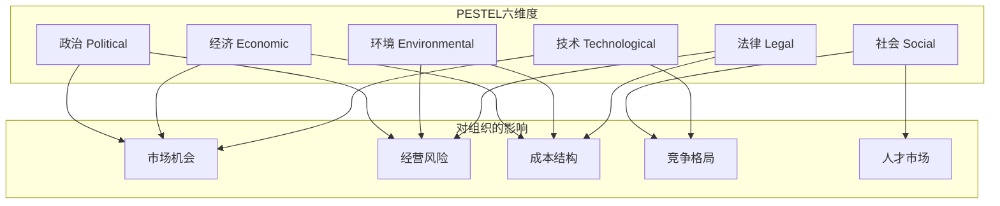
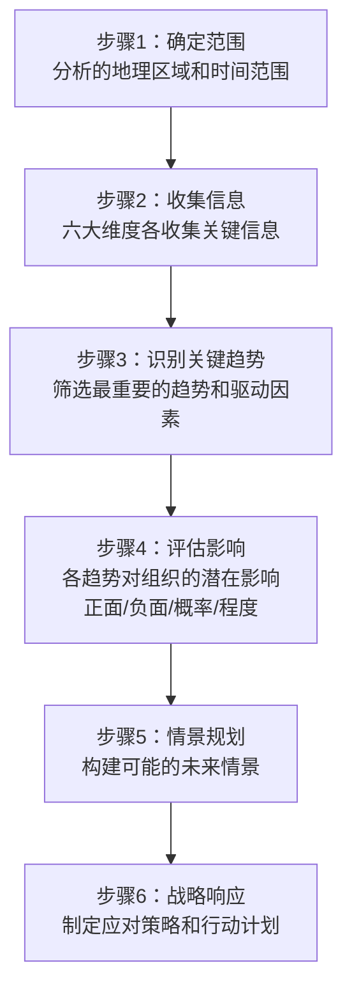
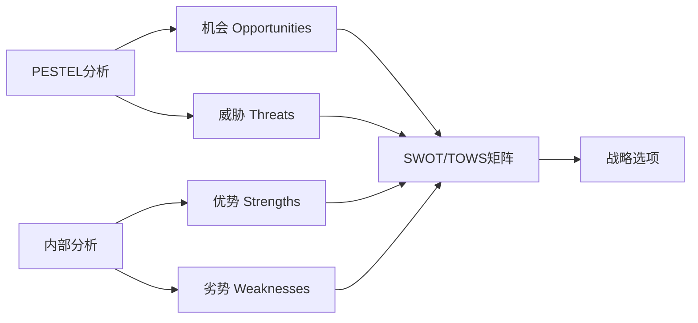
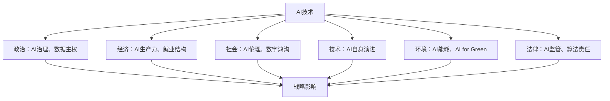

# PESTEL分析：宏观环境的系统扫描

> PESTEL是对宏观环境六大维度的系统扫描，帮助组织识别影响战略的关键趋势和驱动因素。

---

## 一、引子：为什么要扫描宏观环境

### 1.1 宏观环境的力量

疫情、AI革命、地缘政治变化、气候变化、人口老龄化——这些宏观力量对商业的影响远超任何单一企业或行业。PESTEL分析的价值在于**系统性地扫描宏观环境**，避免"盲人摸象"式的片面分析。

### 1.2 PESTEL的核心逻辑

> [!important] PESTEL的核心价值
> PESTEL不是"预测未来"，而是**识别关键趋势和不确定性**，为战略规划提供宏观背景。它帮助组织回答"宏观环境中有哪些因素可能影响我们的战略？"

---

## 二、PESTEL六维度详解

### 2.1 政治因素（Political）

政治因素关注政府政策、政治稳定性和地缘政治对商业环境的影响。

| 细分维度 | 关键问题 | 示例 |
|---------|---------|------|
| 政府稳定性 | 政权更迭风险？政策连续性？ | 选后政策变化 |
| 产业政策 | 政府支持/限制哪些行业？ | 新能源补贴、教培监管 |
| 税收政策 | 税率变化趋势？行业性税收优惠？ | 企业所得税率、研发税收抵扣 |
| 贸易政策 | 关税、贸易协定、进出口限制 | 中美贸易摩擦、RCEP |
| 地缘政治 | 国际关系紧张对业务的影响？ | 制裁、供应链脱钩 |
| 劳动法规 | 最低工资、劳动保护、工会 | 劳动法修订 |

### 2.2 经济因素（Economic）

经济因素关注宏观经济状况及其对商业活动的影响。

| 细分维度 | 关键问题 | 示例 |
|---------|---------|------|
| 经济增长 | GDP增速、经济周期阶段？ | 经济衰退vs繁荣 |
| 利率与通胀 | 融资成本？通胀对企业成本的影响？ | 加息周期、输入性通胀 |
| 汇率 | 汇率波动对进出口的影响？ | 人民币升值vs贬值 |
| 就业与收入 | 劳动力市场状况？消费者购买力？ | 失业率、人均可支配收入 |
| 大宗商品价格 | 原材料价格趋势？能源成本？ | 石油、铜、锂价格 |
| 资本市场 | 融资环境？IPO市场？估值水平？ | 风险投资活跃度 |

### 2.3 社会因素（Social）

社会因素关注人口结构、文化价值观和生活方式变化。

| 细分维度 | 关键问题 | 示例 |
|---------|---------|------|
| 人口结构 | 年龄分布、城市化率、人口流动 | 老龄化、少子化、城镇化 |
| 文化价值观 | 社会态度变化？消费观念？ | 环保意识、健康意识 |
| 生活方式 | 工作方式、消费习惯、休闲方式 | 远程办公、共享经济 |
| 教育水平 | 劳动力素质？人才供给？ | 高等教育普及率 |
| 社会趋势 | 社会运动、舆论热点 | Z世代消费观、多元包容 |
| 健康意识 | 公众健康关注度？ | 大健康产业、心理健康 |

> [!tip] 社会因素与HR的关联
> 社会因素中的**人口结构**（老龄化、少子化）、**工作价值观**（Z世代的工作偏好）、**生活方式**（远程办公、灵活用工）直接影响HR战略。在 [[03-HR人事/培训与人才发展/培训与人才发展_知识库建设方案]] 中，这些因素决定了人才供给和员工需求的变化。

### 2.4 技术因素（Technological）

技术因素关注技术变革和创新对行业的影响。

| 细分维度 | 关键问题 | 示例 |
|---------|---------|------|
| 新兴技术 | 什么新技术可能颠覆行业？ | AI、区块链、量子计算 |
| 技术成熟度 | 技术处于什么阶段？何时商业化？ | Gartner技术成熟度曲线 |
| 研发投入 | 行业和技术领域的研发趋势？ | 各国研发支出占比 |
| 技术基础设施 | 网络、算力、数据基础设施？ | 5G、云计算、数据中心 |
| 自动化 | 哪些工作可能被自动化？ | AI对白领工作的影响 |
| 知识产权 | 专利趋势、技术标准？ | 标准必要专利、开源运动 |

> [!important] AI是PESTEL中"T"维度的核心变量
> 在 [[02-AI趋势与素养/AI Native组织变革/00_MOC_AI Native组织变革中枢]] 中我们已深入讨论AI对组织的影响。在PESTEL框架中，AI不仅属于技术维度，它还在重塑政治（AI治理）、经济（AI生产力）、社会（AI伦理）、法律（AI监管）等所有维度。

### 2.5 环境因素（Environmental）

环境因素关注自然环境、气候变化和可持续发展议题。

| 细分维度 | 关键问题 | 示例 |
|---------|---------|------|
| 气候变化 | 气候变化对业务的影响？碳政策？ | 碳税、碳中和目标 |
| 自然资源 | 资源稀缺性？可再生资源？ | 水资源、稀有金属 |
| 环境污染 | 环保法规趋势？消费者环保意识？ | 限塑令、排放标准 |
| 可持续发展 | ESG投资趋势？绿色消费？ | ESG评级、绿色债券 |
| 天气与灾害 | 极端天气对运营的影响？ | 洪水、飓风、干旱 |
| 能源转型 | 可再生能源趋势？能源成本？ | 光伏、风能、氢能 |

### 2.6 法律因素（Legal）

法律因素关注法律法规对商业活动的约束和影响。

| 细分维度 | 关键问题 | 示例 |
|---------|---------|------|
| 行业法规 | 行业准入、经营许可、合规要求 | 金融牌照、医疗许可 |
| 消费者保护 | 消费者权益法规？数据隐私？ | GDPR、个人信息保护法 |
| 竞争法 | 反垄断、反不正当竞争 | 平台经济反垄断 |
| 劳动法 | 劳动合同、工时、社保 | 灵活用工法规 |
| 知识产权法 | 专利、商标、著作权保护 | 技术专利诉讼 |
| 国际法 | 跨境经营的法律合规 | 长臂管辖、制裁合规 |

---

## 三、PESTEL的应用方法

### 3.1 标准分析流程

### 3.2 PESTEL分析表格模板

| 维度 | 关键趋势 | 影响程度 | 影响方向 | 时间跨度 | 确定性 |
|------|---------|---------|---------|---------|--------|
| 政治 | | 高/中/低 | 正面/负面 | 短期/中期/长期 | 高/中/低 |
| 经济 | | 高/中/低 | 正面/负面 | 短期/中期/长期 | 高/中/低 |
| 社会 | | 高/中/低 | 正面/负面 | 短期/中期/长期 | 高/中/低 |
| 技术 | | 高/中/低 | 正面/负面 | 短期/中期/长期 | 高/中/低 |
| 环境 | | 高/中/低 | 正面/负面 | 短期/中期/长期 | 高/中/低 |
| 法律 | | 高/中/低 | 正面/负面 | 短期/中期/长期 | 高/中/低 |

### 3.3 从PESTEL到情景规划

PESTEL的进阶应用是**情景规划**（Scenario Planning）：

1. 从PESTEL中识别2-3个最关键的不确定性因素
2. 将这些不确定性因素交叉组合，构建2-4个未来情景
3. 针对每个情景制定战略预案
4. 识别各情景的"早期信号"，持续监控

> [!tip] 情景规划示例
> 不确定性因素1：AI技术发展速度（快/慢）
> 不确定性因素2：AI监管力度（强/弱）
> 
> 情景A：快+弱 → "狂野西部"——AI快速普及，监管滞后，创新为王
> 情景B：快+强 → "有序创新"——AI快速普及，监管同步，合规为王
> 情景C：慢+弱 → "观望时代"——AI发展缓慢，竞争格局稳定
> 情景D：慢+强 → "过度监管"——AI发展受阻，创新成本高

---

## 四、PESTEL与SWOT的关系

### 4.1 PESTEL是SWOT的外部输入

### 4.2 PESTEL与其他分析工具的关系

| 工具 | 分析层次 | PESTEL如何提供输入 |
|------|---------|-------------------|
| [[04-商业与战略/战略分析工具与框架/02_波特五力模型：行业结构的分析框架]] | 行业 | PESTEL中的技术趋势影响进入壁垒，法规影响竞争格局 |
| [[04-商业与战略/战略分析工具与框架/03_SWOT分析：最被滥用的战略工具]] | 企业 | PESTEL提供O和T的直接输入 |
| [[04-商业与战略/战略分析工具与框架/06_蓝海战略：创造无竞争的市场空间]] | 市场 | PESTEL中的技术和社会趋势可能揭示蓝海机会 |
| [[04-商业与战略/战略分析工具与框架/08_安索夫矩阵：增长战略的四种路径]] | 增长 | PESTEL中的经济和社会趋势影响市场选择 |

---

## 五、PESTEL在HR领域的应用

### 5.1 HR视角的PESTEL

在 [[03-HR人事/培训与人才发展/培训与人才发展_知识库建设方案]] 和 [[战略人力资源]] 中，PESTEL可以帮助HR识别影响人才管理的外部趋势：

| 维度 | HR关注点 |
|------|---------|
| 政治 | 劳动法规变化、移民政策、产业政策对人才需求的影响 |
| 经济 | 劳动力市场紧张程度、薪资趋势、人才竞争格局 |
| 社会 | 人口结构变化（老龄化/少子化）、工作价值观变化（Z世代）、远程办公趋势 |
| 技术 | AI对岗位的替代和创造、HR科技趋势、技能需求变化 |
| 环境 | ESG对雇主品牌的影响、绿色技能需求 |
| 法律 | 劳动法修订、数据隐私法规（员工数据）、灵活用工法规 |

---

## 六、AI时代的PESTEL分析

### 6.1 AI正在重塑所有PESTEL维度

### 6.2 AI辅助PESTEL分析

| AI的能力 | PESTEL应用 |
|---------|-----------|
| 信息聚合 | 从海量新闻、报告、数据中提取PESTEL各维度趋势 |
| 趋势识别 | 识别新兴趋势和弱信号 |
| 影响评估 | 量化各趋势对行业的影响程度 |
| 情景模拟 | 构建和测试多种未来情景 |
| 持续监控 | 实时跟踪PESTEL各维度的关键指标变化 |

> [!important] 人机协同
> AI可以大幅提升PESTEL的信息收集和趋势识别效率，但判断哪些趋势"真正重要"、评估各趋势的"战略含义"，仍然需要人类的战略思维和行业经验。

---

## 七、常见误区

> [!warning]- 误区一：PESTEL就是"列清单"
> 很多人做PESTEL只是把六大维度各列几条趋势，然后结束。正确的PESTEL应该评估各趋势的影响程度、概率和战略含义。

> [!warning]- 误区二：所有趋势都同等重要
> PESTEL可能产生几十个趋势，但不是所有都同等重要。应该筛选出3-5个对组织影响最大的关键趋势。

> [!warning]- 误区三：PESTEL一次做够
> 宏观环境是动态变化的，PESTEL应该定期更新。建议年度全面更新，重大事件时即时更新。

> [!warning]- 误区四：忽略趋势之间的相互作用
> 六大维度不是孤立的。例如，AI技术（T）推动监管（P/L），影响就业（E/S），改变能源消耗（Env）。好的PESTEL分析应该识别跨维度相互作用。

---

## 八、总结

PESTEL分析的核心价值：

1. **系统性**：六大维度确保不遗漏重要的宏观因素
2. **前瞻性**：从"趋势识别"到"情景规划"，帮助组织为未来做准备
3. **基础性**：PESTEL是其他战略分析工具（五力、SWOT）的输入
4. **动态性**：宏观环境持续变化，PESTEL应定期更新

---

## 九、延伸阅读

- [[04-商业与战略/战略分析工具与框架/00_MOC_战略分析工具与框架中枢]]：返回知识库中枢
- [[04-商业与战略/战略分析工具与框架/02_波特五力模型：行业结构的分析框架]]：从宏观到中观（行业）
- [[04-商业与战略/战略分析工具与框架/03_SWOT分析：最被滥用的战略工具]]：PESTEL提供O和T的输入
- [[04-商业与战略/战略分析工具与框架/10_战略工具的综合应用：从分析到决策]]：PESTEL在综合框架中的位置
- [[02-AI趋势与素养/AI Native组织变革/00_MOC_AI Native组织变革中枢]]：AI作为PESTEL中T维度的核心变量
- Aguilar, F. (1967). *Scanning the Business Environment*. Macmillan.

---

> [!quote] 核心引用
> "宏观环境扫描的目的不是预测未来，而是为不确定性做准备。" —— Francis Aguilar
>
> "在快速变化的环境中，最重要的不是预测的准确性，而是感知变化的敏感度。" —— 管理实践总结