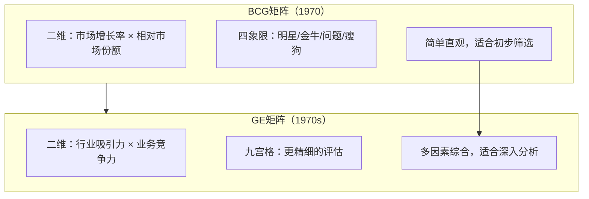
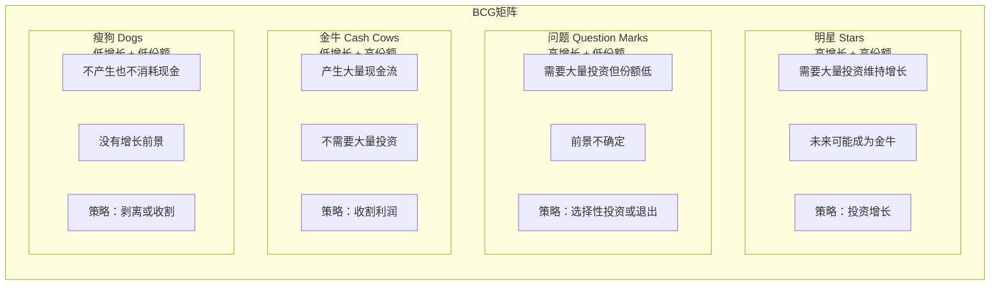
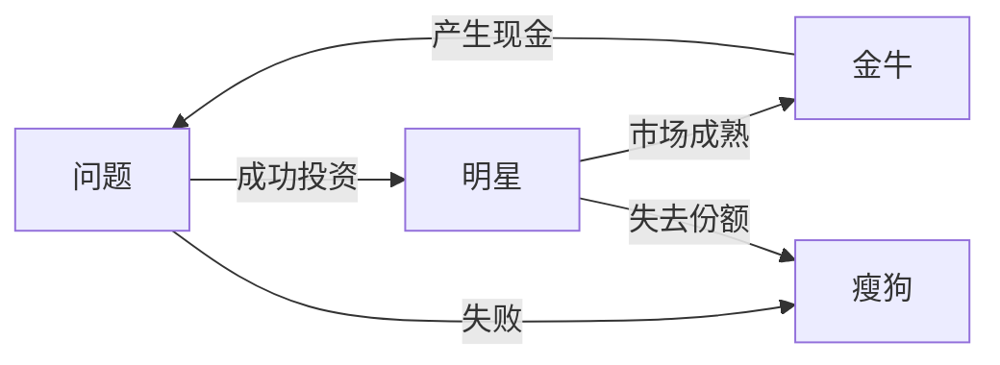
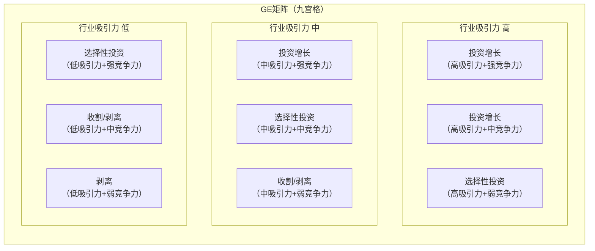
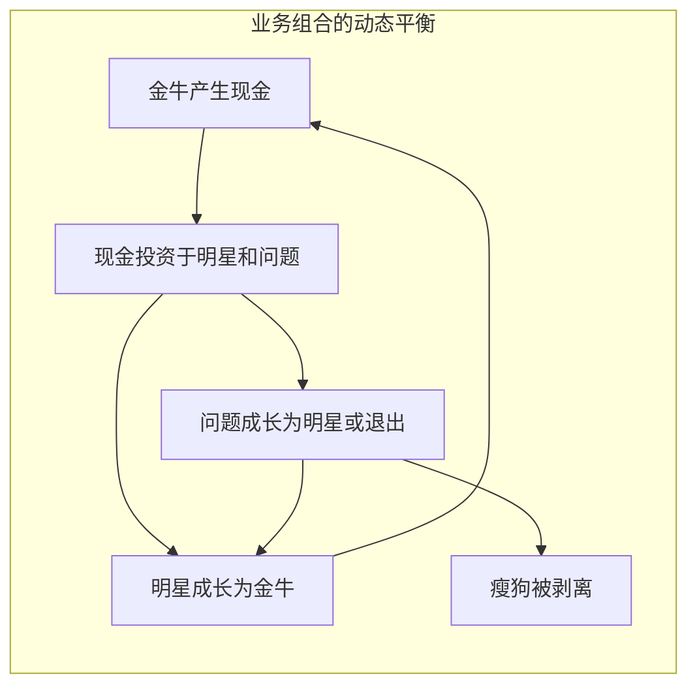

# BCG矩阵与GE矩阵：业务组合管理

> BCG矩阵和GE矩阵是企业级业务组合管理的两大经典工具，帮助组织回答"资源应该投向哪些业务"这一核心问题。

---

## 一、引子：业务组合管理的核心问题

### 1.1 多业务企业的资源分配困境

当一家企业拥有多个业务时，面临的核心问题是：

- 哪些业务应该加大投资？
- 哪些业务应该维持现状？
- 哪些业务应该收割利润？
- 哪些业务应该剥离退出？

这些决策直接影响企业的长期竞争力。BCG矩阵和GE矩阵提供了结构化的业务组合分析框架。

### 1.2 两个矩阵的关系

> [!important] BCG与GE的关系
> BCG矩阵是"快速筛选"工具，GE矩阵是"深入分析"工具。通常先用BCG快速定位，再用GE对关键业务进行多因素评估。

---

## 二、BCG矩阵详解

### 2.1 BCG矩阵的基本框架

### 2.2 BCG矩阵的两个维度

| 维度 | 定义 | 如何衡量 | 含义 |
|------|------|---------|------|
| **市场增长率** | 业务所在市场的增长速度 | 行业增长率（如过去3-5年CAGR） | 高增长意味着需要更多投资来维持增长 |
| **相对市场份额** | 该业务相对于最大竞争对手的市场份额 | 自身份额 / 最大竞争对手份额 | 高份额意味着成本优势（经验曲线效应） |

### 2.3 四象限的战略含义

| 象限 | 特征 | 现金流 | 战略方向 | 投资策略 |
|------|------|--------|---------|---------|
| **明星** | 高增长+高份额 | 现金流中性（大量投资+大量收入） | 保持/建立领导地位 | 大量投资 |
| **金牛** | 低增长+高份额 | 现金流正（少量投资+大量收入） | 维持/收割 | 维持性投资 |
| **问题** | 高增长+低份额 | 现金流负（大量投资+少量收入） | 选择性投资或退出 | 选择性大量投资 |
| **瘦狗** | 低增长+低份额 | 现金流中性或负 | 收割/剥离 | 不投资或撤资 |

### 2.4 BCG矩阵的成功路径

> [!tip] 理想的业务组合
> 理想的业务组合应该有：
> - 足够的**金牛**来提供现金流
> - 适量的**明星**作为未来的增长引擎
> - 有选择的**问题**作为未来的选项
> - 尽可能少的**瘦狗**

### 2.5 BCG矩阵的局限

| 局限 | 说明 |
|------|------|
| **过于简化** | 只用两个维度解释业务状况，忽略了太多因素 |
| **市场份额不等于竞争力** | 在利基市场或差异化市场中，低份额也可能盈利 |
| **增长不等于吸引力** | 高增长行业可能因为竞争激烈而利润微薄 |
| **静态快照** | 单一时点的分析，忽略了动态变化 |
| **假设独立性** | 假设各业务独立，忽略了业务间的协同效应 |
| **忽视战略选择** | 不仅可以选择投资/收割，还可以选择改变竞争方式 |

---

## 三、GE矩阵详解

### 3.1 GE矩阵的基本框架

GE矩阵（又称麦肯锡矩阵）是BCG矩阵的升级版，用两个综合维度替代BCG的单一指标：

### 3.2 GE矩阵的两个维度详解

#### 行业吸引力（Industry Attractiveness）

行业吸引力是一个综合指标，包括多个子因素：

| 子因素 | 衡量指标 | 权重示例 |
|--------|---------|---------|
| 市场规模 | 总市场规模、增长率 | 20% |
| 市场增长率 | 过去3-5年CAGR | 15% |
| 行业利润率 | 行业平均利润率 | 15% |
| 竞争强度 | 竞争者数量、集中度 | 15% |
| 技术变革 | 技术变革速度 | 10% |
| 进入壁垒 | 进入难度 | 10% |
| 监管环境 | 监管友好程度 | 10% |
| 宏观因素 | PESTEL各维度影响 | 5% |

#### 业务竞争力（Business Strength / Competitive Position）

业务竞争力也是一个综合指标：

| 子因素 | 衡量指标 | 权重示例 |
|--------|---------|---------|
| 市场份额 | 相对市场份额 | 20% |
| 品牌力量 | 品牌认知度、忠诚度 | 15% |
| 技术能力 | 技术领先程度、专利 | 15% |
| 成本结构 | 相对成本优势 | 15% |
| 分销渠道 | 渠道覆盖和效率 | 10% |
| 产品质量 | 质量水平、客户满意度 | 10% |
| 管理能力 | 管理团队经验 | 10% |
| 客户关系 | 客户忠诚度、转换成本 | 5% |

### 3.3 GE矩阵的战略决策

| 矩阵位置 | 战略方向 | 资源分配 |
|---------|---------|---------|
| 高吸引力+强竞争力 | 投资增长 | 优先分配资源，大量投资 |
| 高吸引力+中竞争力 | 投资增长 | 选择性投资，增强竞争力 |
| 高吸引力+弱竞争力 | 选择性投资 | 要么大力投资提升竞争力，要么退出 |
| 中吸引力+强竞争力 | 投资增长 | 维持优势，选择性投资 |
| 中吸引力+中竞争力 | 选择性投资 | 有选择地投资盈利细分市场 |
| 中吸引力+弱竞争力 | 收割/剥离 | 逐步退出，最大化剩余价值 |
| 低吸引力+强竞争力 | 选择性投资 | 维持优势，但控制投资 |
| 低吸引力+中竞争力 | 收割/剥离 | 不再投资，最大化现金流 |
| 低吸引力+弱竞争力 | 剥离 | 尽快退出 |

### 3.4 BCG vs GE矩阵对比

| 维度 | BCG矩阵 | GE矩阵 |
|------|---------|--------|
| 复杂度 | 简单 | 复杂 |
| 维度数量 | 2个单一指标 | 2个综合指标 |
| 象限数量 | 4个 | 9个 |
| 精确度 | 粗略 | 精细 |
| 适用场景 | 初步筛选 | 深入分析 |
| 数据需求 | 低 | 高 |
| 主观性 | 低 | 较高（权重设定） |

---

## 四、业务组合管理的战略决策

### 4.1 四种基本战略选择

| 战略选择 | 含义 | 适用场景 | 对HR的启示 |
|---------|------|---------|-----------|
| **投资增长** | 大量投入资源，扩大市场份额 | 明星业务、有前景的问题业务 | 大量招聘、培养领导者 |
| **维持** | 保持现有地位，适度投资 | 成熟的金牛业务 | 保持核心人才、控制成本 |
| **收割** | 减少投资，最大化短期现金流 | 衰退的金牛、瘦狗 | 冻结招聘、优化人力成本 |
| **剥离** | 出售或关闭业务 | 没有前景的瘦狗 | 制定人员过渡方案、知识转移 |

### 4.2 业务组合的动态平衡

> [!important] 业务组合的生命周期管理
> 业务组合管理不是一次性工作，而是持续的动态管理。企业需要确保：
> 1. 有足够的金牛为增长提供资金
> 2. 明星和问题业务有清晰的发展路径
> 3. 及时剥离没有前景的瘦狗业务

---

## 五、HR视角的业务组合管理

### 5.1 不同业务类型的人才策略

在 [[03-HR人事/培训与人才发展/培训与人才发展_知识库建设方案]] 和 [[战略人力资源]] 中，不同业务类型需要不同的人才策略：

| 业务类型 | 人才需求 | 招聘策略 | 培训重点 | 激励方式 |
|---------|---------|---------|---------|---------|
| **明星** | 快速增长型人才 | 大量招聘、快速上岗 | 领导力发展、快速学习 | 股权激励、高绩效奖金 |
| **金牛** | 效率型人才 | 精准招聘、控制编制 | 流程优化、精益管理 | 稳定的薪酬+利润分享 |
| **问题** | 创业型人才 | 核心岗位招聘 | 创新能力、试错学习 | 高风险高回报激励 |
| **瘦狗** | 过渡型人才 | 冻结招聘 | 技能转岗、职业转型 | 保留计划、离职补偿 |

### 5.2 业务组合变化的人才挑战

| 业务组合变化 | HR挑战 | 应对策略 |
|-------------|--------|---------|
| 剥离某个业务 | 人员安置、知识转移、士气 | 制定过渡方案、内部转岗、职业指导 |
| 收购新业务 | 文化整合、人才保留、组织融合 | 尽职调查、关键人才保留计划 |
| 大规模投资明星业务 | 快速招聘、能力建设 | 雇主品牌、人才培养体系搭建 |
| 收割金牛业务 | 控制人力成本、保持核心人才 | 精准激励、接班人计划 |

---

## 六、AI时代的业务组合管理

### 6.1 AI如何改变业务组合分析

| AI能力 | 对业务组合管理的影响 |
|--------|-------------------|
| 实时数据分析 | 从年度静态分析变为实时动态评估 |
| 预测模型 | 更准确地预测业务增长和市场份额变化 |
| 情景模拟 | 模拟不同资源配置方案的结果 |
| 模式识别 | 识别业务组合中的隐藏风险和机会 |
| 自动化报告 | 自动生成业务组合分析报告 |

### 6.2 AI对BCG/GE假设的挑战

| 传统假设 | AI时代的挑战 |
|---------|-------------|
| 市场份额→成本优势 | AI可能使小企业也能达到规模效率 |
| 高增长需要大量投资 | AI驱动的轻资产模式可能改变增长逻辑 |
| 业务边界清晰 | AI驱动的跨界竞争使业务边界模糊 |

---

## 七、总结

BCG矩阵和GE矩阵的核心价值：

1. **结构化思维**：将复杂的业务组合问题简化为可分析的框架
2. **资源分配指导**：为投资/维持/收割/剥离决策提供依据
3. **组合平衡**：确保业务组合在现金流、增长、风险上平衡
4. **动态视角**：从生命周期角度理解业务演变

---

## 八、延伸阅读

- [[04-商业与战略/战略分析工具与框架/00_MOC_战略分析工具与框架中枢]]：返回知识库中枢
- [[04-商业与战略/战略分析工具与框架/08_安索夫矩阵：增长战略的四种路径]]：增长战略选择
- [[04-商业与战略/战略分析工具与框架/10_战略工具的综合应用：从分析到决策]]：业务组合分析在综合框架中的位置
- [[03-HR人事/培训与人才发展/培训与人才发展_知识库建设方案]]：不同业务类型的人才策略
- Henderson, B. (1970). "The Product Portfolio." *BCG Perspectives*.
- McKinsey & Company. "The GE-McKinsey Nine-Box Matrix."

---

> [!quote] 核心引用
> "一个企业的业务组合决定了它的未来——好的组合管理不是选择'最好的业务'，而是选择'最好的业务组合'。" —— Bruce Henderson
>
> "不要问'这个业务好不好'，要问'这个业务在我们的组合中是否合适'。" —— 战略管理实践