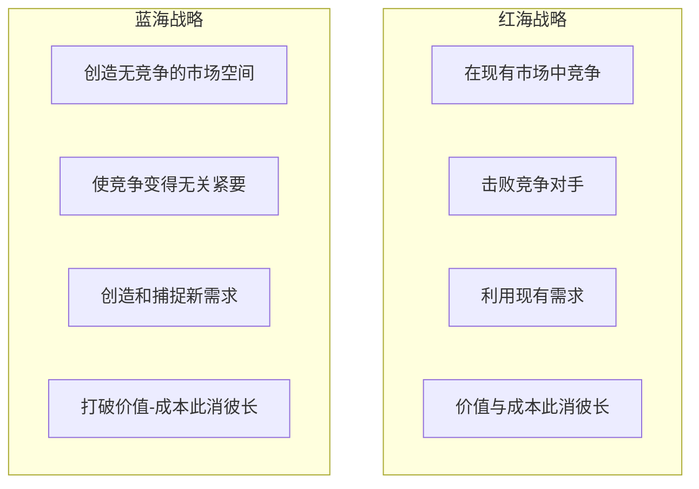
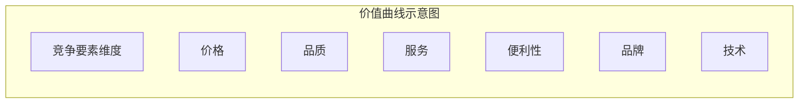
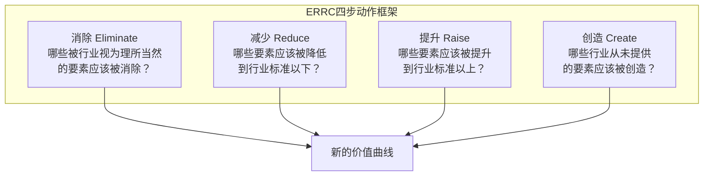
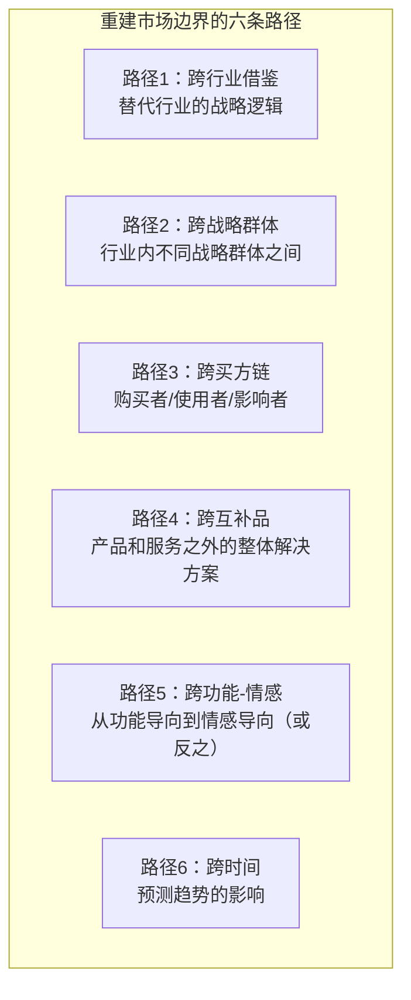

# 蓝海战略：创造无竞争的市场空间

> 蓝海战略不是"在现有市场中竞争"，而是"创造新的市场空间，使竞争变得无关紧要"。

---

## 一、引子：红海与蓝海

### 1.1 红海vs蓝海

W. Chan Kim和Renee Mauborgne在2005年出版的《蓝海战略》中提出了一个根本性的战略选择：

| 维度 | 红海 | 蓝海 |
|------|------|------|
| 市场空间 | 已知的市场空间 | 未知的市场空间 |
| 竞争状况 | 激烈竞争，价格战 | 无竞争或极少竞争 |
| 需求 | 争夺现有需求 | 创造新需求 |
| 价值-成本 | 价值与成本此消彼长 | 同时追求差异化和低成本 |
| 战略逻辑 | 在竞争中胜出 | 使竞争变得无关紧要 |
| 增长方式 | 从竞争对手手中夺取份额 | 创造新的市场空间 |

### 1.2 蓝海战略的核心逻辑

> [!important] 蓝海战略的核心命题
> 蓝海战略的核心理念是**价值创新**（Value Innovation）——不是在"差异化"和"低成本"之间做选择，而是同时追求两者。通过重构价值曲线，创造新的需求，让竞争变得无关紧要。

---

## 二、价值曲线与ERRC四步动作框架

### 2.1 价值曲线（Value Curve）

价值曲线是蓝海战略的核心分析工具，它以图形方式展示一个行业中各竞争要素的投入水平。

**绘制价值曲线的步骤**：
1. 识别行业的关键竞争要素（通常5-10个）
2. 绘制行业现有竞争者的价值曲线
3. 识别可以消除、减少、提升、创造的要素

### 2.2 ERRC四步动作框架

ERRC是蓝海战略最核心的工具，通过四个动作重构价值曲线：

| 动作 | 核心问题 | 目的 | 示例 |
|------|---------|------|------|
| **消除**（Eliminate） | 哪些行业长期竞争的因素已不再被客户需要？ | 消除不必要的成本 | 航空公司消除头等舱（低成本航空） |
| **减少**（Reduce） | 哪些因素可以远低于行业标准？ | 降低不必要的成本 | 减少餐食质量、减少座位间距 |
| **提升**（Raise） | 哪些因素应该远高于行业标准？ | 创造差异化 | 提升准点率、提升线上体验 |
| **创造**（Create） | 行业从未提供过什么？ | 创造新需求 | 创造社区体验、创造订阅模式 |

### 2.3 好的ERRC分析的特征

> [!tip] 好的ERRC分析三特征
> 1. **聚焦**：不是对所有要素做微调，而是在少数关键要素上做大胆改变
> 2. **独特**：你的价值曲线应该与行业标准曲线明显不同
> 3. **有说服力的口号**：你的价值主张应该能用一句话清晰表达

---

## 三、蓝海战略的六项原则

### 3.1 制定原则（Formulation Principles）

| 原则 | 说明 | 核心工具 |
|------|------|---------|
| **重建市场边界** | 不要盯着现有行业边界，要跨行业、跨战略群体、跨时间寻找机会 | 六条路径框架 |
| **注重全局而非数字** | 不要陷入财务细节，先画出战略布局图（价值曲线） | 战略布局图 |
| **超越现有需求** | 不要只关注现有客户，要关注非客户 | 三个层次的非客户 |
| **遵循合理的战略顺序** | 按"买方效用→价格→成本→执行"的顺序验证 | 买方效用图 |

### 3.2 执行原则（Execution Principles）

| 原则 | 说明 | 核心工具 |
|------|------|---------|
| **克服关键组织障碍** | 识别并克服认知、资源、动机、政治四大障碍 | 引爆点领导力 |
| **将执行纳入战略** | 从战略制定阶段就让执行者参与，建立公平过程 | 公平过程 |

### 3.3 六条路径框架（重建市场边界）

---

## 四、蓝海战略的经典案例

### 4.1 太阳马戏团（Cirque du Soleil）

| 动作 | 具体内容 |
|------|---------|
| **消除** | 动物表演（成本高、争议大）、明星演员（议价能力强） |
| **减少** | 传统马戏的趣味性和刺激感 |
| **提升** | 艺术性、音乐、舞美、场馆品质 |
| **创造** | 主题故事线、艺术化氛围、多场次同时演出 |

**结果**：太阳马戏团创造了全新的"艺术化马戏"品类，吸引了从未看过马戏的成年人（剧院观众），同时保持了比传统马戏更低的可变成本（无动物、无明星）。

### 4.2 Yellow Tail葡萄酒

| 动作 | 具体内容 |
|------|---------|
| **消除** | 复杂的酒标术语、年份差异、陈年潜力 |
| **减少** | 口感复杂度、品牌历史、酒庄故事 |
| **提升** | 易饮性、包装设计、零售便利性 |
| **创造** | 简单有趣的选择体验、非正式场合的社交饮品 |

**结果**：Yellow Tail吸引了从未喝过葡萄酒的啤酒和鸡尾酒消费者，成为美国最畅销的进口葡萄酒。

### 4.3 任天堂Wii

| 动作 | 具体内容 |
|------|---------|
| **消除** | 复杂的操作界面、高硬件规格 |
| **减少** | 图像处理能力、游戏复杂度 |
| **提升** | 体感互动、社交乐趣、家庭体验 |
| **创造** | 体感控制、家庭多人游戏、健康运动游戏 |

**结果**：Wii吸引了大量非传统游戏玩家（老年人、女性、家庭），在PS3和Xbox 360的激烈竞争中开辟了全新的市场空间。

---

## 五、蓝海战略与波特五力

### 5.1 互补而非矛盾

> [!important] 蓝海战略与波特五力的关系
> 蓝海战略和波特五力不是矛盾的，而是互补的：
> - **波特五力**描述"现有竞争格局"——为什么有些行业利润低
> - **蓝海战略**提供"跳出竞争"的方法论——如何创造高利润的新市场
> - 五力分析帮你识别"这是一个红海"，蓝海战略帮你找到"蓝海在哪"

### 5.2 蓝海也会变红海

> [!warning] 蓝海不是永久的
> 蓝海战略创造的新市场空间最终也会吸引模仿者，变成红海。因此，蓝海战略不是一次性的，而是需要持续的价值创新。组织需要不断监控价值曲线，防止被模仿者拉回行业标准。

---

## 六、HR视角的蓝海战略

### 6.1 蓝海战略的人才需求

在 [[03-HR人事/培训与人才发展/培训与人才发展_知识库建设方案]] 中，蓝海战略对人才发展提出独特要求：

| 传统战略人才 | 蓝海战略人才 |
|-------------|-------------|
| 分析现有市场数据 | 洞察未被满足的需求 |
| 优化现有业务 | 创造全新业务 |
| 竞争思维 | 创新思维 |
| 风险规避 | 风险承受 |
| 执行既定计划 | 探索未知领域 |

### 6.2 蓝海战略的组织能力要求

| 能力 | 说明 | HR培养方式 |
|------|------|-----------|
| 跨界洞察 | 从其他行业获取灵感 | 跨行业轮岗、外部学习 |
| 用户同理心 | 深入理解非客户 | 用户研究、设计思维培训 |
| 大胆假设 | 敢于挑战行业惯例 | 创新文化、容错机制 |
| 快速验证 | 低成本试错 | 精益创业、MVP方法论 |

---

## 七、AI与蓝海战略

### 7.1 AI创造蓝海的机会

AI正在创造大量的蓝海机会：

| AI领域 | 蓝海机会 | 示例 |
|--------|---------|------|
| 个性化 | 从"标准化产品"到"千人千面" | AI个性化教育、AI定制化保险 |
| 自动化 | 从"人工服务"到"智能服务" | AI客服、AI法律咨询 |
| 预测 | 从"事后反应"到"事前预测" | AI预见性维护、AI健康预警 |
| 创造 | 从"人工创作"到"AI辅助创作" | AI设计、AI内容生成 |

### 7.2 AI如何辅助蓝海战略分析

| AI能力 | 蓝海战略应用 |
|--------|-------------|
| 数据挖掘 | 从海量数据中识别未被满足的需求 |
| 模式识别 | 跨行业识别可借鉴的价值曲线 |
| 用户画像 | 精准识别和分析"非客户"群体 |
| 情景模拟 | 模拟不同价值曲线的市场反应 |

---

## 八、总结

蓝海战略的核心贡献：

1. **从竞争到创新**：将战略思维从"如何击败对手"转向"如何创造新市场"
2. **价值创新**：打破差异化与低成本的对立，同时追求两者
3. **ERRC框架**：提供具体的价值曲线重构方法
4. **非客户视角**：关注行业之外的人，而非仅关注现有客户

---

## 九、延伸阅读

- [[04-商业与战略/战略分析工具与框架/00_MOC_战略分析工具与框架中枢]]：返回知识库中枢
- [[04-商业与战略/战略分析工具与框架/02_波特五力模型：行业结构的分析框架]]：理解现有竞争格局（红海）
- [[04-商业与战略/战略分析工具与框架/08_安索夫矩阵：增长战略的四种路径]]：增长战略选择
- [[04-商业与战略/商业模式设计与创新/00_MOC_商业模式设计与创新中枢]]：蓝海战略与商业模式的交叉
- [[02-AI趋势与素养/AI Native组织变革/00_MOC_AI Native组织变革中枢]]：AI时代的蓝海机会
- Kim, W. C. & Mauborgne, R. (2005). *Blue Ocean Strategy*. Harvard Business Review Press.

---

> [!quote] 核心引用
> "蓝海战略的核心是价值创新——不是击败竞争对手，而是使竞争变得无关紧要。" —— W. Chan Kim & Renee Mauborgne
>
> "不要问'我们如何比竞争对手做得更好'，要问'我们如何重构行业价值曲线'。" —— 蓝海战略核心理念

---

## 十、蓝海战略的局限与批判

### 10.1 主要局限

| 局限 | 说明 |
|------|------|
| **蓝海发现难度** | 真正的蓝海机会稀少，大多数"蓝海"只是未被发现的细分市场 |
| **模仿壁垒低** | 除非有专利或强网络效应，蓝海很容易被模仿者涌入 |
| **忽视执行** | 蓝海战略侧重战略制定，对执行难度的关注相对不足 |
| **需求风险** | 创造新需求本身就存在不确定性，非客户可能永远不买 |
| **过度简化** | ERRC框架看似简单，但在复杂行业中的实际应用远比想象中困难 |

### 10.2 蓝海战略的适用条件

蓝海战略最适合以下场景：

- 行业高度同质化，竞争陷入价格战
- 存在大量"非客户"群体，他们的需求未被满足
- 技术或商业模式有突破性变化可能
- 组织有能力承受创新风险

> [!warning] 蓝海战略不是万能药
> 蓝海战略是战略工具箱中的一种选择，不是所有企业、所有时期都应该追求蓝海。在稳定增长的行业中，持续优化红海竞争策略可能更有效。

---

## 十一、蓝海战略的自检清单

进行蓝海战略分析时，请逐项确认：

- [ ] 是否绘制了行业现有的价值曲线？各竞争要素是否清晰？
- [ ] ERRC四个动作是否都有具体内容？（消除/减少/提升/创造）
- [ ] 新的价值曲线是否与行业标准曲线明显不同？
- [ ] 价值主张能否用一句话清晰表达？
- [ ] 是否识别了三个层次的非客户？（即将离开的/拒绝的/从未想过的）
- [ ] 是否评估了蓝海战略的可持续性？（模仿壁垒有多高？）
- [ ] 组织是否具备执行蓝海战略的能力？

> [!tip] 蓝海战略的检验标准
> 一个好的蓝海战略应该能够回答："如果这个战略成功，我们的竞争对手会感到'无关紧要'，而不是'被击败'。"