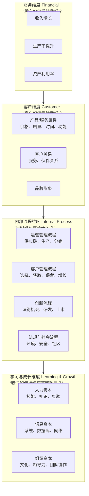

# 战略地图与平衡计分卡：从战略到执行

> 战略地图将战略目标转化为四个维度的因果链，平衡计分卡将其量化为可衡量的KPI。它们共同解决"战略如何落地"这一核心问题。

---

## 一、引子：战略执行的"鸿沟"

### 1.1 战略与执行之间的鸿沟

> [!quote] 战略执行的核心挑战
> "大多数战略失败不是因为战略不好，而是因为执行不力。战略地图和平衡计分卡的出现，就是为了填补'战略制定'与'战略执行'之间的鸿沟。"

据统计，约70%的战略失败源于执行问题而非战略本身。原因包括：

- 战略停留在高层，没有传达到基层
- 战略目标过于抽象，员工不知道如何行动
- 绩效体系与战略脱节——考核的内容与战略方向不一致
- 缺少战略执行的反馈机制

### 1.2 战略地图与BSC的定位

> [!important] 本知识库的独特视角
> [[03-HR人事/绩效管理/00_MOC_绩效管理中枢]] 知识库中已从**绩效管理角度**介绍了KPI和BSC。本知识库从**战略角度**来写BSC——关注的是BSC如何作为"战略执行框架"，而非"绩效考核工具"。

| 视角 | 关注点 | 核心问题 |
|------|--------|---------|
| **绩效管理视角**（[[03-HR人事/绩效管理/00_MOC_绩效管理中枢]]） | 指标设计、考核方法、奖惩机制 | 如何衡量和激励员工表现？ |
| **战略执行视角**（本知识库） | 战略翻译、因果链、战略沟通 | 如何将战略转化为全员行动？ |

---

## 二、战略地图详解

### 2.1 战略地图的四个维度

战略地图由Robert Kaplan和David Norton在2000年提出，是平衡计分卡的视觉化表达。

### 2.2 因果链：战略地图的核心逻辑

战略地图的核心是**因果链**（Cause-and-Effect Logic）：

> 学习与成长 → 内部流程 → 客户 → 财务

**因果链的关键原则**：

1. **相关性**：每个因果链应该有逻辑支撑，最好是数据支撑
2. **滞后与领先**：财务和客户是滞后指标（结果），内部流程和学习成长是领先指标（驱动）
3. **战略特异性**：不同战略的因果链应该不同

### 2.3 绘制战略地图的步骤

| 步骤 | 内容 | 产出 |
|------|------|------|
| 1 | 明确战略目标（使命、愿景、价值观） | 战略方向 |
| 2 | 确定财务目标（增长、利润、生产率） | 财务维度目标 |
| 3 | 确定客户价值主张（差异化方向） | 客户维度目标 |
| 4 | 识别关键内部流程 | 内部流程维度目标 |
| 5 | 确定所需的无形资产（人力、信息、组织） | 学习与成长维度目标 |
| 6 | 连接因果链，形成战略地图 | 可视化的战略地图 |

---

## 三、平衡计分卡详解

### 3.1 BSC的四个视角

平衡计分卡将战略地图的目标转化为可衡量的指标（KPI）、目标值和行动方案：

| 视角 | 核心问题 | 典型指标 |
|------|---------|---------|
| **财务** | 我们如何为股东创造价值？ | 收入增长率、利润率、ROI、EVA、现金流 |
| **客户** | 客户如何看待我们？ | 客户满意度、NPS、客户保留率、市场份额 |
| **内部流程** | 我们必须擅长什么？ | 流程效率、质量指标、创新周期、交付准时率 |
| **学习与成长** | 我们如何持续改进？ | 员工满意度、培训完成率、关键人才保留率、系统就绪度 |

### 3.2 BSC的"平衡"含义

> [!important] BSC的四种平衡
> BSC之所以叫"平衡"计分卡，是因为它在四个维度上实现平衡：
> 1. **财务与非财务**：不仅看财务指标，也看客户、流程、人才
> 2. **短期与长期**：不仅看当期业绩，也看长期能力建设
> 3. **领先与滞后**：不仅看结果指标（滞后），也看驱动指标（领先）
> 4. **内部与外部**：不仅看内部运营，也看外部客户和利益相关方

### 3.3 BSC的KPI设计

| 设计原则 | 说明 |
|---------|------|
| **战略对齐** | 每个KPI都应该与战略目标有明确的因果联系 |
| **可衡量** | 每个KPI都应该有明确的定义和计算方法 |
| **可行动** | 每个KPI的改善应该对应具体的行动方案 |
| **数量控制** | 每个视角3-5个关键KPI，总数不超过20个 |
| **目标值** | 每个KPI都应该有挑战性但可实现的目标值 |

---

## 四、BSC与战略地图的局限

### 4.1 主要局限

| 局限 | 说明 |
|------|------|
| **自上而下** | 战略地图假定战略由高层制定，向下传递，可能忽视基层的创新 |
| **线性因果** | 因果链假设过于简化，实际因果关系复杂且非线性 |
| **测量困难** | 学习与成长维度的指标（如文化、领导力）难以量化 |
| **实施成本** | 完整的BSC体系设计和维护成本高 |
| **静态性** | 战略地图一旦制定，更新频率低，可能导致战略僵化 |
| **忽视外部** | 主要关注内部，对竞争对手和外部环境变化的响应不够敏捷 |

### 4.2 BSC与其他管理工具的关系

| 工具 | 与BSC的关系 |
|------|-----------|
| **OKR** | BSC是战略执行框架，OKR是目标管理工具。BSC确保"做正确的事"，OKR确保"正确地做事" |
| **KPI** | KPI是BSC的组成部分。BSC强调KPI与战略的因果关系，而非孤立地设定指标 |
| [[04-商业与战略/战略分析工具与框架/03_SWOT分析：最被滥用的战略工具]] | SWOT分析为战略地图提供输入（战略方向） |
| [[04-商业与战略/战略分析工具与框架/09_麦肯锡7S模型：组织一致性的诊断框架]] | 7S诊断组织是否准备好执行BSC定义的战略 |

---

## 五、HR视角的战略地图与BSC

### 5.1 学习与成长维度：HR的核心战场

在BSC的四个维度中，**学习与成长维度**是HR直接贡献的领域：

| 子维度 | HR的贡献 | 与 [[03-HR人事/培训与人才发展/培训与人才发展_知识库建设方案]] 的关联 |
|--------|---------|---------------------------|
| **人力资本** | 招聘、培训、人才发展、绩效管理 | 核心关联 |
| **信息资本** | HR信息系统、人才数据分析 | 技术基础设施 |
| **组织资本** | 文化塑造、领导力发展、团队协作 | 组织发展（OD） |

### 5.2 战略人力规划（Strategic Workforce Planning）

BSC为[[战略人力资源]]提供了量化基础：

### 5.3 与绩效管理的关系

> [!important] 战略视角BSC vs 绩效视角BSC
> - **战略视角**（本知识库）：BSC作为战略沟通和执行的工具，关注的是"如何将战略转化为全员行动"
> - **绩效视角**（[[03-HR人事/绩效管理/00_MOC_绩效管理中枢]]）：BSC作为绩效考核的工具，关注的是"如何衡量和激励员工"
> - 两者应该**协同**：好的BSC既驱动战略执行，也为绩效管理提供框架

---

## 六、AI时代的战略地图与BSC

### 6.1 AI如何增强BSC

| BSC的传统痛点 | AI的解决方案 |
|--------------|-------------|
| 数据收集耗时 | 自动从多系统采集数据，实时更新 |
| 因果链难以验证 | 机器学习和因果推断验证因果关系 |
| KPI目标值设定主观 | 基于历史数据和行业基准的智能推荐 |
| 战略执行缺乏透明度 | 实时仪表盘，自动预警 |
| 战略地图更新慢 | 基于数据变化的动态战略地图 |

### 6.2 AI对BSC假设的挑战

| 传统假设 | AI时代的挑战 |
|---------|-------------|
| 战略是相对稳定的 | AI加速环境变化，战略需要更频繁调整 |
| 因果链是线性可预测的 | AI系统产生涌现性行为，因果链复杂 |
| 组织边界清晰 | AI驱动的生态协作模糊了组织边界 |

---

## 七、常见误区

> [!warning]- 误区一：BSC就是KPI清单
> BSC的核心是战略地图的因果链，KPI只是因果链的量化表达。没有因果链的BSC就是一堆KPI的集合，不是战略执行工具。

> [!warning]- 误区二：四个维度必须有相同数量的KPI
> 不同战略下，各维度的KPI数量可以不同。例如，创新战略下，内部流程维度的KPI可能更多。

> [!warning]- 误区三：战略地图一次做完就够
> 战略地图应该定期回顾和更新。建议年度全面回顾，季度战术调整。

> [!warning]- 误区四：BSC可以替代战略思考
> BSC是战略执行的工具，不是战略制定的工具。如果战略本身有问题，BSC只会更高效地执行一个错误的战略。

---

## 八、总结

战略地图与BSC的核心价值：

1. **战略翻译**：将抽象的战略转化为具体的行动和指标
2. **因果链**：建立"学习与成长 → 内部流程 → 客户 → 财务"的逻辑链
3. **平衡**：在财务与非财务、短期与长期、结果与驱动之间取得平衡
4. **沟通**：为全组织提供统一的战略语言和框架

---

## 九、延伸阅读

- [[04-商业与战略/战略分析工具与框架/00_MOC_战略分析工具与框架中枢]]：返回知识库中枢
- [[03-HR人事/绩效管理/00_MOC_绩效管理中枢]]：从绩效角度理解BSC和KPI
- [[03-HR人事/培训与人才发展/培训与人才发展_知识库建设方案]]：BSC学习与成长维度的HR实践
- [[战略人力资源]]：战略人力规划与BSC的对接
- [[04-商业与战略/战略分析工具与框架/10_战略工具的综合应用：从分析到决策]]：BSC在综合框架中的位置
- Kaplan, R. & Norton, D. (2000). "Having Trouble with Your Strategy? Then Map It." *Harvard Business Review*.
- Kaplan, R. & Norton, D. (1996). *The Balanced Scorecard*. Harvard Business Review Press.

---

> [!quote] 核心引用
> "如果你不能衡量它，你就不能管理它。" —— Robert Kaplan & David Norton
>
> "战略地图的价值不在于其本身，而在于它所引发的关于战略的对话。" —— 战略管理实践

---

## 十、实战案例：低成本航空的战略地图

### 10.1 低成本航空的战略地图

以西南航空公司为代表的低成本航空，其战略地图与全服务航空公司完全不同：

| 维度 | 全服务航空战略地图 | 低成本航空战略地图 |
|------|------------------|------------------|
| 财务 | 最大化每客收入 | 最大化飞机利用率 |
| 客户 | 服务全面、舒适 | 低价、准点、便捷 |
| 内部流程 | 枢纽辐射、多种机型 | 点对点、单一机型、快速周转 |
| 学习与成长 | 多技能服务人员 | 高效的地勤培训、员工持股 |

### 10.2 战略地图的差异化

这个案例说明：**不同战略需要不同的战略地图**。低成本航空的战略地图中：

- 财务维度关注"飞机利用率"而非"每客收入"
- 客户维度关注"低价和准点"而非"服务和舒适"
- 内部流程关注"快速周转"而非"枢纽辐射"
- 学习与成长关注"员工所有权"实现低成本运营

> [!important] 战略地图的关键
> 战略地图的价值不在于"四个维度"，而在于"四个维度之间因果链的独特性"。如果两家公司的战略地图看起来一样，说明它们没有真正的战略差异。

---

## 十一、战略地图与BSC的自检清单

- [ ] 战略地图是否清晰展示了"学习与成长 → 内部流程 → 客户 → 财务"的因果链？
- [ ] 每个维度的目标是否与战略方向一致？
- [ ] 因果链是否有数据支持，而非仅凭逻辑推断？
- [ ] BSC指标是否覆盖了四个维度？总数是否控制在20个以内？
- [ ] 是否设定了每个指标的目标值和行动方案？
- [ ] 战略地图是否被组织各级理解和使用？
- [ ] 是否有定期回顾和更新机制？

> [!tip] 战略执行的质量标准
> 一个好的战略执行体系应该能够让一线员工回答："我的日常工作如何贡献于公司的战略目标？"
>
> "战略地图的价值不在于其本身，而在于它所引发的关于战略的对话。" —— 战略管理实践

---

## 十二、BSC实施的关键成功因素

### 12.1 实施BSC的常见陷阱

| 陷阱 | 说明 | 规避方法 |
|------|------|---------|
| **高层不参与** | 只有中层推动，高层不重视 | CEO必须亲自领导BSC项目 |
| **指标过多** | 试图衡量一切，最终什么都衡量不好 | 坚持每个维度3-5个指标 |
| **缺乏沟通** | 战略地图只在高层传播 | 全员沟通、可视化、培训 |
| **与激励脱节** | BSC指标与薪酬激励无关 | 将BSC指标与绩效薪酬挂钩 |
| **一次性工程** | 做完就束之高阁 | 建立月度/季度回顾机制 |

### 12.2 实施BSC的七步法

1. **明确战略**：确保战略清晰且被高层认可
2. **绘制战略地图**：建立因果链
3. **设计指标体系**：为每个目标设计KPI
4. **设定目标值**：为每个KPI设定挑战性目标
5. **制定行动方案**：为每个目标制定具体行动
6. **层层分解**：将公司级BSC分解到部门和个人
7. **建立回顾机制**：定期回顾战略执行情况

> [!important] BSC不是终点
> BSC实施成功的关键不是"设计出完美的计分卡"，而是"建立战略执行的持续管理机制"。BSC是战略管理的工具，不是一次性项目。