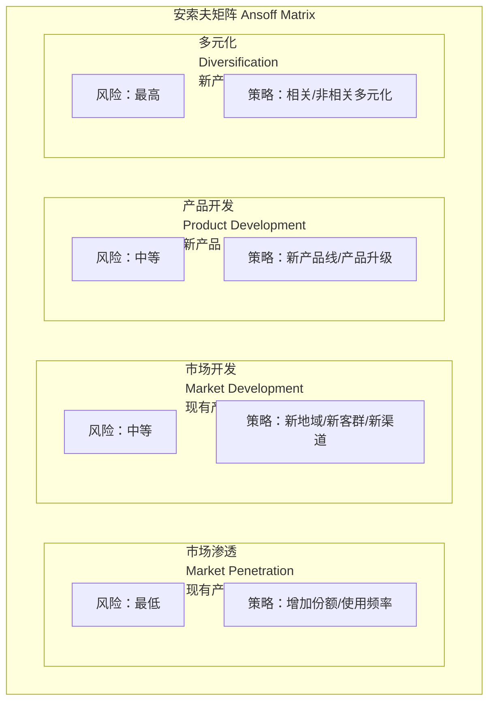
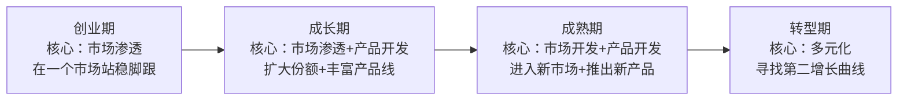

# 安索夫矩阵：增长战略的四种路径

> 安索夫矩阵以"产品-市场"两个维度，定义了四种增长战略路径——从最安全的市场渗透到最具风险的多元化。

---

## 一、引子：增长是一切战略的核心问题

### 1.1 增长的永恒命题

无论是初创企业还是成熟巨头，增长都是战略的核心议题。Igor Ansoff在1957年提出的安索夫矩阵，至今仍是增长战略最经典的分析框架。

### 1.2 安索夫矩阵的基本框架



| 维度 | 现有产品 | 新产品 |
|------|---------|--------|
| **现有市场** | 市场渗透（风险最低） | 产品开发（风险中等） |
| **新市场** | 市场开发（风险中等） | 多元化（风险最高） |

---

## 二、四种增长路径详解

### 2.1 市场渗透（Market Penetration）

**定义**：在现有市场，用现有产品，实现增长。

**核心逻辑**：在不改变产品和市场的前提下，增加销量和市场份额。

**具体策略**：

| 策略 | 说明 | 示例 |
|------|------|------|
| 增加使用频率 | 让现有客户使用更多 | 促销活动、会员计划 |
| 增加使用量 | 让每次使用消耗更多 | 大包装、套餐捆绑 |
| 争夺竞争对手客户 | 从竞争对手处获取客户 | 价格战、差异化营销 |
| 开发非用户 | 吸引行业内的非用户 | 降低门槛、试用活动 |
| 增加使用场景 | 拓展产品的新使用场景 | 小苏打用于清洁、除味 |

**优势**：
- 风险最低，因为产品和市场都是熟悉的
- 可以利用现有能力和资源

**劣势**：
- 市场空间有限，增长天花板低
- 容易引发竞争对手反击

### 2.2 市场开发（Market Development）

**定义**：用现有产品，进入新市场。

**核心逻辑**：将已证明有效的产品推向新的地理区域、新的客户群体或新的分销渠道。

**具体策略**：

| 策略 | 说明 | 示例 |
|------|------|------|
| 地理扩张 | 进入新的城市/国家/地区 | 中国企业出海东南亚 |
| 新客户群体 | 服务之前未覆盖的客户群 | 奢侈品推出年轻副线 |
| 新分销渠道 | 通过新的渠道触达客户 | 传统品牌进入电商平台 |
| 新使用场景 | 为现有产品找到新用途 | 工业胶带用于消费市场 |

**优势**：
- 产品已成熟，不需要重新研发
- 可以分摊研发成本

**劣势**：
- 新市场可能有不同的客户需求
- 可能面临当地竞争者的阻击
- 需要建立新的渠道和品牌认知

### 2.3 产品开发（Product Development）

**定义**：在现有市场，推出新产品。

**核心逻辑**：利用对现有客户和市场的理解，开发新产品满足其需求。

**具体策略**：

| 策略 | 说明 | 示例 |
|------|------|------|
| 产品升级 | 推出新一代产品 | iPhone每年升级 |
| 产品线延伸 | 在现有品类中增加新品 | 洗发水品牌推出护发素 |
| 新品类开发 | 在现有市场中推出全新品类 | 苹果从电脑到手机 |
| 互补品开发 | 开发与现有产品互补的产品 | 打印机+墨盒 |

**优势**：
- 市场和客户已了解，不需要重新建立品牌认知
- 可以利用现有客户关系和渠道

**劣势**：
- 新产品开发有技术风险
- 可能蚕食现有产品（自相残杀）
- 需要新的研发能力

### 2.4 多元化（Diversification）

**定义**：用新产品，进入新市场。

**核心逻辑**：同时偏离现有产品和市场，进入全新的业务领域。

**多元化分类**：

| 类型 | 说明 | 风险 | 示例 |
|------|------|------|------|
| **水平多元化** | 新产品在技术上与现有产品相关，但面向新市场 | 中高 | 消费电子品牌进入汽车 |
| **垂直多元化** | 沿着价值链向上游或下游延伸 | 中 | 零售商做自有品牌 |
| **同心多元化** | 新产品与现有产品共享技术或渠道 | 中 | 发动机制造商做割草机 |
| **混合多元化** | 完全不相关的业务 | 高 | 电器公司做房地产 |

**优势**：
- 可以进入利润更高的行业
- 分散经营风险

**劣势**：
- 风险最高，失败率也最高
- 需要全新的能力和知识
- 管理复杂度大幅增加

---

## 三、各路径的风险与收益

```mermaid
graph TB
    subgraph 风险收益矩阵["风险与收益"}
        direction TB
        A["市场渗透<br/>风险：★☆☆☆☆<br/>收益：★☆☆☆☆"]
        B["市场开发<br/>风险：★★★☆☆<br/>收益：★★★☆☆"]
        C["产品开发<br/>风险：★★★☆☆<br/>收益：★★★☆☆"]
        D["相关多元化<br/>风险：★★★★☆<br/>收益：★★★★☆"]
        E["非相关多元化<br/>风险：★★★★★<br/>收益：★★★★★"]
    end
```

### 3.1 路径选择的影响因素

| 因素 | 影响 |
|------|------|
| **市场成熟度** | 成熟市场适合市场渗透，新兴市场适合市场开发 |
| **竞争优势** | 强品牌适合产品开发，强运营适合市场渗透 |
| **资源能力** | 资金充裕可考虑多元化，资金紧张优先市场渗透 |
| **市场机会** | 新市场机会明确时优先市场开发 |
| **风险偏好** | 保守型选择市场渗透，激进型选择多元化 |

---

## 四、安索夫矩阵在AI时代的应用

### 4.1 AI产品的增长路径选择

在 [[02-AI趋势与素养/AI Native组织变革/00_MOC_AI Native组织变革中枢]] 中讨论了AI组织的特征。从安索夫矩阵角度看，AI产品的增长路径有独特考量：

| 路径 | AI产品示例 | 特殊考量 |
|------|-----------|---------|
| **市场渗透** | ChatGPT Plus在现有用户中推广 | AI产品网络效应强，市场渗透可自我强化 |
| **市场开发** | AI产品从英语市场进入中文市场 | 语言和文化适配是AI市场开发的关键挑战 |
| **产品开发** | 从AI文本生成扩展到AI图像生成 | AI技术协同性强，产品开发相对容易 |
| **多元化** | AI公司进入机器人、自动驾驶 | AI基础设施可复用，但应用场景差异大 |

### 4.2 AI+传统行业：产品开发还是多元化？

> [!question] AI+传统行业属于哪种增长？
> 一家传统制造企业引入AI，属于"产品开发"（新产品+现有市场）还是"多元化"（新产品+新市场）？
>
> 答案取决于**AI产品与原有业务的关联度**：
> - 如果AI只是优化现有产品（如智能质检），属于**产品开发**
> - 如果AI创造全新业务（如从制造转型AI SaaS），属于**多元化**
> - 关键是：客户是否相同？能力是否相关？

### 4.3 AI降低多元化风险

| 传统多元化风险 | AI如何降低风险 |
|--------------|---------------|
| 不了解新市场 | AI数据分析快速理解新市场 |
| 缺乏新能力 | AI能力可跨领域迁移 |
| 管理复杂度高 | AI自动化降低管理复杂度 |
| 试错成本高 | AI模拟降低试错成本 |

---

## 五、HR视角的安索夫矩阵

### 5.1 不同增长路径的能力需求

在 [[03-HR人事/培训与人才发展/培训与人才发展_知识库建设方案]] 和 [[战略人力资源]] 中，不同增长路径需要不同的组织能力：

| 增长路径 | 核心能力需求 | HR重点 |
|---------|-------------|--------|
| **市场渗透** | 销售能力、营销能力、运营效率 | 销售培训、激励机制 |
| **市场开发** | 市场拓展能力、跨文化能力、渠道管理 | 国际化人才、本地化招聘 |
| **产品开发** | 研发能力、创新能力、项目管理 | 技术人才招聘、创新文化 |
| **多元化** | 并购整合能力、新业务能力、管理能力 | 并购HR整合、新能力建设 |

### 5.2 增长路径的人才策略

| 路径 | 人才来源 | 人才策略 |
|------|---------|---------|
| 市场渗透 | 内部为主 | 培训现有团队，提升销售和营销能力 |
| 市场开发 | 内部+外部 | 内部调动+外部招聘本地人才 |
| 产品开发 | 外部为主 | 招聘新领域的技术人才 |
| 多元化 | 外部为主+并购 | 并购获取人才，外部招聘新业务领导者 |

---

## 六、常见误区

> [!warning]- 误区一：增长路径是互斥的
> 企业可以同时实施多种增长路径。例如，在现有市场进行产品开发的同时，也可以用现有产品进入新市场。

> [!warning]- 误区二：市场渗透是"低级"增长
> 在快速增长的市场中，市场渗透可能是最有效的增长策略。关键是市场空间，而非路径类型。

> [!warning]- 误区三：多元化一定风险高
> 相关多元化的风险可能低于"不相关市场的市场开发"。风险取决于企业能力与新业务的匹配度，而非路径类型本身。

> [!warning]- 误区四：增长路径选择是静态的
> 企业应该根据市场变化、能力积累和竞争态势，动态调整增长路径的组合。

---

## 七、总结

安索夫矩阵的核心价值：

1. **结构化增长选择**：将增长战略简化为产品-市场两个维度
2. **风险意识**：每个路径的风险特征不同，帮助决策者评估取舍
3. **能力匹配**：不同路径需要不同的组织能力，促使企业审视自身准备度
4. **动态视角**：增长的路径选择应随企业生命周期和市场环境动态调整

---

## 八、延伸阅读

- [[04-商业与战略/战略分析工具与框架/00_MOC_战略分析工具与框架中枢]]：返回知识库中枢
- [[04-商业与战略/战略分析工具与框架/05_BCG矩阵与GE矩阵：业务组合管理]]：业务组合管理中的增长决策
- [[04-商业与战略/战略分析工具与框架/06_蓝海战略：创造无竞争的市场空间]]：蓝海战略与安索夫矩阵的互补
- [[04-商业与战略/商业模式设计与创新/00_MOC_商业模式设计与创新中枢]]：增长战略与商业模式创新的交叉
- [[02-AI趋势与素养/AI Native组织变革/00_MOC_AI Native组织变革中枢]]：AI时代的增长路径
- Ansoff, I. (1957). "Strategies for Diversification." *Harvard Business Review*.

---

> [!quote] 核心引用
> "增长战略的选择不是'哪个最好'，而是'哪个最合适'——取决于你的能力、市场机会和风险承受能力。" —— Igor Ansoff
>
> "最危险的增长战略不是多元化，而是假装多元化是产品开发。" —— 战略管理实践

---

## 九、多路径组合增长策略

### 9.1 同时推进多种增长路径

大多数成功企业不是只选择一种增长路径，而是同时推进多种路径：

| 企业 | 市场渗透 | 市场开发 | 产品开发 | 多元化 |
|------|---------|---------|---------|--------|
| 苹果 | iPhone升级换机 | 印度市场拓展 | Vision Pro | Apple Pay金融服务 |
| 腾讯 | 微信生态变现 | 海外游戏发行 | 视频号 | 云计算、企业服务 |
| 特斯拉 | 现有车型降价 | 进入新兴市场 | Cybertruck | 能源业务（Powerwall） |

### 9.2 增长路径的动态演进



### 9.3 增长路径的资源分配原则

| 原则 | 说明 |
|------|------|
| **70-20-10法则** | 70%资源投入核心业务（市场渗透），20%投入相邻业务（市场开发/产品开发），10%投入全新业务（多元化） |
| **能力连续性** | 优先选择与现有能力相关的增长路径，降低学习成本 |
| **风险分散** | 不要把所有资源押注在单一高风险路径上 |

---

## 十、安索夫矩阵的自检清单

- [ ] 是否明确了当前的市场定义和产品定义？
- [ ] 是否评估了各路径的市场空间、竞争态势和风险？
- [ ] 是否考虑了组织能力与各路径的匹配度？
- [ ] 是否制定了多路径组合的增长策略（而非单选）？
- [ ] 是否设定了各路径的阶段性目标和退出标准？
- [ ] 是否考虑了AI对增长路径选择的影响？
- [ ] 是否与BCG矩阵、蓝海战略等其他工具联动使用？

> [!tip] 增长战略的质量标准
> 一个好的增长战略应该能够回答："我们选择这条增长路径，不是因为别的路径不好，而是因为这条路径与我们的能力、市场机会和风险偏好最匹配。"