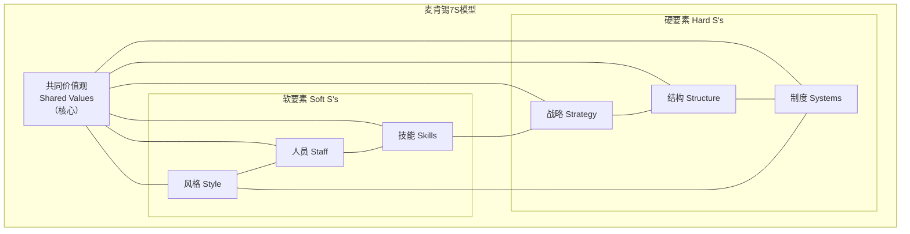
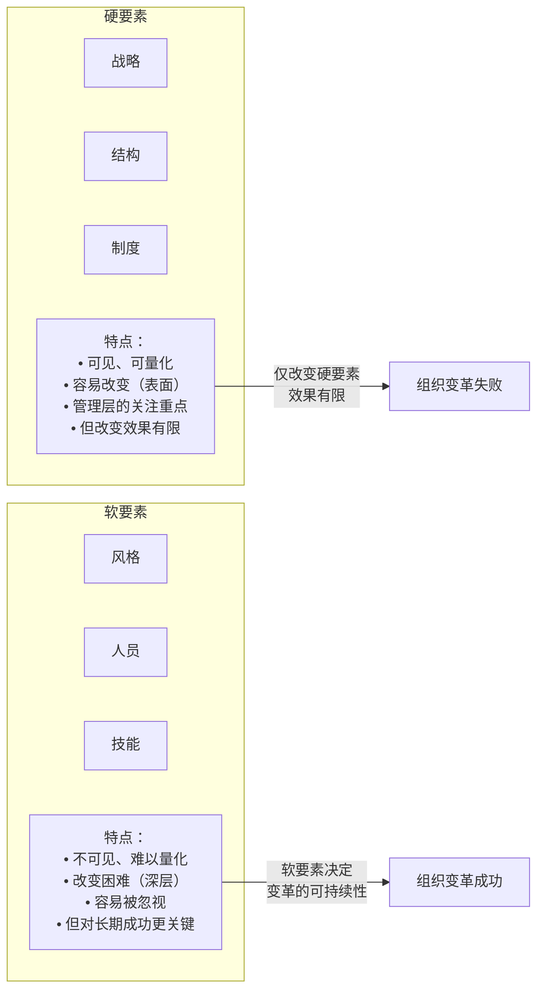
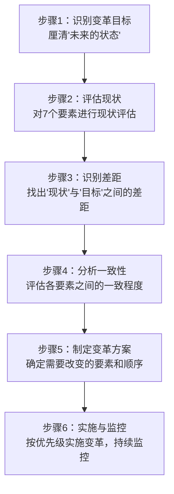
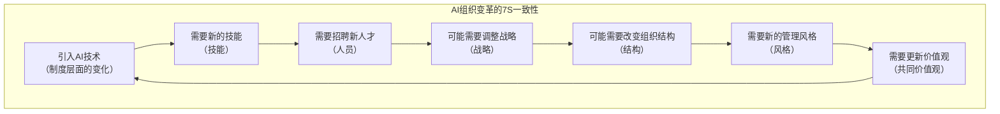

# 麦肯锡7S模型：组织一致性的诊断框架

> 7S模型强调组织的有效性取决于七个要素之间的"一致性"（alignment），而非单个要素的优劣。共同价值观是核心，连接所有其他要素。

---

## 一、引子：为什么好战略常常失败

### 1.1 战略失败的组织根源

许多组织制定了清晰的战略，但执行时却举步维艰。原因往往不是战略本身有问题，而是**组织的其他要素与战略不一致**。

麦肯锡7S模型（由Tom Peters和Robert Waterman在1980年提出）提供了一个系统性的组织诊断框架，帮助识别"战略成功实施的组织条件"。

### 1.2 7S模型的核心逻辑

> [!important] 7S的核心命题
> 组织的有效性不是由单个要素的优劣决定的，而是由**七个要素之间的一致性**决定的。当七个要素相互协调、相互强化时，组织就能有效执行战略；当要素之间存在矛盾时，组织就会陷入内耗。

---

## 二、7S详解

### 2.1 硬要素：战略、结构、制度

#### 战略（Strategy）

**定义**：组织为建立和维持竞争优势而采取的行动方案。

**关键问题**：
- 我们的战略是什么？（成本领先/差异化/聚焦？）
- 战略是否清晰？是否被组织成员理解？
- 战略是否与外部环境匹配？

**诊断信号**：
- 战略清晰但执行不力 → 可能是结构或制度问题
- 战略频繁变化 → 可能是核心不稳定的信号

#### 结构（Structure）

**定义**：组织的架构、层级、汇报关系、分工方式。

**关键问题**：
- 组织结构是否支持战略？（集权 vs 分权？职能制 vs 事业部制？）
- 汇报关系是否清晰？决策效率如何？
- 结构是否过于复杂或僵化？

**常见结构类型**：

| 结构类型 | 适用场景 | 优势 | 劣势 |
|---------|---------|------|------|
| 职能制 | 单一业务、稳定环境 | 专业化、效率高 | 部门墙、协调难 |
| 事业部制 | 多业务、多元化 | 业务聚焦、灵活 | 资源重复、协同难 |
| 矩阵制 | 复杂项目、多维度 | 资源共享、灵活 | 双线汇报、冲突 |
| 网络制 | 快速变化、创新 | 敏捷、弹性 | 控制弱、协调成本高 |

#### 制度（Systems）

**定义**：组织运行的流程、规则、程序和IT系统。

**关键问题**：
- 核心业务流程是什么？效率如何？
- 绩效管理制度是否与战略一致？
- 信息系统的支持程度？

**诊断信号**：
- 制度繁琐但结果不好 → 制度可能阻碍了执行
- 制度过于简单 → 可能导致失控

### 2.2 软要素：风格、人员、技能

#### 风格（Style）

**定义**：组织的管理风格、领导行为方式和文化氛围。

**关键问题**：
- 管理风格是命令式还是参与式？
- 决策文化是自上而下还是自下而上？
- 组织氛围是竞争型还是合作型？

**管理风格对比**：

| 维度 | 传统风格 | 现代风格 |
|------|---------|---------|
| 决策 | 自上而下 | 参与式、授权 |
| 沟通 | 正式、层级 | 开放、透明 |
| 控制 | 严格监督 | 信任+结果导向 |
| 创新 | 规避风险 | 鼓励试错 |
| 关系 | 正式、距离 | 非正式、亲密 |

#### 人员（Staff）

**定义**：组织中的人员构成、人才素质和员工管理。

**关键问题**：
- 人才储备是否充足？关键岗位是否有继任者？
- 人员构成是否多元化？是否与战略匹配？
- 员工的敬业度和满意度如何？

**与HR的关联**：这是7S中与 [[03-HR人事/培训与人才发展/培训与人才发展_知识库建设方案]] 和 [[战略人力资源]] 最直接相关的要素。

#### 技能（Skills）

**定义**：组织作为一个整体所拥有的核心能力。

**关键问题**：
- 组织的核心竞争力是什么？
- 哪些技能是组织独有的、难以模仿的？
- 技能差距在哪里？如何弥补？

**注意**：这里的"技能"是**组织层面的核心竞争力**，不仅仅是个人技能的总和。

### 2.3 核心要素：共同价值观（Shared Values）

**定义**：组织的核心价值观、信念和指导原则。

**关键问题**：
- 组织真正信奉的价值观是什么？（不是墙上的口号）
- 价值观是否渗透到日常决策中？
- 员工是否认同和践行价值观？

> [!important] 共同价值观是7S的核心
> 共同价值观位于7S模型的核心，因为它连接和影响所有其他六个要素。当组织的价值观清晰且被广泛认可时，它就像"粘合剂"，使其他要素协调一致。

---

## 三、硬要素与软要素的对比

> [!warning] 变革的常见陷阱：只改硬要素
> 许多组织在变革时只关注战略、结构、制度（硬要素），而忽视了风格、人员、技能、价值观（软要素）。结果往往是"表面变了，深层没变"——新战略旧文化，新结构旧行为，新制度旧思维。

---

## 四、7S在组织诊断和变革中的应用

### 4.1 组织诊断的7S框架

使用7S进行组织诊断时，重点不是"每个要素打多少分"，而是**评估要素之间的一致性**：

| 诊断维度 | 关键问题 |
|---------|---------|
| 战略-结构 | 组织结构是否支持战略执行？ |
| 战略-制度 | 管理系统（绩效、激励、信息）是否与战略一致？ |
| 战略-技能 | 组织是否具备执行战略所需的核心能力？ |
| 战略-人员 | 人才配置是否满足战略需求？ |
| 战略-风格 | 管理风格是否与战略要求匹配？ |
| 战略-价值观 | 战略方向是否与核心价值观一致？ |
| 结构-制度 | 制度和流程是否与组织结构匹配？ |
| 人员-技能 | 人员能力是否与所需的组织技能匹配？ |

### 4.2 7S变革诊断流程

### 4.3 变革的优先级

| 变革起点 | 示例 | 波及范围 |
|---------|------|---------|
| 战略变化 | 从成本领先转向差异化 | 所有7个S都需要调整 |
| 结构调整 | 从职能制转向事业部制 | 影响制度、风格、人员 |
| 技术变革 | 引入AI系统 | 影响制度、技能、人员 |
| 领导更替 | 新CEO上任 | 首先影响风格和价值观 |
| 文化变革 | 推动创新文化 | 主要影响风格和价值观 |

---

## 五、HR视角的7S模型

### 5.1 7S中HR直接相关的要素

在 [[03-HR人事/培训与人才发展/培训与人才发展_知识库建设方案]] 和 [[战略人力资源]] 中，7S模型有三个要素与HR直接相关：

| 要素 | HR的贡献 | 具体实践 |
|------|---------|---------|
| **人员（Staff）** | 招聘、配置、人才管理 | 人才盘点、继任计划、招聘策略 |
| **技能（Skills）** | 培训与发展、能力建设 | 培训体系、学习路径、技能评估 |
| **风格（Style）** | 文化塑造、领导力发展 | 企业文化建设、领导力项目 |

### 5.2 7S在组织变革中的HR角色

| 变革场景 | HR的角色 | 关键行动 |
|---------|---------|---------|
| 战略转型 | 人才策略制定者 | 评估人才差距，制定招聘/培训计划 |
| 结构调整 | 组织设计支持者 | 协助设计新结构，管理人员过渡 |
| 文化变革 | 文化变革推动者 | 重新定义价值观，设计文化活动 |
| 技术变革 | 能力建设者 | 技能再培训，数字化人才发展 |

### 5.3 与组织发展（OD）的关联

在 [[组织发展]] 中，7S模型是OD诊断的核心工具之一。OD从业者使用7S来：
- 系统性地诊断组织问题
- 设计全面的变革干预方案
- 确保变革方案覆盖软硬要素

---

## 六、AI时代的7S模型

### 6.1 AI对7S各要素的影响

| 7S要素 | AI的影响 |
|--------|---------|
| **战略** | AI创造新的战略选择（数据驱动、个性化） |
| **结构** | AI推动组织扁平化、网络化 |
| **制度** | AI自动化流程、智能决策支持 |
| **风格** | AI要求更开放、数据驱动的管理风格 |
| **人员** | AI改变人才需求结构，创造新岗位 |
| **技能** | AI成为核心组织能力，数据素养成为基础技能 |
| **共同价值观** | AI伦理、透明度、人机协作成为新价值观议题 |

### 6.2 AI组织变革的7S一致性

在 [[02-AI趋势与素养/AI Native组织变革/00_MOC_AI Native组织变革中枢]] 中，7S模型帮助我们理解为什么AI变革需要全要素协同：

> [!important] AI变革不是技术项目
> AI变革不只是引入新技术（制度），而是需要7S全要素的协调变化。只改变技术而不改变其他要素，AI变革注定失败。

---

## 七、常见误区

> [!warning]- 误区一：7S是"七个分数"
> 7S不是给每个要素打分然后求平均。核心是**一致性**——一个要素的"优秀"如果与其他要素不一致，反而可能有害。

> [!warning]- 误区二：硬要素比软要素重要
> 管理层往往关注硬要素（战略、结构、制度），因为它们"可见"。但研究表明，软要素的忽视是组织变革失败的主要原因。

> [!warning]- 误区三：7S分析一次就够了
> 组织是动态的，7S要素持续变化。定期进行7S诊断（至少年度），尤其是在重大变革前后。

> [!warning]- 误区四：所有7S要素都需要改变
> 不是每次变革都需要改变所有7个S。关键是识别"最小必要变化集"——改变哪些要素能带动其他要素的调整。

---

## 八、总结

麦肯锡7S模型的核心价值：

1. **系统性**：避免"头痛医头"，提供全面的组织诊断框架
2. **一致性导向**：强调要素之间的协调，而非单个要素的优化
3. **软硬结合**：硬要素和软要素同等重要，避免"重硬轻软"
4. **变革指导**：为组织变革提供诊断和规划框架

---

## 九、延伸阅读

- [[04-商业与战略/战略分析工具与框架/00_MOC_战略分析工具与框架中枢]]：返回知识库中枢
- [[04-商业与战略/战略分析工具与框架/03_SWOT分析：最被滥用的战略工具]]：内部能力评估
- [[04-商业与战略/战略分析工具与框架/07_战略地图与平衡计分卡：从战略到执行]]：战略执行框架
- [[03-HR人事/培训与人才发展/培训与人才发展_知识库建设方案]]：7S中的人员和技能要素
- [[02-AI趋势与素养/AI Native组织变革/00_MOC_AI Native组织变革中枢]]：AI变革的7S一致性
- [[组织发展]]：OD视角下的7S诊断
- Peters, T. & Waterman, R. (1982). *In Search of Excellence*. Harper & Row.

---

> [!quote] 核心引用
> "组织的有效性不在于单个要素的卓越，而在于所有要素的和谐一致。" —— Tom Peters & Robert Waterman
>
> "硬要素容易改变，但软要素决定变革的成败。" —— 组织变革实践