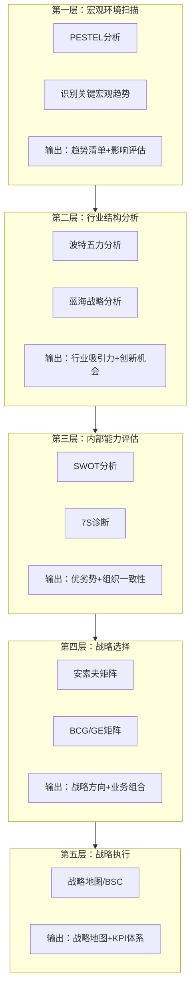
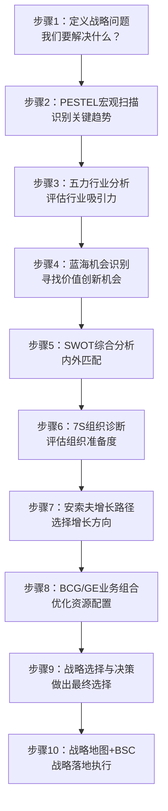
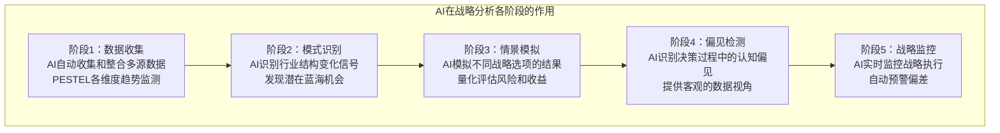
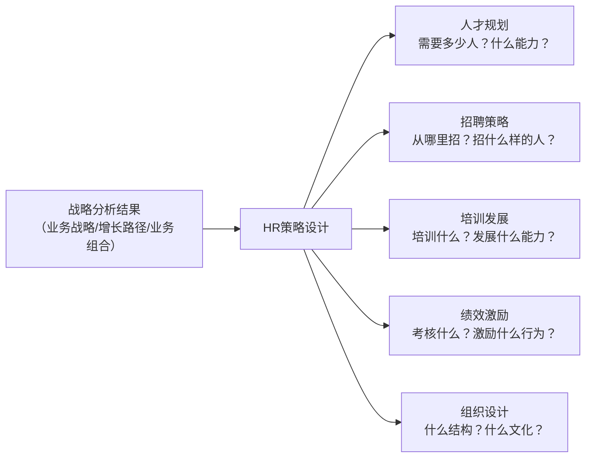

# 战略工具的综合应用：从分析到决策

> 单一工具无法完整回答战略问题。真正的战略分析需要组合使用多个工具，形成从宏观环境 → 行业分析 → 内部评估 → 战略选择 → 战略执行的完整流程。

---

## 一、引子：为什么需要综合应用

### 1.1 单一工具的局限性

每个战略工具都有其独特的视角和局限：

| 工具 | 回答的问题 | 不回答什么 |
|------|-----------|-----------|
| [[04-商业与战略/战略分析工具与框架/04_PESTEL分析：宏观环境的系统扫描]] | 宏观环境有哪些趋势？ | 这些趋势对行业的具体影响？ |
| [[04-商业与战略/战略分析工具与框架/02_波特五力模型：行业结构的分析框架]] | 行业竞争格局如何？ | 我们在这个行业中有什么优势？ |
| [[04-商业与战略/战略分析工具与框架/03_SWOT分析：最被滥用的战略工具]] | 我们的优劣势和机会威胁？ | 我们应该选择哪个战略？ |
| [[04-商业与战略/战略分析工具与框架/06_蓝海战略：创造无竞争的市场空间]] | 如何创造新市场？ | 现有业务怎么管理？ |
| [[04-商业与战略/战略分析工具与框架/08_安索夫矩阵：增长战略的四种路径]] | 增长路径有哪些？ | 哪个路径最适合我们？ |
| [[04-商业与战略/战略分析工具与框架/05_BCG矩阵与GE矩阵：业务组合管理]] | 如何管理业务组合？ | 新业务机会在哪里？ |
| [[04-商业与战略/战略分析工具与框架/07_战略地图与平衡计分卡：从战略到执行]] | 如何将战略落地？ | 战略本身是否正确？ |
| [[04-商业与战略/战略分析工具与框架/09_麦肯锡7S模型：组织一致性的诊断框架]] | 组织是否准备好执行战略？ | 竞争优势在哪里？ |

> [!important] 没有一个工具能回答所有问题
> 战略分析的完整流程需要多个工具的协同。每个工具提供"一块拼图"，综合起来才能看到完整的战略图景。

### 1.2 综合应用的原则

| 原则 | 说明 |
|------|------|
| **互补性** | 选择的工具应该覆盖不同的分析维度（外部/内部/定性/定量） |
| **时序性** | 工具的使用顺序应该遵循从宏观到微观、从分析到决策的逻辑 |
| **适用性** | 不是所有工具都要用，根据战略问题的性质选择最相关的工具 |
| **迭代性** | 后续分析可能揭示新问题，需要回到前面的工具重新分析 |

---

## 二、战略分析的"漏斗"模型

### 2.1 从宏观到微观的五层分析

### 2.2 各层的输入输出

| 层次 | 输入 | 核心工具 | 输出 | 关键问题 |
|------|------|---------|------|---------|
| L1 宏观 | 外部数据、报告 | PESTEL | 趋势清单 | 哪些宏观趋势重要？ |
| L2 行业 | L1输出+行业数据 | 五力、蓝海 | 行业吸引力评分 | 这个行业能赚钱吗？有没有蓝海？ |
| L3 内部 | 内部数据+竞品对比 | SWOT、7S | 优劣势+组织诊断 | 我们的能力匹配吗？ |
| L4 选择 | L1+L2+L3输出 | 安索夫、BCG | 战略选项 | 增长路径？业务组合？ |
| L5 执行 | L4输出+组织能力 | BSC、战略地图 | 战略地图+KPI | 如何落地？ |

---

## 三、战略分析的标准流程

### 3.1 完整流程（10步法）

### 3.2 各步骤详细说明

**步骤1：定义战略问题**

> 在开始分析之前，明确"我们到底要解决什么问题"。好的问题定义已经包含了分析的方向。

**步骤2-4：外部环境分析**

- [[04-商业与战略/战略分析工具与框架/04_PESTEL分析：宏观环境的系统扫描]]：识别影响行业的关键宏观趋势
- [[04-商业与战略/战略分析工具与框架/02_波特五力模型：行业结构的分析框架]]：评估行业利润潜力和竞争压力
- [[04-商业与战略/战略分析工具与框架/06_蓝海战略：创造无竞争的市场空间]]：寻找价值创新机会

**步骤5-6：内部能力评估**

- [[04-商业与战略/战略分析工具与框架/03_SWOT分析：最被滥用的战略工具]]：将外部机会/威胁与内部优势/劣势匹配
- [[04-商业与战略/战略分析工具与框架/09_麦肯锡7S模型：组织一致性的诊断框架]]：评估组织是否具备执行新战略的条件

**步骤7-8：战略选择**

- [[04-商业与战略/战略分析工具与框架/08_安索夫矩阵：增长战略的四种路径]]：确定增长方向
- [[04-商业与战略/战略分析工具与框架/05_BCG矩阵与GE矩阵：业务组合管理]]：优化资源配置

**步骤9：战略决策**

综合所有分析结果，做出战略选择。详见下文"战略决策的常见偏见"。

**步骤10：战略执行**

- [[04-商业与战略/战略分析工具与框架/07_战略地图与平衡计分卡：从战略到执行]]：将战略转化为行动和KPI

---

## 四、战略决策的常见偏见

### 4.1 认知偏见对战略决策的影响

即使有了完整的分析，战略决策仍然受到认知偏见的严重影响。以下是战略决策中最常见的偏见：

| 偏见 | 说明 | 战略决策中的表现 | 应对策略 |
|------|------|----------------|---------|
| **确认偏误** | 倾向于寻找支持已有观点的信息 | 只收集支持自己偏好的战略方向的数据 | 强制寻找反面证据，设立"魔鬼代言人" |
| **过度自信** | 高估自己的判断能力 | 过于乐观地估计战略成功的概率 | 做"事前验尸"（premortem）：假设战略失败，分析原因 |
| **锚定效应** | 过度依赖最先获得的信息 | 被最初的行业数据或竞争对手策略"锚定" | 先从多个独立来源获取信息 |
| **从众效应** | 跟随大多数人的判断 | "大家都在做数字化，我们也要做" | 明确区分"跟随"和"战略选择" |
| **沉没成本谬误** | 因为已投入而不愿放弃 | 继续投资一个已经证明失败的策略 | 问"如果今天从零开始，我会做这个选择吗？" |
| **可得性偏见** | 过度依赖容易想起的信息 | 因为最近看到某公司成功，就认为该策略可行 | 系统性地收集行业数据，而非依赖记忆 |
| **框架效应** | 问题表述方式影响判断 | 战略被描述为"增长机会"而非"风险决策" | 用不同框架重新描述战略问题 |

### 4.2 改善战略决策质量的方法

| 方法 | 说明 |
|------|------|
| **魔鬼代言人** | 指定专人寻找反对战略选项的理由 |
| **事前验尸** | 假设战略已失败，分析失败原因 |
| **红蓝对抗** | 一个团队论证战略，另一个团队挑战战略 |
| **决策矩阵** | 用多维度评分矩阵评估各战略选项 |
| **外部视角** | 引入行业外人士或独立顾问提供外部视角 |
| **延迟判断** | 先收集所有信息，再形成判断（避免过早下结论） |

---

## 五、AI如何辅助战略分析

### 5.1 AI在战略分析全流程中的角色

### 5.2 AI的能与不能

| AI能做的 | AI不能做的 |
|---------|-----------|
| 收集和分析海量数据 | 在信息不完整时做出判断 |
| 识别模式和趋势 | 理解组织文化和政治 |
| 模拟多种情景 | 在冲突的价值观中做出权衡 |
| 检测认知偏见 | 承担战略决策的责任 |
| 实时监控执行情况 | 激发团队对战略的承诺 |

> [!important] AI是工具，不是决策者
> AI可以大幅提升战略分析的效率和深度，但最终的**战略选择**——在不确定环境中做出决断，在相互冲突的优先级中做出取舍，为组织设定方向——仍然是人类领导者的核心职责。

### 5.3 与相关主题的关联

- [[02-AI趋势与素养/AI Native组织变革/00_MOC_AI Native组织变革中枢]]：AI如何重塑战略决策的组织方式
- [[04-商业与战略/商业模式设计与创新/00_MOC_商业模式设计与创新中枢]]：AI驱动的商业模式创新
- [[04-商业与战略/战略分析工具与框架/01_战略思维的本质：从做什么到不做什么]]：AI时代的战略思维

---

## 六、工具组合的实战场景

### 6.1 场景一：年度战略规划

| 步骤 | 工具 | 时间投入 | 参与者 |
|------|------|---------|--------|
| 宏观扫描 | PESTEL | 2-3天 | 战略团队+外部专家 |
| 行业分析 | 五力 | 1-2天 | 战略团队+业务负责人 |
| 内部评估 | SWOT + 7S | 2-3天 | 高层+中层+HR |
| 战略选择 | 安索夫 + BCG | 2-3天 | 高层管理团队 |
| 战略执行 | BSC/战略地图 | 3-5天 | 高层+各职能负责人 |

### 6.2 场景二：新市场进入决策

| 步骤 | 工具 | 关键产出 |
|------|------|---------|
| 宏观环境 | PESTEL（聚焦目标市场） | 目标市场宏观风险评估 |
| 行业分析 | 五力 + 蓝海战略 | 目标市场吸引力+差异化机会 |
| 增长路径 | 安索夫矩阵 | 进入方式（市场开发/产品开发/多元化） |
| 综合评估 | SWOT | 进入的优劣势 |
| 执行准备 | 7S | 组织是否准备好进入 |

### 6.3 场景三：业务组合优化

| 步骤 | 工具 | 关键产出 |
|------|------|---------|
| 现状评估 | BCG/GE矩阵 | 各业务的矩阵定位 |
| 趋势分析 | PESTEL | 各业务所在市场的趋势 |
| 资源评估 | 7S（聚焦技能和人员） | 组织能力与业务匹配度 |
| 战略选择 | 投资/维持/收割/剥离决策 | 各业务的资源分配方案 |
| 执行落地 | BSC | 各业务的KPI和目标 |

### 6.4 场景四：组织变革

| 步骤 | 工具 | 关键产出 |
|------|------|---------|
| 变革诊断 | 7S全面诊断 | 各要素现状与一致性问题 |
| 环境分析 | PESTEL + 五力 | 变革的外部驱动力 |
| 战略方向 | SWOT + 蓝海战略 | 变革后的战略方向 |
| 变革路径 | 安索夫矩阵 | 增长的路径选择 |
| 执行落地 | BSC/战略地图 | 变革的KPI和里程碑 |

---

## 七、HR视角的综合应用

### 7.1 战略分析结果如何转化为HR策略

在 [[03-HR人事/培训与人才发展/培训与人才发展_知识库建设方案]] 和 [[战略人力资源]] 中，战略分析是HR策略的起点：

### 7.2 不同战略分析工具对HR的启示

| 战略工具 | 对HR的启示 |
|---------|-----------|
| PESTEL | 社会趋势（人口、工作观）和技术趋势（AI）影响人才供给 |
| 五力 | 行业竞争强度决定人才争夺的激烈程度 |
| SWOT | 人才优势和劣势是内部因素的重要组成部分 |
| 安索夫 | 不同增长路径需要不同的人才策略 |
| BCG | 不同业务类型需要不同的人才管理方式 |
| 7S | 人员、技能、风格是HR的直接责任领域 |
| BSC | 学习与成长维度是HR对战略执行的核心贡献 |

---

## 八、常见误区

> [!warning]- 误区一：工具越多越好
> 不是所有工具都适用于每个场景。根据战略问题的性质选择2-4个最相关的工具，比把所有工具都过一遍更有效。

> [!warning]- 误区二：分析越深入越好
> 战略分析需要在"足够深入"和"及时决策"之间平衡。完美主义导致分析瘫痪，错失时机。

> [!warning]- 误区三：分析结果=战略
> 分析工具提供的是"选项"和"洞察"，不是"战略"本身。战略是"选择"——在多选项中做出取舍。

> [!warning]- 误区四：战略分析是一次性的
> 战略环境持续变化，战略分析应该定期更新。建议年度全面分析+季度快速回顾。

---

## 九、总结

战略工具综合应用的核心原则：

1. **从宏观到微观**：PESTEL → 五力 → SWOT → 战略选择 → 执行
2. **从外部到内部**：先理解环境和行业，再审视自身
3. **从分析到决策**：工具提供信息，决策者做出选择
4. **从战略到执行**：战略地图和BSC将战略转化为行动
5. **警惕偏见**：认知偏见是战略决策的最大敌人之一
6. **人机协同**：AI增强分析，人类做出判断

---

## 十、延伸阅读

- [[04-商业与战略/战略分析工具与框架/00_MOC_战略分析工具与框架中枢]]：返回知识库中枢
- [[04-商业与战略/战略分析工具与框架/01_战略思维的本质：从做什么到不做什么]]：战略思维基础
- 本知识库中所有10篇内容文档
- [[02-AI趋势与素养/AI Native组织变革/00_MOC_AI Native组织变革中枢]]：AI时代的战略决策
- [[04-商业与战略/商业模式设计与创新/00_MOC_商业模式设计与创新中枢]]：战略与商业模式的交叉
- [[03-HR人事/培训与人才发展/培训与人才发展_知识库建设方案]]：战略分析到HR策略

---

> [!quote] 核心引用
> "战略分析的价值不在于分析的深度，而在于它导向的决策质量。" —— 战略管理实践
>
> "最好的战略分析是那些能帮助决策者做出更好选择的分析——不多不少，恰到好处。" —— 管理实践总结
>
> "在战略决策中，最大的敌人不是信息不足，而是认知偏见。" —— Daniel Kahneman