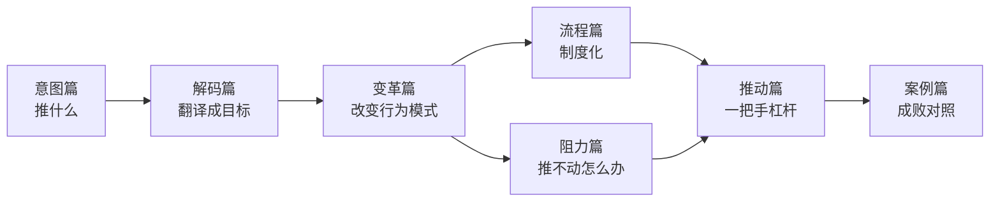

# 战略落地与组织变革中枢

本知识库回答一个问题：一个想法怎么变成整个组织的行动。视角是一把手和变革推动者——不是旁观者分析，是"我具体该做什么"。素材来自已批准的建设方案，七模块逐层展开。

## 定位

CEO的日常困境不是没有想法，是想法推不动：会上拍板的新流程三个月没人执行；变革方案画得很漂亮，一动架构就撞上部门墙；战略定了，一线员工不知道跟自己有什么关系。想法到落地之间隔着四道墙——翻译墙（想法变组织语言）、机制墙（目标变责任与考核）、变革墙（改变既有行为模式）、文化墙（短期行动变长期习惯）。本库就是逐层拆墙的手册。

## 七模块速览

- 01-意图篇：想法筛选与战略意图——推什么
- 02-解码篇：战略解码全链条——把想法翻译成组织目标（本库核心模块）
- 03-变革篇：组织变革落地——变革模型、路线图、变革办、固化
- 04-流程篇：流程落地与制度化——SOP、流程Owner、持续优化
- 05-阻力篇：变革阻力与组织政治——三层面诊断、部门博弈、把反对者变盟友
- 06-推动篇：一把手杠杆与推进节奏——五大杠杆、沟通穿透、检查机制
- 07-案例篇：落地成败案例——成功拆解、死因诊断

## 使用指南

| 你现在的状态 | 先看什么 |
|------|--------|
| 想法太多，什么都想推 | 意图篇 |
| 战略定了，没人执行，目标无人认领 | 解码篇 |
| 推流程、改架构，不知道从哪下手 | 变革篇、流程篇 |
| 推不动，阻力重重，部门博弈 | 阻力篇、推动篇 |
| 想借鉴成败经验 | 案例篇 |

> [!important] 五条关键原则
> 1. 一次只推一个大想法，变革资源有限，多推等于都不推。
> 2. 解码必须穿透到个人，链条断在中间，战略就是文件旅行。
> 3. 变革是改变行为模式，不是换一版制度文件。
> 4. 阻力是信息，反对声里藏着没解决的问题。
> 5. 一把手的杠杆有限，要善用节奏、授权和仪式，不能全靠自己盯。

## 与变革管理知识库的分工

[[04-商业与战略/变革管理/00_MOC_变革管理中枢|变革管理]]知识库是理论版——勒温三阶段、科特八步、变革领导力模型的完整论述；本库是实战版——这些模型怎么变成一把手的动作、解码会怎么开、变革办怎么建。同一模型在两库各有理论入口和实战入口，互相双链。

## 关联知识库

- [[04-商业与战略/战略/00_MOC_战略中枢|战略库]]：战略翻译、取舍思维、节奏与时机——本库的翻译规则与方法底座
- [[03-HR人事/绩效管理/00_MOC_绩效管理中枢|绩效管理库]]：OKR、BSC——解码篇的工具衔接
- [[03-HR人事/组织行为学精要/00_MOC_组织行为学精要中枢|组织行为学精要]]：组织与人的规律——阻力篇与推动篇的理论支撑
- [[03-HR人事/AI时代领导力与管理/00_MOC_AI时代领导力与管理中枢|AI时代领导力]]：转型路线图与组织变革领导力
- [[05-产品与开发/项目管理方法论/00_MOC_项目管理方法论中枢|项目管理方法论]]：干系人与协调机制——跨部门变革的落地工具

## 下一步

如果你现在想法很多，从意图篇读起——[[04-商业与战略/战略落地与组织变革/01-意图篇/01_想法的筛选与排序：什么值得推|想法的筛选与排序]]；如果战略已经定了但推不动，直接进[[04-商业与战略/战略落地与组织变革/02-解码篇/01_战略解码全链条|战略解码全链条]]。每篇结尾都有"现在你应该怎么做"，读完就动手。
