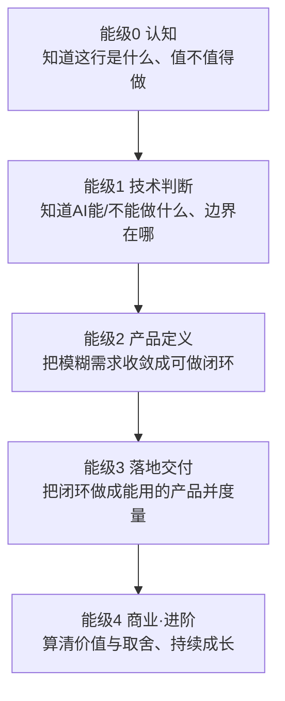
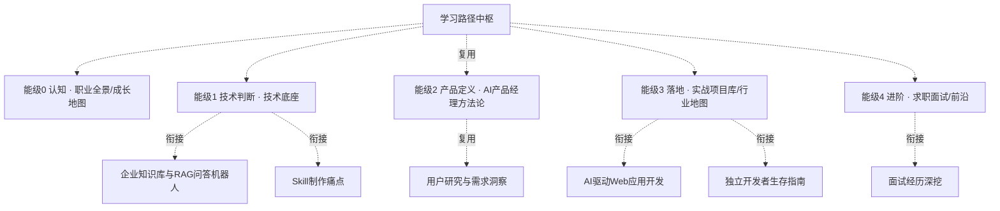

# AI产品经理学习路径中枢（重写版）

> [!abstract] 知识库定位
> 回答**"如何成为一名合格的 AI 产品经理"**——不是罗列知识，而是给出一条**能跟着走到底的能力曲线**：每层练什么能力、看什么资源、做什么练习、练到什么程度才算会、过关后进哪里。
>
> 与 [[05-产品与开发/AI产品经理方法论/00_MOC_AI产品经理方法论中枢]]（给"正确答案"）互补：方法论讲"怎么做对"，本路径讲"**怎么一步步走到能做对**"。
>
> **核心导向**：**求职入行为主轴，能力全面发展为底座。**

---

## 一、学习主轴：AI PM 能力螺旋

> 用一条**能力螺旋**替代扁平分层——每一轮都是一次"学→做→测→反思"的回升，练成下一层才支撑更上一层的判断。

> **螺旋而非直线**：每一能级都在一轮"学→做→测→反思"中夯实一次；不能跳级——不先练成能级1的技术判断，能级2的产品定义就容易把 AI 该不该用都搞错。

---

## 二、全线能力曲线总表（看/练/判据）

> 这张表就是全库的"成体系主线"：每一层都明确 **要练成的能力 → 看什么 → 练什么 → 怎么算会 → 下一步**。

| 能级/层 | 要练成的能力 | 看什么（资源类型） | 练什么（可检验练习） | 怎么算会（判据） | 过关入口 |
|------|------------|------------------|--------------------|----------------|---------|
| **能级0 认知** | 说清"AI PM 是什么、值不值得做" | 岗位JD、招聘平台、行业报告 | 写出30秒定位＋盘点自己优势 | 能讲出 3 处与传统的不同＋目标方向 | 进能级1 |
| **能级1 技术判断** | 判断"AI能/不能做什么、该不该用" | 模型能力文档、动手试真实产品 | 对5个真实需求做能力边界判断 | 每个判断能给出"用/不用/用哪种"理由 | 进能级2 |
| **能级2 产品定义** | 把需求收敛成"可做闭环" | AI产品方法论、真实PRD案例 | 写1份含能力边界的一页产品定义 | 闭环可跑通、明确指标与容错 | 进能级3 |
| **能级3 落地交付** | 把闭环做成能用、可度量的产品 | 动手工具、项目复盘、作品集样本 | 做出1个真实反馈的项目＋作品集 | 有项目故事＋量化结果 | 进能级4 |
| **能级4 商业·进阶** | 算清价值与取舍、持续跟前沿 | 商业/成本/合规专题、前沿发布 | 评估1个AI产品的ROI与风险 | 能算清成本/价值/风险并给取舍 | 长期循环 |

---

## 三、子知识库导航（按能级归位）

| 能级 | 子知识库 | 一句话 | 枢纽 |
|------|---------|--------|------|
| 0 | [[05-产品与开发/AI产品经理学习路径/01-认知启蒙/00_MOC_职业全景中枢]] | 这个职业是什么、值不值得、你往哪走 | [[05-产品与开发/AI产品经理学习路径/01-认知启蒙/00_MOC_职业全景中枢]] |
| 0 | [[05-产品与开发/AI产品经理学习路径/01-认知启蒙/00_MOC_成长地图中枢]] | 怎么学、每阶段练什么、走到哪算会 | [[05-产品与开发/AI产品经理学习路径/01-认知启蒙/00_MOC_成长地图中枢]] |
| 1 | [[05-产品与开发/AI产品经理学习路径/02-技术底座/00_MOC_技术底座中枢]] | AI能做什么、不能做什么、边界在哪 | [[05-产品与开发/AI产品经理学习路径/02-技术底座/00_MOC_技术底座中枢]] |
| 1 | [[05-产品与开发/AI产品经理学习路径/02-技术底座/00_MOC_技术栈中枢]] | RAG/Agent/多模态/提示词怎么选 | [[05-产品与开发/AI产品经理学习路径/02-技术底座/00_MOC_技术栈中枢]] |
| 2 | [[05-产品与开发/AI产品经理学习路径/03-产品定义/00_MOC_产品定义中枢]] | 把模糊想法收敛成可做闭环（一页产品定义） | [[05-产品与开发/AI产品经理学习路径/03-产品定义/00_MOC_产品定义中枢]] |
| 2 | [[05-产品与开发/AI产品经理方法论/00_MOC_AI产品经理方法论中枢]] | 复用：会定义、会设计、会迭代 | -- |
| 3 | [[05-产品与开发/AI产品经理学习路径/04-实战落地/00_MOC_实战项目库中枢]] | 把会做得变成作品集、可讲的故事 | [[05-产品与开发/AI产品经理学习路径/04-实战落地/00_MOC_实战项目库中枢]] |
| 3 | [[05-产品与开发/AI产品经理学习路径/04-实战落地/00_MOC_行业地图中枢]] | 各行业产品形态、往哪投 | [[05-产品与开发/AI产品经理学习路径/04-实战落地/00_MOC_行业地图中枢]] |
| 4 | [[05-产品与开发/AI产品经理学习路径/05-进阶出口/00_MOC_求职面试中枢]] | 把实力转化成 Offer | [[05-产品与开发/AI产品经理学习路径/05-进阶出口/00_MOC_求职面试中枢]] |
| 4 | [[05-产品与开发/AI产品经理学习路径/05-进阶出口/00_MOC_前沿跟踪中枢]] | 持续进阶、不被淘汰 | [[05-产品与开发/AI产品经理学习路径/05-进阶出口/00_MOC_前沿跟踪中枢]] |

---

## 四、推荐学习节奏（求职入行导向）

### 双引擎并进

- **求职主线**：技术判断 → 作品集 → 面试，产出直接落进简历/作品集
- **能力底座**：同步补"沟通表达、商业判断、量化思维、行业认知"（见第五节）

> 每过一关能级，回读本中枢更新"进度追踪"，并确认"怎么算会"已达标再前进。

---

## 五、能力全面发展补充清单（副线底座）

| 能力维度 | 具体练法（D1实操） | 相关已有知识库 |
|---------|-------------------|---------------|
| 沟通与表达 | 每做一个项目就讲一遍给非技术人、录音回听 | [[03-HR人事/招聘与面试体系/00_MOC_招聘与面试体系中枢]] |
| 商业判断 | 每个项目补一段"商业价值/ROI"结论 | [[04-商业与战略/商业模式设计与创新/00_MOC_商业模式设计与创新中枢]] |
| 量化思维 | 每个项目定义并检验至少1个指标 | [[06-数据分析/AI数据分析/00_MOC_AI数据分析中枢]] |
| 行业认知 | 深耕 HR+组织一个方向、做行业研究 | [[04-商业与战略/战略分析工具与框架/00_MOC_战略分析工具与框架中枢]] |

---

## 六、与已有知识库的衔接

---

## 七、我的学习进度追踪（闭环）

> [!todo] 当前进度（每过一关更新）
> - [ ] **能级0 认知**：30秒定位＋目标方向
> - [ ] **能级1 技术判断**：5个需求能力边界判断
> - [ ] **能级2 产品定义**：一页产品定义＋PRD
> - [ ] **能级3 落地交付**：作品集＋项目故事
> - [ ] **能级4 商业·进阶**：ROI评估＋面试复盘＋前沿机制

> 本轮水位：____ / 当前卡在哪：____ / 下一步练什么：____

---

## 附：重写质量标准

> 本次重写依据 [[05-产品与开发/AI产品经理学习路径/AI产品经理学习路径_重写设计方案]]，四维度：D1实操与模板 / D2深度洞察 / D3成体系主线 / D4资源与练习。

---

## 版本历史

| 版本 | 日期 | 更新内容 |
|------|------|----------|
| v0.1 | 2026-08-20 | 初始中枢（五层） |
| **v1.0** | 2026-08-20 | **重写为"能力螺旋 + 看/练/判据"主线** |