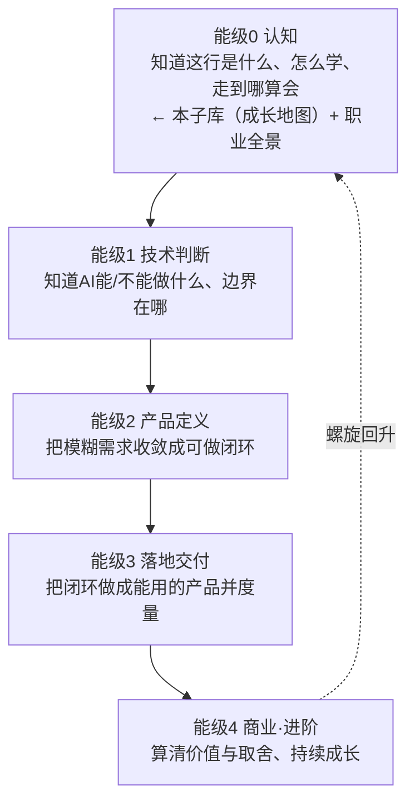

# 成长地图中枢（重写版）

> [!abstract] 本子库目的（能级0：认知）
> 本子库服务**能力螺旋的能级0——认知**。目标不是"了解怎么学"，而是练成一项能力：**能回答「我该怎么学、学到哪算会、现在走到哪了」**。产出是**一条可执行的学习路线 + 一个能自我校准的学习闭环**。
>
> 与 [[05-产品与开发/AI产品经理学习路径/01-认知启蒙/00_MOC_职业全景中枢]] 分工：职业全景回答"**去哪**"（选方向），成长地图回答"**怎么走**"（定路线）。

---

## 一、本子库要练成的能力（D3主线）

> **能级0 认知的判据：你能在任何时候说清「我现在在能力螺旋的哪一格、这一格要练成什么、练成后进哪里、当前卡在哪」。**
> 这不是"知道几个学习方法"，而是"**能自我定位、自我校准**"——这是后续所有能级的元能力。练不成它，后面会陷入"学了很多、不知道走到哪"的失控。

---

## 二、能力螺旋总览（本子库是第 0 圈）

> 全库主线是一条**能力螺旋**：每一圈都是一轮"学→做→测→反思"，练成下一层才支撑更上一层的判断。

> [!warning] 螺旋而非直线
> 不能跳级。**因为**能级1的技术判断是能级2产品定义的地基，**所以**不先练成"判断 AI 该不该用、用哪种"，产品定义就会把需求定义在错误的假设上，后面所有努力都白费。本子库的"怎么算会"就是防止你带着没练成的能级0硬闯能级1。

---

## 三、文档规划（每篇的深度升级点）

| 文档 | 核心问题 | 深度升级点（相对旧版） | 状态 |
|------|---------|----------------------|------|
| [[05-产品与开发/AI产品经理学习路径/01-认知启蒙/01_拥抱不确定性：AI PM 的学习心态]] | 心态上怎么准备 | 从"接受三个事实"升级为"**不确定性决策能力**"：概率性决策/信息不完备判断/工具过时应对框架 + 不确定性决策模板 | 本文档 |
| [[05-产品与开发/AI产品经理学习路径/01-认知启蒙/02_项目驱动学习法]] | 怎么学最有效 | 从"五步法清单"升级为"**项目驱动学习闭环**"：每步给做法+坑 + 选题表 + 存量项目升级作品集 | 本文档 |
| [[05-产品与开发/AI产品经理学习路径/01-认知启蒙/03_成长五阶段路线图]] | 从入门到胜任怎么走 | 从"五阶段"升级为"**能力螺旋五能级**"：每能级给能力/看/练/判据/过关入口 + 阶段自检清单 + 跳级反例 | 本文档 |
| [[05-产品与开发/AI产品经理学习路径/01-认知启蒙/04_学习闭环与全面发展]] | 边学边做、兼补短板 | 从"闭环四步"升级为"**每周学习闭环模板 + 月度复盘模板**"，与总中枢进度追踪联动 | 本文档 |

---

## 四、本子库的"看什么 / 练什么 / 怎么算会"总表

> 这张表就是本子库的成体系主线：四篇文档各司其职，练成后合起来 = 能级0 认知。

| 文档 | 看什么（资源类型） | 练什么（可检验练习） | 怎么算会（判据） |
|------|------------------|--------------------|----------------|
| 01 拥抱不确定性 | AI 产品复盘文、模型能力边界文档、失败案例 | 用"不确定性决策模板"拆 3 个真实决策 | 能区分"确定/不确定/可验证"，不把时点结论当真理 |
| 02 项目驱动学习法 | 项目复盘文、作品集样本、上手工具 | 填 1 张选题表 + 跑通 1 个最小闭环 | 有 1 个"问题-方案-指标-结果"可讲的项目 |
| 03 成长五阶段路线图 | 能力模型、岗位 JD、成长复盘 | 用自检清单定位当前能级 | 能说清"我在哪格、练什么、进哪里、卡在哪" |
| 04 学习闭环与全面发展 | 学习方法论、复盘模板、能力清单 | 连续 4 周跑每周闭环 + 1 次月度复盘 | 闭环可自转：输入→实践→度量→复盘不断档 |

---

## 五、与其它子库的衔接

- **前置**：先过 [[05-产品与开发/AI产品经理学习路径/01-认知启蒙/00_MOC_职业全景中枢]]（有定位和目标方向），再来本子库定路线
- **后置**：本子库"怎么算会"达标后，进入 [[05-产品与开发/AI产品经理学习路径/02-技术底座/00_MOC_技术底座中枢]] 练能级1
- **全程**：每过一关能级，回 [[05-产品与开发/AI产品经理学习路径/00_MOC_AI产品经理学习路径中枢]] 更新进度追踪（见 04 篇的联动机制）

---

## 六、进度追踪（与 04 篇联动）

> [!tip] 填完即用
> 每过一篇就勾一项。**全部勾选 = 能级0认知过关**，才允许进入能级1技术底座。勾选标准要严——"能讲给非技术人听 + 扛得住追问"才算过，不是"看过就算会"。

> [!todo] 能级0 认知·成长地图进度
> - [ ] 01 不确定性：拆解 3 个真实决策，模板填完
> - [ ] 02 项目驱动：选题表填完 + 1 个最小闭环跑通
> - [ ] 03 路线图：自检清单定位当前能级
> - [ ] 04 闭环：连续 4 周每周闭环 + 1 次月度复盘
>
> 当前水位：____ / 卡在哪：____ / 下一步练什么：____

---

## 版本历史

| 版本 | 日期 | 更新内容 |
|------|------|----------|
| v0.1 | 2026-08-20 | 初始中枢（学习心态 + 五阶段） |
| **v1.0** | 2026-08-20 | **重写：升级为"能力螺旋"导航中枢，服务能级0认知，四篇全部深化（D1-D4）** |
