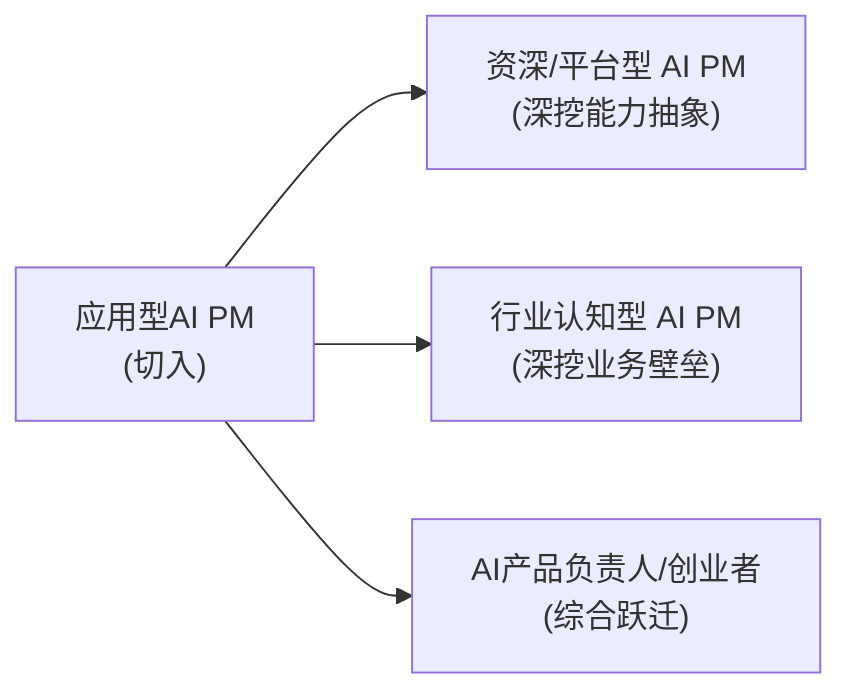

# AI产品经理的细分类型与职业路径（重写版）

> [!abstract] 本文目的
> 看清 AI PM 不是单一岗位，而是一个按"**技术深度 × 产品职责**"分布的职业谱系。本文不仅罗列类型，更给出一张**决策表**：结合你的背景，该选哪类、怎么切入、怎么进阶。

---

## 一、三类典型 AI PM（含深度权衡）

| 类型 | 核心职责 | 典型产出 | 技术深度 | 最大的"坑" |
|------|---------|---------|:---:|-----------|
| **应用型 AI PM** | 把 AI 作为能力注入产品，解决具体场景 | AI 功能、AI 产品 PRD | 中低 | 容易变成"接线员"，价值被低估 |
| **能力/平台型 AI PM** | 抽象 AI 能力成平台/接口 | 能力平台、API 定义 | 中高 | 需求抽象难，易过度设计 |
| **底层/算法向 PM** | 明确模型能力边界与迭代方向 | 模型需求、评测体系 | 高 | 易陷技术细节，远离用户 |

> 深度洞察：**多数岗位不是纯一类，而是介于之间。求职入行通常从"应用型"切入，因为最容易证明'我能把一个AI能力用在真实场景并产出可度量价值'**——这正是你 HR+AI 项目的优势所在。

---

## 二、按落地细分（含选择逻辑）

| 维度 | 方向 | 选择判断依据 |
|------|------|-------------|
| 通用 AI 产品 | 智能助手、Copilot、AI 创作 | 竞争激烈、需要强产品力 |
| **垂直行业 AI** | HR-AI、客服、金融、医疗、教育 | **有行业认知壁垒，可差异化**（你的主战场） |
| AI 基础设施 | 模型平台、评测、标注 | 需技术深、规模公司 |

> 深度洞察：**垂直行业 AI 的护城河是"行业认知"而非"AI 技术"**——因为 AI 技术大家都能调，但"懂 HR 业务里 AI 该怎么落地、边界和伦理在哪"是稀缺的。你把 HR + AI 结合，就是在建这个护城河。

---

## 三、职业进阶二维路线



### 不同切入路径的优劣权衡

| 路径 | 快速拿到Offer | 长期天花板 | 适合 |
|------|:---:|:---:|------|
| 垂直切入（HR-Tech） | ★★★ | ★★★ | 有行业背景的你 |
| 通用AI产品岗 | ★★★ | ★★ | 产品力强 |
| 平台/强技术向 | ★★ | ★★★ | 技术底厚 |

> 深度洞察：**求职"先求进、再求嗨"**——先垂直切入拿 Offer 站稳，再用 1-2 年向"平台化或带方向"跃迁，比一上来就冲平台型对新人更现实。

---

## 四、给你的定位决策表（直接填）

> 结合你的三大存量（Skill四连发、知微RAG机器人、InterviewPrep），填这个决策表：

```
1. 我最能证明的价值：____（例：把HR制度问答做成秒级且解决胡说八道）
2. 最适合的类型：____（建议：应用型，HR/组织方向）
3. 目标岗位关键词：____（HR产品经理 / AI产品经理 / AI应用产品）
4. 我的差异化叙事：____（例：懂HR + AI落地 + 关注招聘伦理）
```

---

## 五、练什么（可自测）

- [ ] 用决策表为自己填一版定位
- [ ] 找 2 个目标类型公司的岗位，说明"这会让我证明哪项能力"

---

- 下一步：[[05-产品与开发/AI产品经理学习路径/01-认知启蒙/02_市场需求与薪资前景]]
- 回到 [[05-产品与开发/AI产品经理学习路径/01-认知启蒙/00_MOC_职业全景中枢]]