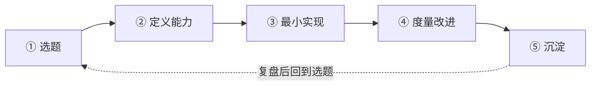

# 项目驱动学习法（重写版）

> [!abstract] 一句话
> 本层要练成的**能力**不是"会做项目"，而是：**能把一个模糊想法，通过"选题→定义能力→最小实现→度量改进→沉淀"的闭环，变成一件"可讲、可验证、可复用"的作品**。这是能级0认知里唯一直接产出求职硬通货的一格。

---

## 一、深度讲透：项目驱动学习闭环

旧版给了"五步法"清单，但没讲清楚**每步的坑**和**为什么顺序不能乱**。真正的闭环长这样：



### ① 选题：从"你的场景 + 真实痛点"出发，而不是"热门方向"

- **做法**：选一个"你本来就懂的业务场景 + 一个真实存在的痛点"。你有 HR 背景，就从 HR 场景挖；你有存量项目，就从存量项目深化。
- **坑**：追热点选题（"最近 Agent 火，做个 Agent 吧"）。**因为**你没有场景认知，**所以**做出来的东西既没有真实用户，也讲不出业务价值，面试一问就露馅。
- **检验**：选题能不能用一句话说清"**谁、在什么场景、有什么痛点、AI 能解决哪一步**"？说不清，说明选题没成立。

### ② 定义能力：先定义"AI 要具备什么能力、什么算好、容许多错"，再动手

- **做法**：动手前先写清楚三件事——AI 要完成的任务、好的输出长什么样、错误容许多大（是 90% 正确就行，还是必须 99%）。
- **坑**：跳过这步直接开干。**因为**没有"什么算好"的定义，**所以**你永远不知道项目算不算完成，也无法度量改进，最后只能"做到哪算哪"。
- **检验**：能不能写出"**这个 AI 能力，输入是什么、输出是什么、验收标准是什么**"？能写出，才进入下一步。

### ③ 最小实现：用现成工具/接口跑通最小闭环，不追求完美

- **做法**：用现成的模型 API、开源框架、低代码工具，先跑通"输入→处理→输出"的最小链路。目标是"能跑"，不是"跑得漂亮"。
- **坑**：一上来就追求工程完美（自己搭全套架构、写完整前后端）。**因为**最小闭环的价值是"快速验证假设"，**所以**工程细节应该等假设验证后再补，否则你花 3 周搭的壳，可能验证出来方向就是错的。
- **检验**：能不能在**计划时间内**（比如 1-2 周）跑通一个"能演示"的最小版本？跑不通，说明要么选题太大，要么定义能力太贪。

### ④ 度量改进：定义指标，跑一次改一次

- **做法**：用第②步的"验收标准"落成可量化的指标（准确率、覆盖率、用户完成率、耗时），跑一轮→看指标→改一处→再跑。
- **坑**：没有指标，或指标太虚（"效果不错"）。**因为**没有数字，**所以**你既无法证明项目价值，也无法向面试官讲"我改进了什么"。
- **检验**：能不能说出"**改前指标 X → 改后指标 Y**"？能说出，才有资格写进作品集。

### ⑤ 沉淀：整理成"问题-方案-指标-结果"的可讲故事

- **做法**：把整个过程整理成一段 10 分钟能讲完的故事：问题是什么、为什么用 AI、方案怎么设计、指标怎么改进、结果是什么、如果重来会改什么。
- **坑**：项目做完了不沉淀，或者只写"我做了什么功能"。**因为**面试官要听的是"你的判断和结果"，**所以**只讲功能不讲判断 = 白做。
- **检验**：能不能把项目讲给一个**不懂技术的人**，让他听懂"这解决了什么问题、效果如何"？能，才算沉淀完成。

> [!warning] 顺序不能乱的原因
> 这五步是一个**验证链**：选题验证"值不值得做"，定义能力验证"做什么"，最小实现验证"能不能做"，度量验证"做得好不好"，沉淀验证"能不能讲"。**因为**每一步都在为下一步提供判断依据，**所以**跳步（比如没定义能力就开干）会让后面所有步骤失去基准，项目变成"做了但说不清"。

---

## 二、项目驱动学习选题表（填完即用）

> [!tip] 填完即用
> 每个候选项目填一行。填不满 5 列的项目，先别做——**因为**这五列正是"值不值得做"的判据。

```
【项目候选】：____

| 列 | 内容 | 填写要求 |
|----|------|---------|
| 场景 | 谁、在什么场景 | 具体到人+场景，如"HR 在筛选简历时" |
| 痛点 | 痛点是什么、现在怎么解决的 | 要有"现在很痛"的证据，不是"可能有用" |
| AI能力 | AI 要具备什么能力 | 具体到任务，如"从 JD 提取硬性要求并匹配" |
| 最小闭环 | 最小可跑通的范围 | 控制在 1-2 周能跑通 |
| 度量指标 | 怎么算好、容许多错 | 可量化 + 有改进空间 |
```

**示例（用你的存量项目）**：

| 列 | 内容 |
|----|------|
| 场景 | 求职者（你自己）在准备 AI PM 面试时 |
| 痛点 | 面试题多、答案散、复盘靠记忆 |
| AI能力 | 根据岗位 JD 生成针对性面试题 + 模拟追问 |
| 最小闭环 | 输入 JD → 生成 10 道题 + 3 轮追问 |
| 度量指标 | 题目与 JD 匹配度（人工评分）、追问覆盖高频考点率 |

---

## 三、把已有存量项目升级为作品集（你已经在做的）

> 你已有三大存量项目，**不需要从零开始**，而是用闭环的"度量改进 + 沉淀"两步把它们升级成作品集：

| 存量项目 | 已具备 | 缺什么（升级点） | 升级动作 |
|---------|-------|----------------|---------|
| **Skill 四连发** | 已落地、可演示 | 缺"度量指标 + 商业价值结论" | 补一段"解决了什么痛点、效果如何、值多少钱" |
| **知微 RAG 问答机器人** | 已落地、有技术深度 | 缺"能力边界说明 + 失败案例" | 补"它答不好的问题有哪些、为什么、怎么兜底" |
| **InterviewPrep（AI模拟面试）** | 已落地、与求职强相关 | 缺"度量改进记录 + 可讲故事" | 补"改前/改后指标 + 10 分钟故事" |

> [!tip] 升级优先级
> 求职冲刺期，**优先升级 InterviewPrep**——**因为**它和 AI PM 岗位最相关（AI 产品 + 面试场景 + 求职故事一体），**所以**它是投入产出比最高的作品集素材。RAG 机器人排第二（技术深度好讲），Skill 四连发排第三（体现产品化能力）。

---

## 四、输入型学习 vs 项目型实践：比例与调整逻辑

旧版给了固定比例表，但没讲**怎么调**。核心逻辑是：

> **比例不是死的，由"当前卡在哪"决定。**

| 状态 | 输入型 | 项目型 | 调整逻辑 |
|------|:---:|:---:|---------|
| 刚入门、概念全无 | 70% | 30% | 先有概念，否则项目做不动 |
| 有概念、缺判断 | 40% | 60% | 用项目练判断，输入只补缺口 |
| 有判断、缺作品 | 20% | 80% | 求职要的是作品，不是笔记 |
| **卡住了、项目推不动** | **临时升到 60%** | 40% | **卡住 = 缺某块知识，先补再回项目** |

> [!warning] 调整信号
> - 项目推不动、反复卡在同一处 → 不是"再硬扛"，是**缺输入**，临时升输入比例补缺口
> - 输入越学越多、但没产出 → 是**逃避实践**，强制降输入比例，先跑一个最小闭环
> - 判断标准：**每周结束时问"这周产出了什么可展示的东西？"** 连续两周答案都是"没有"，就是输入过载，必须转向项目

---

## 五、看什么（D4 资源类型）

1. **真实项目复盘文**（搜索关键词：AI 产品 项目复盘 / 独立开发 复盘 / RAG 项目 踩坑）——看别人五步闭环里每一步怎么做的、坑在哪
2. **作品集/项目案例样本**（搜索关键词：AI 产品经理 作品集 / AI 项目 demo 案例）——看"可讲的项目"长什么样
3. **上手工具/框架文档**（搜索关键词：LangChain / RAG 框架 / 低代码 AI 应用 平台）——最小实现的加速器
4. **你的存量项目代码与数据**（InterviewPrep、知微 RAG、Skill 四连发）——最真实的练习素材

---

## 六、练什么（D4 练习，可自测）

1. **选题表练习**：用上面的选题表，填 3 个候选项目（含 1 个存量项目升级），每个必须填满 5 列
2. **最小闭环练习**：挑 1 个选题，在 1-2 周内跑通最小闭环，并记录"改前/改后指标"
3. **沉淀练习**：把 1 个项目写成 10 分钟可讲的故事，讲给 1 个不懂技术的人，收集 3 个听不懂的点并修改

---

## 七、怎么算会（D3 判据，可自测）

- [ ] 能 30 分钟填完一张选题表（5 列全满），并说清"为什么选它"
- [ ] 至少 1 个项目跑通了最小闭环，且有"改前指标 → 改后指标"的记录
- [ ] 能把 1 个项目讲成"问题-方案-指标-结果"的故事，非技术人能听懂
- [ ] 能说清"卡住时先补输入、输入过载时先做项目"的调整逻辑

> 达标信号：**你手上至少有 1 个"能讲、有数字、有价值"的项目**，而不是"学了一堆、做了一堆、说不清"。

---

## 八、下一步衔接

> 练成"项目驱动学习闭环"后，进入 [[05-产品与开发/AI产品经理学习路径/01-认知启蒙/03_成长五阶段路线图]]——**因为**你已经知道"怎么把一个项目做出来"，**所以**下一步是把"做一个项目"放大成"走完一整条成长路线"，看清每个能级练什么、怎么排优先级。

- 回到 [[05-产品与开发/AI产品经理学习路径/01-认知启蒙/00_MOC_成长地图中枢]]
