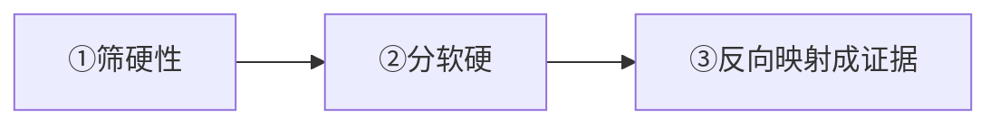

# 岗位JD拆解：招聘要什么（重写版）

> [!abstract] 本文目的
> 把"AI PM 招聘要什么"从模糊感觉，变成一套**可执行的 JD 拆解 + 需求翻译成证据**的方法。让你打开任何一份 JD 都能 5 分钟看出：它要什么、我有什么、我缺什么。

---

## 一、高频 JD 要求背后的"真实考核点"

> **招聘要求不是字面清单，是会转换为面试问题考察的。"看到要求→想到它会在面试怎么考→准备应对"。**

| JD 常见写法 | 真实在考什么 | 面试会怎么问 | 你的应对 |
|------------|-------------|-------------|---------|
| "有AI产品/AI应用经验" | 是否真落地过 | 讲一个AI项目 | Skill/RAG/InterviewPrep |
| "理解大模型能力边界" | 会不会判断该不该用AI | 这个场景适合AI吗 | 能力边界四问 |
| "数据思维、能定义指标" | 会不会度量 | 你的项目怎么衡量 | 秒级/编造率/准备度 |
| "有垂直行业经验" | 懂不懂业务 | 这个业务链路的痛点 | HR 认知 |
| "跨团队沟通" | 能否协调 | 讲一次跨职能协作 | Skill 团队交付 |

---

## 二、JD 拆解三步法（含模板）



**① 筛硬性**：学历/年限/必须项——先判断能否达标
**② 分软硬**：区分【必须】vs【加分】，加分项=你的差异化
**③ 反向映射**：把每个要求翻译成你的一段 STAR 证据

### JD↔证据对照表（模板，直接套用）

```
岗位：____
┌──────────┬────────────┬──────────────┬──────────┐
│ JD要求     │ 必须/加分     │ 我的证据(项目)  │ 命中度    │
├──────────┼────────────┼──────────────┼──────────┤
│ AI应用落地 │ 必须        │ 知微RAG机器人      │ ★★★     │
│ 能力边界   │ 必须        │ 多LLM链重构理由     │ ★★☆     │
│ 数据度量   │ 加分        │ 问答机器人评估体系    │ ★★☆     │
│ 垂直行业   │ 加分        │ HR+校招测评         │ ★★★     │
└──────────┴────────────┴──────────────┴──────────┘
```

> 用法：**命中度低的必须项，优先级最高去补**；命中高的加分项，是聊天/面试时主动抛出的差异化。

---

## 三、把"要求"翻译成"你的证据"（简历/面试素材）

> 建立这张"能力↔证据"主表，就是你的面试弹药库地基：

| 能力要求 | 你的证据 | 一句话讲法 |
|---------|---------|-----------|
| AI应用落地 | Skill四连发、知微、InterviewPrep | "我把AI能力变成团队看得见的改变" |
| 能力边界 | 多LLM链重构 | "我定位到单链路职责过载" |
| 数据/度量 | 问答机器人评估 | "秒级、编造率降到极低" |
| 垂直场景 | HR/组织/测评 | "我懂HR里AI怎么落地" |
| 产品思维 | AI PRD方法论 | "从需求到复盘是完整闭环" |

---

## 四、一份 JD 的完整拆解示例（抽象）

> **JD**："负责AI客服产品的需求定义与迭代，制定效果指标，与算法协作"
> **我的拆解**：
> - 需求定义 → RAG机器人的需求与链路重构
> - 效果指标 → 如何定义"回答准确率/满意度"（含编造率）
> - 与算法协作 → 讲跨职能（Skill团队交付）案例
> - **命中度**：需求★★★ / 指标★★☆ / 算法协作★★☆

---

## 五、练习（D4可自测）

- [ ] 找 1 份真实目标 JD，用"三步法"拆解并填对照表
- [ ] 把每个【必须】项对应到自己的一段能讲30秒的证据
- [ ] 标出自己的"最高命中度差异项"，作为面试主动抛出点

---

- 下一步：[[05-产品与开发/AI产品经理学习路径/01-认知启蒙/04_我的优势盘点与定位]]
- 回到 [[05-产品与开发/AI产品经理学习路径/01-认知启蒙/00_MOC_职业全景中枢]]