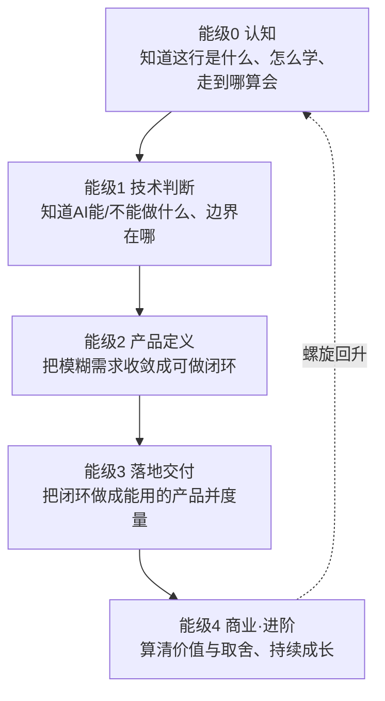

# 成长五阶段路线图（重写版）

> [!abstract] 一句话
> 本层要练成的**能力**不是"知道有五个阶段"，而是：**能随时定位自己在能力螺旋的哪一格、清楚这一格要练成什么、练成后进哪里、当前卡在哪**。这是能级0认知的收口——把前几篇的"心态 + 项目"整合成一条可执行、可自检的路线。

---

## 一、深度讲透：能力螺旋五能级

旧版的"五阶段"是**时间顺序**（先认知、再技术、再作品……），但真正的成长是**能力螺旋**：每一能级都是一轮"学→做→测→反思"，且**后一能级依赖前一能级练成的判断力**。



### 能级0 认知（本子库）——练成"自我定位与校准"

- **要练成的能力**：说清"AI PM 是什么、值不值得做、我往哪走、我该怎么学"
- **看什么**：岗位 JD、招聘平台、行业报告、学习方法论
- **练什么**：30 秒定位 + 优势盘点 + 项目选题表 + 学习闭环
- **怎么算会**：能 60 秒讲清定位；能说清"我在哪格、练什么、进哪里"
- **过关入口**：带着"定位 + 目标方向 + 1 个项目选题"进入能级1

### 能级1 技术判断——练成"AI 能力边界判断"

- **要练成的能力**：判断"这个需求该不该用 AI、用哪种技术、边界在哪"
- **看什么**：模型能力文档、技术选型总览、真实产品体验
- **练什么**：对 5 个真实需求做"用/不用/用哪种"判断，每个给出理由
- **怎么算会**：每个判断能说清"为什么用/不用 + 边界条件 + 兜底方案"
- **过关入口**：进入能级2，用判断力做产品定义

### 能级2 产品定义——练成"把需求收敛成闭环"

- **要练成的能力**：把模糊需求收敛成"可做、可度量、可兜底"的产品闭环
- **看什么**：AI 产品方法论、真实 PRD 案例、需求洞察方法
- **练什么**：写 1 份含"能力边界 + 指标 + 容错"的一页产品定义 / AI PRD
- **怎么算会**：闭环可跑通、指标明确、容错设计清楚
- **过关入口**：进入能级3，把定义做成产品

### 能级3 落地交付——练成"把闭环做成能用、可度量的产品"

- **要练成的能力**：把产品定义落地成能用的产品，并用数据证明价值
- **看什么**：上手工具、项目复盘、作品集样本
- **练什么**：做出 1 个真实反馈的项目 + 作品集 + 项目故事
- **怎么算会**：有"问题-方案-指标-结果"可讲的故事 + 量化结果
- **过关入口**：进入能级4，算清价值与取舍

### 能级4 商业·进阶——练成"算清价值与取舍、持续成长"

- **要练成的能力**：从商业角度评估 AI 产品（成本/价值/风险），并持续跟前沿
- **看什么**：商业/成本/合规专题、前沿发布、行业报告
- **练什么**：评估 1 个 AI 产品的 ROI 与风险；建立前沿跟踪机制
- **怎么算会**：能算清成本/价值/风险并给出取舍；能持续更新认知
- **过关入口**：长期循环，螺旋回升到能级0 重新校准

---

## 二、反例坑：跳级学习的代价

> [!warning] 最典型的坑：不练技术判断就做产品定义
> 你跳过能级1，直接进入能级2"写 AI PRD"。**因为**你没有练成"AI 能/不能做什么"的判断力，**所以**你会犯这些错：
> - 把"AI 做不到的事"写进需求（如要求 100% 无幻觉的问答），产品注定做不出来
> - 把"不该用 AI 的环节"硬塞 AI（如简单的规则判断），成本高、效果差
> - 面试被问"为什么用 RAG 不用微调"时，答不出边界条件，暴露判断力缺失
>
> **后果**：PRD 写得再漂亮，也是建立在错误假设上的空中楼阁。**因为**能级2 的地基是能级1 的判断力，**所以**跳级 = 把楼盖在沙子上。
>
> **识别信号**：你发现自己"写方案很快，但一被追问技术边界就卡壳"，就是跳级的信号——**回退到能级1，先补判断力，再回来写方案**。

---

## 三、阶段自检清单（每阶段 3-5 条可勾选判据）

> [!tip] 填完即用
> 每 2 周自检一次，勾选当前能级的条目。**全部勾选才算过关，才能进下一能级。**

```
【能级0 认知】自检（全部勾选才过关）
- [ ] 能 60 秒讲清"AI PM 是什么 + 与传统 PM 的 3 处不同"
- [ ] 有明确的 30 秒定位 + 锁定的目标岗位方向
- [ ] 能说清"我现在在哪格、这一格练什么、练成后进哪里"
- [ ] 有 1 张填完的项目选题表（5 列全满）

【能级1 技术判断】自检
- [ ] 对 5 个真实需求做出"用/不用/用哪种"判断
- [ ] 每个判断都能给出理由 + 边界条件
- [ ] 能说清"AI 不能做什么"（幻觉、成本、数据隐私等边界）
- [ ] 每个判断都有兜底方案

【能级2 产品定义】自检
- [ ] 写出一页产品定义（问题/方案/能力边界/指标/容错）
- [ ] 闭环可跑通（逻辑上能闭环）
- [ ] 指标明确且可度量
- [ ] 容错设计清楚（AI 错了怎么办）

【能级3 落地交付】自检
- [ ] 至少 1 个项目做成能用、可演示
- [ ] 有"改前指标 → 改后指标"的度量记录
- [ ] 有 10 分钟可讲的"问题-方案-指标-结果"故事
- [ ] 作品集整理完成（含 1 个与目标岗位强相关的项目）

【能级4 商业·进阶】自检
- [ ] 能评估 1 个 AI 产品的成本/价值/风险
- [ ] 能给出明确的取舍结论（做/不做/怎么做）
- [ ] 有持续的前沿跟踪机制
```

---

## 四、结合求职时间线的节奏建议

> 求职入行导向下，**能级1（技术判断）和能级3（落地交付）是冲刺重点**——因为面试直接考判断力、简历直接要作品。


> [!warning] 时间线是"并行推进"，不是"串行等待"
> 上面的箭头表示**能力依赖**，不是"必须做完才做下一个"。求职冲刺期建议：**能级1 判断力为主线，能级3 作品集为副线并行推进**（判断力支撑作品，作品反哺判断），能级2 在作品做到一半时深潜补 PRD 能力。**因为**求职窗口不等人，**所以**要"边判断、边做作品、边补定义"，而不是按部就班走完一格再走下一格。

**节奏原则**：
- 每周固定时间做"判断力练习"（能级1）——它是面试的硬通货
- 每周固定时间推进"作品集"（能级3）——它是简历的硬通货
- 每 2 周做一次阶段自检，卡在哪一格就临时加码哪一格
- 求职冲刺期，**主线程 80% 用于"作品+面试"**，副线程 20% 沉淀全面发展（见 04 篇）

---

## 五、看什么（D4 资源类型）

1. **AI PM 能力模型/岗位要求**（搜索关键词：AI产品经理 能力模型 / AI产品经理 岗位 JD）——校准每个能级"市场到底要什么"
2. **成长复盘/转行经验**（搜索关键词：转行 AI产品经理 经验 / AI PM 成长路径）——看别人怎么走、在哪卡住
3. **各能级的核心资源**（技术判断→模型文档；产品定义→PRD 案例；落地→项目复盘；商业→ROI 案例）——按当前能级取用
4. **求职时间线参考**（搜索关键词：AI产品经理 求职 时间线 / 转行 求职 计划）——校准自己的节奏

---

## 六、练什么（D4 练习，可自测）

1. **定位练习**：用自检清单给当前能级打分，写出"我在哪格、练什么、进哪里、卡在哪"
2. **路线推演练习**：把"求职时间线"画成自己的版本（含每周投入小时数、里程碑日期），并标出 3 个可能卡住的点
3. **跳级诊断练习**：找出自己最近一次"跳级"（没练判断就写方案/没定义就开干），写出"当时跳了哪级、代价是什么、现在怎么补"

---

## 七、怎么算会（D3 判据，可自测）

- [ ] 能随时说清"我在能力螺旋的哪一格、这一格练什么、练成后进哪里、当前卡在哪"
- [ ] 当前能级的自检清单全部勾选（不达标不前进）
- [ ] 有一份贴合自己求职时间线的节奏计划，且能说清"为什么这样排"
- [ ] 能说出"跳级会付出什么代价"的 1 个真实例子（自己的或别人的）

> 达标信号：**你不再问"我该学什么"，而是问"我这一格卡在哪、怎么过"。** 此时路线图从"知识"变成了"导航"。

---

## 八、下一步衔接

> 练成"能力螺旋五能级"后，进入 [[05-产品与开发/AI产品经理学习路径/01-认知启蒙/04_学习闭环与全面发展]]——**因为**你已经知道"走到哪算会"，**所以**下一步是把"自检"变成"每周自动运转的闭环"，让路线图真正跑起来。

- 回到 [[05-产品与开发/AI产品经理学习路径/01-认知启蒙/00_MOC_成长地图中枢]]
