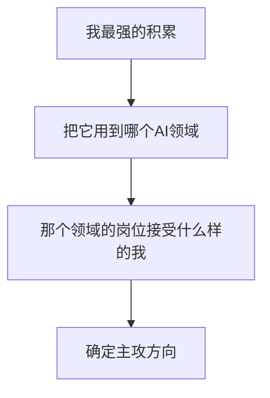

# 我的优势盘点与定位（重写版）

> [!abstract] 本文目的
> 用一份**定位工作坊模板**，帮你从"我好像会很多"梳理成"我确定往这个方向走"。这不是泛泛的"优势列举"，而是一套可取舍的定位练习。

---

## 一、资产盘点（先全面再取舍）

> 用自己的真实积累逐项盘点，每项标"对 AI PM 的价值"：

| 维度 | 你的积累 | 在 AI PM 时的价值 | 强度 |
|------|---------|------------------|:---:|
| 垂直行业 | HR/人事/校招/组织 | HR-AI 场景判断力 | ★★★ |
| AI 落地 | Skill、知微、InterviewPrep | 从0到1把AI变产品 | ★★★ |
| 技术理解 | LLM集成、RAG、多LLM链 | 能与算法对话 | ★★☆ |
| 产品方法 | 方法论、需求/迭代/度量 | 体系完整 | ★★☆ |
| 战略商业 | 商业模式、变革管理 | 业务视角 | ★★☆ |
| 数据 | AI数据分析 | 数据决策 | ★★☆ |

---

## 二、定位决策（取舍逻辑，附权衡）

> 定位不是"把最强的全写上"，而是**选一个能同时兑现多箱组合的方向**。

### 权衡三问
1. **能不能证明**：这个方向我有没有可讲的项目/证据？
2. **认不认可**：市场愿不愿为"HR+AI"买单？
3. **可持续吗**：这条路有没有成长与护城河？

> 深度洞察：**定位的最优解 = 你拥有的能力 ∩ 市场需要的 ∩ 你有证据的**。三者交集越小越聚焦，越聚焦越难被替代。

---

## 三、你的主攻定位建议

### 主攻：应用型 AI 产品经理（HR/组织 / 办公协作方向）
- 投递关键词：`AI产品经理`、`HR产品经理`、`AI应用产品`、`Copilot产品`
- 核心卖点：**垂直场景（HR）+ AI 落地（已做）+ 完整方法论**
- 备选：AI 客服/知识库产品（RAG直接对口）、AI 效率工具

---

## 四、30 秒自我介绍模板（填完即用）

> "我是一名有 HR 背景 + AI 落地经验的候选者。我把 HR 业务和 AI 结合，独立完成过[项目]，解决了[痛点]，用[指标]证明价值。我理解大模型能力边界，擅长把 AI 能力翻译成产品价值。我的差异点是既懂业务、又能动手落地。"

> 补全 3 个 [ ] 即成可用自我介绍。进阶版见[[05-产品与开发/AI产品经理学习路径/05-进阶出口/00_MOC_求职面试中枢]]。

---

## 五、定位工作坊：清单（D4练习）

- [ ] 把"资产盘点表"填满（诚实打分）
- [ ] 用"三问权衡"筛出 1-2 个候选方向
- [ ] 为一个主攻方向写 5 个目标岗位关键词
- [ ] 完成 30 秒自我介绍 [ ] 补全

---

## 六、过关判据（能级0）

> - [ ] 能一句话说清"我做什么方向、凭什么"
> - [ ] 有明确的目标岗位类型与关键词
> - [ ] 能 30 秒把定位讲给别人听

> 达成后进入能级1：[[05-产品与开发/AI产品经理学习路径/02-技术底座/00_MOC_技术底座中枢]]

---

- 回到 [[05-产品与开发/AI产品经理学习路径/01-认知启蒙/00_MOC_职业全景中枢]]