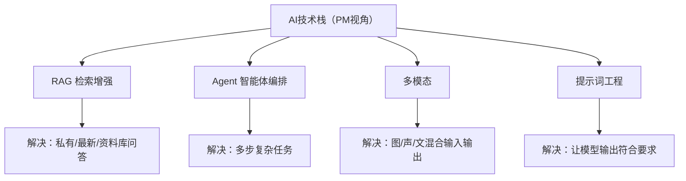

# 关键AI技术栈中枢

> [!abstract] 本子库目的
> AI PM 不用写代码，但要能看懂"工程常常在做什么、解决什么问题、怎么选"。本库覆盖面试高频的几项关键技术：**RAG、Agent、多模态、提示词工程**——并从**产品视角**讲透"什么时候用哪种"。

---

## 一、核心问题

1. RAG / Agent / 微调 分别解决什么问题？
2. 提示词在产品里是"配置"还是"产品逻辑"？
3. 遇到一个需求，怎么选技术栈？

---

## 二、文档规划

| 文档 | 核心问题 | 状态 |
|------|---------|------|
| 01_技术选型总览：RAG/Agent/微调/提示词 | 各技术解决什么问题、怎么选 | 本文档 |
| 02_RAG与知识问答 | 私有资料问答怎么做 | 本文档 |
| 03_Agent与多步任务编排 | 复杂任务怎么做 | 本文档 |
| 04_提示词的产品化视角 | 提示词是产品交互不是咒语 | 本文档 |

---

## 三、技术全景（PM视角速查）

---

## 四、与已有知识库衔接

- 动手实践 RAG：[[01-AI技术/企业知识库与RAG问答机器人/00_MOC_企业知识库与RAG问答机器人中枢]]
- 提示词深度：[[01-AI技术/Prompt Engineering深度/00_MOC_Prompt Engineering深度中枢]]
- Skill 封装：[[01-AI技术/Skill制作痛点/00_MOC_Skill制作痛点中枢]]

---

## 五、本层检验

> - [ ] 能说清 RAG 和 Agent 的区别、何时各用哪个
> - [ ] 能解释提示词为何是"产品交互"而非简单咒语
> - [ ] 能给一个需求配出合理技术栈

---

## 版本历史

| 版本 | 日期 | 更新内容 |
|------|------|----------|
| v0.1 | 2026-08-20 | 初始中枢 + 内容 |