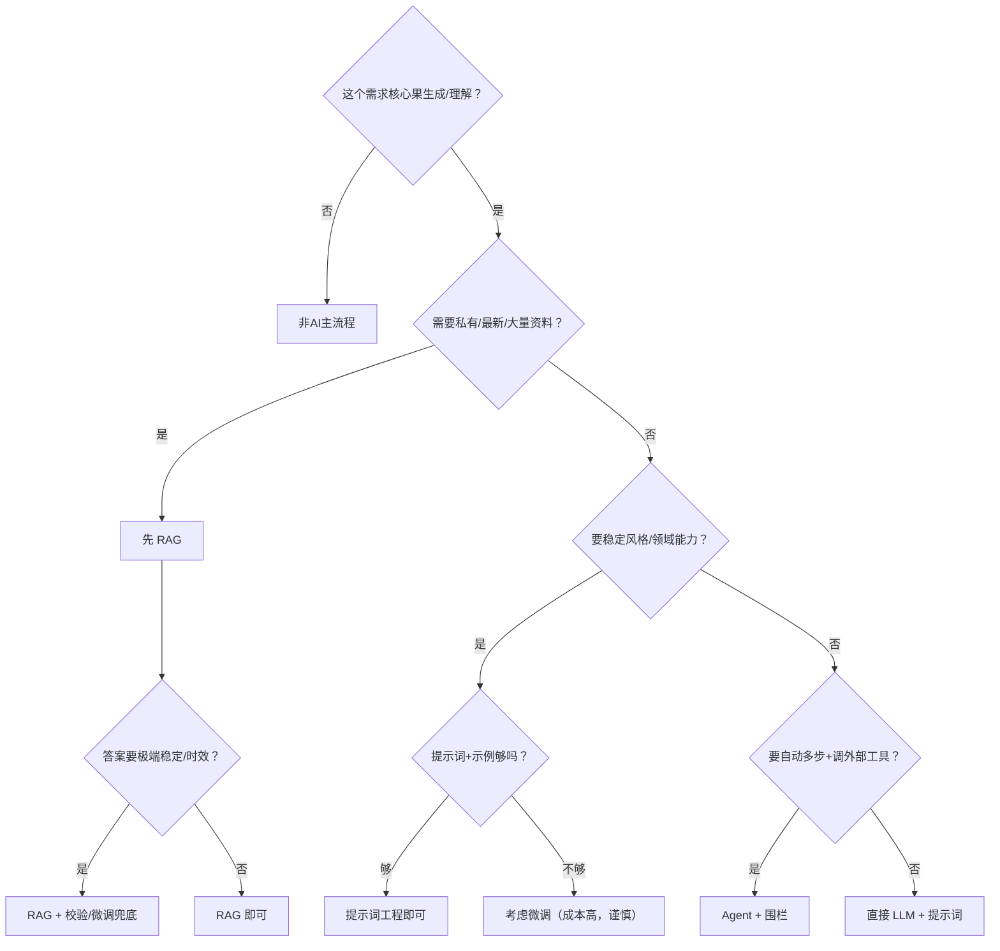

# 技术选型总览：RAG / Agent / 微调 / 提示词（重写版）

> [!abstract] 本文要练成的能力
> 把一张对比表升级为**一套可执行的选型决策树 + 各技术的权衡（成本/复杂度/迭代速度）+ 选型反例**。能级1"技术判断"里，选型是把"该不该用AI"落到"用哪种"的最后一跳——**目标是能对一个需求交出"先用什么、为什么暂不上重方案"的判断。**

---

## 一、四者对比（从"解决什么"到"PM的真相"）

| 技术 | 解决什么 | 一句话 | 适用时机 | PM 真相（别只看字面） |
|------|---------|--------|---------|---------------------|
| **提示词工程** | 让模型稳定输出 | 调"说话方式" | 一切产品的基础 | 成本最低，先做它，几乎所有重方案最终都还得带上提示词 |
| **RAG** | 让模型基于指定资料答 | 先查再答 | 私有/最新/大量资料问答 | 解决"知识会话受限"，迭代快，是应用落地最常用的一招 |
| **微调** | 让模型具备稳定风格/领域能力 | 补专业课 | 需要稳定风格/专业能力 | 成本高、慢，仅当前端/现有手段明显不够才上 |
| **Agent** | 让模型自主完成多步并调工具 | 配计划+工具 | 复杂多步、需外部系统 | 能力强但"失控"与"成本"风险最大，需围栏 |

---

## 二、D1 技术选型决策树（填完即用）

**决策时记住：多数产品应沿"提示词 → RAG → Agent/微调"的轻到重路径，不要一步到位重方案。**

---

## 三、D2 三者的优先级权衡（决策必看）

| 技术 | 成本 | 复杂度 | 迭代速度 | 一句话决策倾向 |
|------|:---:|:---:|:---:|-------------|
| 提示词 | 低 | 低 | 快 | **能不上重就不上重，先用它验证需求** |
| RAG | 中 | 中 | 中 | 需要私有/资料时是"性价比最高"的升级 |
| Agent | 中高 | 中高 | 中 | 能力上限高，但围栏工作成本可能盖过收益 |
| 微调 | 高 | 高 | 慢 | 沉没成本高、难回退，**最后才考虑** |

> 深度洞察：**优先级不是"越强越好"，是"成本/复杂度/迭代速度"的折中。** 因为 Agent/微调会把**开发与运维成本、失控风险、回退难度**一起抬上去，所以**即便重方案技术上限更高，多数场景仍是"提示词+RAG+足够兜底"的轻组合先验证**。能快速造出可测的 MVP，才谈得上下一步是否升级。

**选型反例（怎么选错的）：**

1. **一股脑上微调，其实只需 RAG。**
   → 因为业务以为"模型不懂我们的术语所以要训练它"，但实际上这些知识在私有文档里；所以正确做法是先 RAG（企业资料问答几乎首选），而非高成本微调。上微调是你以为对了、其实最贵也最慢的一步。

2. **一句话需求就上 Agent，实际一两步就够。**
   → 因为"想显得先进"就堆编排，但任务本身固定两三步；所以更该用**确定性的工作流/提示词**，而不是泛化 Agent——去掉决策分支，反而更稳定更省钱。

3. **完全忽略提示词，以为"换技术能解决一切"。**
   → 因为所有重方案最终仍受 prompt 影响，所以跳过提示词优化等于在"地基没稳时盖高层"；先打磨提示词，多数轻问题当场就解决。

> 3个反例的共性：**选型和"该不该用AI"一样，都要先看需求驱动，而不是先看技术热不热。** 因为需求里藏着"数据、确定性、步骤数"三个真相，所以先读清需求再选型，是避开返工的唯一路径。

---

## 四、一句记忆口诀（可印在心里）

> **"先提示词，数据敏感上 RAG，稳定风格/专业才微调，多步复杂再 Agent——但多数时候，轻组合就够了。"**

> 面试运用：给场景时展示"先分析问题 → 用最简方案 → 说明为何不先上重方案"的取舍，比背 RAG/Agent 定义值钱得多。

---

## 五、D3 主线衔接

- **衔接能级1 技术判断**：本文接收前面"四问决策"的结论，把"用哪种技术"展开并权衡。
- **衔接能级2 产品定义**：**选型结论里的"数据源、校验、预算上限"会成为产品需求里的功能与约束**——一个"暂不上Agent"的决定，其实等价于产品定义里的范围收敛与降本。
- **衔接下一个文档**：选型后如何把 RAG 做落地 → [[05-产品与开发/AI产品经理学习路径/02-技术底座/02_RAG与知识问答]]
- 显式判据：**能对3个需求分别给出"起始技术 + 为何暂不上重方案 + 升级触发条件"，就是掌握了选型判断。**

---

## 六、D4 资源与练习

**看什么（资源类型）**
- 官方文档：大模型上下文窗口、API 能力说明（关键词：模型 context window、API pricing）
- 深度文章：RAG vs 微调 vs Agent 选型（关键词：RAG vs fine-tuning、Agent vs workflow 选型）
- 上手工具：在真实项目上按决策树走一遍（动手样本）

**练什么（可自测练习）**
- [ ] 练习1：给知微机器人做选型走查——说明"为何选 RAG+多LLM链"而非"上微调"，给出触发升级条件。
- [ ] 练习2：对2个需求分别给"轻方案→重方案"的升级路径与触发点。
- [ ] 练习3：造一个"一股脑上微调/Agent"的反例，写清为什么错+该怎么做。

**怎么算会（达标判据）**
- [ ] 能对需求按决策树选型，并说明成本/复杂度/迭代速度的取舍。
- [ ] 能讲清"为何暂不上重方案"及升级触发条件。
- [ ] 能造出并解释一个选型反例。

---

## 练什么（可自测清单）

- [ ] 用决策树给3个需求选型并给取舍理由
- [ ] 写出知微RAG机器人"为何不微调"的依据
- [ ] 写一个选型反例及正确方案

---

- 下一步：[[05-产品与开发/AI产品经理学习路径/02-技术底座/02_RAG与知识问答]]
- 回到 [[05-产品与开发/AI产品经理学习路径/02-技术底座/00_MOC_技术栈中枢]]
- 能力边界判断衔接：[[05-产品与开发/AI产品经理学习路径/02-技术底座/03_能力边界判断：一个需求该不该用AI]]