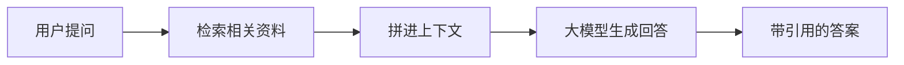

# RAG 与知识问答（重写版）

> [!abstract] 本文要练成的能力
> 把"RAG是什么"升级为**一套可执行的 RAG 产品落地流程（资料治理 → 检索 → 生成 → 兜底 → 评测）**，并用你的知微 RAG 机器人做真实推敲 + 常见坑盘点。这是能级1"技术判断"里最落地可作作品的一篇——练完你既能讲懂，也能指导工程落地。

---

## 一、RAG 是什么（PM 直觉 + 一条主线）



> **一句话逻辑：先"查资料"，再"照着资料回答"。** 它解决大模型"知识过时/无私有知识/幻觉"三大问题，且**迭代快**——因为"改回答=改资料库"，不依赖重新训练。

> 深度洞察：**RAG 的本质是把"让模型更懂"从"改模型"（微调）变成"改数据+改检索"（迭代）= 更便宜、更快、更可回退。** 因为多数企业问题其实是"资料访问/检索"问题而非"模型能力"问题，所以 **RAG 成为企业知识类产品的首选结构。**

---

## 二、D1 可执行：RAG 产品落地五步流程（逐环节给做法 + 你踩过的坑）

```
① 资料治理 → ② 检索 → ③ 生成 → ④ 兜底 → ⑤ 评测
```

### ① 资料治理（最容易被低估，却是质量源头）
- **源**：确定哪些文档合法可用（制度、FAQ、说明书），排除过时改版前的版本。
- **切分**：按"可独立回答一个问题"的自然段落切，而不是无论长短一刀切。
- **元数据**：给片段打标签（来源、部门、版本、时间），供引用与过滤。
- 常见坑：`资料乱、重复版本并存 → 检索命中旧制度 → 答错`。你知微机器人初期"答复与现行制度不一致"，很可能就是资料治理没做干净。

### ② 检索（答得对的关键）
- **尽量能"召回对该问题最相关的片段"**，衡量指标常用 recall（别漏）、precision（别杂）。
- 长期用向量检索，但**短/专有名词/数字**问题常需"关键词+向量"混合。
- 常见坑：`检索召回率高但排序差 → 把"次要资料"顶到前面 → 答非所问`。需要调 top-k、调阈值，必要时重排序。

### ③ 生成（用正确的资料答）
- 把检索到的片段拼进上下文，约束模型"只依据片段回答、无据则拒答"。
- 你的多LLM链重构即在此分工：检索/生成/校验分角色，解决"单一模型立场不稳、格式乱"。

### ④ 兜底（查不到时怎么收场）
- **合理拒答**：检索不到可靠依据时明确"我无法基于现有资料回答"，给出人工/客服入口。
- **引用呈现**：让用户看到依据（来源/原文摘录），增强信任、也暴露资料缺口。

### ⑤ 评测（落地闭环）
- 造 30–100 条评测集（正确/边界/歧义），跑出"正确率/幻觉率/误拒率"，定上线红线。
- 见 [[05-产品与开发/AI产品经理学习路径/02-技术底座/04_幻觉、可信度与产品兜底]] 的评测与监控做法。

---

## 三、D2 常见坑盘点（直接踩过的 / 高频的）

1. **资料治理偷懒（最常见、最致命）**
   → 因为"垃圾进、垃圾出"，所以资料脏/版本乱，检索再好也答错。**先管资料，再谈检索。**

2. **切分不合理**
   → 因为切太碎丢失上下文、切太长夹杂无关内容，所以两者都降检索质量。要按"语义完整"切，越贴合"一个问答一片段"越好。

3. **只用一种检索方式**
   → 因为只有向量检索对短词/数字敏感，所以专有名词/数字问题要用"关键词+向量"混合才稳。

4. **不做兜底/拒答**
   → 因为不设拒答，模型会对查不到的资料自信硬答=幻觉，所以**必须给"无据拒答"装闸门**，这比答案更专业。

5. **没有评测集，迭代靠"感觉"**
   → 因为改资料/模型无从度量前后差异，所以**必须先建评测集**，一切优化才有标尺。

> 深度洞察：**五步里真正的分水岭是①资料治理与⑤评测集。** 因为③④是工程常规，而①决定数据质量、⑤决定能不能判断"是否变好了"，两者才是 PM 最该盯的"产品级"环节，也是最容易给公司讲清成本与ROI的地方。

---

## 四、知微 RAG 机器人案例（选型→落地→兜底→评测 全走查）

- **背景**：员工问 HR 制度，要求答对、可溯源、无编造。
- **选型**：私有制度资料 → RAG（先前四问选型见 [[05-产品与开发/AI产品经理学习路径/02-技术底座/03_能力边界判断：一个需求该不该用AI]] 例子3）。
- **落地**：资料治理（制度版本清洗、切分）→ 检索（向量+关键词混合）→ 生成（多LLM链分工）→ 兜底（引用+拒答）→ 评测（制度题库测正确率/幻觉率）。
- **你踩的坑**：答复与现行制度不一致（资料治理）、多LLM链解决立场/格式不稳。
- **面试讲法**：背景→痛点→技术思路（检索+多LLM链+引用）→效果指标→遇到的问题（幻觉/检索不准）→解决（引用+校验）→迭代（评测集+反馈回流）。

---

## 五、D3 主线衔接

- **衔接能级1 技术判断**：RAG 落地即"该不该用AI的四问"在"需要私有数据"分支的具体化。
- **衔接能级2 产品定义**：**五步里的"拒答口径、引用呈现、评测红线、兜底流程"都是可写进 PRD 的功能点**——RAG 的落地过程天然产出产品需求清单。
- **衔接其他技术栈**：与提示词产品化联动（把检索结果稳定拼进 prompt）：[[05-产品与开发/AI产品经理学习路径/02-技术底座/04_提示词的产品化视角]]
- **深度动手库**：[[01-AI技术/企业知识库与RAG问答机器人/00_MOC_企业知识库与RAG问答机器人中枢]]
- 显式判据：**能讲清RAG五步、并用知微案例演示"选型→落地→兜底→评测"完整闭环，就是能级1最落地的能力证据。**

---

## 六、D4 资源与练习

**看什么（资源类型）**
- 官方文档：主流 RAG / 向量库 / 检索框架使用（关键词：LangChain RAG、向量检索 faiss、成熟框架）
- 深度文章：RAG 优化与坑（关键词：RAG 优化 最佳实践、chunking 策略）
- 上手工具：把知微机器人的资料治理/评测集重建一遍（动手样本）

**练什么（可自测练习）**
- [ ] 练习1：为知微机器人做"资料版本清洗 + 语义切分"方案，写清规则。
- [ ] 练习2：写一份 30 条评测集（含正确/边界/歧义/拒答），跑出正确率/幻觉率/误拒率。
- [ ] 练习3：给一个"新部门知识库"设计五步落地流程与时间表。

**怎么算会（达标判据）**
- [ ] 能讲清RAG五步及每步的关键指标。
- [ ] 能指出资料治理/评测集这两大分水岭，并说明坑。
- [ ] 能用知微案例完整讲"选型→落地→兜底→评测"。

---

## 练什么（可自测清单）

- [ ] 为知微机器人重建资料治理+评测集方案
- [ ] 写出RAG五步落地的执行清单与指标
- [ ] 用知微案例完成"背景→痛点→技术→效果→优化"的面试讲解稿

---

- 下一步：[[05-产品与开发/AI产品经理学习路径/02-技术底座/03_Agent与多步任务编排]]
- 深度衔接：[[01-AI技术/企业知识库与RAG问答机器人/00_MOC_企业知识库与RAG问答机器人中枢]]
- 回到 [[05-产品与开发/AI产品经理学习路径/02-技术底座/00_MOC_技术栈中枢]]