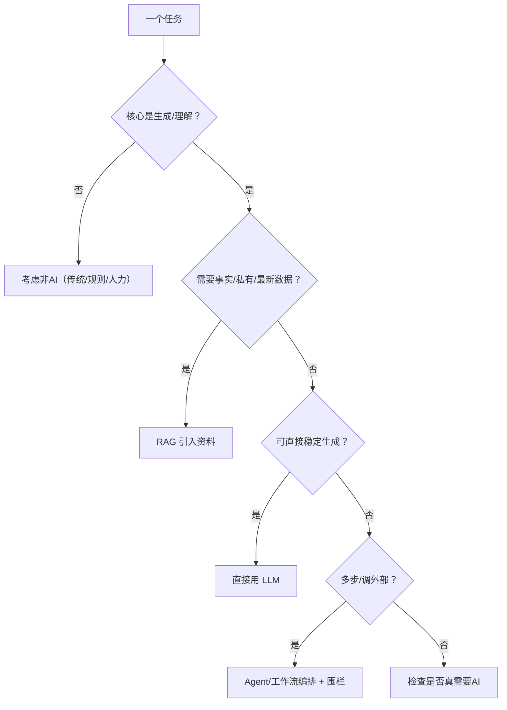

# 能力边界：能做什么、不能做什么（重写版）

> [!abstract] 本文要练成的能力
> 把"擅长/不擅长/边界模糊"从一张表升级为**一份可操作的判断清单 + 用得到底反例 + 边界模糊时的处理策略**。能级1"技术判断"的核心不是记住结论，而是**对一个具体任务，快速判断它落在大模型能力图的哪一格，并决定怎么补。**

---

## 一、能力三段表（从"结论"到"判断特征"）

> 高手不只是背强项，而是**能识别一个任务落在哪段、凭什么**。所以每段都给"判断特征"。

### ✅ 擅长（生成主导）
| 擅长能力 | 判断特征（回答时如何识别） |
|---------|---------------------------|
| 语言理解与生成（总结/改写/翻译/扩写） | 任务本质是"把一段意思换个形式或粒度表达" |
| 创意内容（文案/初稿/头脑风暴） | 没有唯一正确答案，强调流畅与多样性 |
| 代码生成与解释 | 任务可从自然语言映射到已知模式的代码 |
| 结构化提取（要点/实体/列表） | 从自由文本里抽取已存在的结构化信息 |
| 语义改写的日常问答 | 常识主干+生成性的部分 |

### ⚠️ 边界模糊（要做判断，别直接断定）
| 模糊项 | 为什么模糊 | PM 该补什么 |
|--------|-----------|------------|
| 事实/时效性答案 | 生成不代表按时更新 → 结论可能过期 | 检索+RAG |
| 精确计算/多步逻辑 | 中间一步错就全局错，且不易自知 | 规则/工具做关键计算 |
| 最新/私有数据 | 模型没见过就不会 | 检索（私有库） |
| 复杂多步任务稳定性 | 每一步都是概率，链条越长越易偏 | Agent围栏/人工兜底 |

### ❌ 不适合做（应识别的"NOT-AI"信号）
| 不适合场景 | 识别信号 |
|-----------|---------|
| 绝对正确的事实承诺 | 用户/业务方要"铁口直断" |
| 因果判断的独立决策 | 要做的是"选定一个动作并担责" |
| 安全/合规强约束的独立决策 | 出错代价不可逆或违法 |
| 需实时感知外部世界 | 无工具时模型看不到外部 |

---

## 二、核心能力："差一点就能做"判断（做产品判断的主干）

> AI PM 最值钱的瞬间，是判断**"这个任务大模型差一点就能做——差的那一点是什么、用什么补"**。



> 深度洞察：**"差一点就能做"的判断质量，决定产品的差异化。** 因为大多数团队卡在"能用"和"做对"之间，所以 **谁能说清"差的那一点具体是资料/计算/外部感知/确定性"，谁就既当了产品的把关人，也当了对齐算法的翻译者。** 你和一个算法工程师能否有效对话，就取决于你是否能用这句话把需求说清。

---

## 三、D2 深度洞察：三个真正会翻车的反例

> 这些不是理论，是"强行上AI会翻车"的真实情形。

1. **把"精确台账"交给AI（反例：用AI做每月考勤统计）**
   因为考勤要绝对精确（谁迟到、扣几天），是"确定性任务"，所以若让 LLM 计算并担责，**一次算错就失信**。正确做法：LLM 只做"把 SQL/Excel 结果翻译成自然语言"，计算交给规则。
   → 判断：核心不是生成，是记录+计分淀粉 → **NOT-AI（主流程），AI 仅做翻译。**

2. **把"需实时外部或多接口"标为纯生成（反例：让AI 2026年薪资行情不给检索）**
   因为模型知识是训练的时点快照，所以直接生成的"最新行情"多半过时或编造。正确做法：接入检索/权威数据源。
   → 判断：核心是生成，但需要最新数据 → **RAG/检索。**

3. **把高风险决策的第一步就交给全自动（反例：让 AI 自动发解雇邮件不确认）**
   因为每一步都是概率且不可逆，所以全自动会导致越权/事故。正确做法：AI 生成草稿 + 人工确认后发出。
   → 判断：可生成草稿，但执行须围栏 → **AI 辅助+人工闸门。**

3个反例的共性：**不判断"确定性/数据/风险"就上 AI，是翻车的根因。** 用三分法"是不是生成、要不要对、出不出的错"一过，就能提前规避。

---

## 四、D1 可操作：能力边界判断清单（填完即用）

```
对一个任务，逐项走：
□ 任务落在大模型"擅长段"吗？（生成/改写/创意）——否则走非AI
□ 结果必须正确吗？（台账/数字/合规）——必须校验或非AI承担主流程
□ 需要私有/最新数据吗？——是则检索/RAG
□ 需要实时外部世界吗？——是则接工具，否则承认"看不到"
□ 是否需要多步稳定执行？——是则加围栏/人工闸门/预算上限
□ 出错代价多大？（低/中/高）——决定兜底强度
决策：__用哪种技术 / 不用AI，理由（用上面的特征说）__
```

---

## 五、边界模糊时怎么办

> 不是每个任务都能一眼定位。模糊时用这个"三查"：

1. **查确定性**：这个任务核心是"生成创意"还是"要准确答案"？
2. **查数据**：答对需要我知道它没见过的信息吗？
3. **查风险**：最坏一次错误，用户/企业损失多大？

> 深度洞察：**模糊恰恰是 AI PM 的空间。** 因为清晰的"一定AI"和"一定NOT-AI"通常不需要判断，所以真正缺判断的，正是边界模糊区。**凡落入模糊区，默认"先最小化投产+强兜底+可回退"，而不是硬下结论。**

---

## 六、D3 主线衔接

- **衔接能级1 技术判断**：本文给的是"单任务定位"能力；下一篇把它升级成"一个需求该不该用 AI"的四问决策流程。
- **衔接能级2 产品定义**：**凡是落入"模糊区/高风险区"的任务点，在写产品需求时要单列"验证与兜底需求"** ——这是从技术判断通往产品定义的桥。
- 显式判据：**能对一个需求说出"主流程用不用AI、如果不用用时间/哪个环节才需要AI"**，就已具备能级1的判断力。

---

## 七、D4 资源与练习

**看什么（资源类型）**
- 官方发布：各主流大模型官网的能力说明与局限说明（关键词：GPT/Claude/Gemini capabilities limitations）
- 深度文章：大模型能力边界与失效案例盘点（关键词：LLM 能力边界、LLM失败案例 盘点）
- 行业报告：AI应用落地难点与局限（关键词：AI应用落地报告 2026）

**练什么（可自测练习）**
- [ ] 练习1：用能力边界清单，给6个不同任务（考勤、文案、行情查询、代码生成、法务意见、客服）逐个定位并给结论。
- [ ] 练习2：为你知微机器人的每个回答环节写一句"这是生成/检索/校验/兜底"归属。
- [ ] 练习3：找一个强行上AI会翻车的反例（如让AI记账），写清"为什么翻车+正确做法"。

**怎么算会（达标判据）**
- [ ] 能对一个任务用"生成/确定性/数据/风险"四特征定位。
- [ ] 能对"边界模糊"场景说出"要不要检索、要不要人工闸门、出错代价多大"。

---

## 练什么（可自测清单）

- [ ] 用能力边界清单定位 6 个任务并给结论
- [ ] 写出一个"强行上AI会翻车"反例及正确做法
- [ ] 对知微机器人的每个环节做"技术归属"标注

---

- 下一步：[[05-产品与开发/AI产品经理学习路径/02-技术底座/03_能力边界判断：一个需求该不该用AI]]
- 回到 [[05-产品与开发/AI产品经理学习路径/02-技术底座/00_MOC_技术底座中枢]]
- 技术选型补充：[[05-产品与开发/AI产品经理学习路径/02-技术底座/01_技术选型总览：RAG-Agent-微调-提示词]]