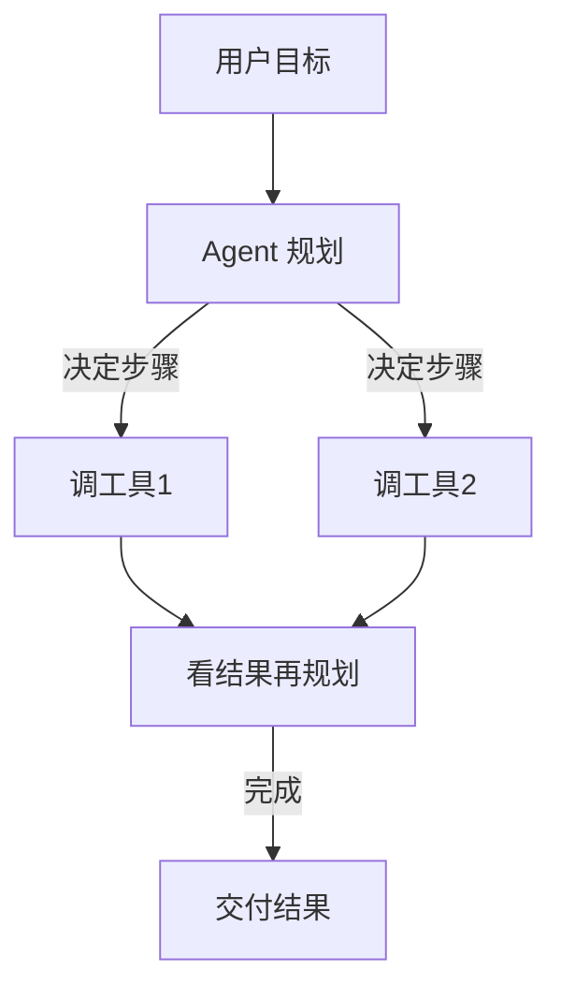

# Agent 与多步任务编排（重写版）

> [!abstract] 本文要练成的能力
> 把"Agent是什么"升级为**一套 Agent 产品设计要点 + 风险围栏清单**，并配一个"什么时候该上 Agent、什么时候别上"的权衡例。这是能级1"技术判断"里自主性最高、风险也最高的技术——练完你能判断"这个需求配不配得上登上前场"，并知道如何把 Agent 关进围栏。

---

## 一、Agent 是什么（PM 直觉）

> **Agent = 大模型 + 计划能力 + 工具调用**。它能把一个复杂目标拆成多步，自主决定"下一步做什么、用哪个工具"，直到完成。



> 深度洞察：**Agent 与普通问答的本质区别不是"多步"，而是"把决策权交给模型"。** 因为 Agent 用模型在运行时决定"下一步"而非写死脚本，所以才范围undefined能力上升、但也引入"步骤不可控、成本不封顶、错误累积"的新风险。**你做的 Skill/工作流，是确定性的，属"轻量工作流"；Agent 是模型自主决策的，是它的泛化版。**

---

## 二、D1 Agent 产品设计要点（从立项到上线）

1. **先问"值不值"**：任务多步且**可自动化**，且有工具可调用 → 才考虑；否则普通工作流就够。
2. **定义目标与边界**：给 Agent 明确"完成什么算成功、做到什么程度必须停"，别让它自由发挥。
3. **控制调用面**：哪些工具/系统可用、哪些禁区，逐项授权；不给不必要的权限。
4. **设预算与步数上限**：封顶调用次数与费用，防止"追着跑没完"。
5. **每步留痕/可回退**：关键动作打日志、支持撤销/回退到上一步。
6. **人工闸门**：越权/高影响动作必须人确认后执行（耗钱订阅、发邮件、删数据等）。

---

## 三、D1 风险围栏清单（上线检查，逐项勾选）

```
□ 目标与终止条件明确（什么算完成、何时强制停）
□ 允许/禁止的工具列表（按需最小授权）
□ 调用次数与费用预算已封顶
□ 高影响动作（发消息/付款/删数据）有人工确认
□ 每步日志留痕，可回退上一步
□ 超时/死循环兜底（超时则终止提示人工）
```

> 深度洞察：**围栏不是"限制智商"，是"把失控代价调到产品可承受"。** 因为 Agent 自主性的价值来自"少人工"，而失控的本质是"把决策权让渡给了概率"；所以围栏的松紧应正比于"越权/错误的最大损失"，越高影响越要收紧人工闸门。

---

## 四、D2 该上 Agent vs 别上 Agent（权衡例 + 反例）

### 该上：多步、可自动化、有真实工具（如 HR 入职办理）
- 需求：自动生成 offer → 触发审批 → 发系统通知 → 收集回传，多系统多步。
- 因为步骤确定、有多个系统要调用、且人工做重复低效，所以值得上 Agent（或工作流）提效。
- 但**每步仍要围栏**：发 offer 前人工确认，付款/发外界消息加闸门。

### 别上：固定一两步就能做（如"把周报转成会议议程"）
- 需求：单次生成，没有多系统调用。
- 因为只需一次/两步生成，所以用**提示词或固定工作流**更快更稳更省，上 Agent = 多掏成本、多担失控风险，纯属过剩。
- 反例示范：`"显得先进就上一句话 Agent"，实际两步就够 → 既贵又易错` 是典型选型反例。

> 权衡标准一句话：**"是否需要模型在运行时自主决策+调用外部系统"是上不上 Agent 的分水岭。** 因为 Agent 的代价（成本/失控/运维）只有换来"真自主多步"才有意义，所以固定流程一律先用确定性方案。

---

## 五、D3 主线衔接

- **衔接能级1 技术判断**：本文承接技术选型决策树里"要自动多步+调外部工具"的结论，并落地为设计要点+围栏。
- **衔接能级2 产品定义**：**围栏清单里的"人工闸门、预算上限、日志回退"会在 PRD 中标成"必要约束与审批流"**——这是 Agent 产品从技术方案走向产品需求的典型映射。
- **衔接提示词产品化**：Agent 的每步仍要稳定 prompt，见 [[05-产品与开发/AI产品经理学习路径/02-技术底座/04_提示词的产品化视角]]
- **衔接你的积累**：Skill/工作流/Web 应用与 Agent 思想相通，可作"轻量Agent"素材。
- 显式判据：**能对任意任务判定"值不值得上Agent"并给出围栏配置，就是掌握了能级1里自主性最高的判断。**

---

## 六、D4 资源与练习

**看什么（资源类型）**
- 上手工具：主流 Agent 编排框架体验（关键词：LangGraph、agent framework 多步编排）
- 官方文档：模型工具调用/Function calling 能力（关键词：tool use、function calling）
- 深度文章：Agent 失控/成本案例（关键词：AI agent 失败案例、agent 失控 成本）

**练什么（可自测练习）**
- [ ] 练习1：找3个"多步任务"，逐一判定"值不值得上Agent"，给围栏配置。
- [ ] 练习2：写一个"一句话就上Agent"的反例，并给出正确做法（提示词/工作流）。
- [ ] 练习3：把 Skill/多LLM链提升为"面向Agent"的设计提案，说明哪步由模型自主、哪步保留人工。

**怎么算会（达标判据）**
- [ ] 能用"是否有模型自主决策+调外部系统"判断该不该上 Agent。
- [ ] 能给任一个 Agent 配出完整风险围栏清单。
- [ ] 能讲清"Agent 与普通工作流"的边界及各自的坑。

---

## 练什么（可自测清单）

- [ ] 判定3个多步任务该不该上Agent，配围栏
- [ ] 写一个"过度上Agent"反例及正确方案
- [ ] 把 Skill/多LLM链设计成"轻量Agent"提案

---

- 下一步：[[05-产品与开发/AI产品经理学习路径/02-技术底座/04_提示词的产品化视角]]
- 回到 [[05-产品与开发/AI产品经理学习路径/02-技术底座/00_MOC_技术栈中枢]]