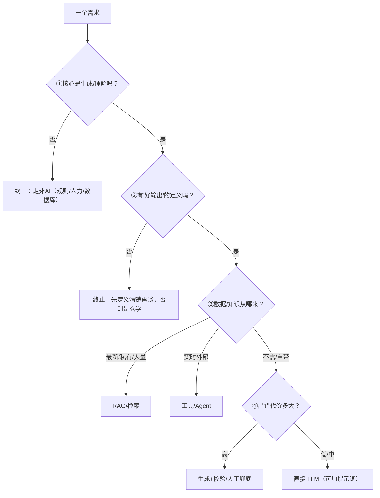

# 能力边界判断：一个需求该不该用AI（重写版）

> [!abstract] 本文要练成的能力
> 把"四问框架"从一段话升级为**一条含终止条件的可决策流程**，并配合三个带真实背景的完整推敲例子（用/不用/用哪种）。这是能级1"技术判断"的收口；练完，你能对一个陌生需求当场给出带理由的判断，而不是只会背"RAG/Agent"标签。

---

## 一、可决策流程（四问 → 每条给"怎么判/何时停"）

> 原版的四步往往被背成一句话。这里改成**每条带判断依据 + 终止条件（什么情况下直接停止、不用再往下）**：



**四问的每条判据与"何时停下"：**

1. **核心是不是生成/理解？** → 判据：任务要"对"（台账/唯一答案/记分）而非"好" → **核心不是生成可直接停**，AI 最多做翻译/辅助。
2. **有没有"好"的定义？** → 判据：你能不能写出一句"什么样算及格输出" → **写不出就先别上 AI**，先定义验收口径（这是产品，不是魔法）。
3. **数据与知识从哪来？** → 判据：答对需不需要模型没见过的最新/私有/外部信息 → 需要 → RAG/工具；不需要 → 再走④。
4. **错误容忍度多大？** → 判据：最坏一次错误，用户/企业损失多少 → 高 → 必须校验/人工闸门；低 → 可直接生成。

> 深度洞察：**真正卡住产品的不是第③④问，而是第②问。** 因为大多数"想用AI"的需求其实说不清"好输出长什么样"，所以很多项目死在"无法验收、无法迭代"，而不是死在技术。**所以你若遇到一个讲不清验收目标的场景，第一反应该是"先定义验收"，而不是"先选技术"。**

---

## 二、D2 三个真实例子（用/不用/用哪种，含你的背景）

### 例子1：用 —— 面试评估生成（LLM 主流程 + 校验）
- 需求：结构化面试后让AI生成"行为表现总结"。
- ①核心是生成（把面试记录浓缩成评语）→ 是 → ②有"好"定义（覆盖关键能力维度、无废话）→ 有 → ③数据自带（面试记录进来了）→ ③不需额外检索 → ④出错代价中（评语影响用人判断）→ 结论：**LLM 生成 + 维度校验**。
- 推敲：因为评语要覆盖指定能力维度、且要"看起来专业"，所以用 low temperature + 示例固化；又因为不能全信一次输出，所以**关键字段（打分）不从 AI 拿，分数交给规则**，AI 只写评语。这才平衡了"效率"与"可信"。

### 例子2：不用（或仅辅助）—— 考勤扣款计算
- 需求：每月自动计算每人迟到/缺勤的扣款。
- ①核心不是生成（是精确计算台账）→ 停止，走规则/SQL。
- 推敲：因为账要一分不差、且要担责（员工纠纷/合规），所以 **主流程绝不让 LLM 算**；若要体验提升，LLM 只能把 Excel/SQL 结果翻译成一句人话。→ 结论：**NOT-AI（主流程），AI 仅作解释器。**

### 例子3：用哪种 —— HR 制度问答机器人（你知微的真实场景）
- 需求：员工问"病假扣多少"要答对且可溯源。
- ①核心是理解和回答 → 是 → ②有"好"定义（答案来自制度原文、可引用、无编造）→ 有 → ③需要私有制度资料 → **RAG** → ④出错代价高（误导员工/有合规风险）→ **引用溯源 + 拒答兜底**。
- 推敲：因为你发现单一模型可能立场不一/格式不稳，所以用**多LLM链重构**分工（检索/生成/校验分角色），再配引用，把"答得专业但可能错"压制成"有据可查"。
- 结论：**RAG + 多LLM链 + 引用/校验 + 拒答**。

3个例子合起来演示同一件事：**同一套四问，从"要不要用"推演到"用哪种、补什么兜底"，全程用你的业务与踩坑背景支撑，而不是背名词。**

---

## 三、D1 判断模板（填完即用）

```
需求：____
□ 核心是否生成/理解？（是/否）若否→停，走非AI
□ 好输出的定义：____（写一句"什么样算及格"）
□ 数据/知识来源：____（最新/私有/外部/无需）
□ 出错代价：低/中/高____
结论技术：____（纯LLM / RAG / Agent / 非AI / 组合）
兜底：____（引用/校验/人工/拒答）
一句话理由（用"因为…所以…"）：____
```

> 把这份表在你真实项目里填 5 次，你的"这是不是AI的事、该用哪种"就会变成肌肉记忆，而非背模板。

---

## 四、给求职的运用

> 面试问"这个需求你判断用不用AI、为什么"，别只给结论。给出这条流程线：
> "这需求核心是生成吞吐 → 有明确的'好'定义 → 需要私有/最新数据 → 出错代价高 → 所以用 RAG + 引用校验，而非纯LLM。理由是因为答错会误导用户。"

---

## 五、D3 主线衔接

- **衔接能级1 技术判断**：本文把"单任务定位"（上一篇）升级成"整个需求的决策流程"。
- **衔接能级2 产品定义**：**流程第②问"好输出定义"产出的验收口径，直接进入产品需求文档**；第④问产出兜底需求同样是功能点。这就是从"判断"到"定义功能"的桥。
- **衔接技术选型**：流程结论（RAG/Agent/微调/提示词）正是下一篇技术选型总览要展开的选项空间：[[05-产品与开发/AI产品经理学习路径/02-技术底座/01_技术选型总览：RAG-Agent-微调-提示词]]
- 显式判据：**能对一个陌生需求，独立走完四问并给出带理由的"用/不用/用哪种"，就是你具备能级1判断力的标志。**

---

## 六、D4 资源与练习

**看什么（资源类型）**
- 真实案例：知名AI产品落地与失败复盘（关键词：AI 产品 失败案例、AI 落地 坑）
- 深度文章：AI 能力边界判断方法论（关键词：何时该用大模型、AI 任务适合性判断）
- 上手工具：把流程套到你自己做的 3 个功能上（动手样本）

**练什么（可自测练习）**
- [ ] 练习1：用判断模板对你的 5 个真实/周边需求打分，写全结论与理由。
- [ ] 练习2：每个判断用"因为…所以…"写一句理由，练 5 次。
- [ ] 练习3：把一个"你很想上AI但说不清验收"的场景写出来，并补上它的"好输出定义"。

**怎么算会（达标判据）**
- [ ] 能对陌生需求独立走完四问，给结论。
- [ ] 每次结论都能讲出"因为…所以…"的支撑。
- [ ] 能为每个"用AI"的结论自动补出对应兜底。

---

## 练什么（可自测清单）

- [ ] 用四问决策给 5 个需求下判断并写理由
- [ ] 写出你的知微机器人四问走查+用工哪种技术+兜底
- [ ] 为一个"说不清验收"场景补出"好输出定义"

---

- 下一步：[[05-产品与开发/AI产品经理学习路径/02-技术底座/04_幻觉、可信度与产品兜底]]
- 回到 [[05-产品与开发/AI产品经理学习路径/02-技术底座/00_MOC_技术底座中枢]]