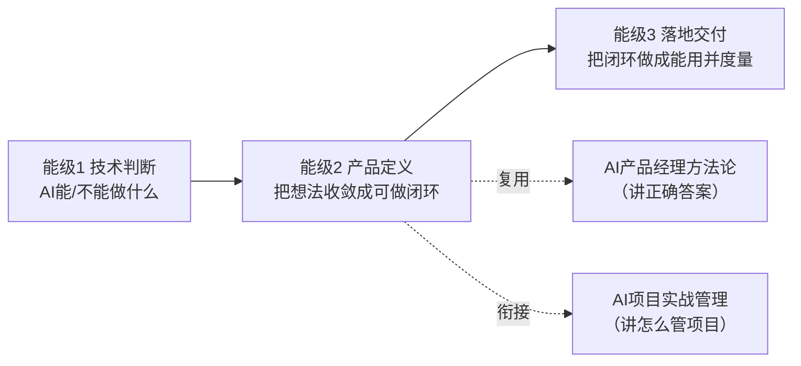

# 产品定义中枢（能级2）

> [!abstract] 本层目的
> 能级2 产品定义要练成的能力是：**把一句模糊的想法，收敛成"可做闭环"的一页产品定义**——说清给谁、解决什么、AI 怎么用、怎么算对、错了怎么办、先做哪一块。
>
> 这是能力螺旋里"从判断到定义"的桥：能级1 技术判断告诉你"AI 能不能做"，本层告诉你"**该做成什么、做多小才算闭环**"。
>
> 与 [[05-产品与开发/AI产品经理方法论/00_MOC_AI产品经理方法论中枢]]（讲"正确答案"）互补：方法论讲"怎么做对"，本库讲"**怎么一步步练到能做对**"——每篇都给出看什么、练什么、怎么算会。

---

## 一、本层核心目标（一句话能力）

> **对任意一个真实想法，能在 30 分钟内产出"一页产品定义 + 能力边界 + 评测口径 + 最小闭环范围"，并讲得清每一步为什么。** 这是求职面试里"从 0 到 1 做 AI 产品"类问题的主干能力。

---

## 二、看什么 / 练什么 / 怎么算会（总表）

> 本层四篇文档，每篇都按"看→练→判据"组织，先看这张总表定节奏。

| 文档 | 要练成的能力 | 看什么 | 练什么 | 怎么算会 |
|------|------------|--------|--------|---------|
| [[05-产品与开发/AI产品经理学习路径/03-产品定义/01_需求收敛：从模糊想法到一页产品定义]] | 把模糊想法收敛成一页产品定义 | AI PRD 案例、需求分析方法 | 用 InterviewPrep 填一页产品定义 | 六栏全填、每栏讲得出"为什么" |
| [[05-产品与开发/AI产品经理学习路径/03-产品定义/02_能力边界与AI方案选型]] | 判断该不该用 AI、用哪种方案 | 技术选型文章、AI 产品拆解 | 对 3 个需求填选型决策表 | 每个选型有"因为…所以…"理由 |
| [[05-产品与开发/AI产品经理学习路径/03-产品定义/03_评测指标与容错设计]] | 定义"做对了"的指标与容错 | 评测方法论、LLM eval 资料 | 为知微机器人搭评测体系 | 有维度/评测集/评分/通过线 |
| [[05-产品与开发/AI产品经理学习路径/03-产品定义/04_闭环定义与MVP范围]] | 定义最小闭环与 MVP 范围 | 精益创业、AI 产品拆解 | 把 InterviewPrep 16 模块重排 P0/P1/P2 | 能画出闭环线并说清"用一次有用" |

---

## 三、文档规划（每篇深度升级点）

| 文档 | 核心问题 | 深度升级点（相对"背概念"） | 状态 |
|------|---------|---------------------------|------|
| 01_需求收敛 | 模糊想法怎么变成一页产品定义 | 需求三层拆解 + "功能→能力"转变 + 六栏模板落地 | 新建 |
| 02_能力边界与AI方案选型 | 该不该用 AI、用哪种 | 四步判断带终止条件 + 四种方案成本差异 + 决策表 | 新建 |
| 03_评测指标与容错设计 | 怎么定义"做对了" | 评测=AI PM 核心标尺 + 三要素 + 容错三手段 | 新建 |
| 04_闭环定义与MVP范围 | 最小闭环与 MVP 怎么划 | 闭环判定 + P0/P1/P2 逻辑 + 范围控制 | 新建 |

> [!tip] 阅读顺序
> 01 → 02 → 03 → 04 是"从想法到可做"的自然顺序：先收敛需求，再判断 AI 方案，再定义怎么算对，最后划最小闭环。四篇合起来就是一份完整的一页产品定义。

---

## 四、与相邻能级的衔接

- **从能级1 进来**：[[05-产品与开发/AI产品经理学习路径/02-技术底座/00_MOC_技术底座中枢]] 练成"判断 AI 边界"后，本层把判断落成产品定义。其中 [[05-产品与开发/AI产品经理学习路径/02-技术底座/03_能力边界判断：一个需求该不该用AI]] 的"好输出定义"和"兜底"两个产出，直接成为本层 01 和 03 的输入。
- **向能级3 出去**：本层产出的"一页产品定义 + 闭环范围"直接进入 [[05-产品与开发/AI产品经理学习路径/04-实战落地/00_MOC_实战项目库中枢]]，变成作品集里的项目故事骨架。
- **复用方法论**：[[05-产品与开发/AI产品经理方法论/00_MOC_AI产品经理方法论中枢]] 给出"需求定义、体验设计、评估度量"的正确答案；本层用"学习路径"视角，把正确答案拆成"先练哪一步、练到什么程度算会"。
- **衔接项目管理**：本层 03 的评测体系对应 [[05-产品与开发/AI项目实战管理/02-AI特有管理篇/02_评测驱动迭代]]；本层 04 的闭环范围对应 [[05-产品与开发/AI项目实战管理/01-个人项目实战篇/02_最小闭环与里程碑]]。

---

## 五、本层检验（自测清单）

> [!todo] 能级2 过关检查
> - [ ] 能对 1 个真实想法填出完整的一页产品定义（六栏）
> - [ ] 能说清"这个需求为什么用/不用 AI、用哪种方案"
> - [ ] 能为产品定义出评测维度、评测集与通过线
> - [ ] 能画出最小闭环线，并把范围拆成 P0/P1/P2

> 本轮水位：____ / 当前卡在哪：____ / 下一步练什么：____

---

## 版本历史

| 版本 | 日期 | 更新内容 |
|------|------|----------|
| v0.1 | 2026-08-21 | 初始中枢：能级2 产品定义四篇文档 + 看/练/判据总表 |
