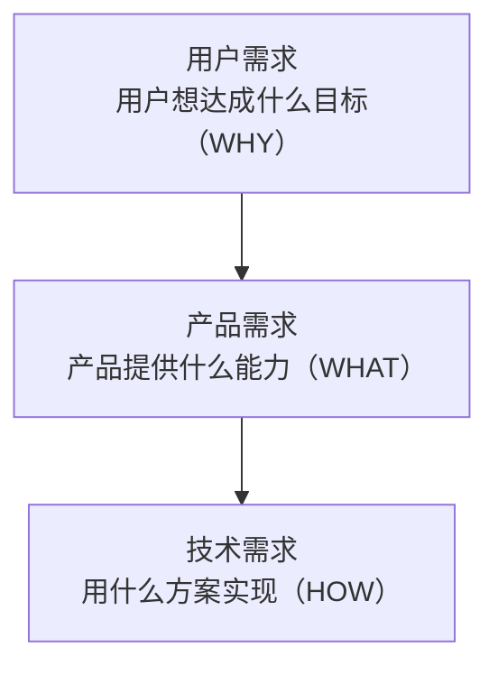

# 需求收敛：从模糊想法到一页产品定义

> [!abstract] 本文要练成的能力
> 把"我有一个想法"（模糊、兴奋、说不清）收敛成**一页产品定义**（问题/目标用户/核心价值/AI能力边界/关键指标/容错方案六栏全填、每栏讲得清为什么）。这是能级2 产品定义的入口能力——**因为 AI 产品最大的浪费不是做错，而是做之前没想清楚，所以第一步不是写代码，而是把想法压成一页纸。**

---

## 一、深度讲透：需求的三层，别混着谈

> 一个"需求"其实是三层叠在一起，混着谈就会吵不清、做不对。



| 层 | 问什么 | 反例（把三层混在一起） |
|----|--------|----------------------|
| **用户需求** | 用户想达成什么目标？在什么场景下卡在哪？ | "用户想要一个 AI 面试官"——这是产品需求，不是用户需求；用户真正想要的是"提前知道会被问什么、练完知道差在哪" |
| **产品需求** | 产品提供什么**能力**，让用户达成目标？ | "做一个岗位分析模块"——这是功能列表，不是能力；能力是"把岗位要求翻译成可练习的清单" |
| **技术需求** | 用什么方案实现？数据从哪来？ | "用 RAG 接知识库"——这是技术方案，要等产品需求定完再谈 |

> [!warning] 反例坑：把"我想要"当需求
> "我想要一个能自动生成周报的 AI"——这是**你的想要**，不是需求。需求必须能回答"谁、在什么场景、为什么现在卡住"。因为"我想要"没有用户和场景，所以做出来大概率没人用；**所以收敛需求的第一动作，是给想法补上"谁 + 场景 + 卡点"。**

> 因为三层各回答一个问题，所以**收敛的顺序必须自上而下**：先锁用户需求（WHY），再定产品能力（WHAT），最后才谈技术（HOW）。跳层谈，是需求讨论失控的头号原因。

---

## 二、深度讲透："功能 → 能力"的思维转变

> AI 产品的需求不是"功能列表"，而是"能力描述"。这是 AI PM 与传统 PM 最本质的差别之一。

| 思维 | 描述方式 | 问题 |
|------|---------|------|
| **功能思维** | "做一个模拟面试按钮" | 说不清 AI 做到什么程度算好，验收靠感觉 |
| **能力思维** | "具备把岗位要求翻译成针对性考题的能力" | 定义了"能力边界"，验收有口径 |

> 因为 AI 输出是概率性的，所以**"做了某个功能"不等于"能力达标"**——按钮能点，但生成的题可能不针对、评分可能不靠谱。所以产品定义里要写的是"**具备什么能力、能力边界在哪**"，而不是"有什么按钮"。

> 深度洞察：**"能力"这个词天然带边界。** 说"具备生成考题的能力"，紧接着就要问"覆盖哪些岗位？题准不准？答错怎么办？"——边界一问出来，评测和兜底就跟着出来了。**所以从"功能"到"能力"，不是换词，是逼自己把验收和风险想清楚。**

---

## 三、反例坑：需求列表堆砌

> [!warning] 反例坑：需求列表堆砌
> 把想到的功能一条条列出来（"要有岗位分析、要有题库、要有评分、要有历史记录、要有社区…"），然后开始做。**问题：列表没有主次、没有闭环、没有验收**，做一半发现核心价值没验证，列表越长越不敢砍。
>
> 因为列表是"加法思维"，所以只会越堆越多；**所以收敛要用"减法思维"**：先问"用户用一次，凭什么觉得有用"，把能回答这个问题的功能留下，其余后置。这正是本层 04 篇"闭环定义"要做的事——本层先把"想法"收敛成"一页定义"，04 再收敛成"最小范围"。

---

## 四、填完即用：一页产品定义模板（六栏）

> 对每个候选想法填这张表。**填不满或填不通，说明还没想清楚，不要开始做。**

```
产品名：________

① 问题（用户需求）：谁、在什么场景、卡在哪？
   ____
② 目标用户：谁最痛、谁愿意先付费/先试用？
   ____
③ 核心价值（产品能力）：用户用一次，凭什么觉得有用？
   ____
④ AI 能力边界：AI 做什么、不做什么？能力边界在哪？
   ____
⑤ 关键指标：怎么算"做对了"？上线后盯哪 1-3 个数字？
   ____
⑥ 容错方案：AI 出错/超时/幻觉时怎么办？
   ____
```

> 六栏的关系：① ② 回答"为什么做"，③ ④ 回答"做成什么"，⑤ ⑥ 回答"怎么算对、错了怎么办"。**六栏全填，一页产品定义才成立。**

---

## 五、示范：InterviewPrep 的一页产品定义

> 用你的真实项目示范六栏怎么填，面试讲"从 0 到 1"时这就是骨架。

```
产品名：InterviewPrep（AI 面试押题）

① 问题：求职者不知道会被问什么（信息不对称）；练完没人告诉差在哪（无反馈）；刷题是单次动作、没有诊断迭代（无闭环）。
② 目标用户：主动求职、愿意为"提前知道会被问什么"付费的人（小红书高频出现"面试官视角押题"需求）。
③ 核心价值：把"岗位需求→靶向练习→效果评估"变成闭环——练一次就知道差在哪、怎么补。
④ AI 能力边界：AI 负责解析 JD、生成考题、模拟面试官、五维评分；不负责"保证押中"（概率性，需提示"仅供参考"）。
⑤ 关键指标：六维准备度评分（0-100）的迁移，如"连续练习 21 天从 52 涨到 71"；而非功能数量。
⑥ 容错方案：7 家 AI 供应商按场景路由并互为容错；评分偏低置信时提示"可补充练习"；内容与代码解耦便于快速修正。
```

> 注意第 ④ 栏：**"不负责保证押中"就是能力边界**——把概率性说在前头，评测和兜底（⑤⑥）就顺理成章。

---

## 六、看什么（资源类型 + 搜索关键词）

| 资源类型 | 看什么 | 搜索关键词 |
|---------|--------|-----------|
| 真实 PRD 案例 | 成熟 AI 产品的一页 PRD / 需求文档怎么写的 | AI 产品 PRD 案例、AI 产品需求文档 示例 |
| 需求分析方法 | 用户需求 vs 产品需求 vs 技术需求怎么拆 | 需求三层 用户需求 产品需求、需求收敛 方法 |
| AI 产品拆解 | 别人怎么把"功能"描述成"能力" | AI 产品 拆解 能力边界、AI 产品 从功能到能力 |
| 你的存量项目 | 复盘 InterviewPrep 当初怎么从"刷到帖子"收敛成闭环 | -- |

---

## 七、练什么（可检验练习，结合真实项目）

- [ ] **练习1**：给 InterviewPrep 填一遍上面的六栏模板，重点打磨第 ④ 栏"AI 能力边界"，写到"AI 不做什么"为止。
- [ ] **练习2**：给知微 RAG 机器人填一遍六栏模板，对比 InterviewPrep，找出两个产品在"容错方案"栏的差异（一个重引用溯源、一个重供应商容错）。
- [ ] **练习3**：把 Skill 四连发里的"自动拉群"写成一页产品定义，验证"规则明确的机械劳动"能不能套进六栏——套不进的地方，往往就是"该不该用 AI"的线索。

---

## 八、怎么算会（达标判据，可自测）

- [ ] 能对 1 个真实想法在 30 分钟内填完六栏，且每栏讲得出"为什么这么填"。
- [ ] 能分清一个需求的三层，并指出别人混层的地方。
- [ ] 能一句话说清"这个产品提供什么能力、能力边界在哪"。

---

## 九、下一步衔接

- 本层下一篇：[[05-产品与开发/AI产品经理学习路径/03-产品定义/02_能力边界与AI方案选型]]——六栏里的第 ④ 栏"AI 能力边界"怎么判断、怎么选方案。
- 回到 [[05-产品与开发/AI产品经理学习路径/03-产品定义/00_MOC_产品定义中枢]]
- 方法论对照：[[05-产品与开发/AI产品经理方法论/02_AI产品的需求定义：从「功能」到「能力」]]
