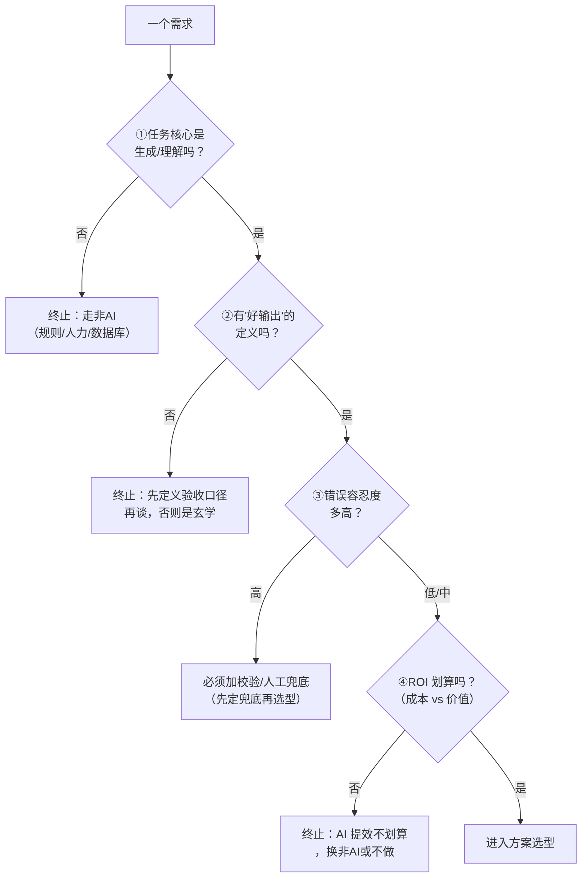

# 能力边界与AI方案选型

> [!abstract] 本文要练成的能力
> 对一页产品定义里的第 ④ 栏"AI 能力边界"，做出**带理由的选型判断**：这个需求该不该用 AI、用哪种方案（提示词/RAG/Agent/微调）、成本差在哪。这是能级2 里最"技术"的一环，但练的是**产品判断**，不是写代码——**因为方案选错，后面评测、兜底、成本全跟着错，所以选型要在产品定义阶段就定下来。**

---

## 一、深度讲透：能力边界判断四步（带终止条件）

> 能级1 里 [[05-产品与开发/AI产品经理学习路径/02-技术底座/03_能力边界判断：一个需求该不该用AI]] 的四问，本层把它升级成**产品定义阶段可执行的四步**，每一步都带"何时停"。



| 步骤 | 判据 | 何时停 |
|------|------|--------|
| ① 是否需生成/理解 | 任务要"好"（生成/理解/判断）而非"对"（台账/唯一答案） | 核心不是生成 → 停，走非 AI |
| ② 有无"好输出"定义 | 能否写出一句"什么样算及格输出" | 写不出 → 停，先定义验收 |
| ③ 错误容忍度 | 最坏一次错误，用户/企业损失多少 | 高 → 先定兜底，再谈选型 |
| ④ ROI | 每次调用的成本 vs 省下的人力/带来的价值 | 不划算 → 停，AI 不是目的 |

> 深度洞察：**真正卡住产品的不是①③④，而是②。** 因为大多数"想用 AI"的需求说不清"好输出长什么样"，所以很多项目死在"无法验收、无法迭代"。**所以你若遇到讲不清验收的场景，第一反应该是"先定义验收"，而不是"先选技术"。**

> 因为第④步 ROI 常被忽略，所以很多"能用 AI"的需求其实不该用——**"能做"和"该做"是两件事**：能做是技术问题，该做是 ROI 问题。

---

## 二、深度讲透：四种方案怎么选（适用场景 + 成本差异）

> 选型不是"哪个高级选哪个"，而是**按"知识从哪来 + 要做什么 + 成本预算"对号入座**。

| 方案 | 适用场景 | 成本特征 | 一句话判断 |
|------|---------|---------|-----------|
| **提示词** | 任务单步、知识自带、不需要外部资料 | 最低：一次调用，无额外工程 | 能靠提示词解决的，别上复杂方案 |
| **RAG** | 需要最新/私有/大量知识，答案要可溯源 | 中：检索 + 生成 + 知识库维护 | 答对依赖"模型没见过"的资料 → RAG |
| **Agent** | 多步任务编排、需要调用工具/外部系统 | 高：多轮调用 + 编排 + 失败重试 | 要"做一串事"而不是"答一个问题" → Agent |
| **微调** | 输出格式/风格/领域语言要高度定制 | 最高：训练 + 数据标注 + 维护 | 提示词/RAG 都压不住格式问题时才微调 |

> 因为成本从提示词到微调是"数量级"递增，所以**选型铁律是"从最便宜的方案开始试"**：先用提示词，不够加 RAG，再不够考虑 Agent，最后才微调。**不是因为微调更"高级"，而是因为越贵的方案越难维护、越难迭代。**

> 真实权衡：RAG 的隐性成本不在调用，在**知识库维护**——资料更新、格式清洗、检索调优都要持续投入；Agent 的隐性成本在**失败重试**——多步任务任何一步出错都要兜底。**所以选型时要把"长期维护成本"算进去，而不只是单次调用价格。**

---

## 三、反例坑

> [!warning] 反例坑1：什么都想用 Agent
> "这个需求要 AI，那就上 Agent。"——Agent 是**多步任务编排**的方案，不是"AI 的加强版"。因为 Agent 每多一步就多一层失败概率和成本，所以**单步任务用 Agent 是杀鸡用牛刀**；先问"这件事是不是真的需要 AI 自己决定下一步做什么"。

> [!warning] 反例坑2：为用 AI 而用 AI
> "领导/老板/自己觉得该上 AI，就上了。"——因为"能用 AI"不等于"该用 AI"，所以**先走四步判断**：核心不是生成 → 别用；说不清验收 → 别用；ROI 不划算 → 别用。你的 Skill 四连发里"自动拉群"就是反例的正面示范——**先确认是规则明确的机械劳动，才决定用 AI 自动化，而不是为了炫技。**

---

## 四、填完即用：AI 方案选型决策表

> 对每个候选需求填一张，**五列全填、理由用"因为…所以…"**，填完选型就定了。

```
需求/场景：________

| 任务类型 | 错误容忍度 | 成本预算 | 选型 | 理由（因为…所以…） |
|---------|-----------|--------|------|-------------------|
| （生成/理解/检索/多步编排…） | （低/中/高） | （单次调用 + 长期维护） | （提示词/RAG/Agent/微调/非AI） | ____ |

兜底方案：____（引用/校验/人工/拒答/供应商容错）
一句话结论：____
```

> 示范（InterviewPrep 的"五维评分"）：
> - 任务类型：生成 + 判断 → ② 有"好输出"定义（覆盖五维、可量化）→ ③ 错误容忍中（评分影响用户判断）→ ④ ROI 划算（省掉人工批改）
> - 选型：**提示词 + 结构化输出**（知识自带、单步生成，不需要 RAG/Agent）
> - 兜底：低置信时提示"可补充练习"；7 家供应商按场景路由互为容错
> - 理由：因为评分是单步生成、知识自带，所以用提示词就够；因为评分影响用户判断，所以加低置信兜底。

---

## 五、看什么（资源类型 + 搜索关键词）

| 资源类型 | 看什么 | 搜索关键词 |
|---------|--------|-----------|
| 技术选型文章 | RAG/Agent/微调/提示词各自的适用边界与成本 | RAG vs Agent 区别、LLM 微调 什么时候需要 |
| AI 产品拆解 | 成熟产品为什么选这个方案（如客服机器人用 RAG） | AI 产品 技术方案 拆解、RAG 落地案例 |
| 成本资料 | 各方案的成本构成（调用/训练/维护） | LLM 成本 优化、RAG 维护成本 |
| 你的存量项目 | 复盘知微机器人为什么从"单链路"重构为"多链路"（本质是选型纠错） | -- |

---

## 六、练什么（可检验练习，结合真实项目）

- [ ] **练习1**：给 InterviewPrep 的 16 个模块各填一张选型决策表，标出哪些模块其实不需要 AI（可能是"该不该用 AI"的反例）。
- [ ] **练习2**：给知微 RAG 机器人写一份"为什么用 RAG 而不是微调/Agent"的选型说明，用四步判断 + 成本差异讲清楚。
- [ ] **练习3**：找出 Skill 四连发里"为用 AI 而用 AI"的候选场景，用四步判断证明它该不该用 AI。

---

## 七、怎么算会（达标判据，可自测）

- [ ] 能对陌生需求独立走完四步判断，并给出"用/不用/用哪种"的结论。
- [ ] 每个选型都能讲出"因为…所以…"的理由，且提到成本差异。
- [ ] 能指出别人"什么都想用 Agent / 为用 AI 而用 AI"的问题在哪。

---

## 八、下一步衔接

- 本层下一篇：[[05-产品与开发/AI产品经理学习路径/03-产品定义/03_评测指标与容错设计]]——选型定了，怎么定义"做对了"。
- 回到 [[05-产品与开发/AI产品经理学习路径/03-产品定义/00_MOC_产品定义中枢]]
- 技术底座衔接：[[05-产品与开发/AI产品经理学习路径/02-技术底座/03_能力边界判断：一个需求该不该用AI]]
- 技术栈总览：[[05-产品与开发/AI产品经理学习路径/02-技术底座/01_技术选型总览：RAG-Agent-微调-提示词]]
