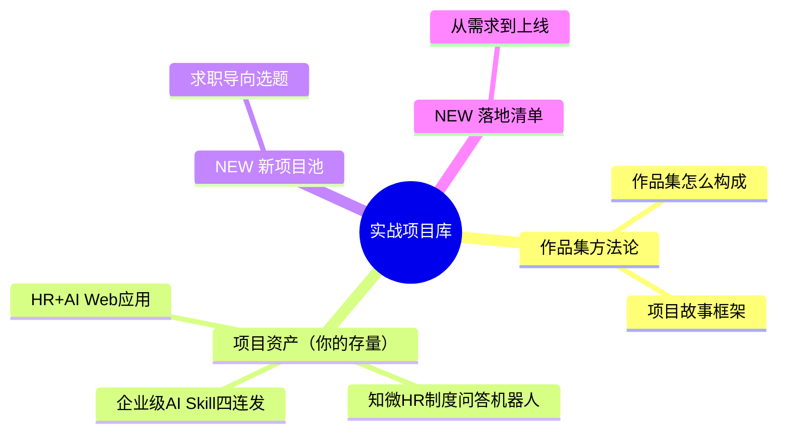

---
title: "AI产品实战项目库中枢"
aliases: ["AI PM 作品集", "实战项目库"]
tags:
  - MOC
  - AI产品经理
  - 实战项目
  - 作品集
created: 2026-08-20
updated: 2026-08-20
status: "active"
category: "实战落地"
---

# AI产品实战项目库中枢

> [!abstract] 本子库目的
> **求职导向下，这是最重要的弹药库。** 把"会做的东西"提炼成"能讲、能展示、能写进简历的作品集"，并沉淀从 0 到 1 的实战方法论。你已有 Skill 四连发、RAG 机器人、Web 应用等积累，本库帮你系统化、成作品集。

---

## 一、核心目标

> **拥有 1-2 个"能 10 分钟讲清、有指标、有价值"的 AI 产品作品**，作为求职最强证据。

---

## 二、子库结构

### 文档规划

| 文档 | 核心问题 | 状态 |
|------|---------|------|
| 01_作品集构成与项目故事框架 | 作品集怎么搭、项目怎么讲 | v0.1 |
| 02_存量作品盘点：把已有的变成作品集 | 现有资产怎么升级 | v0.1 |
| 03_新项目选题池与落地清单 | 再做什么来补作品集短板 | v0.1 |
| **04_三个存量项目面试故事卡** | 三大项目1分钟/10分钟/追问版怎么讲 | **v0.1** |
| **05_面试追问弹药库** | 高频追问怎么答、STAR脚本 | **v0.1** |

---

## 三、与求职主线衔接

> - 产出 → 进入 [[05-产品与开发/AI产品经理学习路径/05-进阶出口/00_MOC_求职面试中枢]]，把作品讲成面试答案
> - 技术衔接：[[01-AI技术/Skill制作痛点/00_MOC_Skill制作痛点中枢]]

---

## 版本历史

| 版本 | 日期 | 更新内容 |
|------|------|----------|
| v0.1 | 2026-08-20 | 初始中枢 + 内容 |