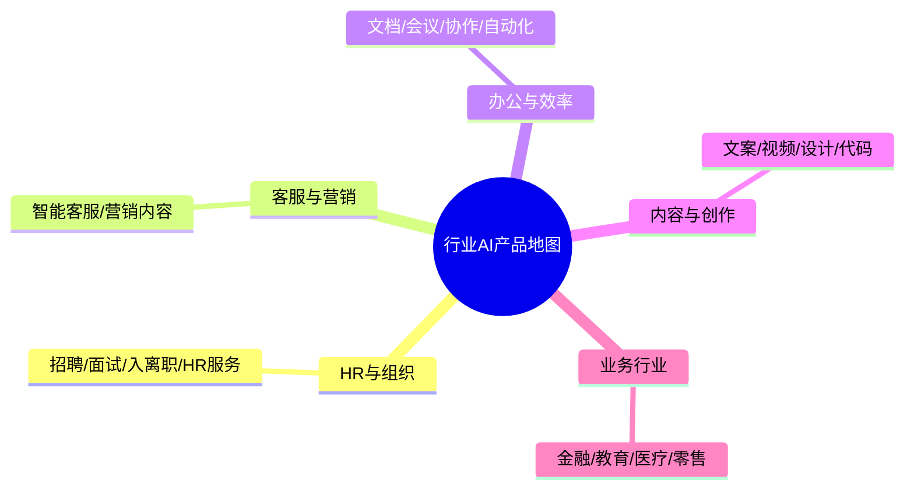

# 行业AI产品地图中枢

> [!abstract] 本子库目的
> 扩大"行业×场景"视野，理解 AI 产品在不同行业的落地形态。**求职导向**：帮你判断"去哪个行业做 AI PM 更有机会"，并强化你的 HR 垂直优势。

---

## 一、本子库结构

### 文档规划

| 文档 | 核心问题 | 状态 |
|------|---------|------|
| 01_HR与组织AI产品（重点） | HR场景的AI产品，你的主战场 | 本文档 |
| 02_客服/营销/办公/内容等通用AI产品 | 其他高频场景长什么样 | 本文档 |
| 03_行业选择与求职落点 | 去哪个行业做AI PM | 本文档 |

---

## 二、重点提醒

> **你的 HR 垂直优势**是差异化。本库 HR 部分作为主攻区深挖，其余行业作为视野补充，避免东一榔头西一棒。

---

## 版本历史

| 版本 | 日期 | 更新内容 |
|------|------|----------|
| v0.1 | 2026-08-20 | 初始中枢 + 内容 |