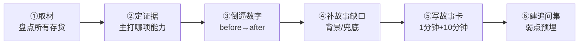

---
title: "存量作品盘点：把已有的变成作品集（重写版）"
aliases:
  - 存量作品盘点
  - 项目作品化
  - 已有项目变作品集
tags:
  - 作品集
  - 项目盘点
  - 求职
  - AI产品经理
  - 能级3落地交付
created: 2026-08-20
status: "active"
---

# 存量作品盘点：把已有的变成作品集（重写版）

> [!abstract] 本文要练成的能力
> 把**已经交付过的 AI 项目资产**，按固定转化流程一步不漏地产品化成可用的作品集证据——不是重新做，而是把已有库存"提纯变现"。这是能级 3「落地交付」的加速版：你已经有三个真实项目，缺的只是把「做过的」翻译成「靠谱的」。
>
> 一句话：**存量作品化 = 取材 → 定证据 → 倒逼数字 → 补故事 → 写故事卡 → 建追问集**，六步缺一不可。

---

## D1 实操与模板：项目→作品的完整转化六步

### 转化流水线总览

### 第 1 步：取材（盘点存货）

把你手上**所有**可作证据的东西摊开：代码仓库、PRD、需求文档、数据报表、截图、演示链接、复盘笔记。要做的是"盘点清单"，不是筛选。对你来说是：

| 项目 | 已有存货 | 还缺什么 |
|------|---------|---------|
| 知微 HR 制度问答机器人 | 架构（多 LLM 链重构）、错误分类统计、知识库方法论 | 上线后的指标时间线、当时的上线时间 |
| 企业级 AI Skill 四连发 | 4 款 Skill、痛点记录、使用说明、审核节点 | 每款 Skill 被团队使用的人次 |
| InterviewPrep | 16 模块、7 家供应商、飞书 Wiki、代码仓库 | 真实用户样本 / 反馈记录（诚实处理） |

### 第 2 步：定证据（主打哪项能力）

每件作品**只主打一项能力**，多了就散。选它"最独有、最不可替代"的那项：

| 项目 | 主打能力 | 一句话点题 |
|------|---------|-----------|
| 知微 | **端到端闭环 + 技术判断**（RAG/多LLM链 + 反幻觉兜底） | 把制度问答从"分钟级→秒级"还治好了"胡说八道" |
| Skill 四连发 | **业务提效 + 团队化落地** | 从个人工具升级成团队看得见的效率改变 |
| InterviewPrep | **需求判断力 + 0到1闭环** | 独立从模糊痛点做出一款闭环产品 |

> 判断逻辑："主打能力 = 面试官最想要 × 你最能证明 × 可被追问不穿帮"。

### 第 3 步：倒逼数字（before→after）

把"过程性成果"提炼成**可量化的前后对比**。规则：**每个作品至少一个 before→after 数字 + 一个隐性收益**。

| 项目 | before→after（硬数字） | 隐性收益 |
|------|------------------------|---------|
| 知微 | 制度查询 分钟级→秒级；编造率降到极低；覆盖百余名 HR | 查询会话量不降反升（敢用的多了） |
| Skill 四连发 | 建群单次 4 分钟→1 分钟 | AI 提效在团队中获得可见改观与接受度 |
| InterviewPrep | 全链路 16 模块；7 家供应商路由；准备度曲线（如 52→71） | "内容/代码解耦"降低单人维护成本 |

> **注意**：InterviewPrep 这类没有大规模真实用户的项目，不要编造用户量。可量化"工程指标"（模块数、供应商切换、评分曲线），把用户验证不足作为"诚实弱点"（见第 6 步），反而加分。

### 第 4 步：补故事缺口（背景 + 兜底，不虚构）

借回忆和复盘，把 6 段式里缺的 **背景细节** 和 **兜底故事** 补上：当时在什么公司、哪个业务线、替你背锅的人是谁、一句话怎么讲清业务痛点。**补的是"回忆出来的真实细节"，绝不补"编造的数字/结果"**。例如知的背景是"HR 制度分散在制度中心，格式五花八门"——这种画面感必须补，因为它让面试官秒懂。

### 第 5 步：写故事卡（1 分钟 + 10 分钟）

套用 [[05-产品与开发/AI产品经理学习路径/04-实战落地/01_作品集构成与项目故事框架]] 的 6 段式。**直接复用成品故事卡** [[05-产品与开发/AI产品经理学习路径/04-实战落地/04_三个存量项目面试故事卡]]——那里已经写好了你三个项目的完整 1 分钟、10 分钟、追问三版，你要做的是按第 1-4 步补全后对照微调，而不是从零写。

### 第 6 步：建追问集（诚实弱点预埋）

为每个项目主动准备"被追问的弹药"和"一条诚实弱点"。主动暴露弱点展示成熟，比被戳穿体面得多：

| 项目 | 最可能被追问的点 | 诚实弱点怎么答 |
|------|----------------|---------------|
| 知微 | 为什么拆链路能治编造？ | 编造是生成天性，用"依据片段+给出处+转人工"结构性压缩，不是提示词技巧（讲成架构判断） |
| Skill四连发 | Skill 和脚本有什么区别？ | 有过自动化做过头、只做工具不退文档的坑，最终靠"人工确认+文档先行"修正 |
| InterviewPrep | 真有用户吗？ | 诚实说：目前是独立验证阶段、真实用户规模有限，工程/方法已闭环；我把它作为持续验证中的产品 |

---

## 重点打磨：三个项目的"作品化"具体指引

### 代表作候选①：知微 HR 制度问答机器人 —— 打磨成技术+闭环双主打

- **别只讲"做了个 RAG 机器人"**，要把"多 LLM 链重构"讲成完整迭代故事：上线好用 → 三个月后开始编造 → 一对一诊断 → 错误分类统计 → 定位到"单条链路过载" → 按职责拆四条链路 → 指标回升。这条"遇到问题→诊断→重构→改进"线，最能体现 AI PM 的**问题解决能力**。
- **延伸行业价值**：HR + AI 稀缺认知。制度问答的"信任是第一产品属性"（答案会被当依据引用），是你最独特的体会。
- **最扛的追问**：为什么技术重构（而非提示词）是解药？答：职责过载是架构问题，提示词救不了。→ 显成熟。

### 代表作候选②：企业级 AI Skill 四连发 —— 主打"提效 + 团队化"

- **卖点不是"写了 4 个脚本"**，而是"个人工具 → 团队工具"的升级逻辑：降门槛（同事能直接用）＋ 补文档（剥离个人维护责任）＋ 留人工审核（合规红线）。
- **讲清楚选题判断**：先花一周记录重复劳动、按"频次/耗时/出错后果/能否模板化"四问排序，再选前四项——这比直接讲代码更能证明产品思维。
- **最扛的追问**：单靠"建群从 4→1 分钟"会不会太小？答：它证明了 AI 提效在一线落地是真实可见的改变，为团队后续 AI 项目铺路（隐性收益）。

### 代表作候选③：InterviewPrep 从 0 到 1 —— 主打"需求判断力 + 闭环"

- **最值钱的不是代码，是"把模糊痛点收敛成清晰闭环的需求判断力"**：岗位分析→能力诊断→靶向练习→效果评估，16 模块按 P0/P1/P2 交付。
- **讲克制**：P2 再诱人也等 P0 验证后再碰——这是一个人做产品最难守住的纪律。
- **诚实兜底**：真实用户规模有限 → 用工程指标（7 供应商/评分曲线）+ 内容与代码解耦（单人维护可持续）来证明"这个产品设计是健康的"。

---

## D2 深度洞察：把已有变成作品的权衡与坑

- **权衡："每个都转化" vs "只打磨代表作"**：因为每个转化都需要整段打磨时间、而产出回报递减，所以**优先把代表作做成顶配（完整故事卡）**，其余项目降级为"补充证据 + 一句主打点"。别平均用力。
- **反例坑 ①：把"做的过程"当"作品价值"**。做了很多却没提炼价值，等于库存未变现。因为面试官要的是**可证的能力**而非工作量，所以必须完成「第 2 步定证据 + 第 3 步倒逼数字」才算变现——否则 6 段式里只有"做了什么"，没有"证明了什么"。
- **反例坑 ②：用虚构数字补"作品不够"**。恰恰因为你有**真实项目 + 真实闭环**（知微/Skill/InterviewPrep），才最不需要注水。因为虚假数字在追问下（系统日志可核验）必穿帮，所以宁可展示"小但有过程、有方法"，也不要"大但心虚"。
- **反例坑 ③：只会讲成功、不会讲失败**。招聘最反感"零弱点候选人"。因为成熟 = 敢暴露决策时的不确定与纠偏，所以**主动准备一条诚实弱点**（如 InterviewPrep 用户规模有限、Skill 曾自动化做过头）是有利策略。
- **洞察（能级 3 关键）**：你手上三件作品正好构成一条**能级递进叙事**——从「单点 Skill」（落地交付第一关）→「系统架构」（技术兜底）→「0到1独立产品」（完整闭环）。这条线不是巧合，是你的落地交付能力逐步加深的证据，面试时当主线讲。

---

## D3 主线衔接

- **与能级 3「落地交付」的关系**：存量作品化是"把已交付闭环**证明**给他人"的环节，是落地交付的「证据化」收尾。
- **衔接能级 4（商业/战略）**：第 3 步"倒逼数字"天然通向价值算清——问"这个效率提升/闭环背后的业务价值或货币化空间是多少"。能算出价值（不止效率）的存量项目，就是你进入能级 4 的素材。
- **向下喂给求职**：转化产物（故事卡 + 追问集）直接用于 [[05-产品与开发/AI产品经理学习路径/04-实战落地/05_面试追问弹药库]] 和高频面试答题。

---

## D4 资源与练习

**看什么**（关键词检索）：
| 关键词 | 解决什么 |
|--------|---------|
| 作品集 存量 项目 变现 | 怎么把已有经历产品化 |
| 面试 项目 讲深度 讲故事 | 讲深的技术 |
| STAR 项目复盘 迭代 | 把迭代讲成结构化叙事 |
| RAG 反幻觉 能力边界 | 支撑知微的技术判断话术 |

**练什么（可自测）**：
1. 按六步流水线，为 3 个项目各过一遍（填完模板表）。
2. 为每个项目写一条"诚实弱点 + 应答"（第 6 步），练到能 10 秒内说清。
3. 把知微的"多 LLM 链重构"改写成"问题→诊断→重构→改进"四段迭代小故事。

**怎么算会（达标判据）**：
- [ ] 能对每个已有项目，一句话说出"它主打哪项能力 + 最硬数字"
- [ ] 每项目都有 before→after 硬数字 + 一条隐性收益 + 一条诚实弱点
- [ ] 三项目能串成"单点→系统→0到1"一条成长主线

---

## 练什么（可自测）

- [ ] 用第 1-3 步，为知微/Skill/InterviewPrep 各填一张"定证据 + 倒逼数字"表
- [ ] 为每项目补完背景细节与一条兜底故事（不虚构）
- [ ] 对照成品故事卡，微调你的三项目故事线为最新一版
- [ ] 能一口气讲出三项目合起来的成长主线（30 秒）

---

- 下一步：若要补作品集缺口 → [[05-产品与开发/AI产品经理学习路径/04-实战落地/03_新项目选题池与落地清单]]
- 讲故事框架：[[05-产品与开发/AI产品经理学习路径/04-实战落地/01_作品集构成与项目故事框架]]
- 可直接复用的故事卡：[[05-产品与开发/AI产品经理学习路径/04-实战落地/04_三个存量项目面试故事卡]]
- 回到 [[05-产品与开发/AI产品经理学习路径/04-实战落地/00_MOC_实战项目库中枢]]