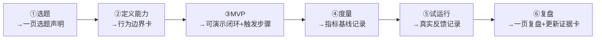

# 新项目选题池与落地清单（重写版）

> [!abstract] 本文要练成的能力
> 用**选题评估表**判断一个新项目"值不值得做、或者为什么不做"，并用一张**每步都有可交付产出**的落地清单，把它从需求推到可讲的上线/演示版本。它服务于能级 3「落地交付」——新项目是为了**补作品集缺口**，不是"多做一件事又做不完"。
>
> 前提铁律：**先问"作品集现在的缺口是什么"**，只有现有三个存量项目（知微/Skill/InterviewPrep）覆盖不了某求职方向时才开新项目。否则，回到 [[05-产品与开发/AI产品经理学习路径/04-实战落地/02_存量作品盘点：把已有的变成作品集]] 打磨存量，性价比更高。

---

## D1 实操与模板：选题评估表 + 落地清单

### 1. 选题评估表（每一行打 1-5 分，填完取决策）

| 评估维度 | 1 分（别做） | 3 分（可考虑） | 5 分（值得做） | 本轮候选打分 |
|---------|-----------|--------------|--------------|:---:|
| **痛点真实度** | 自认的需求 | 观察到的痛点 | 有真实用户表达过/给过反馈 | |
| **AI 价值密度** | 换个人做也行 | AI 明显增量 | AI 不可替代（生成/理解/检索） | |
| **能力边界可判断** | 说不清 AI 强项在哪 | 大致知道边界 | 能划定"哪用AI/哪人审/兜底" | |
| **可量化** | 讲不出指标 | 有中间指标 | 有 before→after 主指标 | |
| **1-2 周能否出 MVP** | 明显超期 | 需妥协 | 能剪到最短闭环 | |
| **岗位匹配度** | 与求职方向无关 | 沾边 | 直接加码主打方向（如 HR 垂直） | |
| **展示性** | 只能纯讲 | 有截图 | 有可访问演示/链接/真实用户 | |
| **复用好资产** | 全新重来 | 部分复用 | 复用知微知识库方法论/Skill 骨架 | |
| **总分（满分40）** | | | | |

**决策规则（填完即用）：**
- **总分 ≥ 28，且"1-2 周出 MVP" ≥ 4** → 可以做；
- **总分 20-27** → 只做"削弱版 MVP"（砍到最核心一个环节）；
- **总分 < 20，或"AI价值密度" ≤ 2** → 不做/换题，回去打磨存量。

> 复用项加分不是巧合：能复用的新项目 = 做得快 + 能讲"方法可迁移"，这正是你作品集最强的叙事，优先级天然更高。

### 2. 落地清单：每一步的**可交付产出**

| 步骤 | PM 动作 | **这一步的可交付产出（验收物）** |
|------|--------|------------------------------|
| ① 选题 | 场景真实、问题清晰、AI 有价值 | **《一页选题声明》**：用户/痛点/为什么是现在/AI 在哪一环/主指标，各 2-3 句 |
| ② 定义能力 | 明确"AI 要做什么、什么叫好、错误容忍" | **《行为边界卡》**：AI 做什么 / 什么叫好（输出定义）/ 错误容忍度 / 兜底方式 |
| ③ MVP | 用现成接口最短路径跑通 | **可演示的最小闭环 + 触发步骤**（别人按步骤能复现的演示路径，不是堆功能） |
| ④ 度量 | 定指标、测一次 | **《指标基线记录》**：before 基线 + 首测数字 + 口径说明 |
| ⑤ 试运行 | 收集少量真实反馈（哪怕 1 个真实同学/同事） | **《真实反馈记录表》**：谁/在什么场景/反馈了啥/验证了哪条假设 |
| ⑥ 复盘 | 沉淀项目故事，更新作品集 | **《一页复盘》**（坑/兜底/重来怎么改）+ 更新后的「作品集证据卡」 |

> 每步都可交付产出，是为了**防止"做得差不多就停"**。走到第 ⑤ 步至少拿到 1 个真实反馈，才算"能讲"——纯 demo 没有试运行反馈，故事就缺了真实感。

### 3. 一个示例：用评估表走一遍「HR 场景智能面试助手」

（展示怎么打分、怎么落到可交付产出）

- 痛点真实度：5（你 HR 背景 + 求职者在"面试官视角押题"上真实付费意愿，InterviewPrep 已验证。）
- AI 价值密度：5（解析 JD、生成考题、模拟面试官——生成/理解型，AI 天然匹配。）
- 能力边界可判断：4（定位"辅助押题与反馈"，最终决策仍人评。）
- 可量化：5（押题命中率、反馈条数、使用时长。）
- 1-2 周出 MVP：4（复用 InterviewPrep 的闭环与 7 供应商骨架。）
- 岗位匹配度：5（HR 垂直 + AI 面试，直接指向主打方向。）
- 展示性：4（可复用 Web/Electron，可现场演示。）
- 复用好资产：5（直接复用 InterviewPrep 的知识库/闭环方法论。）
- **总分 37 → 值得做**，选"削弱版 MVP"（只留"岗位分析→AI 押题→五维反馈"一个核心环节）先行验证。

---

## 新项目选题池（按求职价值排序）

| 选题方向 | 为什么适合 | 难度 | 复用好资产？ | 求职信号 |
|---------|-----------|:---:|:---:|---------|
| **HR场景智能面试助手** | 你的 HR 优势 + 面试高频场景，可直接复用 InterviewPrep 闭环 | 中 | ★★★★★ | 垂直 + AI 产品 + 复用 |
| **知识库问答升级版** | 在知微 RAG 上加实时/多模态/多来源 | 中 | ★★★★★ | 技术深度 + 架构 |
| **企业内部 AI Agent** | 体现 Agent 编排（把 Skill 升级为会拆步调工具的 Agent） | 中高 | ★★★★（Skill 骨架） | 前沿 + 编排 |
| **AI 周报/数据分析助手** | 办公效率场景，易量化（承接你周报 Skill 经验） | 低中 | ★★★★ | 效率工具 |
| **AI 面试复盘工具** | 面试本身，迭代反馈闭环 | 低中 | ★★★ | 产品思维 |

> 共同排序逻辑：**复用越多 + 越贴合 HR 垂直 + 越容易在 1-2 周出 MVP**，排越前。求职冲刺期做新项目，"小而完整"（1 个核心场景、1-2 周能出可用版本）远好于"大而未完"。

---

## D2 深度洞察：选题与落地的权衡和坑

- **权衡："开新项目" vs "打磨存量"**：因为面试冲刺期时间有限，而存量已可讲、新项目有"做不完变半成品"的交付风险（半成品是负资产，面试反而扣分），所以决策规则是：**只有当代作品集的 3 件套覆盖不了某一个求职方向时，才开新项目补缺口**。这与"相比新项目更优先打磨磨存量"一脉相承。
- **反例坑 ①：为了"多一个作品"而开新项目**。作品集的价值在质量不在数量（见 [[05-产品与开发/AI产品经理学习路径/04-实战落地/01_作品集构成与项目故事框架]]），半途而废的项目比没有还糟。因为"数量焦虑"会稀释你打磨代表作的时间，所以先想清楚"缺哪个补哪个"，再决定做不做。
- **反例坑 ②：选"炫技但没法量化"的选题**（如纯模型参数调优）。因为求职要的是**业务价值证据**不是技术秀，所以任何选题都要能落到 before→after 指标；量化不了的选题，即使技术炫也不值得入职冲刺期投入。
- **反例坑 ③：落地清单走不完（卡在 MVP）**。单人项目最大风险是沉溺于"把功能做全"。因为越做越深越难停，所以强制用"每步一个可交付产出"验收，尤其第 ③ 步只允许做可演示的最小闭环。走到 1-2 周没通 < 这是砍范围做削弱版 MVP 的信号。
- **洞察（能级 3 关键）**：新项目最大的价值不是"新增一个作品"，而是**证明你的方法可迁移**——把知微的知识库方法论、Skill 的团队化经验、InterviewPrep 的闭环叙事，搬到一个新场景还能跑通。因为可迁移性正是能级 3「落地交付」能级 4「算价值」的分水岭：只会在一个场景落地是手艺，跨场景能落地才是方法。

---

## D3 主线衔接

- **与能级 3「落地交付」的关系**：新项目落地清单本质是"把需求→可用闭环"的完整一关，每一步的可交付产出就是落地交付的验收点。
- **衔接能级 4（商业/战略）**：落地清单第 ⑤ 步的"真实反馈"和第 ⑥ 步的"一页复盘"直接通向"价值验证"——有真实反馈才能谈"这是不是值得做的生意"。能带着验证数据进入下一轮迭代的产品，才是能级 4 的素材。
- **技术衔接**：落到具体实现，见 [[05-产品与开发/AI驱动Web应用开发/00_MOC_AI驱动Web应用开发中枢]] 与 [[01-AI技术/Skill制作痛点/00_MOC_Skill制作痛点中枢]]。

---

## D4 资源与练习

**看什么**（关键词检索）：
| 关键词 | 解决什么 |
|--------|---------|
| 独立开发者 最小可行产品 MVP | 怎么剪最短闭环 |
| AI 产品 0到1 案例复盘 | 参考别人怎么选题与落地 |
| RAG 知识库 产品升级 多模态 | 知识库问答升级方向 |
| Agent 编排 Agent 产品 落地 | 把 Skill 升级为 Agent 的方向 |

**练什么（可自测）**：
1. 用评估表给选题池里 2 个候选各打一轮分，并写出总分与取舍理由。
2. 挑 1 个候选，写下《一页选题声明》和《行为边界卡》两件交付物。
3. 规划"削弱版 MVP"：砍到只剩一个可演示环节，并列出触发步骤。

**怎么算会（达标判据）**：
- [ ] 能对着任意选题，2 分钟打分并说清"做几周、能不能做、复用什么"
- [ ] 落地清单每一步都有对应"可交付产出"，而不是只写了动作
- [ ] 明确知道"新项目与存量打磨"的取舍边界（缺啥补啥，不盲目新增）

---

## 练什么（可自测）

- [ ] 用评估表对"HR 智能面试助手"打一次分，验证得分与我给的 37 是否一致，并说明差异
- [ ] 写出 2 个候选的《一页选题声明》+《行为边界卡》
- [ ] 为所选新项目规划削弱版 MVP，列出触发步骤与 1 个验收点
- [ ] 明确写出：什么时候该做新项目，什么时候该去打磨存量

---

- 打磨存量（更优先）：[[05-产品与开发/AI产品经理学习路径/04-实战落地/02_存量作品盘点：把已有的变成作品集]]
- 讲故事框架：[[05-产品与开发/AI产品经理学习路径/04-实战落地/01_作品集构成与项目故事框架]]
- 回到 [[05-产品与开发/AI产品经理学习路径/04-实战落地/00_MOC_实战项目库中枢]]