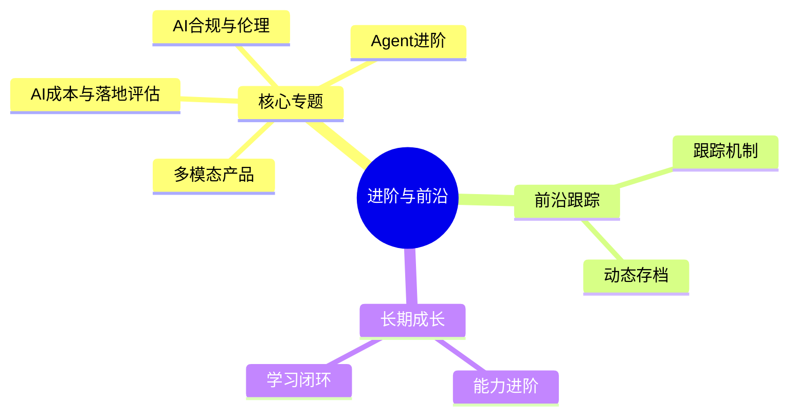

# 进阶专题与前沿跟踪中枢

> [!abstract] 本子库目的
> 支持**长期成长**：在入门求职之上持续进阶。聚焦"多模态、成本与落地、合规伦理、Agent进阶"等专题，并建立**可持续更新的前沿跟踪机制**，避免知识过时。

---

## 一、本子库结构

### 文档规划

| 文档 | 核心问题 | 状态 |
|------|---------|------|
| 01_关键进阶专题：多模态/成本/合规 | 资深 AI PM 要懂什么 | 本文档 |
| 02_前沿跟踪机制 | 怎么长期跟上 AI 变化 | 本文档 |
| 03_从求职到长期成长 | 入职后怎么继续进阶 | 本文档 |
| 06_小红书行业洞察与前沿情报 | 2026 行业真实水位 + 前沿词汇快照 | 本文档 |

---

## 二、与其它层衔接

> - 伦理深度：[[02-AI趋势与素养/AI伦理与治理/00_MOC_AI伦理与治理中枢]]
> - 方法论基础：[[05-产品与开发/AI产品经理方法论/00_MOC_AI产品经理方法论中枢]]
> - 学习闭环：[[05-产品与开发/AI产品经理学习路径/01-认知启蒙/04_学习闭环与全面发展]]

---

## 版本历史

| 版本 | 日期 | 更新内容 |
|------|------|----------|
| v0.1 | 2026-08-20 | 初始中枢 + 内容 |