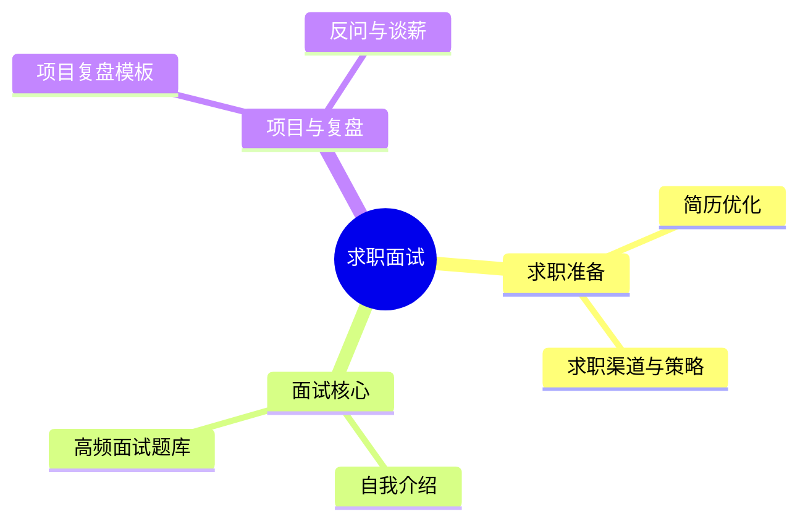

# 求职与面试演练中枢

> [!abstract] 本子库目的
> **把实力转化为 Offer。** 覆盖求职全流程：简历、自我介绍、高频面试题、项目复盘、谈薪。求职为导向的出口库，直接可执行。

---

## 一、核心目标

> 进入面试 80% 高频题都能应对；简历与自我介绍能突出"垂直 + AI + 落地"主线；谈薪有据。

---

## 二、子库结构

### 文档规划

| 文档 | 核心问题 | 状态 |
|------|---------|------|
| 01_简历与求职策略 | 简历怎么改、投到哪里 | 本文档 |
| 02_自我介绍与项目复盘 | 30秒/60秒怎么讲、项目怎么复 | 本文档 |
| 03_高频面试题库与答题框架 | 常问什么、怎么答 | 本文档 |
| 04_反问与谈薪 | 如何问、如何谈 | 本文档 |
| 05_小红书真实面经与高频问题库 | 2026 面试官现在问什么（真实题源） | 本文档 |
| 06_小红书行业洞察与前沿情报 | AI PM 值不值得做、前沿词汇 | 本文档 |

---

## 三、与已有资产衔接

- 面试经历：面试经历深挖（目录待建，暂无索引）
- 作品弹药：[[05-产品与开发/AI产品经理学习路径/04-实战落地/00_MOC_实战项目库中枢]]
- 校招测评面试：[[03-HR人事/校招测评/00_MOC_校招测评中枢]]

---

## 版本历史

| 版本 | 日期 | 更新内容 |
|------|------|----------|
| v0.1 | 2026-08-20 | 初始中枢 + 内容 |