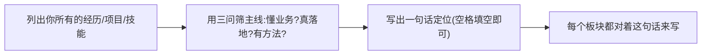

---
title: "简历与求职策略（重写版）"
aliases:
  - 简历改写方法
  - 求职渠道节奏
tags:
  - 简历
  - 求职策略
  - AI产品经理
  - 求职面试
created: 2026-08-20
status: "active"
---

# 简历与求职策略（重写版）

> [!abstract] 本文要练成的能力
> 不是"知道简历要怎么写"，而是**能把自己的真实经历改写成一页能通过 ATS 初筛、又能在 30 秒内让面试官读出"垂直 + AI + 落地"主线的高分简历**，并建立一套有序不焦虑的投递节奏。这是能级4"商业·进阶"里"把变现走通"的第一步。

---

## 一、主线提炼：简历先定"一句话定位"，再写板块

> 简历最常见的失败不是写得差，而是**没有主线**——面试官看完不知道"你是谁、为什么是你"。先在你脑子里定死一句话，所有板块都服务这句话。

### 你的主线（照抄可直接用）

> **"深耕 HR 场景三年产品化理解的 AI 产品经理——独立把 AI 能力翻译成 HR/组织 业务价值并量化交付，具备完整从 0 到 1 的 AI 产品体验（RAG 问答、企业级 Skill、独立 Web 产品）。"**

> 这一句同时回答三个问题——懂业务（HR）、真落地（已做）、有方法（完整）：就是能级0-4 累积起来的能力浓缩。

### 主线提炼的三步法（每份简历都走一遍）



**三问判据（来自 [[05-产品与开发/AI产品经理学习路径/01-认知启蒙/04_我的优势盘点与定位]]）**：你的每一段经历，至少要能证明"懂业务"或"真落地"或"有方法"中的任何一问；三段共同拼成完整主线。

> [!warning] 深度洞察·坑
> 反例：把"我做过视频剪辑、考过证、做过社群运营"全铺上去。**每个与主线无关的板块都在稀释主线**，让 HR 看不出你是 HR-Tech AI PM。原则是**宁可砍，不可乱**——与主线无关的删掉或压缩成一行"个人特质"。

---

## 二、每个板块怎么写（含可直接填的模板）

### 1. 头图 / 基本信息
- 姓名、手机、邮箱、城市、求职意向（写"AI 产品经理（HR/组织场景）"而不是泛泛"产品经理"）
- **GitHub / 作品集链接单独放一行**（一行就够，别占用空间）

### 2. 核心技能（关键词应答 ATS）
> 现在的简历常被 ATS/HR 用关键词初筛。**在技能区植入岗位 JD 里的词**，但要诚实到"能解释"。

```
技能模板（照抄，替换性能level）:
- 产品方法论：需求定义 / 能力和场景 / 迭代度量 / 用户研究（JTBD）
- AI 技术判断：LLM 能力边界 / RAG 检索问答 / Agent 编排 / Prompt 产品化 / 幻觉兜底
- AI 落地工具：Dify / 7 家多供应商路由 / Node.js+Electron / GitHub Actions
- 领域：HR 制度 / 招聘流程 / 组织与提效 / 数据合规
```

> 注意区分**"能理解/判断"**（管理岗写法）与 **"精通"**。AI PM 面试官更信"我判断过某某场景能不能用 AI"，而不是"我精通深度学习"。所以技能里写"理解能力边界、做过 RAG"比"精通 NLP"可信也合适。

### 3. 项目经验：用"一句话定位 + 3 点量化"格式（最强）
> 项目是你简历最重的一块，直接用你三份故事卡淬炼（详见 [[05-产品与开发/AI产品经理学习路径/04-实战落地/04_三个存量项目面试故事卡]]，这里不重复全文，只给"简历版压缩语法"）。

**每段项目 = 一句话定位（做了什么 + 解决什么痛点 + 里程碑） + 项目角色 + 3 条量化成果。**

模板（直接填，知微项目示范）：
```
知微 · HR制度问答机器人（RAG + 多LLM链）
定位：覆盖百余名HR的制度问答机器人，把制度查询从分钟级压到秒级。
角色：独立主导根因诊断 / 架构重构 / 知识库升级（从需求到运维全流程）。
结果：
  - 制度查询：分钟级 → 秒级
  - 编造率（幻觉）：从反复出错降到极低（拆链路 + 依据片段兜底）
  - 知识库升级为"关键词→场景→制度"闭环，沉淀为团队复用标准范式
```

> [!note] 量化结果怎么填（D2 关键方法）
> 不是"结果 = 数字"，而是**"基线 → 改变 → 单位 → 意义"四段**：
> - 基线（改了之前多差）："制度查询靠翻文档/问同事，分钟级"
> - 改变（我带来什么）："拆成四条链路 + 依据片段兜底"
> - 单位/数值（可验证）："分钟级→秒级；覆盖百余名 HR"
> - 意义（为什么了不起）："编造对制度类回答是致命问题，比没人答更严重"
>
> 反例：只写"提升了准确率"（没基线没数值）、只写"负责机器人"（没角色没结果）。**四个里面至少有三个元素，这条成果才算写得实。**

**三项目简历压缩对照（拿去抄，细节用于面试，简历保留一行要点）：**

| 项目 | 简历一句话 | 最硬 1 条量化 |
|------|-----------|--------------|
| 知微HR机器人 | RAG制度问答 + 链路重构 | 分钟级→秒级、编造率↓ |
| Skill四连发 | 4款 HR 提效 Skill | 建群 4 分钟→1 分钟 |
| InterviewPrep | 0到1 独立 AI 面试产品 | 16 模块、7 供应商、准备度评分 |

### 4. 工作经历（如有实习/正式经历）
- 用同款"定位+角色+量化"，写 HR COE 相关经历（你理解 HR 制度、写过舆情、拆过表、配过 Dify 自动化）。
- **即使是实习/校园，也按"做了事、带数字"写**，别只写职位名。

### 5. 个人特质（1 行足矣）
- "AI 产品经理认知里融入了数字化伦理意识与本分"这类一句话，呼应 HR-AI 的差异化。

---

## 三、求职渠道与节奏（含"投递漏斗"）

### 渠道排序（你这种"垂直 + AI + 落地"候选最有效）

| 渠道 | 用法 | 优先级 | 说明 |
|------|------|:---:|------|
| **内推** | 找校友/前同事/脉脉 AI 产品经理内推 | ★★★ | 绕过 ATS，直通面试，对你最省力 |
| **Boss/猎聘** | 投"AI产品经理""HR-Tech""Copilot产品""AI应用产品" | ★★★ | 关键词要含"AI"+"HR/办公协作" |
| **垂直社区/星球** | HR科技、AI PM、独立开发者社群发布作品/自荐 | ★★ | 能制造"被看到"，尤其 InterviewPrep 是现成名片 |
| **作品展示** | GitHub + 产品 Demo 链接放进简历与个人页 | ★★ | 用 InterviewPrep 当敲门砖 |
| 内推论坛/即刻 | AI产品方向招聘帖 | ★ | 关注存量补给 |

### 投递节奏（避免"投了但讲不清"）

> 节奏关键：**先磨弹药，再开火。** 投递不是越多越好，是"投出即能讲清"。

1. **第 1 周（弹药期，不出手）**：定位主线 → 改 3 段项目为上述格式 → 写自我介绍两版（见02）→ 准备 3 个反问。
2. **第 2-3 周（定向期）**：锁 20-30 家目标公司（HR软件、企业服务、AI Copilot、办公协作）+ 每家公司 1 句"他们 AI 在做什么"。
3. **第 4 周起（放出期）**：分批投，10 家/批；拿到反馈即复盘简历哪里被打回。

> [!warning] 深度洞察·坑
> 反例：一上来海投 200 家，面了三家就乱了——自我介绍和项目故事还没定型。**先定向磨 5 个代表性岗位的"精准投递 + 精准故事"，验证主线站得住，再放量。** 因为任何一段失败都在给你信号：是简历问题，是匹配度问题，还是能力问题，分开诊断。

---

## 四、资源与练习（D4）

### 看什么（用关键词搜，不臆造 URL）
- 关键词：AI产品经理岗位JD拆解（看 5 个不同公司 HR-Tech 岗，提取共性关键词）
- 关键词：简历 ATS 关键词 / 一页简历排版
- 关键词：AI产品经理面经 / HR科技产品求职
- 上手：把你自己简历丢进一个 ATS 解析工具看能否正确抓取（验证"垂直"词命中了）

### 练什么（可自测）
- [ ] 完成上面模板，把三个项目都写成"定位+角色+量化"格式
- [ ] 找 5 个真实 HR-Tech AI PM JD，归纳 10 个高频关键词，回填进你的技能区
- [ ] 写出一句话定位（能用 30 秒讲清，且能对应到至少一个项目）
- [ ] 设 20 家目标公司名单 + 每家一句"他们 AI 在做什么"

### 过关判据（能级4 · 简历出口）
> - [ ] 一页内，无与你主线无关的整块经历
> - [ ] 每个项目都有"基线→改变→数值→意义"四要素中至少三个
> - [ ] 技能区能命中目标岗位 JD 关键词，且每条你都能口述一段对应项目
> - [ ] 有明确的 20 家定向名单，而非海投无脑

---

## 练什么（可自测）

再来一遍清单快检：
- 我的主线一句话是什么？能对应哪个项目？
- 我的三个项目，各自最硬的一条量化是"基线→改变→数值→意义"齐的吗？
- 我手上有没有 20 家"我说得出他们在做什么"的目标公司？

如果都能答，进入自我介绍打磨：[[05-产品与开发/AI产品经理学习路径/05-进阶出口/02_自我介绍与项目复盘]]

---

- 回到 [[05-产品与开发/AI产品经理学习路径/05-进阶出口/00_MOC_求职面试中枢]]
- 主线溯源：[[05-产品与开发/AI产品经理学习路径/01-认知启蒙/04_我的优势盘点与定位]]