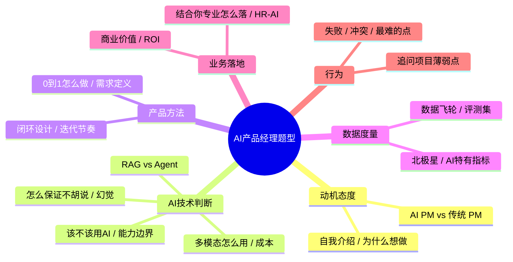

# 高频面试题库与答题框架（框架+表格版）

> [!abstract] 本文要练成的能力
> 不是"存一堆题目"，而是**分类掌握 AI 产品经理面试的高频题型 + 每个题型一套可复用框架 + 结合你真实案例的答题要点表**。面试时"会用框架 + 有个人案例"远胜"背标准答"。

> [!note] 使用说明
> 每道题给的是**答题要点表**（结构段 → 关键词触发点 → 可引案例/数字），不是成稿。**背结构不背句**：记住关键词，用自己的话展开。配合 [[05-产品与开发/AI产品经理学习路径/04-实战落地/04_三个存量项目面试故事卡]] 的项目素材使用。

---

## 一、题型地图（先看全局）

> 六大类覆盖沙面。真正稀缺的是**每一类你能落到自己的项目与案例**，而不是背定义。

---

## 二、三个万能框架（贯穿所有题型）

### 框架①：STAR + 能力边界（讲项目用）
**背景/痛点 → 我的方案（含为什么用/不用 AI）→ 指标/结果 → 反思兜底。**
> 几乎所有"讲讲这件事"都用它。你的三项目故事卡就是现成 STAR。

### 框架②：AI 能力边界判断（判该不该用 AI 用）
**复现自 [[05-产品与开发/AI产品经理学习路径/02-技术底座/03_能力边界判断：一个需求该不该用AI]]**：
> 任务是否需要生成/理解 → 对错误的容忍度（幻觉致命吗）→ 是否有可兜底方案 → 成本 ROI 是否成立。
> 你开口先说"我先判断边界，再决定方案"——这句话本身就是加分。

### 框架③：生命周期展开（讲 0 到 1 / 产品设计用）
**机会 → 需求 → 设计（P0/P1/P2）→ 度量 → 迭代。**
> 与你的 InterviewPrep"机会→需求→闭环→分阶段交付→度量"完全同构，直接背你自己的例。

---

## 三、分类题库 + 答题要点表（每类先框架后要点）

### A. 动机 / 态度类

**A1· 为什么想做 AI 产品经理？（必考）**
- 框架：动机（我的经历）→ 匹配（我有 AI 落地）→ 差异化（市场缺 HR-Tech AI PM）。

| 结构段 | 关键词触发点 | 可引案例/数字 |
|--------|------------|--------------|
| 动机 | HR背景 → COE → 被要求用 AI 提效 → 第一次意识到 AI 能把重复劳动变团队工具 | -- |
| 匹配 | 落地 RAG 机器人 + 四款 Skill → AI 从"概念"变"同事在用的工具" | 知微 / Skill四连发 |
| 差异化 | 市场缺"懂业务 + 能落地"的 HR-Tech AI PM | 这个缺位正是我的位置 |

**A2· AI PM 和传统 PM 的区别？（高频）**
- 框架：两条本质差异，配你的实践。

| 差异维度 | 传统 PM | AI PM | 你的案例 |
|---------|--------|-------|---------|
| 输出的确定性 | 确定的功能 | 概率性的能力（会胡说、会波动） | 知微解决编造 |
| 迭代单位 | 版本 | 数据 + 评测 + Prompt 的持续进化 | 周复盘 + 错题集 + 评测集迭代知微 |

**A3· 30 秒/60 秒自我介绍** ✓ → 见 [[05-产品与开发/AI产品经理学习路径/05-进阶出口/02_自我介绍与项目复盘]]（不重复）。

---

### B. AI 技术判断类（最拉分，取决于你真的懂）

**B1· 一个场景该不该用 AI？（下转场必备）**
- 框架：能力边界四步（见框架②）。

| 判断步 | 关键词触发点 | 正例（Skill拉群） | 反例（合规录用） |
|--------|------------|-----------------|----------------|
| ①要生成/理解吗 | 任务是否生成/理解 | 是（话术生成） | 是 |
| ②错一次疼吗 | 错误容忍度 | 不疼（有人工审核兜底） | 很疼（不能错 + 伦理风险） |
| ③有兜底吗 | 可兜底方案 | 有人工审核 | 不能让它拍板 |
| ④ROI 成立吗 | 成本收益 | 省时明确 | -- |
| **结论** | -- | **用 Skill** | **只做辅助、人审兜底** |

**B2· 模型会胡说（幻觉），你怎么让产品可靠？**
- 框架：承认编造是生成机制属性 → 我降低编造（依据片段/链路拆分）+ 提供兜底（出处、转人工）。

| 动作 | 具体做法 | 关键词 |
|------|---------|--------|
| 从根上降低 | 答案生成链路拆单一职责、只依据检索片段、给出处、不知道就明说 | 结构性压缩编造空间 |
| 给它兜底 | 超范围问题转人工、让用户知道哪里不能信 | 出处、转人工 |

> 完整过程见 [[05-产品与开发/AI产品经理学习路径/04-实战落地/04_三个存量项目面试故事卡]]（知微项目）。

**B3· RAG 和 Agent 何时各用哪个？**
- 框架：RAG 是"先查再答"，Agent 是"模型+计划+工具"。判断依任务：查资料回答→RAG；多步要调工具→Agent（要围栏）。

| 维度 | RAG | Agent |
|------|-----|-------|
| 本质 | 检索 + 依据作答 | 模型 + 计划 + 工具调用 |
| 适用 | 从资料里回答（知识问答） | 多步、调多个工具 |
| 特点 | 便宜、可控、幻觉低 | 需围栏（关键节点人工确认） |
| 你的案例 | 知微 | 跟进客户自动发提醒（假设场景） |

**B4· 多模态产品你会怎么判断值不值得做？**（进阶展示项）
- 框架：先判"多模态带来啥新价值" + 成本更高需 ROI + 输入输出边界/合规。

| 判断维度 | 关键词触发点 | 你的可引案例 |
|---------|------------|------------|
| 新价值 | 多模态带来啥新价值 | InterviewPrep 文字→五维雷达/热力图 |
| 成本 ROI | 成本更高需 ROI | 用 AI 生成成长勋章配图 |
| 边界/合规 | 输入输出边界/合规 | -- |

> 详见 [[05-产品与开发/AI产品经理学习路径/05-进阶出口/01_关键进阶专题：多模态-成本-合规]]。

---

### C. 产品方法类

**C1· 一个 AI 产品怎么从 0 到 1？**
- 框架：机会→需求→闭环设计→P0 交付→度量迭代。

| 阶段 | 关键词触发点 | 你的案例（InterviewPrep） |
|------|------------|--------------------------|
| 机会 | 求职者"猜不到会被问什么"、市面人工非标 | -- |
| 需求 | 收敛成"岗位分析→能力诊断→靶向练习→效果评估"闭环 | -- |
| 设计 | 16 模块按 P0/P1/P2 排 | 先让闭环转起来 |
| 度量 | 盯准备度 52→71 的证据 | 不堆功能 |
| 判据 | 先让闭环转起来，再让闭环转得深 | -- |

**C2· 你怎么定义需求 / 从功能到能力？**
- 框架：不列功能，定义"用户要做成什么能力/达成什么结果"。

| 对比 | 错误问法 | 正确问法 | 你的案例 |
|------|---------|---------|---------|
| 需求定义 | "要什么按钮" | "要达成什么结果" | 知微用户要"能确定地查到制度并敢信" |
| 产品取舍 | 堆聊天功能 | 解决可信度和编造 | -- |

> 方法底座见 [[05-产品与开发/AI产品经理方法论/02_AI产品的需求定义：从「功能」到「能力」]]。

---

### D. 数据 / 度量类

**D1· AI 产品的北极星 / 指标怎么定？**
- 框架：先定"产品要促成什么行为"，再定北极星 + AI 特有指标（幻觉率/命中率/置信）。

| 产品 | 北极星 | AI 特有指标 |
|------|--------|------------|
| 知微 | 有效且有依据的答案占比 | 命中率、编造率、人工转接率 |
| InterviewPrep | 准备度曲线 | 连续 21 天 52→71 |

**D2· 数据飞轮怎么建？**
- 框架：用户使用产生数据 → 数据改进模型/检索 → 更好体验带来更多使用。

| 环节 | 你的案例 |
|------|---------|
| 使用产生数据 | 拆合表 Skill：常规 AI 直出、特殊案例记录调试路径后复用 |
| 数据改进 | 知微周复盘 + 错题集回灌评测集，每轮更好 |
| 关键认知 | 飞轮关键不是"有数据"，是"有把使用反馈回灌到改进的机制" |

---

### E. 业务 / 复合类（你的亮眼题）

**E1· 结合你的专业，你会怎么做 HR-AI 产品？（别错过）**
- 框架：给场景 + 分"提效类 vs 决策类"两条 + 强调伦理人审。

| 类型 | 场景 | 原则 | 你的案例 |
|------|------|------|---------|
| 提效类 | 简历筛选、制度问答、招聘建群 | 规则明确、加人工审核 | 几款 Skill |
| 决策类 | 候选人评价、转岗建议 | AI 只能辅助、必须人审兜底、可解释与申诉 | 招聘偏见、算法降级风险 |

> 一句话分野：**提效放开、决策人审**。

**E2· 你的商业价值 / ROI 判断？**
- 框架：单次调用成本 × 用量 × 优化 → 商业模式是否成立。

| 步骤 | 关键词触发点 | 你的案例 |
|------|------------|---------|
| 算经济账 | 单次 token 成本 × 预期用量 | -- |
| 对照价值 | 省下的人工时间 / 带来的收入 | -- |
| 选型 | 最省维护架构 | 7 供应商按场景路由 + 冗余 |
| 上线前问 | 这块钱花得值不值、有没有回本路径 | -- |

---

### F. 行为类

**F1· 谈一个失败 / 最难的点**
- 框架：承认 + 根因 + 兜底 + 学到了什么。

| 结构段 | 关键词触发点 | 可引数字 |
|--------|------------|---------|
| 承认 | 知微上线 3 个月后开始编造制度 | -- |
| 根因 | 不是缺内容，是单条 LLM 链路过载 | -- |
| 兜底 | 错误分类统计定位、拆四条单一职责链路 | 编造率降到极低 |
| 学到 | 评估先行、每轮只改一处、用评测集说话 | -- |

---

## 四、答题的最大原则

> **别背标准答，用"框架 + 个人案例"答。** 因为每道题你都有现成的 HR / 机器人 / Skill / InterviewPrep 案例可接。面试官要的不是标准答案，是"这小子对 AI 真有判断力、真做出过东西"。

最高分打法：**先亮框架（证明会想），再落案例（证明做过），最后说边界（证明成熟）。**

---

## 五、资源与练习（D4）

### 看什么
- 关键词：AI产品经理 面经 / 面试题
- 关键词：HR-Tech / 企业AI 产品面试
- 关键词：行为面试 STAR 法 / 大厂产品面试

### 练什么（可自测）
- [ ] 把上面 12 题各准备一版"框架 + 你的案例"答案，录音 1 遍
- [ ] 挑 5 题让朋友/AI 随机问，现场只靠要点表答，找卡壳点
- [ ] 把 E1（HR-AI 产品）+ E2（ROI）+ B2（幻觉）三题练到"不用想就顺"

### 过关判据（能级4 · 面试出口）
> - [ ] 六大题型至少每题能说出"套哪个框架 + 我哪个项目可引"
> - [ ] 高频题（A1/A2/B1/B2/C1/E1）能不看稿、有数字、有案例地答
> - [ ] 追问（F1 类）能被当场接住，不反复念稿

---

## 练什么（可自测）

- 六大题型我都能说出"对应的框架 + 我的案例"吗？
- 3 个万能框架我遇到任何题能先抛出一个吗？
- E1/E2/B2 三题能无稿流畅答吗？

若达标，学会结尾与谈薪：[[05-产品与开发/AI产品经理学习路径/05-进阶出口/04_反问与谈薪]]

---

- 回到 [[05-产品与开发/AI产品经理学习路径/05-进阶出口/00_MOC_求职面试中枢]]
- 追问弹药扩展：[[05-产品与开发/AI产品经理学习路径/04-实战落地/05_面试追问弹药库]]
- 项目素材卡：[[05-产品与开发/AI产品经理学习路径/04-实战落地/04_三个存量项目面试故事卡]]
