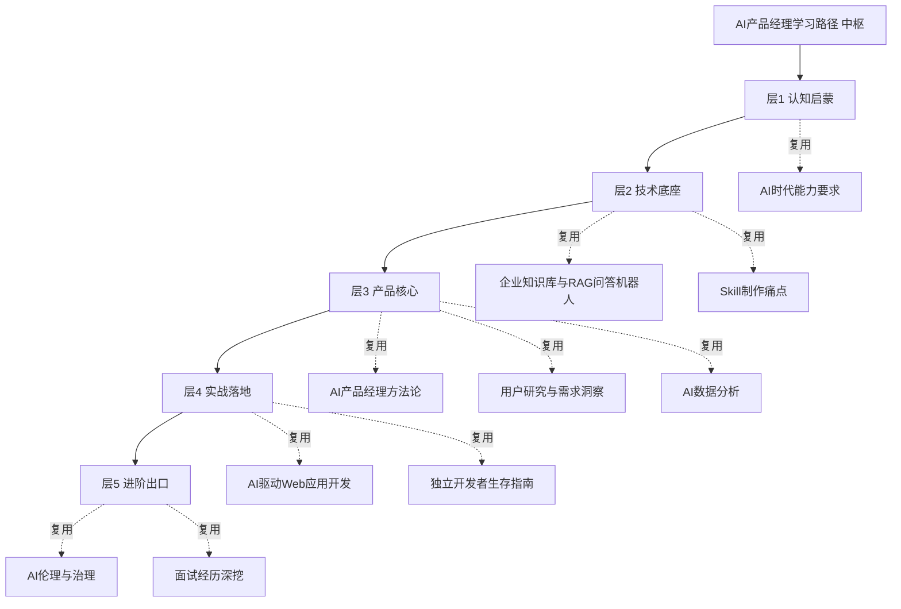

# "AI产品经理学习路径"知识库建设方案

> **文档类型**：建设方案（已确认 · 求职入行导向）
> **状态**：建设中
> **主题**：以"AI产品经理"为目标角色，规划一套**从入门到实战**的学习路径
> **核心导向**：**求职入行为主轴**，同时**补充能力全面发展**（作为长期成长底座，与求职主线并进）
> **定位**：区别于已有 [[05-产品与开发/AI产品经理方法论/00_MOC_AI产品经理方法论中枢]]（聚焦"方法"——怎么做AI产品），本路径知识库聚焦"**路径**"——**按什么顺序学、学哪些知识库、用哪些资源、达成什么里程碑**。两者互补：方法论给出"正确答案"，学习路径给出"到达路径"。

---

## 一、为什么需要这个知识库

### 1.1 痛点：知识散、路径乱、"不知道学什么"

你已经掌握了大量 AI 时代的零散能力：Skill 制作、RAG 问答机器人、Web 应用开发、数据策略、商业战略等。但面对"成为一名合格的 AI 产品经理"这个目标，存在三个问题：

1. **无主线**：知识分散在各分类（01~07），没有一条"AI PM 成长主线"把它们串起来
2. **无阶段**：不清楚学习应该分几个阶段、每个阶段先做什么后做什么、怎么验证自己学会了
3. **无出口**：学完不知道"哪一刻才算入门 / 进阶 / 胜任"，缺少成果物与里程碑

### 1.2 本知识库定位

**把"AI产品经理"这个目标，拆解成一条可执行、可验证、可持续更新的学习路径**：

- **分层**：按"认知 → 技术 → 产品 → 实战 → 进阶"五层组织，逐级递进
- **求职主线**：以"求职入行"为第一优先级，面试/作品集/案例复盘贯穿各层并加权
- **能力底座**：同步补充"沟通表达、商业判断、量化思维、行业认知"等全面发展能力，支撑长期成长而非只为一份工作
- **可检索**：每个阶段都有独立的知识库，需要时直达
- **可应用**：每个阶段配"成果物"与"里程碑"，学了就能验收
- **复用存量**：把已有知识库（AI PM 方法论、Web 开发、数据分析、用户研究等）作为各阶段"推荐阅读"，而非重复建设
- **补空白**：补齐"资源清单、就业/面试出口、持续进阶"等路径特有内容

---

## 二、学习路径整体架构

### 2.1 五层主线

```
AI产品经理学习路径（5 层 · 若干子知识库）
│
├── 层1 认知启蒙：AI产品经理的全景与心态（2个知识库）
│   ├── 01_AI产品经理职业全景：角色/行业/能力要求/前景
│   └── 02_学习心态与成长地图：如何高效学习这个领域
│
├── 层2 技术底座：读懂AI，不被"黑盒"吓住（3个知识库）
│   ├── 03_大模型原理与能力边界：LLM怎么工作、能做什么/不能做什么
│   ├── 04_关键AI关键技术栈：RAG/Agent/多模态/微调（PM视角够用即可）
│   └── 05_提示词与AI交互：Prompt工程的产品化视角
│
├── 层3 产品核心：会定义、会设计、会落地（复用+新建）
│   ├── 06_AI产品设计与交付（复用已有《AI产品经理方法论》）
│   ├── 07_用户研究与需求洞察（复用已有知识库）
│   └── 08_产品数据与效果度量（复用+衔接）
│
├── 层4 实战落地：从学到做（2个知识库）
│   ├── 09_AI产品实战项目库：真题/项目/作品集
│   ├── 10_行业AI产品地图：各行业×各场景的AI产品形态
│   └── （衔接《AI驱动Web应用开发》《独立开发者生存指南》）
│
└── 层5 进阶与出口：从新手到专家（2个知识库）
    ├── 11_求职与面试演练：AI PM 面试题/案例/谈薪
    └── 12_进阶专题与持续更新：多模态/成本/合规/前沿跟踪
```

### 2.2 设计原则

**原则一：路径为主，知识为纬**。不重复建设"怎么做产品"的内容，而是回答"该走到哪一步、看哪个知识库"。

**原则二：充分复用存量**。已有知识库作为各层"推荐阅读"，path 知识库只做"导航 + 增量补白"。

**原则三：每层有成果物**。每个阶段配一个可验收的产出（认知清单→技术 demo→产品方案→上线项目→面经复盘）。

**原则四：可持续更新**。设立"前沿跟踪"机制，AI 领域变化快，路径本身也需要版本化。

---

## 三、各知识库详细规划

### 层1 认知启蒙（2个推荐知识库）

| 知识库 | 核心内容 | 是否新建 |
|--------|---------|---------|
| 01_AI产品经理职业全景 | AI PM 是什么/与传统PM差异（衔接方法论01）、行业岗位分布、能力模型与招聘要求（衔接方法论08）、薪资与前景 | 新建 |
| 02_学习心态与成长地图 | 该领域学习方法论（衔接已有学习法）、成长路线图总览、学习资源总入口（书单/课程/社区） | 新建 |

**里程碑**：能说清"AI PM 和传统 PM 的三处不同 + 自己的 30 天学习计划"

### 层2 技术底座（3个推荐知识库）

| 知识库 | 核心内容 | 是否新建 |
|--------|---------|---------|
| 03_大模型原理与能力边界 | Transformer/Token/上下文机制、能力边界（幻觉/推理/多模态）、"差一点就能做"的判断力（衔接方法论01） | 新建 |
| 04_关键AI技术栈（PM视角） | RAG（衔接知识库与RAG机器人）、Agent、多模态、微调/提示工程差异——PM 只需会判断"什么场景用什么技术" | 新建 |
| 05_提示词与AI交互的产品化 | Prompt不是咒语而是产品交互；把提示词转化为产品功能与用户价值 | 新建 |

**里程碑**：能结合一个真实需求，判断"用 RAG 还是 Agent 还是不需要 AI"，并给出理由

### 层3 产品核心（复用 + 衔接）

| 知识库 | 核心内容 | 是否新建 |
|--------|---------|---------|
| 06_AI产品设计与交付 | 需求定义/体验设计/迭代/度量（完整方法论） | 复用已有《AI产品经理方法论》 |
| 07_用户研究与需求洞察 | 理解用户、发现痛点、验证需求 | 复用已有《用户研究与需求洞察》 |
| 08_产品数据与效果度量 | 数据策略、AI特有指标、北极星指标 | 复用+衔接已有《AI数据分析》 |

**里程碑**：独立完成一份 AI 产品需求文档（PRD），包含 AI 能力边界与错误容错设计

### 层4 实战落地（2个推荐知识库）

| 知识库 | 核心内容 | 是否新建 |
|--------|---------|---------|
| 09_AI产品实战项目库 | 项目选题池、实战拆解、作品集沉淀（衔接你已做的 Skill/RAG 机器人/Web 应用） | 新建（核心） |
| 10_行业AI产品地图 | 教育/电商/HR/金融/医疗等行业 × 客服/分析/创作/助手等场景的产品形态 | 新建（补充） |

**里程碑**：上线一个带真实用户反馈的 AI 产品（或完成一个可展示的项目作品）

### 层5 进阶与出口（2个推荐知识库）

| 知识库 | 核心内容 | 是否新建 |
|--------|---------|---------|
| 11_求职与面试演练 | AI PM 面试题分类与答题框架、案例复盘、自我介绍与谈薪（衔接你的面试经历深挖） | 新建 |
| 12_进阶专题与前沿跟踪 | 多模态产品、AI成本与落地评估、合规与伦理（衔接AI伦理）、前沿动态速记 | 新建 |

**里程碑**：完成一次 AI PM 模拟面试复盘 + 一套可持续更新的前沿追踪机制

---

## 四、分层落地顺序（推荐实施节奏）

> **求职入行导向**下的推荐顺序：先立全线骨架，再按"作品 → 面试"双出口武装求职弹药。建议**按层分批建设**，每层建完即可用。

| 顺序 | 层 | 建议动作 | 优先级 |
|------|----|--------|--------|
| 第1步 | 层1 | 建"职业全景""成长地图"两库，先立主线 | P0 |
| 第2步 | 层2 | 建"大模型能力边界""技术栈判断"两库，打技术底 | P0 |
| 第3步 | 层4 | 建"实战项目库"，把已有作品沉淀成求职作品集 | P0 |
| 第4步 | 层3 | 复用已有方法论库，补导航页衔接 | P1 |
| 第5步 | 层5 | 建"求职面试""前沿跟踪"两库，形成出口与闭环 | P0/P1 |

> 求职导向下，层4（作品集）与层5（面试）是直接弹药，与层1/层2 的技术底同等优先。

---

## 五、与已有知识库的衔接关系



> 结论：学习路径知识库 = **各层"导航 + 增量"**，把散在 01~07 分类里的能力按"AI PM 成长主线"重新点亮，而非从零堆内容。真正**新增建设**的核心是：层1 两库、层2 两库、层4 两库、层5 两库，共 **8 个子知识库**（另有层2第5库"提示词产品化"并入技术栈作增补文档，不单独立库）。

---

## 六、已确认建设范围

1. **目标导向**：求职入行为主轴，能力全面发展为底座（已确认）
2. **建设范围**：新建 **8 个子知识库**，全量建设（已确认）
3. **目录归属**：统一放入 `05-产品与开发\AI产品经理学习路径\`（已确认）
4. **双出口武器**：层4 实战项目库（作品集）+ 层5 求职面试演练，作为求职弹药重点打磨

---

## 七、版本历史

| 版本 | 日期 | 更新内容 |
|------|------|----------|
| v0.1 | 2026-08-20 | 初稿：五层主线 + 12个子知识库规划 |