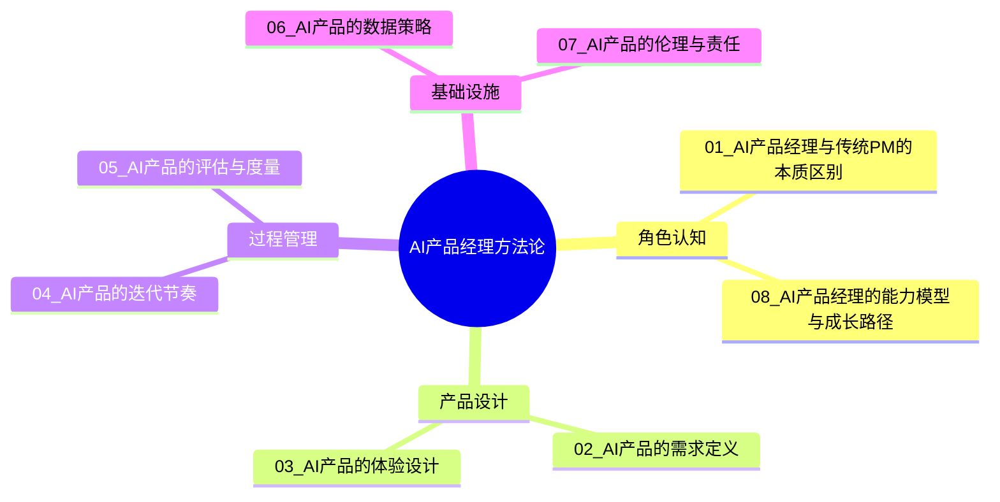
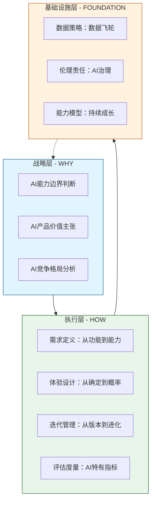
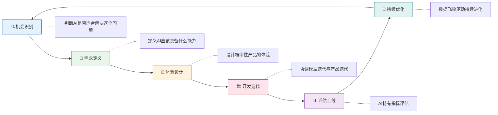
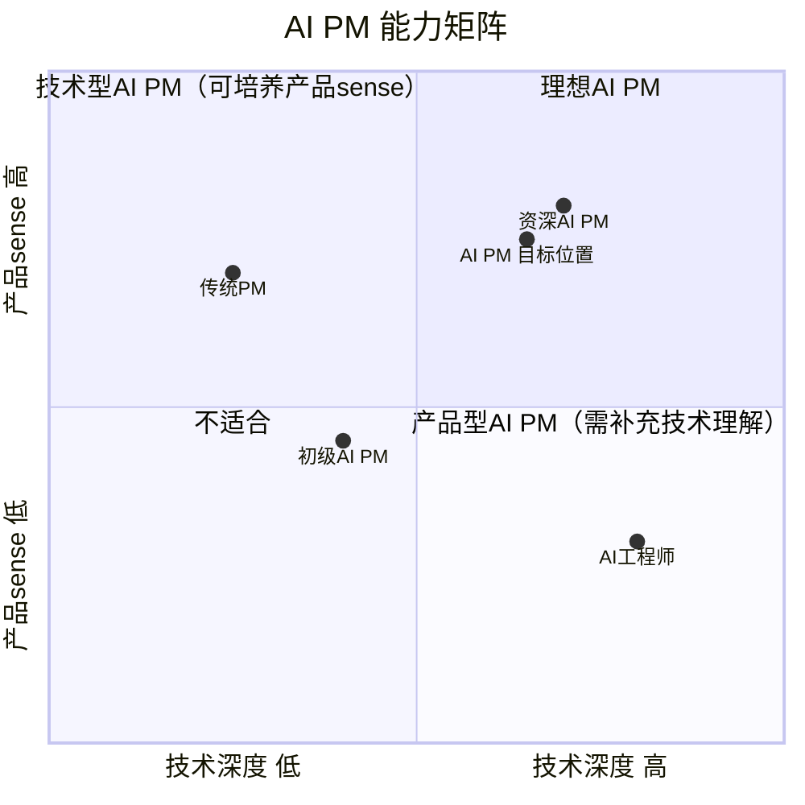
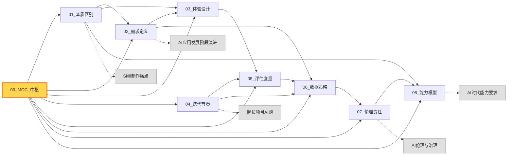
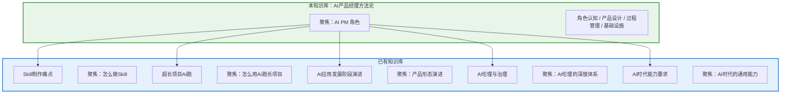

# AI产品经理方法论中枢

> [!abstract] 知识库定位
> 本知识库聚焦 **AI产品经理这个角色**：AI产品怎么定义、怎么设计、怎么迭代、怎么衡量。与已有知识库中 [[01-AI技术/Skill制作痛点/00_MOC_Skill制作痛点中枢]]（讲"怎么做Skill"）、[[01-AI技术/超长项目AI跑/超长项目AI跑_知识库建设方案]]（讲"怎么用AI跑长项目"）、[[02-AI趋势与素养/AI应用发展阶段演进/00_MOC_AI应用发展阶段演进中枢]]（讲"产品形态演进"）形成互补，本知识库从**角色视角**出发，回答"AI PM 到底需要什么不一样的能力"。

---

## 一、知识库结构总览



### 文档导航

| 序号 | 文档 | 核心问题 | 关键标签 |
|------|------|----------|----------|
| 01 | [[05-产品与开发/AI产品经理方法论/01_AI产品经理与传统PM的本质区别]] | AI PM 和传统 PM 到底有什么不同？ | #角色认知 #核心差异 #AI不确定性 |
| 02 | [[05-产品与开发/AI产品经理方法论/02_AI产品的需求定义：从「功能」到「能力」]] | AI产品的需求怎么写？ | #需求定义 #AI能力 #PRD |
| 03 | [[05-产品与开发/AI产品经理方法论/03_AI产品的体验设计：从「确定性」到「概率性」]] | 概率性产品的体验怎么设计？ | #体验设计 #不确定性 #容错 |
| 04 | [[05-产品与开发/AI产品经理方法论/04_AI产品的迭代节奏：从「版本」到「持续进化」]] | AI产品怎么迭代？ | #迭代管理 #模型升级 #持续进化 |
| 05 | [[05-产品与开发/AI产品经理方法论/05_AI产品的评估与度量]] | AI产品怎么衡量成功？ | #评估指标 #北极星指标 #AI度量 |
| 06 | [[05-产品与开发/AI产品经理方法论/06_AI产品的数据策略]] | AI产品的数据飞轮怎么建？ | #数据策略 #数据飞轮 #标注 |
| 07 | [[05-产品与开发/AI产品经理方法论/07_AI产品的伦理与责任]] | AI PM 的伦理责任是什么？ | #AI伦理 #偏见 #透明度 |
| 08 | [[05-产品与开发/AI产品经理方法论/08_AI产品经理的能力模型与成长路径]] | AI PM 需要什么能力？怎么成长？ | #能力模型 #成长路径 #招聘 |
| 09 | [[05-产品与开发/AI产品经理方法论/09_案例_InterviewPrep从0到1完整复盘]] | 一个AI产品怎么从0到1做出来？ | #实战案例 #InterviewPrep #从0到1 |

---

## 二、核心方法论框架

### 2.1 AI产品经理的"三层模型"



### 2.2 AI PM 的核心矛盾

> [!important] AI PM 需要面对的四对核心矛盾
>
> **1. 确定性 vs 概率性**
> 传统产品追求确定性输出，AI产品接受概率性输出。AI PM 需要在"不完美"中做产品决策。
> 详见 [[05-产品与开发/AI产品经理方法论/03_AI产品的体验设计：从「确定性」到「概率性」]]
>
> **2. 功能定义 vs 能力定义**
> 传统产品定义"做什么"，AI产品定义"具备什么能力"。AI PM 必须学会用"能力边界"而非"功能列表"来描述产品。
> 详见 [[05-产品与开发/AI产品经理方法论/02_AI产品的需求定义：从「功能」到「能力」]]
>
> **3. 版本迭代 vs 持续进化**
> AI产品的迭代不是"V1.0 -> V2.0"，而是模型持续升级 + 产品持续优化的双螺旋。
> 详见 [[05-产品与开发/AI产品经理方法论/04_AI产品的迭代节奏：从「版本」到「持续进化」]]
>
> **4. 技术深度 vs 产品广度**
> AI PM 不需要写代码，但必须理解AI能力边界——这是"翻译官"角色的核心。
> 详见 [[05-产品与开发/AI产品经理方法论/01_AI产品经理与传统PM的本质区别]] 和 [[05-产品与开发/AI产品经理方法论/08_AI产品经理的能力模型与成长路径]]

---

## 三、AI产品全生命周期管理



### 各阶段关键问题

#### 阶段一：机会识别
- 这个问题是否适合用AI解决？AI是不是最优解？
- 市场上有哪些竞品？它们的AI能力边界在哪里？
- 用户的核心痛点是什么？AI能带来什么增量价值？
- 关联：[[02-AI趋势与素养/AI应用发展阶段演进/00_MOC_AI应用发展阶段演进中枢]] 中的产品形态判断

#### 阶段二：需求定义
- AI产品的需求不是"功能列表"，而是"能力描述"
- 需要定义"什么是好的AI输出"——这是AI PRD最核心的部分
- 需要定义"错误"的容忍度——什么程度的错误是可以接受的？
- 详见 [[05-产品与开发/AI产品经理方法论/02_AI产品的需求定义：从「功能」到「能力」]]

#### 阶段三：体验设计
- 如何让用户信任一个概率性的AI系统？
- 当AI出错时，用户如何纠正？如何恢复？
- AI输出的"可编辑性"是体验设计的关键
- 详见 [[05-产品与开发/AI产品经理方法论/03_AI产品的体验设计：从「确定性」到「概率性」]]

#### 阶段四：开发迭代
- 模型迭代和产品迭代是两个独立的节奏，需要协调
- A/B测试在AI产品中有特殊性——模型版本A和B可能产生完全不同的用户体验
- 详见 [[05-产品与开发/AI产品经理方法论/04_AI产品的迭代节奏：从「版本」到「持续进化」]]

#### 阶段五：评估上线
- 传统指标（DAU、留存、收入） + AI特有指标（准确率、召回率、响应时间、用户满意度）
- AI产品的"北极星指标"如何设计？
- 详见 [[05-产品与开发/AI产品经理方法论/05_AI产品的评估与度量]]

#### 阶段六：持续优化
- 数据飞轮如何运转：用户使用 -> 产生数据 -> 优化模型 -> 更多用户
- 数据隐私与合规的平衡
- 详见 [[05-产品与开发/AI产品经理方法论/06_AI产品的数据策略]]

---

## 四、AI PM 能力矩阵



> [!tip] 能力解读
> AI PM 的能力要求不是"技术 + 产品"的简单叠加，而是**在AI能力边界上的产品判断力**。关键在于理解AI能做什么、不能做什么、以及"差一点就能做什么"。
> 详见 [[05-产品与开发/AI产品经理方法论/08_AI产品经理的能力模型与成长路径]]

---

## 五、知识关联图谱



---

## 六、阅读路径建议

### 路径一：从传统PM转型AI PM
适合：有传统产品经验，想转型AI领域的PM

```
[[05-产品与开发/AI产品经理方法论/01_AI产品经理与传统PM的本质区别]]
    -> [[02_AI产品的需求定义：从"功能"到"能力"]]
    -> [[03_AI产品的体验设计：从"确定性"到"概率性"]]
    -> [[05-产品与开发/AI产品经理方法论/08_AI产品经理的能力模型与成长路径]]
```

### 路径二：从零开始学AI PM
适合：刚入行或想入行AI产品的新人

```
[[05-产品与开发/AI产品经理方法论/08_AI产品经理的能力模型与成长路径]]
    -> [[05-产品与开发/AI产品经理方法论/01_AI产品经理与传统PM的本质区别]]
    -> [[02_AI产品的需求定义：从"功能"到"能力"]]
    -> [[05-产品与开发/AI产品经理方法论/05_AI产品的评估与度量]]
    -> [[05-产品与开发/AI产品经理方法论/06_AI产品的数据策略]]
```

### 路径三：AI产品负责人/管理者
适合：需要管理AI产品团队或制定AI产品策略的负责人

```
[[04_AI产品的迭代节奏：从"版本"到"持续进化"]]
    -> [[05-产品与开发/AI产品经理方法论/05_AI产品的评估与度量]]
    -> [[05-产品与开发/AI产品经理方法论/06_AI产品的数据策略]]
    -> [[05-产品与开发/AI产品经理方法论/07_AI产品的伦理与责任]]
    -> [[05-产品与开发/AI产品经理方法论/08_AI产品经理的能力模型与成长路径]]
```

### 路径四：AI产品深度思考者
适合：对AI产品方法论有深入思考需求的从业者

```
阅读全部文档，按编号顺序01-08
重点关注各文档之间的交叉引用和矛盾张力
```

---

## 七、关键概念速查

| 概念 | 定义 | 详细文档 |
|------|------|----------|
| **AI能力边界** | 模型在当前阶段能做什么、不能做什么、以及"差一点就能做什么"的边界线 | [[05-产品与开发/AI产品经理方法论/01_AI产品经理与传统PM的本质区别]] |
| **概率性体验** | AI产品的输出不是100%确定的，用户需要接受一定程度的"不确定性" | [[05-产品与开发/AI产品经理方法论/03_AI产品的体验设计：从「确定性」到「概率性」]] |
| **数据飞轮** | 用户使用 -> 产生数据 -> 优化模型 -> 更多用户 -> 更多数据的正向循环 | [[05-产品与开发/AI产品经理方法论/06_AI产品的数据策略]] |
| **AI PRD** | 不同于传统PRD，AI PRD定义"能力"而非"功能"，定义"好"的标准和"错误"的容忍度 | [[05-产品与开发/AI产品经理方法论/02_AI产品的需求定义：从「功能」到「能力」]] |
| **双螺旋迭代** | 模型迭代和产品迭代两个独立节奏的协调与同步 | [[05-产品与开发/AI产品经理方法论/04_AI产品的迭代节奏：从「版本」到「持续进化」]] |
| **TTL (Time to Love)** | 用户从开始使用AI产品到"爱上它"（体验到AI核心价值）的时间 | [[05-产品与开发/AI产品经理方法论/05_AI产品的评估与度量]] |
| **渐进式信任** | 让用户对AI系统的信任从低到高逐步建立的设计策略 | [[05-产品与开发/AI产品经理方法论/03_AI产品的体验设计：从「确定性」到「概率性」]] |
| **AI伦理实操** | AI PM 在偏见检测、透明度、可申诉性方面的具体责任 | [[05-产品与开发/AI产品经理方法论/07_AI产品的伦理与责任]] |

---

## 八、与已有知识库的互补关系



> [!note] 阅读建议
> - 如果你想知道 **AI产品形态怎么演进**，先看 [[02-AI趋势与素养/AI应用发展阶段演进/00_MOC_AI应用发展阶段演进中枢]]
> - 如果你想知道 **怎么用AI跑长项目**，先看 [[01-AI技术/超长项目AI跑/超长项目AI跑_知识库建设方案]]
> - 如果你想知道 **怎么做Skill**，先看 [[01-AI技术/Skill制作痛点/00_MOC_Skill制作痛点中枢]]
> - 如果你想知道 **AI伦理的深度体系**，先看 [[02-AI趋势与素养/AI伦理与治理/00_MOC_AI伦理与治理中枢]]
> - 如果你想知道 **AI时代需要什么能力**，先看 [[02-AI趋势与素养/AI时代能力要求/00_MOC_AI时代能力要求中枢]]
> - 如果你想知道 **AI PM 这个角色到底怎么做**，继续阅读本知识库

---

## 九、方法论核心原则

> [!summary] AI PM 十条核心原则
>
> 1. **AI不是万能药** —— 先判断问题是否适合用AI解决，而不是用AI解决所有问题
> 2. **能力边界 > 功能列表** —— AI产品的需求应该描述"具备什么能力"，而非"做什么功能"
> 3. **接受不确定性** —— AI产品的输出是概率性的，设计时要接受这一点
> 4. **数据是燃料** —— 没有数据策略的AI产品注定失败
> 5. **迭代是双螺旋** —— 模型迭代和产品迭代是两个独立但相互影响的节奏
> 6. **度量需要AI特有指标** —— 传统产品指标不够用，需要引入AI特有指标
> 7. **体验设计要"容错"** —— 好的AI产品体验不是"不出错"，而是"出错后优雅恢复"
> 8. **伦理是实操不是口号** —— AI PM 的伦理责任体现在每一次产品决策中
> 9. **技术理解不等于写代码** —— AI PM 需要理解AI能力边界，但不需要成为算法工程师
> 10. **持续学习是基本功** —— AI领域变化太快，AI PM 必须保持持续学习

---

## 十、版本历史与更新计划

| 版本 | 日期 | 更新内容 |
|------|------|----------|
| v1.0 | 2026-07-27 | 初始版本，包含MOC中枢 + 8篇内容文档 |

### 待更新内容
- [ ] 补充更多实际案例（国内外AI产品案例分析）
- [ ] 增加AI PM 面试题库
- [ ] 增加AI产品设计工具和模板
- [ ] 补充LLM时代的新变化（如Prompt Engineering对产品设计的影响）
- [ ] 增加AI产品的商业化模式分析

---

## 快速开始

如果你是第一次阅读这个知识库，建议从以下三个问题开始：

1. **AI PM 和传统 PM 到底有什么不同？** -> [[05-产品与开发/AI产品经理方法论/01_AI产品经理与传统PM的本质区别]]
2. **AI产品怎么设计？** -> [[05-产品与开发/AI产品经理方法论/02_AI产品的需求定义：从「功能」到「能力」]] + [[05-产品与开发/AI产品经理方法论/03_AI产品的体验设计：从「确定性」到「概率性」]]
3. **AI PM 需要什么能力？** -> [[05-产品与开发/AI产品经理方法论/08_AI产品经理的能力模型与成长路径]]

---

> [!quote] 写在最后
> AI产品经理不是一个"新岗位"，而是一个"新范式"。它要求我们重新思考产品的定义、设计、迭代和度量的方式。这个知识库的目标不是给出"标准答案"，而是提供一套**思考框架**——帮助你在AI产品这个充满不确定性的领域，找到自己的方法论。
>
> 正如 [[05-产品与开发/AI产品经理方法论/01_AI产品经理与传统PM的本质区别]] 中所说：AI PM 的核心价值，在于**把AI的能力边界翻译成产品价值**。