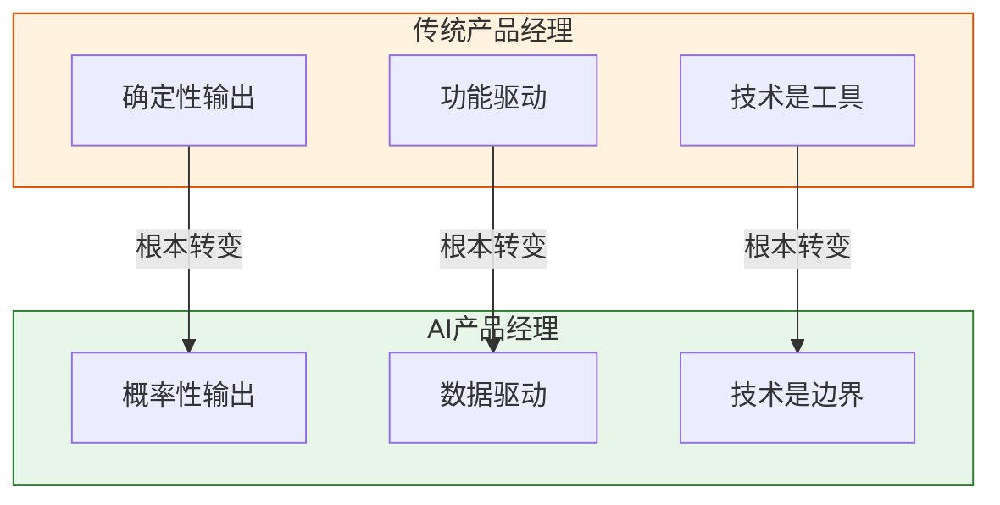
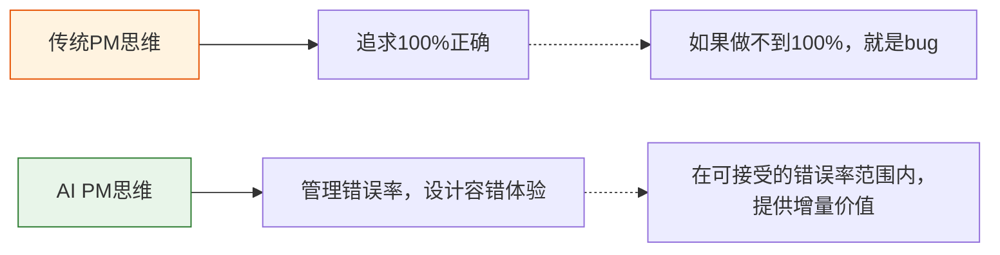
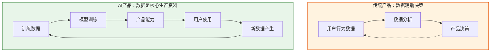
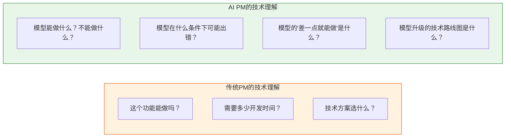
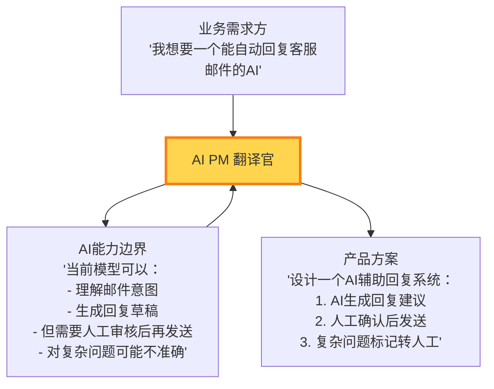
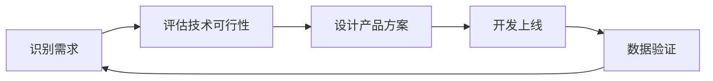
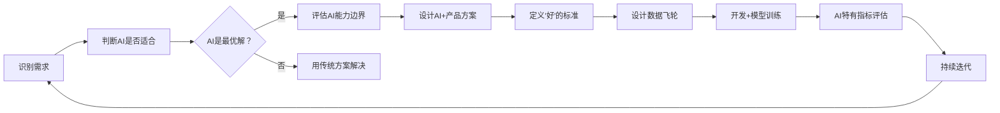
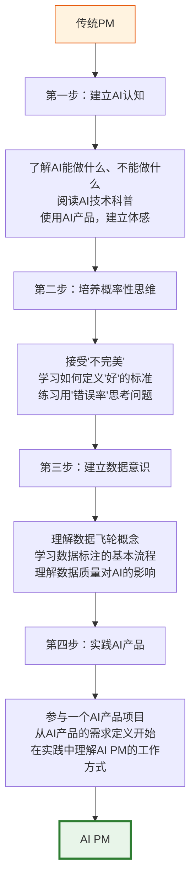

# AI产品经理与传统PM的本质区别

> [!abstract] 核心观点
> AI产品经理和传统产品经理的区别，不是"多了一个AI技能"，而是**整个产品思维范式发生了变化**。AI PM 面临的不是一个"新工具"，而是一个"新范式"——它改变了产品定义、设计、交付和度量的方式。

---

## 一、三大核心差异

### 1.1 差异一：不确定性 —— AI输出不可预测

> [!important] 核心差异
> 传统产品经理面对的是**确定性系统**：点击按钮必然跳转，输入数据必然计算。AI产品经理面对的是**概率性系统**：同样的输入，AI可能给出不同的输出；AI的输出可能对，也可能错。

**传统PM的确定性世界：**
- 用户点击"支付" -> 必然扣款 -> 必然跳转成功页
- 用户输入搜索词 -> 按照规则排序 -> 返回确定结果
- 产品行为是**可预测的**、**可测试的**、**可保证的**

**AI PM的概率性世界：**
- 用户输入提示词 -> AI生成内容 -> 内容质量不确定
- 用户上传图片 -> AI识别 -> 识别结果可能错误
- 产品行为是**概率性的**、**有边界的**、**需要容错的**

这就带来了一个根本性的产品思维转变：

> [!example] 实际案例
> **传统产品**：一个计算器App，1+1必须等于2，如果等于3就是bug。
> **AI产品**：一个AI写作助手，生成的文案可能有时不够好，但80%的情况下能帮用户节省50%的时间。用户愿意接受20%的"不够好"，因为这80%的增量价值足够大。

### 1.2 差异二：数据依赖性 —— AI产品需要数据飞轮

传统产品也需要数据，但数据更多是**辅助决策**的角色。AI产品中，数据是**核心生产资料**。

**传统PM的数据思维：**
- 数据用来验证假设（A/B测试验证哪个方案更好）
- 数据用来发现问题（漏斗分析找流失点）
- 数据是"后验"的

**AI PM的数据思维：**
- 数据用来**训练模型**（没有数据就没有AI能力）
- 数据用来**优化模型**（更多更好的数据 -> 更好的模型）
- 数据是"前置"的，是产品能力的**原材料**
- 需要设计**数据飞轮**：用户使用 -> 产生数据 -> 优化模型 -> 更多用户

详见 [[05-产品与开发/AI产品经理方法论/06_AI产品的数据策略]]

### 1.3 差异三：技术深度 —— AI PM需要理解模型能力边界

传统PM需要理解技术，但更多是理解"技术可行性"和"开发成本"。AI PM需要理解的是**模型能力边界**——这是一种更深层次的技术理解。

> [!warning] 常见误解
> "AI PM 需要会写代码"——这是一个常见的误解。AI PM 不需要成为算法工程师，但需要：
> - 理解不同模型的能力差异（GPT-4 vs GPT-3.5 能做什么不一样的事）
> - 理解模型的局限性（幻觉、偏见、上下文窗口限制）
> - 理解模型迭代的节奏（什么时候期待模型能力提升，什么时候不应该期待）
> - 能够和算法工程师有效沟通，把业务需求翻译成模型能力边界

---

## 二、AI PM的"翻译官"角色

AI PM 最核心的角色是"翻译官"——**把业务需求翻译成AI能力边界，把AI能力边界翻译成产品价值**。

### 翻译官的三层能力

> [!tip] 第一层：理解业务语言
> 听懂业务方在说什么，理解真实需求背后的业务价值。业务方说"我要一个AI客服"，真实需求可能是"我要降低客服成本"或"我要提升客服响应速度"。AI PM 需要判断AI是不是解决这个问题的最佳方式。

> [!tip] 第二层：理解AI语言
> 理解AI在当前阶段能做什么、不能做什么、以及"差一点就能做什么"。这需要持续跟踪AI技术的发展，理解不同模型的能力边界。详见 [[02-AI趋势与素养/AI应用发展阶段演进/00_MOC_AI应用发展阶段演进中枢]] 中关于技术成熟度的判断。

> [!tip] 第三层：创造产品语言
> 在业务需求和AI能力之间找到最优解，设计出既满足业务需求又在AI能力范围内的产品方案。这需要创造力——有时候最好的方案不是"用AI直接解决问题"，而是"用AI + 人工 + 规则"的组合方案。

---

## 三、AI PM 决策模型的变化

### 3.1 传统PM的决策模型

### 3.2 AI PM的决策模型

> [!important] 关键差异
> 传统PM的决策流程中，"技术可行性"是一个**是/否**的判断。AI PM的决策流程中，"AI能力边界"是一个**程度**的判断——不是"能/不能"，而是"在什么条件下能做，做到什么程度"。

---

## 四、AI PM的日常：与传统PM的对比

| 维度 | 传统PM | AI PM |
|------|--------|-------|
| **需求讨论** | 讨论功能列表 | 讨论AI能力边界 |
| **PRD** | 写功能规格 | 写"能力规格" + "好"的标准 + "错误"容忍度 |
| **设计评审** | 评审交互流程 | 评审AI输出的展示方式 + 容错设计 |
| **技术沟通** | 问"能不能做" | 问"能做到什么程度，边界在哪" |
| **上线决策** | 功能测试通过即可上线 | 需要评估模型表现 + 设置灰度策略 |
| **数据分析** | 看漏斗、留存、转化 | 看准确率、召回率、用户满意度、数据飞轮效率 |
| **迭代规划** | 按版本规划功能 | 协调模型迭代节奏 + 产品迭代节奏 |

---

## 五、常见误区

> [!danger] 误区一：AI PM 就是传统PM + 懂AI
> 这不是简单的加法。AI PM需要的是**思维范式的转变**——从确定性思维到概率性思维，从功能思维到能力思维。

> [!danger] 误区二：AI PM 需要是算法专家
> AI PM不需要能写模型代码，但需要能理解模型能力边界。重点是"理解边界"，不是"掌握实现"。

> [!danger] 误区三：AI PM 的角色和传统PM完全无关
> 传统PM的核心能力——用户洞察、需求分析、项目管理、沟通协调——在AI PM中依然重要。AI PM是在这些基础上的**升级**，而不是**替代**。

> [!danger] 误区四：AI产品就是"在传统产品上套一个AI壳"
> 这种"AI壳"思维是AI产品失败的最常见原因。真正的AI产品需要从需求定义、体验设计到迭代度量的全面重构。详见 [[05-产品与开发/AI产品经理方法论/02_AI产品的需求定义：从「功能」到「能力」]] 和 [[05-产品与开发/AI产品经理方法论/03_AI产品的体验设计：从「确定性」到「概率性」]]

---

## 六、从传统PM到AI PM的转型路径

详见 [[05-产品与开发/AI产品经理方法论/08_AI产品经理的能力模型与成长路径]] 中的完整转型路径。

---

## 七、核心要点总结

> [!summary] 记住这五点
>
> 1. **AI PM 不是"传统PM + AI技能"，而是思维范式的转变**
> 2. **三大核心差异：不确定性、数据依赖性、技术深度**
> 3. **AI PM 的核心角色是"翻译官"——把业务需求翻译成AI能力边界**
> 4. **AI PM 的决策从"是/否"变成"在什么条件下，做到什么程度"**
> 5. **转型需要四个步骤：建立AI认知 -> 培养概率性思维 -> 建立数据意识 -> 实践AI产品**

---

## 八、AI PM 决策场景深度案例

### 案例一：AI客服产品的"边界判断"

> [!example] 场景
> 业务方提出需求：做一个"全自动AI客服"，完全替代人工客服。

**传统PM的思考方式：**
- 需要哪些功能？自动回复、意图识别、知识库匹配
- 开发周期多长？3个月
- 上线后能节省多少人力成本？

**AI PM的思考方式：**
- 当前AI客服模型的能力边界在哪里？哪些问题能100%自动处理，哪些需要人工？
- 在什么场景下AI可能出错？出错后怎么恢复？
- 如何定义"好的AI客服"？（响应速度、解决率、用户满意度）
- 数据策略：如何收集用户反馈来持续优化模型？
- 建议方案：AI处理80%常见问题 + 复杂问题自动转人工 + AI辅助人工客服（推荐回复）

### 案例二：AI推荐系统的"不确定性管理"

> [!example] 场景
> 一个电商平台想用AI优化商品推荐。传统规则推荐（"买了X的人还买了Y"）效果稳定，但想试试AI个性化推荐。

**传统PM的思考方式：**
- A/B测试：传统规则推荐 vs AI推荐，看哪个转化率高
- 如果AI推荐转化率更高，就切换到AI推荐

**AI PM的思考方式：**
- AI推荐的不确定性：同一个用户，AI推荐可能每次不同，用户会不会困惑？
- 冷启动问题：新用户没有历史数据，AI推荐效果可能很差
- 长尾商品：AI推荐可能偏向热门商品，长尾商品曝光不足
- 评估指标：不能只看转化率，还要看推荐多样性、用户满意度
- 建议方案：AI推荐 + 规则兜底，冷启动用规则，有数据后用AI

### 案例三：AI写作助手的"价值定位"

> [!example] 场景
> 做一个AI写作助手，帮助用户写工作报告、邮件、文案。

**传统PM的思考方式：**
- 功能列表：自动生成、模板选择、格式调整
- 用户故事：作为用户，我想要一键生成工作报告

**AI PM的思考方式：**
- AI的能力边界：AI能生成什么水平的文案？什么场景下AI表现好，什么场景下表现差？
- 用户信任建立：用户第一次使用时，AI生成的内容可能不够好，如何让用户愿意继续使用？
- "好"的定义：不同用户对"好"的文案定义不同，如何个性化？
- 可编辑性：AI生成的内容用户一定会修改，如何让修改更高效？
- 数据飞轮：用户修改AI生成的内容，如何利用这些修改数据优化模型？
- 建议方案：AI生成草稿 + 用户修改完善 + 修改数据回流优化模型

---

## 关联阅读

- [[05-产品与开发/AI产品经理方法论/00_MOC_AI产品经理方法论中枢]] — 知识库总览
- [[05-产品与开发/AI产品经理方法论/02_AI产品的需求定义：从「功能」到「能力」]] — 深入理解AI产品的需求定义方式
- [[05-产品与开发/AI产品经理方法论/03_AI产品的体验设计：从「确定性」到「概率性」]] — 概率性产品的体验设计方法
- [[05-产品与开发/AI产品经理方法论/08_AI产品经理的能力模型与成长路径]] — AI PM 需要什么能力，怎么成长
- [[02-AI趋势与素养/AI应用发展阶段演进/00_MOC_AI应用发展阶段演进中枢]] — 理解AI产品形态的演进阶段
- [[02-AI趋势与素养/AI时代能力要求/00_MOC_AI时代能力要求中枢]] — AI时代对从业者的通用能力要求