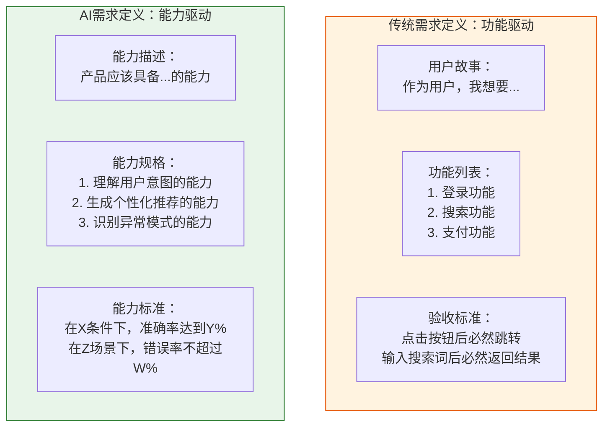
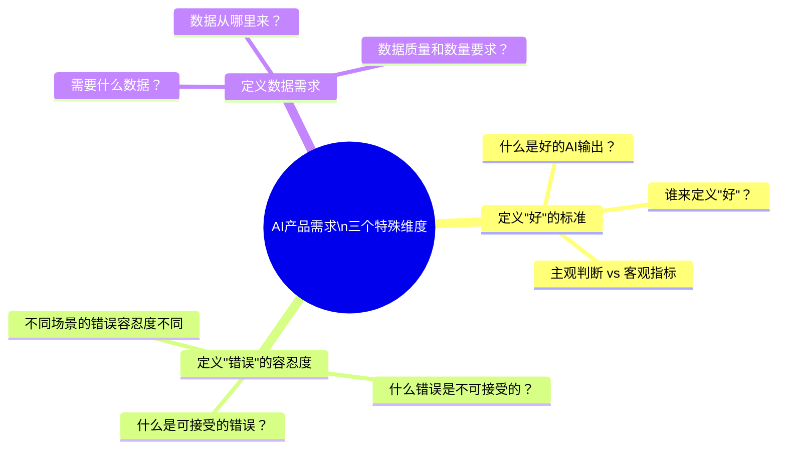
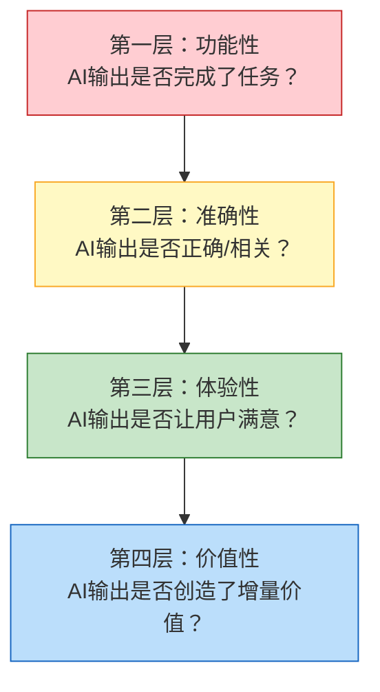
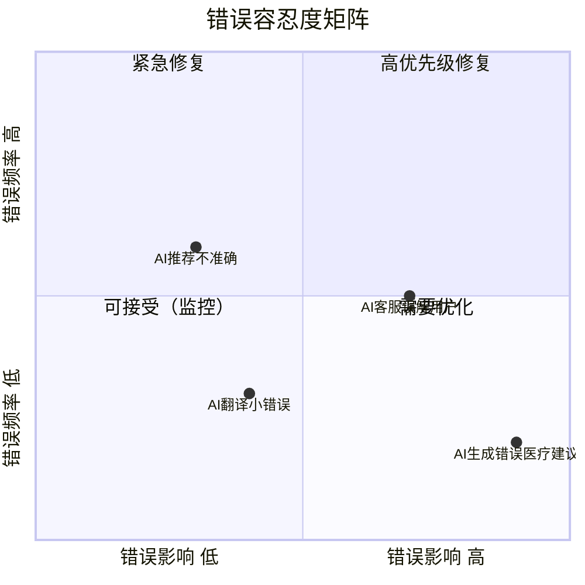
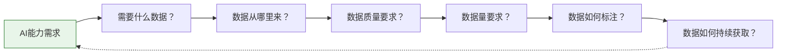
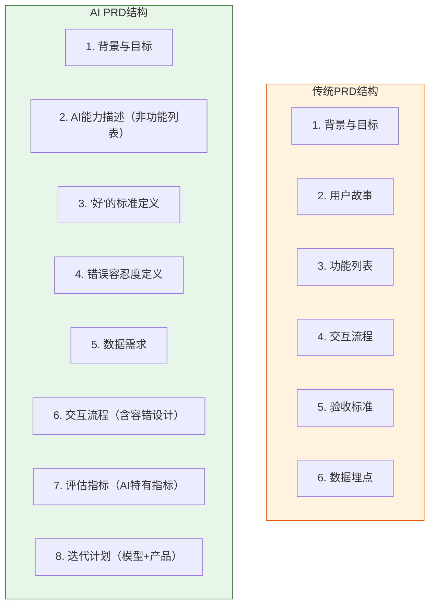
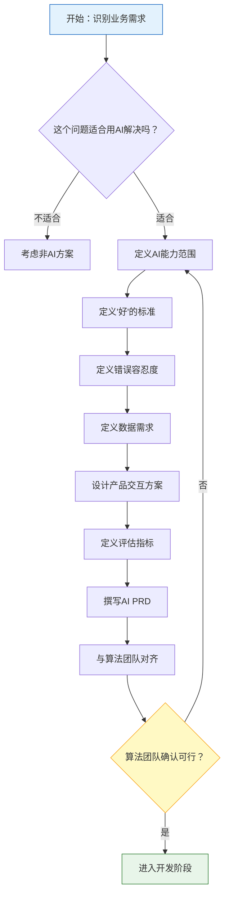

# AI产品的需求定义：从「功能」到「能力」

> [!abstract] 核心观点
> 传统产品定义"做什么功能"，AI产品定义"具备什么能力"。这不是措辞的区别，而是**需求定义范式的根本转变**。AI产品的需求文档需要回答三个传统PRD不会问的问题：什么是"好"的AI输出？什么是"可接受"的错误？需要什么数据来支撑AI能力？

---

## 一、范式转变：从功能到能力

### 1.1 两种需求定义范式的对比



> [!important] 关键区别
> - **传统需求**：定义"产品做什么"（what the product does）
> - **AI需求**：定义"产品具备什么能力"（what the product is capable of）
> - 传统需求关注**输入-输出**的确定性映射
> - AI需求关注**输入-输出**的概率性关系

### 1.2 为什么AI产品需要"能力定义"而非"功能定义"？

| 维度 | 功能定义（传统） | 能力定义（AI） |
|------|-----------------|---------------|
| **确定性** | 确定性的：输入A必然得到输出B | 概率性的：输入A大概率得到输出B |
| **边界** | 边界清晰：功能要么有要么没有 | 边界模糊：能力有程度之分 |
| **测试** | 可穷举测试 | 无法穷举，需要统计测试 |
| **迭代** | 功能迭代：新增/修改/删除 | 能力迭代：提升准确率/扩展覆盖 |
| **用户预期** | 用户预期明确 | 需要管理用户预期 |

---

## 二、AI产品需求的三个特殊维度



### 2.1 维度一：定义"好"的标准

这是AI产品需求最核心也最困难的部分。传统产品中，"好"往往等于"功能正常"——按钮能点击、页面能跳转、数据能提交。但AI产品中，"好"是什么？

> [!question] AI产品中"好"的定义挑战
> - AI文案生成：什么样的文案是"好"的？有趣？准确？符合品牌调性？
> - AI推荐系统：什么样的推荐是"好"的？用户点击了？用户购买了？用户满意了？
> - AI客服：什么样的回答是"好"的？解决了问题？态度友好？简洁高效？

**"好"的四个层次：**



> [!example] 定义"好"的标准示例
> 以AI写作助手为例：
> - **功能性标准**：能生成与用户输入主题相关的文案
> - **准确性标准**：生成文案的事实准确率 >= 95%
> - **体验性标准**：用户采纳率 >= 60%，用户修改率 <= 30%
> - **价值性标准**：使用该功能的用户，内容产出效率提升 >= 40%

### 2.2 维度二：定义"错误"的容忍度

AI产品不可能100%正确。AI PM 需要定义：**什么错误是可以接受的，什么错误是不可接受的**。



> [!warning] 不同场景的错误容忍度
> | 场景 | 错误容忍度 | 示例 |
> |------|-----------|------|
> | **医疗诊断** | 极低（接近零容忍） | AI辅助诊断不能漏诊严重疾病 |
> | **金融风控** | 低（需人工复核） | AI风控误判可能导致资金损失 |
> | **内容推荐** | 中（用户可跳过） | 推荐的视频不感兴趣，用户滑走 |
> | **创意辅助** | 较高（用户可编辑） | AI生成的文案不好，用户可以修改 |
> | **娱乐互动** | 高（错误也是体验） | AI聊天机器人的"胡说八道"有时反而有趣 |

**错误容忍度的定义模板：**

```markdown
## 错误容忍度定义

### 不可接受的错误（零容忍）
- 错误类型：医疗建议错误
- 检测方式：人工审核 + 关键词检测
- 处理方式：系统拦截，不展示给用户

### 需关注的错误（低容忍）
- 错误类型：事实性错误
- 容忍度：错误率 < 2%
- 处理方式：标记"此信息需核实"，引导用户确认

### 可接受的错误（中容忍）
- 错误类型：风格/语气不匹配
- 容忍度：用户投诉率 < 5%
- 处理方式：提供"重新生成"和"编辑"功能

### 预期的"错误"（高容忍）
- 错误类型：创意多样性带来的"不精准"
- 容忍度：无硬性指标
- 处理方式：作为产品特性（多样性）而非缺陷
```

### 2.3 维度三：定义数据需求

AI产品的需求定义中，必须包含**数据需求**。没有数据，就没有AI能力。



**数据需求定义模板：**

| 数据维度 | 说明 | 示例 |
|----------|------|------|
| **数据类型** | 需要什么类型的数据？ | 文本、图像、音频、用户行为日志 |
| **数据来源** | 数据从哪里来？ | 用户UGC、系统日志、第三方采购、人工采集 |
| **数据质量** | 数据需要达到什么质量标准？ | 标注准确率 >= 95%，数据覆盖 >= 80%场景 |
| **数据量级** | 需要多少数据？ | 训练集 >= 10万条，测试集 >= 1万条 |
| **标注方案** | 数据如何标注？ | 标注规范、标注人员要求、质量控制流程 |
| **持续获取** | 数据如何持续更新？ | 用户反馈回流、定期数据更新、数据飞轮设计 |

详见 [[05-产品与开发/AI产品经理方法论/06_AI产品的数据策略]]

---

## 三、AI版PRD的写法

### 3.1 AI PRD vs 传统PRD



### 3.2 AI PRD 新增章节详细说明

#### 新增章节一：AI能力描述

> [!tip] 写法要点
> 不是"系统应该做X"，而是"系统应该具备做X的能力，在Y条件下，达到Z的水平"。

**示例（AI客服产品）：**

```markdown
## AI能力描述

### 能力1：意图识别
- 能力：识别用户消息的核心意图
- 覆盖范围：覆盖20种常见客服意图（退货、换货、物流查询、投诉等）
- 准确率要求：Top-1准确率 >= 85%，Top-3准确率 >= 95%
- 边界说明：不覆盖"情绪宣泄"类消息（转人工处理）

### 能力2：回复生成
- 能力：根据意图和上下文生成回复
- 质量要求：
  - 回复相关性 >= 90%
  - 回复可读性 >= 85%（人工评分）
  - 回复长度 <= 200字
- 边界说明：涉及退款、赔偿等敏感操作时，仅生成建议，需要人工确认
```

#### 新增章节二："好"的标准定义

```markdown
## "好"的标准定义

### 多层次标准
| 层次 | 指标 | 目标值 | 测量方式 |
|------|------|--------|----------|
| 功能性 | 意图识别准确率 | >= 85% | 人工标注测试集 |
| 准确性 | 回复相关性 | >= 90% | 人工评分 + 用户反馈 |
| 体验性 | 用户满意度 | >= 4.2/5.0 | 使用后评分 |
| 价值性 | 问题解决率 | >= 70% | 对话后调研 |
```

#### 新增章节三：错误容忍度定义

（见上文2.2节的模板）

#### 新增章节四：数据需求

（见上文2.3节的模板）

---

## 四、AI产品需求定义的常见陷阱

> [!danger] 陷阱一：把AI当作"万能功能"
> "加个AI功能"——这是最危险的需求表述。AI不是一个可以随意添加的"功能"，而是一种需要精心设计、培养和迭代的"能力"。

> [!danger] 陷阱二：忽视"好"的标准定义
> 如果团队在开发前没有对齐"什么是好的AI输出"，开发过程中就会出现无穷无尽的争论："这个输出算好吗？""我觉得不够好。"——这些争论的根源在于需求阶段没有定义清楚。

> [!danger] 陷阱三：忽视数据需求
> 很多AI产品的PRD写得很好，但完全没有提到数据需求。结果是：产品设计好了，发现没有数据来训练模型，或者数据质量很差。

> [!danger] 陷阱四：用确定性思维写AI需求
> 在AI PRD中写"用户点击按钮后，AI必须生成准确的回复"——这种表述在AI产品中没有意义。应该写"在标准测试集上，AI生成的回复准确率达到85%以上"。

> [!danger] 陷阱五：忽视错误容忍度的场景差异
> 同一个AI产品中，不同场景的错误容忍度可能完全不同。AI PM需要逐一分析每个场景。

---

## 五、AI需求定义的流程



---

## 六、核心要点总结

> [!summary] 记住这五点
>
> 1. **AI产品定义"能力"而非"功能"** —— 这是需求定义范式的根本转变
> 2. **AI PRD有三个新增维度**：定义"好"的标准、定义错误容忍度、定义数据需求
> 3. **"好"的标准有四个层次**：功能性 -> 准确性 -> 体验性 -> 价值性
> 4. **错误容忍度因场景而异**：医疗零容忍，娱乐高容忍，其他场景居中
> 5. **没有数据需求就不是完整的AI PRD** —— 数据是AI能力的原材料

---

## 关联阅读

- [[05-产品与开发/AI产品经理方法论/00_MOC_AI产品经理方法论中枢]] — 知识库总览
- [[05-产品与开发/AI产品经理方法论/01_AI产品经理与传统PM的本质区别]] — 理解AI PM与传统PM的差异
- [[05-产品与开发/AI产品经理方法论/03_AI产品的体验设计：从「确定性」到「概率性」]] — 概率性产品的体验设计
- [[05-产品与开发/AI产品经理方法论/06_AI产品的数据策略]] — 深入了解数据飞轮和数据策略
- [[02-AI趋势与素养/AI应用发展阶段演进/00_MOC_AI应用发展阶段演进中枢]] — 不同阶段AI产品的能力边界