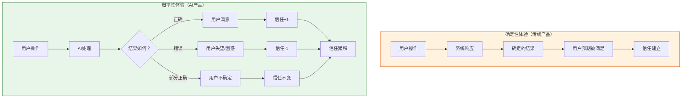
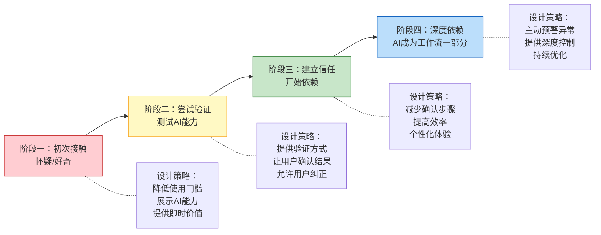
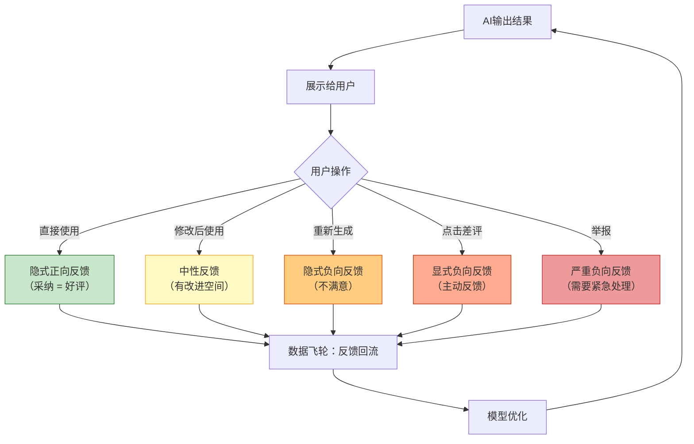
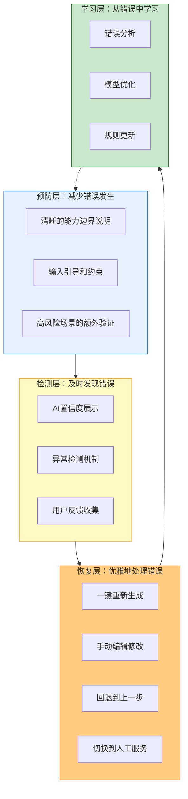

# AI产品的体验设计：从「确定性」到「概率性」

> [!abstract] 核心观点
> 传统产品体验是确定性的——点击按钮必然跳转，输入数据必然计算。AI产品体验是概率性的——AI的输出可能对，可能错，可能"差一点对"。这要求我们从根本上重新思考体验设计的原则：不是追求"不出错"，而是设计"出错后如何优雅地恢复"。

---

## 一、确定性体验 vs 概率性体验

### 1.1 核心挑战

> [!important] 概率性体验的核心挑战
> 用户的信任是一个**累积过程**，而不是**一次性建立**。每一次AI输出都是一次信任投票——正确输出增加信任，错误输出减少信任。AI PM 的体验设计任务，就是**最大化正确输出带来的信任，最小化错误输出带来的信任损失**。

---

## 二、渐进式信任：让用户从怀疑到依赖

### 2.1 渐进式信任模型

### 2.2 各阶段的设计策略

**阶段一：初次接触**

> [!tip] 设计策略
> - **降低使用门槛**：不要让用户学习复杂的操作，一句话就能触发AI
> - **展示AI能力**：在首次使用时展示AI能做什么（如示例提示词）
> - **提供即时价值**：第一次使用就要让用户感受到"有用"

**阶段二：尝试验证**

> [!tip] 设计策略
> - **提供验证方式**：让用户能看到AI的"思考过程"或"依据"
> - **让用户确认结果**：AI输出后，给用户"确认"/"修改"的选项
> - **允许用户纠正**：AI出错时，让用户能轻松纠正，并让AI"学习"

**阶段三：建立信任**

> [!tip] 设计策略
> - **减少确认步骤**：对于高频低风险场景，减少确认步骤
> - **提高效率**：让用户感受到"AI确实帮我省了时间"
> - **个性化体验**：AI根据用户习惯调整输出风格

**阶段四：深度依赖**

> [!tip] 设计策略
> - **主动预警异常**：当AI对某个输出不确定时，主动告知用户
> - **提供深度控制**：让高级用户能调整AI的行为参数
> - **持续优化**：基于用户反馈持续优化AI能力

---

## 三、用户反馈机制：AI产品体验的"安全网"

### 3.1 反馈机制的设计模型

### 3.2 反馈设计的三个层次

| 层次 | 类型 | 设计方式 | 优点 | 缺点 |
|------|------|----------|------|------|
| **显式反馈** | 用户主动评分/点赞/点踩 | 在AI输出下方放置反馈按钮 | 信号明确 | 用户参与率低（1-5%） |
| **隐式反馈** | 通过用户行为推断 | 采纳/复制/修改/重新生成 | 数据量大 | 信号不够精确 |
| **结构化反馈** | 引导用户提供具体原因 | 点踩后弹窗："哪里不满意？" | 信号最丰富 | 用户负担较重 |

> [!tip] 反馈设计原则
> 1. **显式反馈要轻量**：一个按钮搞定，不要弹窗（除非用户主动点踩后想了解更多）
> 2. **隐式反馈是主力**：设计好"采纳"和"修改"的行为埋点，这是最大量的反馈数据
> 3. **结构化反馈用于关键场景**：高风险场景（如医疗、金融）需要更详细的反馈

---

## 四、错误恢复设计：当AI出错时

### 4.1 错误恢复的层次

### 4.2 具体设计方法

#### 预防层：减少错误发生

> [!tip] 设计方法
> - **能力边界说明**：在AI输入框旁展示"我能做什么"和"我不能做什么"
> - **输入引导**：提供示例提示词，引导用户输入AI擅长处理的内容
> - **高风险场景额外验证**：涉及敏感操作时，增加二次确认

#### 检测层：及时发现错误

> [!tip] 设计方法
> - **AI置信度展示**：当AI对输出不确定时，用视觉提示告知用户（如"置信度：中"）
> - **异常检测**：监控输出质量，当质量下降时自动告警
> - **用户反馈**：提供便捷的反馈入口

#### 恢复层：优雅地处理错误

> [!tip] 设计方法
> - **一键重新生成**：最基础的恢复方式，让用户快速获得新结果
> - **手动编辑**：让用户直接修改AI输出，这是AI产品体验的"最后防线"
> - **回退**：保留历史版本，让用户可以回退
> - **转人工**：当AI无法处理时，无缝切换到人工服务

---

## 五、AI输出的"可编辑性"

### 5.1 为什么可编辑性如此重要

> [!important] 可编辑性 = 用户控制权
> AI输出的可编辑性是AI产品体验设计的**核心原则**。它解决了两个关键问题：
> 1. **信任问题**：用户可以修改AI的输出，降低了"AI搞错了怎么办"的焦虑
> 2. **效率问题**：AI生成80% + 用户修改20% 比 用户从0写100% 要快得多

### 5.2 可编辑性的设计层次

| 层次 | 设计方式 | 适用场景 |
|------|----------|----------|
| **基础编辑** | 直接修改AI输出文本 | 文案生成、翻译 |
| **结构化编辑** | 在结构化界面中修改（如修改表格中的某个字段） | 数据提取、表单填充 |
| **参数化编辑** | 调整参数重新生成（如"更正式"/"更简洁"） | 内容生成、风格调整 |
| **交互式编辑** | 与AI对话修改（"把这段改得更专业一些"） | 复杂内容创作 |
| **版本对比** | 展示多个版本，让用户选择或组合 | 创意类产出 |

---

## 六、AI产品体验设计原则总结

> [!summary] AI产品体验设计七大原则
>
> 1. **渐进式信任** —— 不要期望用户一开始就完全信任AI，让信任逐步建立
> 2. **可编辑性第一** —— AI输出必须可编辑，这是用户控制权的底线
> 3. **反馈即数据** —— 每一次用户反馈都是优化AI的数据，设计好反馈回路
> 4. **错误优雅降级** —— 当AI不确定时，主动降低能力承诺，而非硬撑
> 5. **透明但不过度** —— 适当展示AI的思考过程，但不要让技术细节淹没用户
> 6. **场景决定容忍度** —— 不同场景的错误容忍度不同，体验设计要差异化
> 7. **效率优先于完美** —— 80%正确但能帮用户节省时间，好过100%正确但慢

---

## 七、常见反模式

> [!danger] 反模式一：隐藏AI的"AI属性"
> 有些产品试图让AI看起来像真人，隐藏AI的不确定性。当用户发现真相时，信任崩塌得更厉害。

> [!danger] 反模式二：AI输出不可编辑
> 如果用户看到AI输出有问题但无法修改，用户会感到"被AI绑架了"。

> [!danger] 反模式三：过度自信的AI
> AI用100%确定的语气说一件可能只有70%准确的事。这是最伤害信任的行为。

> [!danger] 反模式四：忽视冷启动
> 新用户没有历史数据，AI表现可能很差。需要设计冷启动体验。

> [!danger] 反模式五：一刀切的容错设计
> 所有场景使用同样的容错策略（如所有AI输出都不加确认直接生效），高风险场景可能出大问题。

---

## 八、AI产品体验设计实践案例

### 案例一：AI搜索产品的"置信度展示"

> [!example] Notion AI 的搜索体验设计
> Notion AI 在搜索时，不仅展示搜索结果，还展示AI的置信度。当AI对某个结果不确定时，会用"可能相关"来标记，而不是直接给出确定答案。这个设计让用户知道"AI也不是100%确定"。

**设计要点：**
- 不确定时主动告知，比"假装确定"更能建立信任
- 置信度用自然语言表达（"可能""也许"），而非技术术语
- 给用户验证的途径（点击查看原文）

### 案例二：AI编程助手的"可编辑性"设计

> [!example] GitHub Copilot 的代码补全体验
> Copilot 生成代码建议后，用户可以用Tab键一键采纳，也可以继续打字来忽略。这种"无侵入式"的设计让用户始终掌握控制权——AI建议是"建议"而非"命令"。

**设计要点：**
- AI输出是"建议"而非"最终结果"
- 采纳和拒绝都只需要一个操作
- 用户可以随时修改AI的输出
- 不采纳AI建议不会产生任何负面后果

### 案例三：AI客服的"渐进式信任"设计

> [!example] 智能客服的信任建立路径
> 第一阶段：AI先做简单的事（查询订单状态、回答FAQ）
> 第二阶段：用户信任后，AI开始处理更复杂的事（退换货申请）
> 第三阶段：AI主动预警异常（"这个问题我可能处理不好，建议转人工"）

**设计要点：**
- 信任是逐步建立的，不是一蹴而就的
- AI主动承认"不会"比"硬撑"更能建立信任
- 高风险操作总是需要人工确认

### 案例四：AI翻译工具的"错误恢复"设计

> [!example] DeepL 的翻译编辑体验
> DeepL翻译后，用户可以点击译文中的任何单词来查看替代翻译。这种设计让用户不需要完全重写，只需要微调不满意的部分。

**设计要点：**
- 错误恢复的粒度要细（单词级别而非段落级别）
- 提供多个替代选项，让用户选择而非重写
- 修改操作应该可逆（支持撤销）

---

## 关联阅读

- [[05-产品与开发/AI产品经理方法论/00_MOC_AI产品经理方法论中枢]] — 知识库总览
- [[05-产品与开发/AI产品经理方法论/01_AI产品经理与传统PM的本质区别]] — 理解AI PM与传统PM的差异
- [[05-产品与开发/AI产品经理方法论/02_AI产品的需求定义：从「功能」到「能力」]] — AI产品的需求定义方式
- [[05-产品与开发/AI产品经理方法论/05_AI产品的评估与度量]] — 如何评估AI产品的体验质量
- [[02-AI趋势与素养/AI应用发展阶段演进/00_MOC_AI应用发展阶段演进中枢]] — 不同阶段AI产品的体验设计策略