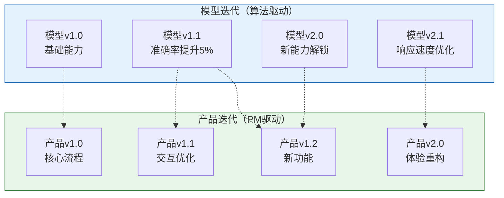
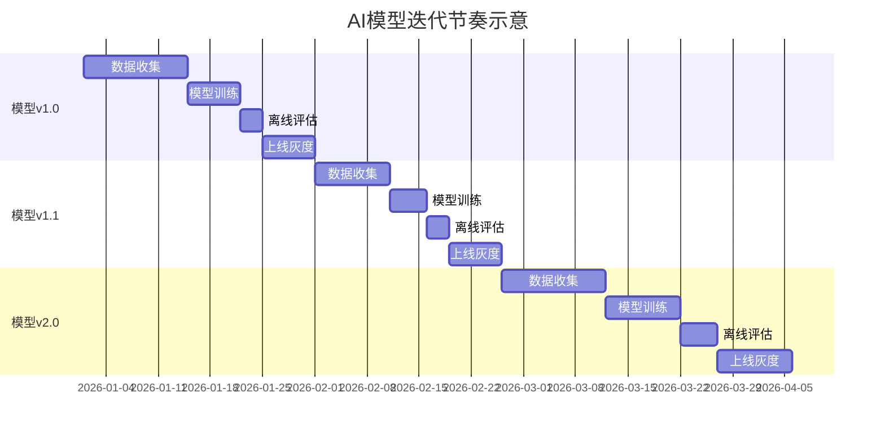
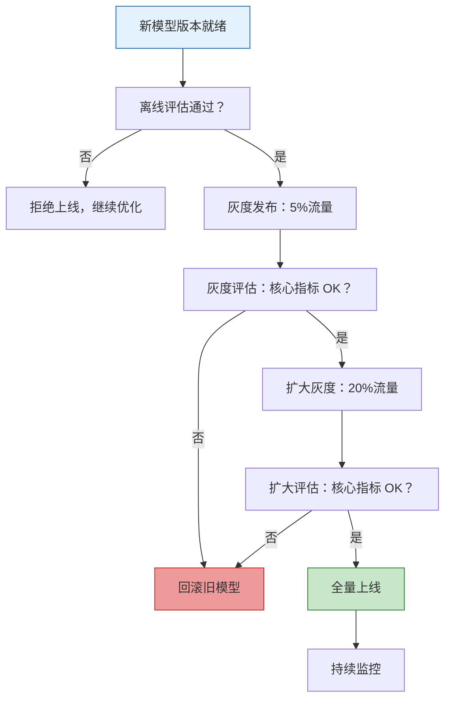
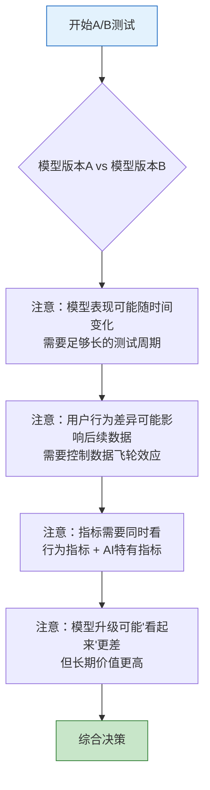
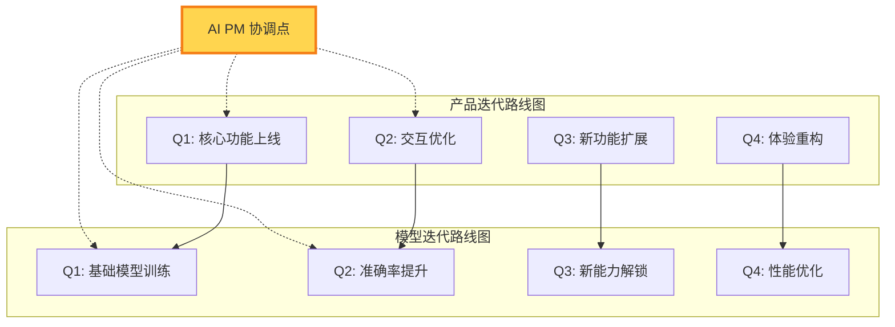
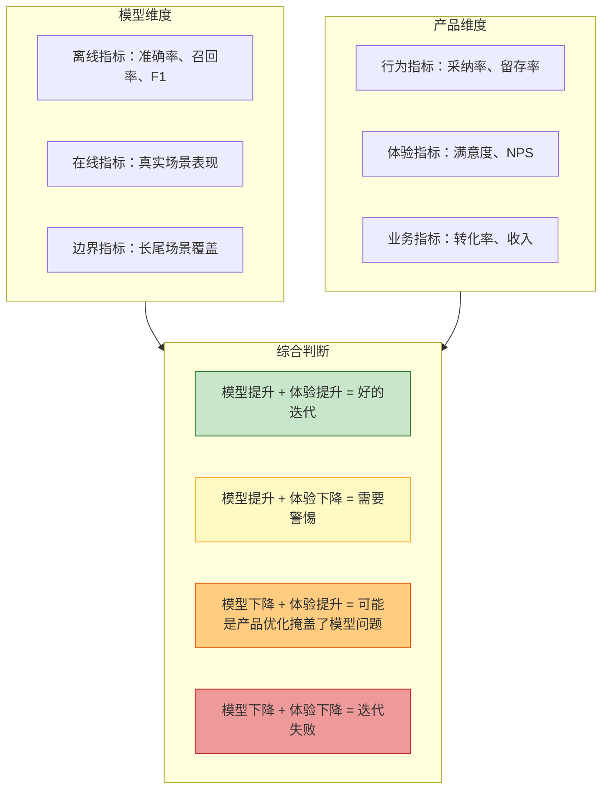
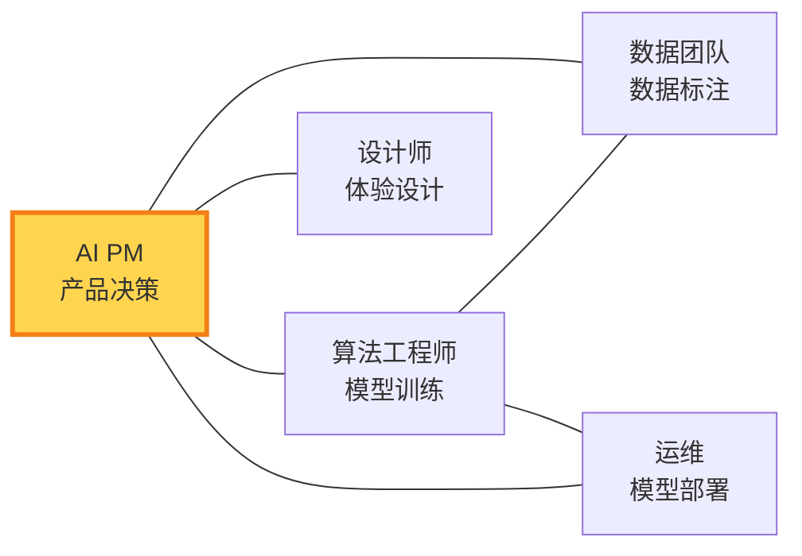

# AI产品的迭代节奏：从「版本」到「持续进化」

> [!abstract] 核心观点
> AI产品的迭代不是"V1.0 -> V2.0 -> V3.0"的线性版本演进，而是**模型持续升级 + 产品持续优化**的双螺旋结构。AI PM 需要同时管理两个独立的迭代节奏，并协调它们之间的相互影响。这是AI产品管理中最复杂也最关键的挑战。

---

## 一、双螺旋迭代模型

### 1.1 模型迭代 vs 产品迭代

### 1.2 两个迭代的独立性与耦合性

| 维度 | 模型迭代 | 产品迭代 | 耦合关系 |
|------|----------|----------|----------|
| **驱动因素** | 算法团队、数据积累、算力 | 用户需求、业务目标、竞品 | 相互独立 |
| **迭代速度** | 取决于训练周期（可能数周） | 取决于开发周期（可能数天） | 节奏不同 |
| **质量保证** | 离线评估 + 在线A/B测试 | 功能测试 + 用户验收 | 需要协调 |
| **风险** | 模型升级可能导致用户体验变差 | 产品改动可能暴露模型短板 | 风险相互影响 |
| **发布方式** | 模型热更新（无需发版） | 应用发版（需要App Store审核） | 发布方式不同 |

---

## 二、模型迭代的管理

### 2.1 模型迭代的节奏

### 2.2 AI PM 在模型迭代中的角色

> [!important] AI PM 不是"等模型训练好再设计产品"
> AI PM 需要主动参与模型迭代的决策：
> 1. **定义模型迭代的目标**：下一个版本要提升什么能力？（准确率？响应速度？新能力？）
> 2. **定义模型迭代的优先级**：在有限的训练资源下，优先优化哪个能力？
> 3. **评估模型迭代的效果**：模型升级后，用户体验是否真的变好了？
> 4. **决策模型升级的上线**：新模型准备好了吗？灰度策略是什么？回滚条件是什么？

### 2.3 模型升级的决策框架

---

## 三、A/B测试在AI产品中的特殊性

### 3.1 AI产品A/B测试的独特挑战

> [!warning] 传统A/B测试 vs AI产品A/B测试
> | 维度 | 传统A/B测试 | AI产品A/B测试 |
> |------|------------|--------------|
> | **测试对象** | UI变化、功能变化 | 模型版本、Prompt变化、参数调整 |
> | **效果稳定性** | 效果稳定（同一个UI对所有人一致） | 效果不稳定（同一个模型对不同用户可能表现不同） |
> | **指标选择** | 转化率、点击率等行为指标 | 需要加入准确率、满意度等AI特有指标 |
> | **测试周期** | 通常1-2周 | 可能需要更长（因为AI效果需要时间被用户感知） |
> | **交互效应** | 用户之间独立 | 用户行为可能影响模型（数据飞轮效应） |

### 3.2 AI产品A/B测试的特殊注意事项

> [!tip] 案例：模型升级了但用户体验变差了？
> 一个常见的现象：新模型在离线指标上全面领先，但上线后用户满意度反而下降。可能的原因：
> 1. **新模型的输出风格变了**：用户已经习惯了旧模型的风格，新风格需要适应期
> 2. **新模型在某些长尾场景下表现更差**：离线评估覆盖不到这些场景
> 3. **新模型更"自信"了**：用更确定的语气输出，但错误时用户的信任损失更大
> 4. **新模型的"惊喜"变少了**：旧模型偶尔的超预期输出让用户觉得"AI很聪明"

---

## 四、产品迭代与模型迭代的协调

### 4.1 协调模型

### 4.2 协调策略

> [!tip] 策略一：以模型能力里程碑驱动产品规划
> 不是"我想做什么功能"然后等模型支持，而是"模型下一个版本能做什么"然后基于此规划产品功能。

> [!tip] 策略二：产品设计要预留模型能力接口
> 产品设计时不要硬编码模型能力，而是设计成"如果模型支持X，就展示X功能"的模式。这样模型升级后，产品可以快速适配。

> [!tip] 策略三：建立模型迭代的"产品验收"流程
> 模型上线前，AI PM 需要亲自"体验"新模型，评估产品体验是否可接受。这是AI PM独有的职责。

> [!tip] 策略四：管理用户的"模型升级预期"
> 用户可能不知道模型升级了，但能感受到产品体验的变化。AI PM需要管理这种预期：通过更新日志、引导提示等方式告知用户。

---

## 五、AI产品迭代的度量

### 5.1 迭代效果的评估框架

详见 [[05-产品与开发/AI产品经理方法论/05_AI产品的评估与度量]]

---

## 六、持续进化的组织保障

### 6.1 AI产品迭代需要跨职能协作

> [!important] AI PM 是迭代的"中央协调者"
> AI PM 需要确保五个角色之间的信息同步：模型进展、产品需求、数据可用性、设计约束、部署条件。任何一个环节的信息不对称，都可能导致迭代失败。

---

## 七、常见陷阱

> [!danger] 陷阱一：把模型迭代和产品迭代混为一谈
> 模型升级不等于产品升级。模型升级了但产品没跟上，或者产品改版了但模型没准备好，都是常见问题。

> [!danger] 陷阱二：过度依赖模型迭代解决产品问题
> 有些产品问题不是模型问题，而是设计问题、流程问题、或者用户教育问题。不要用"等模型升级就好了"来逃避产品设计责任。

> [!danger] 陷阱三：忽视模型升级的"适应期"
> 用户需要时间适应新模型的行为变化。即使是更好的模型，刚切换时也可能导致短期指标下降。

> [!danger] 陷阱四：A/B测试周期太短
> AI产品的A/B测试需要更长的周期，因为AI效果需要时间被用户感知，而且模型表现可能随时间变化。

> [!danger] 陷阱五：没有回滚机制
> 模型升级必须有快速回滚能力。如果新模型出了问题，能在几分钟内切回旧模型。

---

## 八、迭代节奏的实战案例

### 案例一：AI搜索产品的"双螺旋"迭代

> [!example] 某AI搜索产品的迭代实战
> 该产品在6个月内经历了三轮迭代：
> - **第1-2月**：产品上线基础搜索功能，模型v1.0（基于开源模型微调）
> - **第3-4月**：产品增加"追问"功能，模型v1.1（准确率提升8%）
>   - 问题：模型v1.1在长尾查询上表现反而下降，用户投诉增加
>   - 解决：产品侧增加"不满意？试试这样问"引导，模型侧回滚部分参数
> - **第5-6月**：产品上线"AI摘要"功能，模型v2.0（基于更大参数量模型）
>   - 关键决策：模型v2.0响应延迟增加30%，但准确性提升15%
>   - 产品策略：在UI上展示"AI正在分析..."，管理用户对延迟的预期

**核心启示：**
- 模型迭代和产品迭代需要紧密配合，一方变动可能影响另一方
- 模型升级不总是"全面变好"，可能有trade-off
- 产品设计可以缓解模型升级带来的负面体验

### 案例二：AI写作产品的"灰度发布"策略

> [!example] 某AI写作工具的模型升级
> 算法团队训练了一个新模型，离线指标全面领先：
> - 但AI PM坚持灰度发布：先5%用户，观察1周
> - 第一周发现：新模型生成的内容更长，但用户采纳率反而下降
> - 原因分析：用户更喜欢"短小精悍"的回复，而不是长篇大论
> - 调整策略：在prompt中增加"简洁"要求，重新灰度
> - 最终：采纳率提升12%，全量上线

**核心启示：**
- 离线指标好不等于在线体验好
- 灰度发布是AI产品迭代的"安全网"
- AI PM 需要解读"为什么指标好但体验差"

---

## 关联阅读

- [[05-产品与开发/AI产品经理方法论/00_MOC_AI产品经理方法论中枢]] — 知识库总览
- [[05-产品与开发/AI产品经理方法论/05_AI产品的评估与度量]] — 深入理解AI产品的评估方法
- [[05-产品与开发/AI产品经理方法论/06_AI产品的数据策略]] — 数据飞轮如何驱动迭代
- [[01-AI技术/超长项目AI跑/超长项目AI跑_知识库建设方案]] — 如何用AI跑长项目，理解AI项目的特殊性