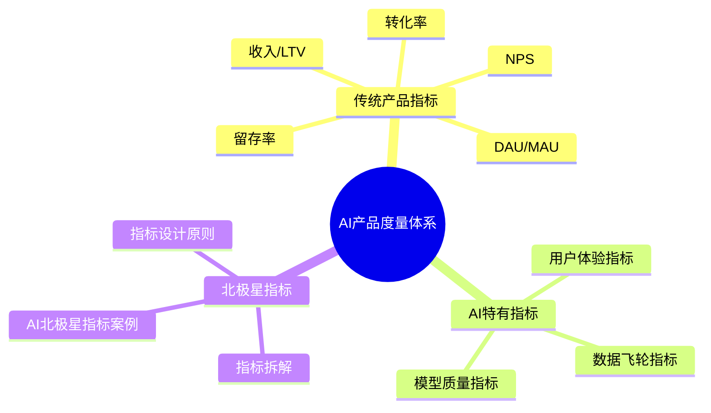
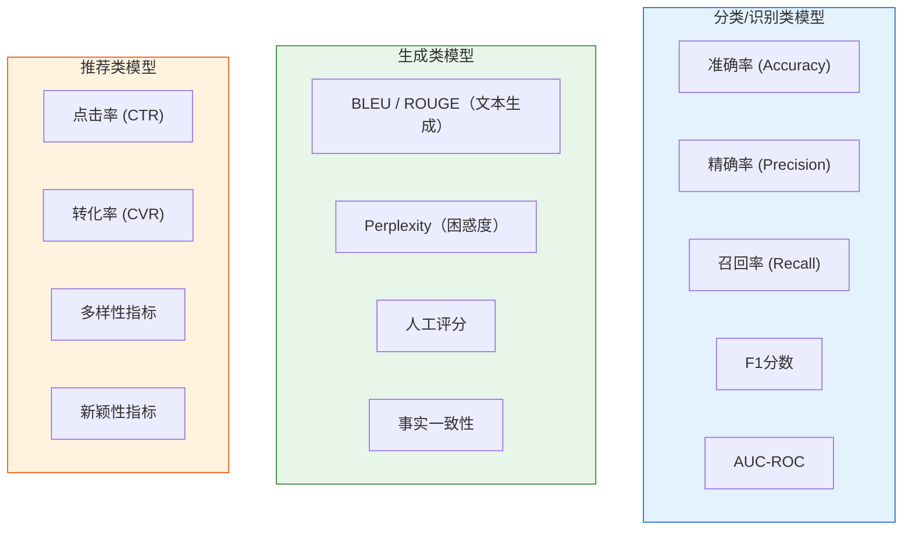
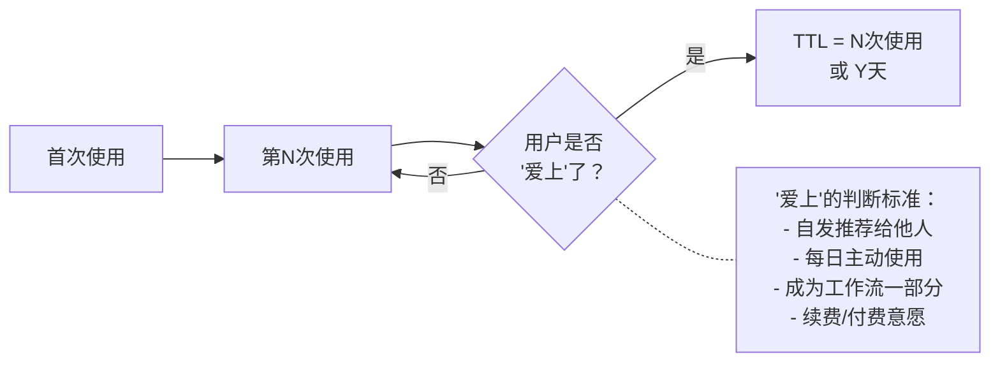
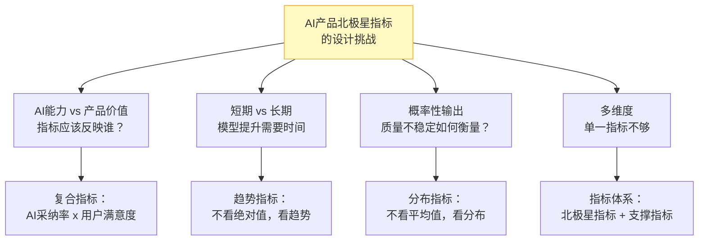
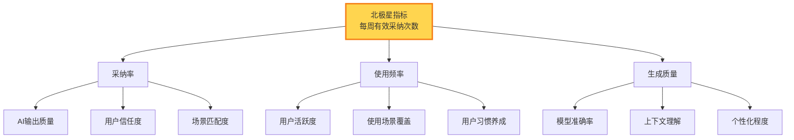
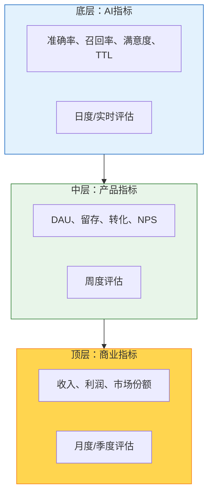

# AI产品的评估与度量

> [!abstract] 核心观点
> AI产品如何衡量成功？传统指标（DAU、留存、收入）仍然是重要的，但不够。AI产品需要引入AI特有指标（准确率、召回率、响应时间、用户满意度、任务完成率、TTL"Time to Love"），并设计一个能同时反映"AI能力"和"产品价值"的北极星指标。

---

## 一、AI产品度量体系全景

---

## 二、传统产品指标在AI产品中仍然重要

> [!important] 传统指标不是"过时了"
> 无论AI能力多强，产品最终还是要服务用户、创造商业价值。DAU、留存、收入这些指标在AI产品中仍然是核心的商业指标。AI PM 不能因为"我们的AI很厉害"就忽视这些基本指标。

但是，传统指标在AI产品中有新的解读：

| 传统指标 | 在AI产品中的新含义 |
|----------|-------------------|
| **DAU/MAU** | 有多少用户日常依赖AI？AI是否成为用户工作流的一部分？ |
| **留存率** | AI的持续价值如何？用户是否"用完就走"还是"越用越离不开"？ |
| **转化率** | AI辅助是否提升了转化？AI推荐是否真正有效？ |
| **收入/LTV** | AI带来的增量价值有多少？用户愿意为AI能力付多少钱？ |
| **NPS** | 用户对AI产品的整体感受如何？AI是否让用户"惊喜"？ |

---

## 三、AI特有指标

### 3.1 模型质量指标

> [!tip] 模型指标的选择原则
> 1. **根据产品类型选择指标**：分类、生成、推荐产品各有侧重
> 2. **精确率 vs 召回率的权衡**：取决于场景。医疗诊断要高召回率（宁可多查也不能漏），内容推荐要高精确率（宁可少推也不能推错）
> 3. **离线指标不等于在线指标**：离线评估好的模型，在线不一定好。必须结合在线指标

### 3.2 用户体验指标

| 指标 | 定义 | 测量方式 | 适用场景 |
|------|------|----------|----------|
| **用户满意度** | 用户对AI输出的整体满意度评分 | 使用后调研（1-5星） | 所有AI产品 |
| **任务完成率** | AI帮助用户成功完成任务的比率 | 用户行为分析 + 调研 | 任务型AI产品 |
| **采纳率** | 用户直接使用AI输出而不修改的比率 | 行为埋点 | 生成类AI产品 |
| **修改率** | 用户修改AI输出后才使用的比率 | 行为埋点 | 生成类AI产品 |
| **重新生成率** | 用户要求AI重新生成的比率 | 行为埋点 | 生成类AI产品 |
| **TTL (Time to Love)** | 用户从开始使用到"爱上"AI的时间 | 用户行为分析 | 所有AI产品 |
| **信任度** | 用户对AI系统的信任程度 | 调研 + 行为分析 | 所有AI产品 |

### 3.3 TTL (Time to Love) —— AI产品特有的核心指标

> [!important] 什么是 TTL (Time to Love)？
> TTL 是衡量用户从"开始使用AI产品"到"真正体验到AI核心价值并爱上它"所需的时间。这个指标在AI产品中特别重要，因为：
> 1. AI产品通常有学习曲线 —— 用户需要时间理解AI能做什么
> 2. AI产品需要"冷启动" —— 初期AI表现可能不够好，需要用户数据积累
> 3. AI产品的价值是"体验型"的 —— 用户需要亲自使用才能感受到价值

**TTL的测量方式：**

**降低TTL的策略：**
- 优化冷启动体验（新用户引导、示例展示）
- 设计"快速赢"体验（第一次使用就要让用户感受到价值）
- 个性化加速（尽快学习用户偏好，提升AI表现）

### 3.4 数据飞轮指标

| 指标 | 定义 | 重要性 |
|------|------|--------|
| **数据增长率** | 用户产生的数据量增长速度 | 数据飞轮的"燃料"是否充足 |
| **数据质量** | 用户反馈数据的质量（标注准确率等） | 数据质量决定模型优化效果 |
| **反馈覆盖率** | 有反馈的AI输出占比 | 反馈越多，优化越快 |
| **飞轮效率** | 数据增长 -> 模型提升的时间周期 | 飞轮转得越快，竞争优势越大 |

详见 [[05-产品与开发/AI产品经理方法论/06_AI产品的数据策略]]

---

## 四、AI产品的北极星指标设计

### 4.1 什么是好的北极星指标？

> [!tip] 北极星指标的标准
> 1. **反映用户价值**：指标上升意味着用户获得更多价值
> 2. **可被团队影响**：团队的工作能直接影响这个指标
> 3. **可测量**：能被准确、持续地测量
> 4. **不过于短期**：不是虚荣指标，反映长期价值

### 4.2 AI产品北极星指标的设计挑战

### 4.3 北极星指标设计案例

| 产品类型 | 北极星指标 | 设计思路 |
|----------|-----------|----------|
| **AI写作助手** | "每周有效采纳次数" | 有效采纳 = 用户直接使用或微调后使用的AI生成内容 |
| **AI客服** | "AI独立解决率 x 用户满意度" | AI解决率衡量效率，满意度衡量质量 |
| **AI推荐系统** | "推荐驱动的有效转化" | 有效转化 = 点击推荐内容并完成目标行为 |
| **AI搜索** | "搜索结果采纳率（首条）" | 用户是否在第一条结果就找到了想要的内容 |
| **AI设计工具** | "AI辅助完成的设计数" | 衡量AI帮助用户完成了多少设计任务 |

### 4.4 北极星指标的拆解

---

## 五、AI产品评估的实践框架

### 5.1 评估金字塔

### 5.2 评估节奏

| 频率 | 评估内容 | 责任人 |
|------|----------|--------|
| **实时** | 模型异常检测（输出质量突然下降） | 算法团队 |
| **每日** | AI特有指标（准确率、响应时间） | AI PM |
| **每周** | 产品指标（留存、采纳率） | AI PM |
| **每月** | 商业指标（收入、NPS） | AI PM + 业务负责人 |
| **每季度** | 战略回顾（市场份额、北极星指标趋势） | 管理层 |

---

## 六、常见陷阱

> [!danger] 陷阱一：只看模型指标，不看产品指标
> 准确率99%但没人用 = 失败的产品。模型指标是手段，产品指标是目的。

> [!danger] 陷阱二：只看产品指标，不看模型指标
> DAU涨了但不知道是模型变好了还是产品变好了，无法做出正确的迭代决策。

> [!danger] 陷阱三：北极星指标忽略AI特性
> 用传统产品的北极星指标（如"DAU"）来衡量AI产品，会忽略AI能力的核心价值。

> [!danger] 陷阱四：指标太多，没有重点
> 一个AI产品可能有几十个指标。AI PM 需要明确哪些是"决策指标"，哪些是"监控指标"。

> [!danger] 陷阱五：只看平均值，不看分布
> AI的表现往往不是均匀的。平均值掩盖了长尾问题。要关注不同用户群、不同场景下的指标分布。

---

## 七、核心要点总结

> [!summary] 记住这五点
>
> 1. **传统指标 + AI特有指标** —— 两者缺一不可，传统指标看商业价值，AI指标看能力质量
> 2. **TTL是AI产品的核心指标** —— 衡量用户从"尝试"到"依赖"的时间
> 3. **北极星指标要反映AI价值** —— 不是简单的DAU，而是"AI带来的有效行为"
> 4. **建立评估金字塔** —— 底层AI指标 -> 中层产品指标 -> 顶层商业指标
> 5. **看分布，不看平均值** —— AI产品的表现分布比平均值更有信息量

---

## 八、度量体系的实战案例

### 案例一：AI搜索产品的"北极星指标"演变

> [!example] 某AI搜索产品的指标演进
> - **阶段一（MVP）**：北极星指标 = "搜索结果采纳率"
>   - 这个阶段最重要的是验证AI搜索是否真的有用
> - **阶段二（增长期）**：北极星指标 = "日活跃搜索用户数"
>   - 产品验证通过，开始追求增长
> - **阶段三（成熟期）**：北极星指标 = "AI搜索渗透率"（使用AI搜索的用户占比）
>   - 目标是让AI搜索成为用户的默认搜索方式
> - **阶段四（变现期）**：北极星指标 = "AI驱动的GMV"
>   - AI搜索的商业化价值

**核心启示：**
- 北极星指标不是一成不变的，随产品阶段演进
- 早期关注"有用"，中期关注"增长"，后期关注"价值"
- 每个阶段收敛到一个核心指标，避免团队方向分散

### 案例二：AI客服产品的"复合指标"设计

> [!example] 某AI客服产品的指标体系
> **北极星指标**：AI有效解决率 = AI独立解决且用户满意的会话占比
>
> **支撑指标**：
> - 模型层：意图识别准确率、回复相关性、响应延迟
> - 产品层：AI会话占比、转人工率、用户满意度
> - 商业层：客服成本下降、用户复购率
>
> **关键洞察**：
> - 如果只追求"AI会话占比"，客服可能会强行用AI处理不适合的问题
> - 加上"用户满意度"作为约束，避免"为了AI而AI"
> - 复合指标可以在"效率"和"质量"之间取得平衡

### 案例三：AI推荐系统的"指标陷阱"

> [!example] 某电商推荐系统的教训
> 团队优化了推荐模型，点击率提升了15%，但GMV下降了5%。
>
> **原因分析**：
> - 新模型推荐的内容更"吸引眼球"（点击率高），但内容质量下降
> - 用户点击了更多，但购买意愿下降
> - 过度优化点击率导致了"标题党"效应
>
> **教训**：
> - 单一指标优化有风险，需要约束指标
> - 推荐系统不能只看点击，要看最终的转化
> - AI PM 需要设计"防作弊"的指标体系

---

## 关联阅读

- [[05-产品与开发/AI产品经理方法论/00_MOC_AI产品经理方法论中枢]] — 知识库总览
- [[05-产品与开发/AI产品经理方法论/04_AI产品的迭代节奏：从「版本」到「持续进化」]] — 迭代中的评估方法
- [[05-产品与开发/AI产品经理方法论/06_AI产品的数据策略]] — 数据飞轮的指标监控