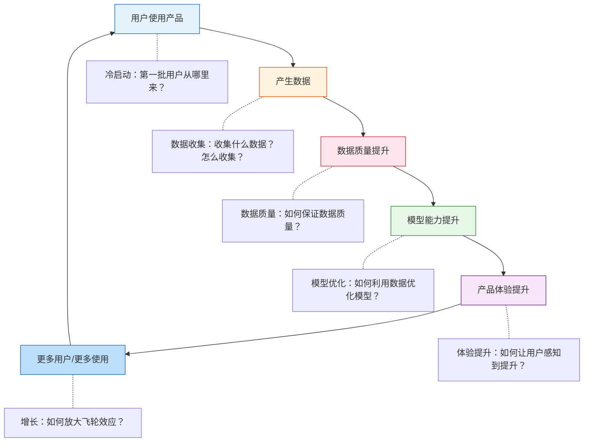
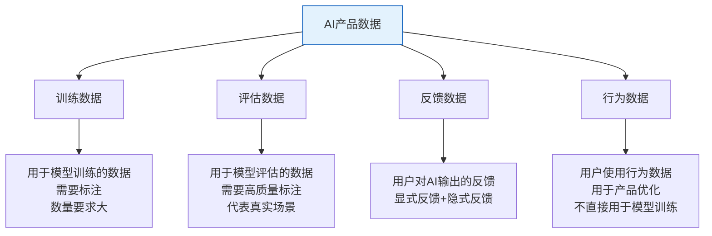
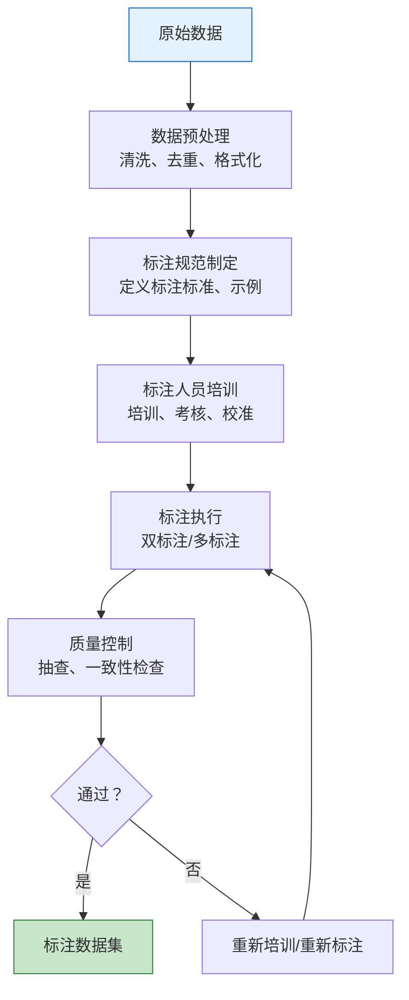
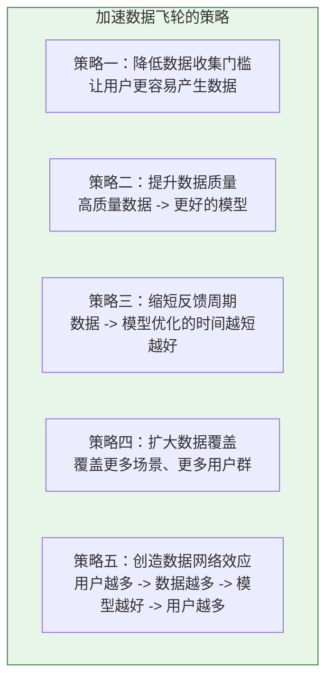
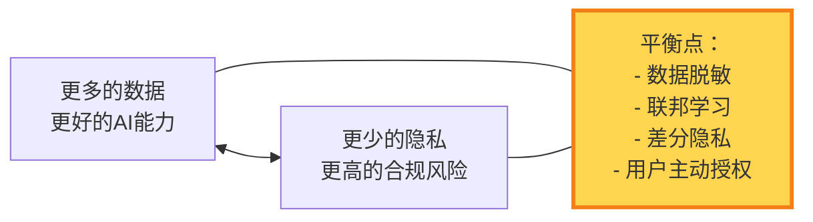

# AI产品的数据策略

> [!abstract] 核心观点
> 数据是AI产品的"燃料"。没有数据策略的AI产品，就像没有燃料的火箭——设计得再漂亮也飞不起来。AI PM 需要理解数据飞轮的设计原理、数据收集策略、数据标注策略，以及数据隐私与合规的平衡。数据策略不是"技术团队的事"，而是AI PM 的核心职责。

---

## 一、数据飞轮：AI产品增长的核心引擎

### 1.1 数据飞轮模型

### 1.2 数据飞轮的六个关键节点

| 节点 | 关键问题 | AI PM 的职责 |
|------|----------|-------------|
| **冷启动** | 第一批用户从哪里来？没有数据怎么训练模型？ | 设计冷启动策略：规则兜底、预训练模型、种子数据 |
| **数据收集** | 收集什么数据？怎么收集？ | 定义数据需求、设计数据收集机制 |
| **数据质量** | 数据干净吗？标注准确吗？ | 建立数据质量标准、设计标注流程 |
| **模型优化** | 数据如何转化为模型能力？ | 定义模型优化目标、评估优化效果 |
| **体验提升** | 用户能感知到模型提升吗？ | 设计"让用户感知提升"的体验 |
| **增长** | 飞轮怎么加速？ | 设计增长策略、协调资源投入 |

---

## 二、数据收集策略

### 2.1 数据分类

### 2.2 数据收集的设计原则

> [!tip] 原则一：数据收集要"润物细无声"
> 不要让用户"帮我们收集数据"，而是让数据收集成为产品使用的自然副产品。用户在使用产品时，自然地产生数据。

> [!tip] 原则二：每一类数据都要有明确用途
> 不要因为"这个数据可能有用"就收集。每一类数据的收集都要有明确的用途说明。这不仅是为了效率，也是隐私合规的要求。

> [!tip] 原则三：质量 > 数量
> 1000条高质量标注数据，比10000条低质量数据更有价值。在数据策略的早期阶段，优先保证数据质量，而非数据数量。

> [!tip] 原则四：设计"数据闭环"
> 从数据收集到模型优化，再到用户感知到优化效果，形成一个完整的闭环。用户感受到"我反馈了，AI真的变好了"，会更有动力持续反馈。

### 2.3 数据收集的常见渠道

| 渠道 | 数据类型 | 优点 | 缺点 |
|------|----------|------|------|
| **用户UGC** | 训练数据、反馈数据 | 量大、成本低、真实场景 | 质量参差不齐 |
| **系统日志** | 行为数据 | 全量、客观 | 噪音多，需要清洗 |
| **人工采集** | 训练数据、评估数据 | 质量高、可控 | 成本高、速度慢 |
| **第三方采购** | 训练数据 | 快速获取、量大 | 可能不匹配场景 |
| **合成数据** | 训练数据 | 成本低、可扩展 | 可能与真实场景有偏差 |
| **用户反馈** | 反馈数据 | 直接反映用户需求 | 参与率低、有偏差 |

---

## 三、数据标注策略

### 3.1 数据标注的重要性

> [!important] 数据标注是AI产品的"基础设施"
> 标注质量直接决定模型质量。AI PM 不需要亲自标注数据，但需要理解标注流程、定义标注标准、建立质量控制机制。这是AI PM 与算法团队协作的关键环节。

### 3.2 标注流程设计

### 3.3 AI PM 在标注中的职责

| 职责 | 说明 |
|------|------|
| **定义标注标准** | 什么是"好"的标注？标注规范怎么写？ |
| **设计标注任务** | 标注任务怎么设计？标注界面怎么设计？ |
| **建立质量控制** | 如何检测标注质量？一致性检查怎么做？ |
| **管理标注成本** | 预算多少？内部标注还是外包？ |
| **评估标注效果** | 标注数据质量如何？是否满足模型训练需求？ |

> [!tip] 标注规范的核心要素
> 1. **标注目标**：标注的目的是什么？模型需要从这些标注中学到什么？
> 2. **标注维度**：标注哪些维度？（如：情感分析标注"正面/负面/中性"）
> 3. **标注示例**：每个维度给出正例和反例
> 4. **边界情况**：如何处理模糊、多义、有争议的样本？
> 5. **一致性要求**：标注人员之间的一致性目标是多少？

---

## 四、数据飞轮的设计与优化

### 4.1 飞轮加速策略

### 4.2 飞轮健康度监控

| 指标 | 健康信号 | 危险信号 |
|------|----------|----------|
| **数据增长率** | 稳定增长 | 增长停滞或下降 |
| **数据质量** | 标注一致性 > 90% | 标注一致性 < 80% |
| **反馈覆盖率** | 反馈率 > 10% | 反馈率 < 2% |
| **飞轮效率** | 数据到模型上线 < 2周 | 数据到模型上线 > 1个月 |
| **模型提升速度** | 每次迭代有明显提升 | 提升停滞（可能遇到天花板） |

---

## 五、数据隐私与合规

### 5.1 数据隐私的核心原则

> [!warning] AI PM 必须关注的数据隐私问题
> 1. **数据最小化**：只收集必要的、且向用户明确告知过用途的数据
> 2. **用户知情权**：用户需要知道哪些数据被收集、用于什么目的
> 3. **用户控制权**：用户应该能够查看、导出、删除自己的数据
> 4. **数据安全**：数据存储、传输、处理过程中的安全保护
> 5. **合规要求**：GDPR、个人信息保护法、行业特定法规

### 5.2 数据隐私与AI能力的两难

> [!tip] AI PM 的实操建议
> 1. **在产品设计阶段就考虑隐私**：不要等到产品上线了才"补"隐私合规
> 2. **与法务团队紧密合作**：了解最新的法规要求
> 3. **透明化数据使用**：在用户协议中清晰说明数据用途
> 4. **给用户选择权**：让用户可以选择是否贡献数据来优化AI
> 5. **数据脱敏优先**：能脱敏的数据尽量脱敏，减少隐私风险

---

## 六、数据策略的常见陷阱

> [!danger] 陷阱一：数据策略是"技术团队的事"
> 很多PM认为数据策略是算法团队的事。但AI PM 是数据策略的"产品Owner"——你定义数据需求，算法团队实现数据处理。

> [!danger] 陷阱二：追求数据量，忽视数据质量
> "多收集数据"是懒惰的策略。"收集高质量数据"才是有效的策略。1万条垃圾数据不如1000条高质量数据。

> [!danger] 陷阱三：数据飞轮"空转"
> 数据在增长，但模型没有提升？需要检查：数据质量是否达标？数据是否被有效利用？模型优化流程是否顺畅？

> [!danger] 陷阱四：忽视冷启动
> "等有了数据再优化模型" -> "没有好模型就没有用户" -> "没有用户就没有数据"。这是一个死循环。必须设计冷启动策略。

> [!danger] 陷阱五：隐私合规是"上线前检查项"
> 隐私合规不是"上线前跑一遍检查清单"，而是应该融入产品设计的每个环节。

---

## 八、数据策略的实战案例

### 案例一：AI产品冷启动的三种策略

> [!example] 冷启动是AI产品最难的阶段
> **策略一：规则兜底 + 逐步替代**
> 某AI客服产品上线时，先用规则引擎处理80%的常见问题，同时收集数据。3个月后，AI模型逐步替代规则引擎。
>
> **策略二：种子数据 + 预训练模型**
> 某AI写作产品在冷启动阶段，先采购了10万条高质量写作数据，微调预训练模型，保证产品上线时就有可用的AI能力。
>
> **策略三：用户引导 + 主动学习**
> 某AI翻译产品在用户首次使用时，让用户完成几个翻译示例，快速建立用户的个性化模型。这种方式虽然增加了用户负担，但能快速提升AI表现。

**冷启动的核心原则：**
- 不能让用户"等"数据飞轮转起来
- 必须有一种方式让产品在"没有数据"时也能提供价值
- 冷启动策略需要在产品设计阶段就确定

### 案例二：数据标注的质量控制实践

> [!example] 某AI产品的标注质量控制流程
> **问题：** 外包标注团队标注质量不稳定，一致性只有70%。
>
> **解决方案：**
> 1. 建立"金标准"数据集：由内部专家标注1000条金标准数据
> 2. 标注人员上岗前必须通过金标准测试（准确率 >= 90%）
> 3. 每100条标注混合5条金标准数据，检测标注人员质量
> 4. 质量低于85%的标注人员暂停标注，重新培训
> 5. 每条数据由2人独立标注，不一致的由第3人仲裁
>
> **效果：** 标注一致性从70%提升到94%

**标注质量控制的要点：**
- 金标准数据是质量控制的基石
- 标注质量需要持续监控，而不是一次性的"上岗考核"
- 双标注+仲裁机制能在成本和质量之间取得平衡

### 案例三：数据飞轮加速的"杠杆点"

> [!example] 找到数据飞轮的关键杠杆
> 某AI推荐产品发现，数据飞轮转得不够快。分析后发现：
> - 用户在"反馈"环节流失严重（只有2%的用户会给推荐结果打分）
> - 没有足够的反馈数据，模型优化速度慢
>
> **杠杆点：重新设计反馈机制**
> - 将显式反馈（打分）改为隐式反馈（用户行为：点击、收藏、购买）
> - 隐式反馈率从2%提升到70%
> - 数据飞轮效率提升3倍
>
> **核心启示：**
> - 数据飞轮的瓶颈往往不在"模型训练"，而在"数据收集"
> - 找到数据收集的"杠杆点"（最小改动，最大效果）
> - 隐式反馈 > 显式反馈，但两者结合效果最好

---

## 七、核心要点总结

> [!summary] 记住这五点
>
> 1. **数据飞轮是AI产品增长的核心引擎** —— 用户 -> 数据 -> 模型 -> 体验 -> 更多用户
> 2. **数据质量 > 数据数量** —— 优先保证质量，再追求数量
> 3. **AI PM 是数据策略的"产品Owner"** —— 定义需求、设计流程、监控效果
> 4. **冷启动是AI产品最大的挑战** —— 必须设计好冷启动策略
> 5. **隐私合规是设计问题，不是检查问题** —— 从设计阶段就要考虑

> [!note] 补充说明：数据飞轮的"临界点"
> 数据飞轮有一个"临界点"概念：在达到临界点之前，飞轮转得很慢，用户感知不到AI的提升；一旦突破临界点，飞轮加速，AI能力出现质的飞跃。AI PM 需要对这个临界点有预判——在临界点之前不能放弃，在临界点之后要准备好放大效应。判断临界点的信号包括：用户反馈数据量超过训练数据量、模型在长尾场景上开始有显著提升、用户自发推荐明显增加。

> [!tip] 数据策略的"成本意识"
> AI PM 在制定数据策略时需要有成本意识。数据标注、存储、处理都有成本，而且成本可能随着数据量增长而线性或指数级增长。AI PM 需要回答：花多少钱买数据是值得的？标注成本是否超过了模型提升带来的收益？数据存储和处理的边际成本是否可控？好的数据策略不是"越多越好"，而是"在成本约束下最大化数据价值"。

---

## 关联阅读

- [[05-产品与开发/AI产品经理方法论/00_MOC_AI产品经理方法论中枢]] — 知识库总览
- [[05-产品与开发/AI产品经理方法论/02_AI产品的需求定义：从「功能」到「能力」]] — 需求定义中的数据需求
- [[05-产品与开发/AI产品经理方法论/04_AI产品的迭代节奏：从「版本」到「持续进化」]] — 迭代中的数据驱动
- [[05-产品与开发/AI产品经理方法论/05_AI产品的评估与度量]] — 数据飞轮的指标监控

> [!quote] 数据策略的终极目标
> 数据策略的终极目标不是"拥有最多的数据"，而是"让每一份数据都转化为AI能力的提升，让每一次AI能力的提升都转化为用户价值"。AI PM 的职责，就是在数据、模型、产品、用户之间建立这个正向循环，并确保它持续运转。
>
> 正如 [[05-产品与开发/AI产品经理方法论/00_MOC_AI产品经理方法论中枢]] 中所说：数据是AI产品的"燃料"——没有燃料的火箭，设计得再漂亮也飞不起来。