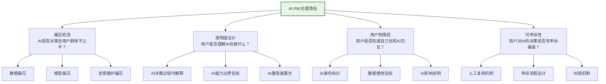
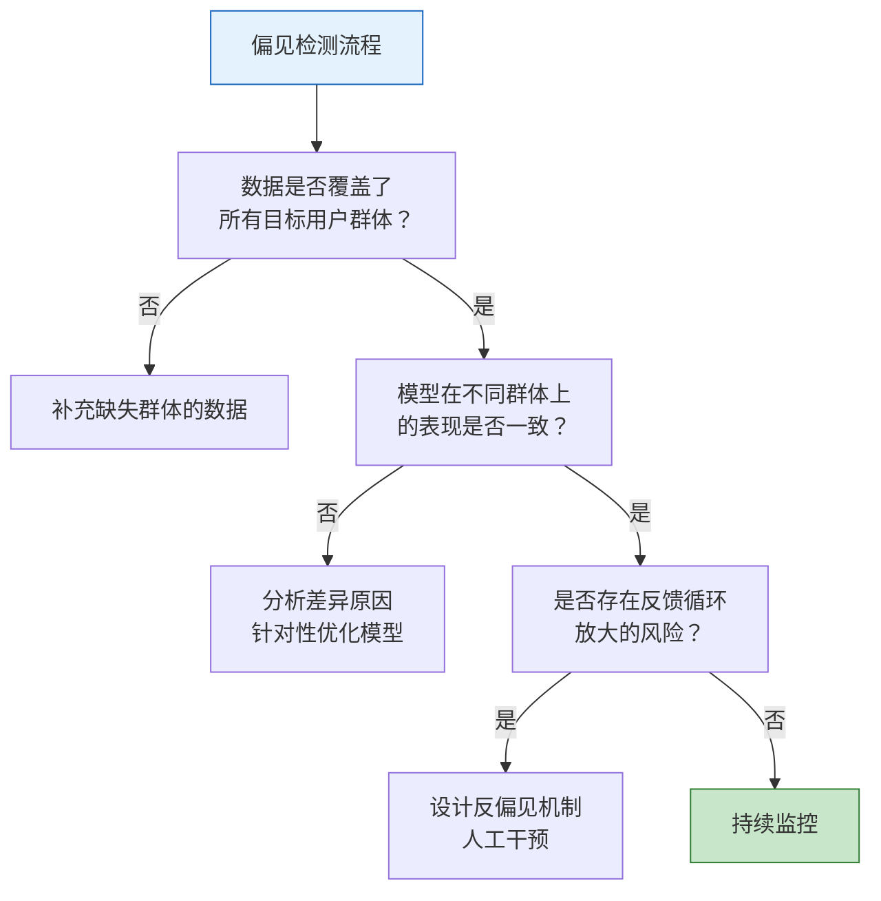
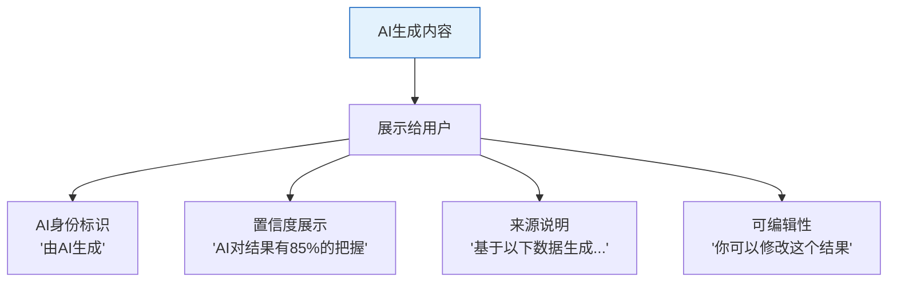
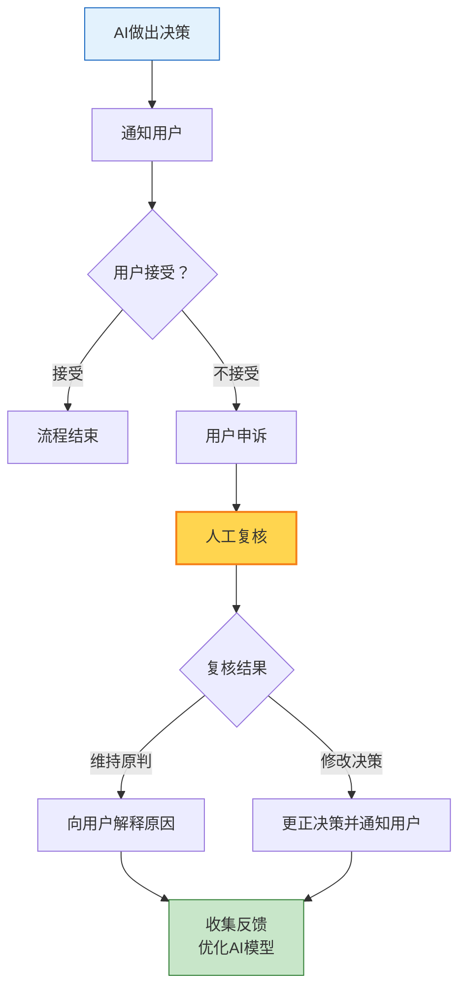
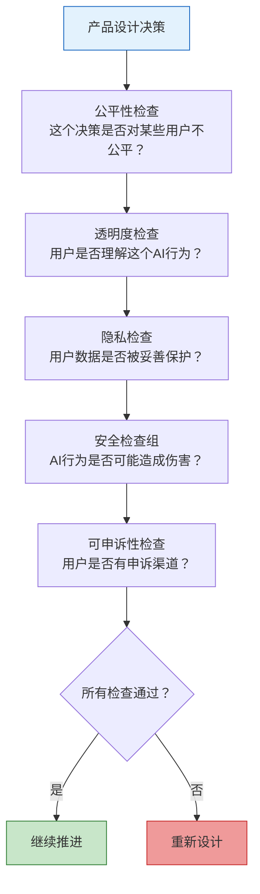

# AI产品的伦理与责任

> [!abstract] 核心观点
> AI PM 的伦理责任不是"高大上的哲学讨论"，而是**嵌入每一次产品决策的实操责任**。本文件聚焦AI PM在产品设计、开发、上线、运营中的具体伦理责任，不重复 [[02-AI趋势与素养/AI伦理与治理/00_MOC_AI伦理与治理中枢]] 中的深度体系内容，而是从AI PM的视角提供可操作的伦理检查清单和决策框架。

---

## 一、AI PM 伦理责任的四个维度

---

## 二、偏见检测：AI PM 的实操职责

### 2.1 三类偏见

> [!warning] 数据偏见
> 训练数据本身带有偏见，导致模型输出带有偏见。
> **AI PM 的职责**：在数据收集阶段就关注数据的代表性，确保数据覆盖不同用户群体。

> [!warning] 模型偏见
> 模型算法本身可能放大某些偏见。
> **AI PM 的职责**：与算法团队合作，要求对模型输出进行不同用户群体的公平性评估。

> [!warning] 反馈循环偏见
> 有偏见的AI输出 -> 影响用户行为 -> 产生更多有偏见的数据 -> 模型更加偏见。
> **AI PM 的职责**：监控数据飞轮的方向，确保反馈循环不会放大偏见。

### 2.2 偏见检测清单

> [!tip] AI PM 的偏见检测实操
> 1. **产品上线前**：要求算法团队提供不同用户群体（性别、年龄、地域等）的模型表现差异报告
> 2. **产品上线后**：监控不同用户群体的满意度、采纳率差异
> 3. **定期审计**：每季度进行一次偏见审计
> 4. **建立反馈渠道**：让用户能方便地报告偏见问题

---

## 三、透明度设计：让用户理解AI

### 3.1 透明度的三个层次

| 层次 | 内容 | 设计方式 | 适用场景 |
|------|------|----------|----------|
| **基础透明** | 告知用户这是AI | "AI助手"标识、机器人头像 | 所有AI产品 |
| **中等透明** | 告知AI的能力边界 | "我能做什么/不能做什么"说明 | 大多数AI产品 |
| **深度透明** | 展示AI的决策依据 | 展示推理过程、数据来源、置信度 | 高风险场景（医疗、金融、法律） |

### 3.2 透明度设计原则

> [!tip] 原则一：透明但不过度
> 不要让技术细节淹没用户。用户需要知道"AI在做什么"和"AI可能出错"，但不需要知道模型架构和训练参数。

> [!tip] 原则二：在关键时刻透明
> 当AI不确定时、当AI做出重要决策时、当用户可能误解AI时，这些是透明度的"关键时刻"。

> [!tip] 原则三：透明要有层次
> 默认展示基础透明信息，用户可以点击展开了解更多。满足不同用户的需求深度。

### 3.3 透明度设计示例

---

## 四、用户知情权：AI时代的"知情同意"

### 4.1 用户需要知道什么

> [!important] 用户知情权的核心问题
> 1. **我是在和AI交互吗？** —— 用户有权知道交互对象是AI而非真人
> 2. **AI会怎么用我的数据？** —— 用户有权知道数据被如何收集和使用
> 3. **AI的决策会对我产生什么影响？** —— 用户有权知道AI决策的后果
> 4. **我可以拒绝AI吗？** —— 用户有权选择不使用AI

### 4.2 AI PM 的实操清单

| 场景 | 用户知情要求 | 设计方式 |
|------|-------------|----------|
| **AI客服** | 告知用户是AI在回复 | 开头说明"我是AI助手" |
| **AI推荐** | 告知推荐逻辑 | "因为你看过X，所以推荐Y" |
| **AI生成内容** | 标注AI生成 | "此内容由AI生成"标签 |
| **AI决策（贷款/招聘）** | 告知AI参与决策 | 说明"AI辅助评估" |
| **AI数据使用** | 告知数据用途 | 清晰的隐私说明 |

---

## 五、可申诉性：AI决策的"上诉渠道"

### 5.1 为什么可申诉性重要

> [!important] AI决策不是"最终判决"
> 当AI做出对用户有重要影响的决策时（如拒绝贷款、过滤内容、评估绩效），用户必须有申诉渠道。AI PM 需要设计"AI决策 -> 人工复核 -> 申诉处理"的完整链路。

### 5.2 可申诉性设计

> [!tip] 可申诉性设计要点
> 1. **申诉入口要明显**：不要藏在三级菜单里
> 2. **人工复核要有SLA**：明确告知用户复核需要多长时间
> 3. **申诉结果要可追溯**：用户能查看申诉历史和处理结果
> 4. **申诉数据要回流**：申诉案例是优化AI的宝贵数据

---

## 六、AI PM 伦理决策框架

### 6.1 伦理检查清单

### 6.2 伦理风险评估矩阵

| 风险等级 | 定义 | 示例 | AI PM 行动 |
|----------|------|------|-----------|
| **高风险** | 可能对用户造成实质性伤害 | 医疗诊断、金融信贷、司法辅助 | 必须人工复核，必须有申诉渠道 |
| **中风险** | 可能影响用户体验或权益 | 内容推荐、客服、招聘筛选 | 需要透明度设计，定期偏见审计 |
| **低风险** | 可能影响用户体验但不造成实质伤害 | 娱乐推荐、创意辅助 | 基础透明度即可，但仍需监控 |

---

## 七、与 AI伦理与治理 的分工

> [!note] 本文件与 [[02-AI趋势与素养/AI伦理与治理/00_MOC_AI伦理与治理中枢]] 的关系
> - **[[02-AI趋势与素养/AI伦理与治理/00_MOC_AI伦理与治理中枢]]** 提供AI伦理的深度体系框架，包括伦理原则、治理架构、监管趋势等
> - **本文件聚焦AI PM的实操责任**：在产品设计、开发、上线、运营中的具体伦理行动
> - 建议先阅读 [[02-AI趋势与素养/AI伦理与治理/00_MOC_AI伦理与治理中枢]] 建立伦理认知框架，再回到本文件了解具体实操

---

## 八、常见陷阱

> [!danger] 陷阱一：伦理是"上线前检查项"
> 伦理不是"产品做好了，上线前检查一下"，而是应该融入产品设计的每个环节。

> [!danger] 陷阱二：伦理是"法务的事"
> 法务告诉你"不能做什么"，但AI PM 需要主动思考"应该做什么"。

> [!danger] 陷阱三：只要技术可行就做
> "技术上可行"不等于"伦理上应该做"。AI PM 需要在技术可行性和伦理责任之间做判断。

> [!danger] 陷阱四：忽视长尾用户
> AI对主流用户表现好，但对少数群体表现差。AI PM 需要关注长尾用户的体验。

> [!danger] 陷阱五：过度依赖用户申诉
> 申诉机制是"最后防线"，不是"第一道防线"。AI PM 应该在前端设计就减少需要申诉的场景。

---

## 九、AI PM 伦理实操案例

### 案例一：AI招聘产品的偏见检测

> [!example] 某AI招聘筛选工具的伦理问题
> **问题发现：** 上线3个月后，内部审计发现AI筛选的简历中，女性候选人通过率明显低于男性。
>
> **根因分析：**
> - 训练数据主要来自历史招聘数据，历史数据中男性占比高
> - 模型学到了"男性更可能被录用"的偏见
> - 反馈循环：模型筛男性 -> 更多男性入职 -> 数据更偏男性
>
> **AI PM的应对措施：**
> 1. 立即暂停AI自动筛选，改为AI辅助（人工终审）
> 2. 重新清洗训练数据，去除性别相关特征
> 3. 建立公平性监控：每周检查不同群体的通过率差异
> 4. 设计"反偏见"机制：当某群体通过率低于阈值时自动告警
> 5. 对外透明：在产品说明中标注AI参与筛选，并说明偏见控制措施

**核心启示：**
- 偏见检测不能等到"出问题"才做，要建立常态化监控
- 反馈循环是偏见放大器的常见原因
- 透明化偏见控制措施可以建立用户信任

### 案例二：AI内容审核的透明度设计

> [!example] 某社交媒体平台的AI内容审核
> **问题：** AI自动删除用户内容，但用户不知道原因，引发大量投诉。
>
> **AI PM的改进措施：**
> 1. 删除通知中说明：被AI标记为"违反社区准则"的原因
> 2. 提供一键申诉按钮，申诉后24小时内人工复核
> 3. 对于"不确定"的内容，AI标记但不删除，转人工审核
> 4. 公开AI审核的准确率数据（季度报告）
> 5. 建立"误删补偿"机制：误删内容恢复后，给予额外曝光补偿

**核心启示：**
- AI决策的透明度直接影响用户信任
- "不确定"时选择保守（不删除），比"确定"后犯错（误删）更好
- 申诉机制不仅是为了纠错，也是收集训练数据的机会

### 案例三：AI医疗产品的伦理边界

> [!example] 某AI辅助诊断产品的伦理决策
> **场景：** AI可以独立完成90%的常见病诊断，准确率超过初级医生。
>
> **伦理决策：** 是否应该让AI独立诊断？
>
> **AI PM的判断：**
> - 虽然准确率高，但医疗场景错误容忍度极低
> - 决策：AI做"初筛"，人工医生做"终审"
> - 设计：AI诊断结果 + 置信度 + 参考依据，医生审核后签字
> - 红线：AI绝不独立做出诊断决策
>
> **核心启示：**
> - 技术能力不等于伦理许可
> - 高风险场景必须有人工终审环节
> - AI PM 需要主动设置"红线"，不能在出事后补救

---

## 十、核心要点总结

> [!summary] 记住这五点
>
> 1. **伦理责任是AI PM 的日常实操，不是"哲学讨论"** —— 每次产品决策都有伦理维度
> 2. **四个核心维度：偏见检测、透明度设计、用户知情权、可申诉性**
> 3. **偏见有三种：数据偏见、模型偏见、反馈循环偏见** —— 需要全链路监控
> 4. **透明度要有层次** —— 基础信息默认展示，详细信息按需展开
> 5. **可申诉性是"最后防线"** —— 但不能只依赖它，前端设计更重要

---

## 关联阅读

- [[05-产品与开发/AI产品经理方法论/00_MOC_AI产品经理方法论中枢]] — 知识库总览
- [[05-产品与开发/AI产品经理方法论/01_AI产品经理与传统PM的本质区别]] — 理解AI PM的独特责任
- [[02-AI趋势与素养/AI伦理与治理/00_MOC_AI伦理与治理中枢]] — AI伦理的深度体系框架
- [[02-AI趋势与素养/AI时代能力要求/00_MOC_AI时代能力要求中枢]] — AI时代的伦理能力要求