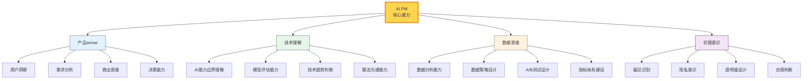
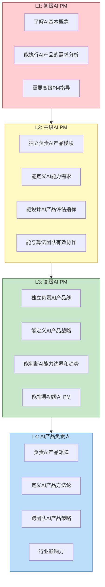
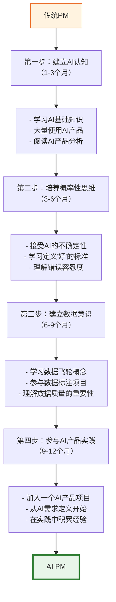
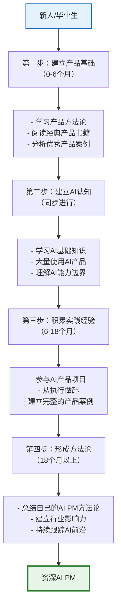
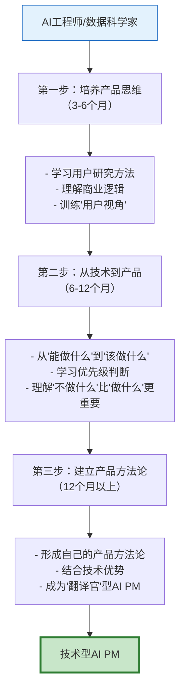
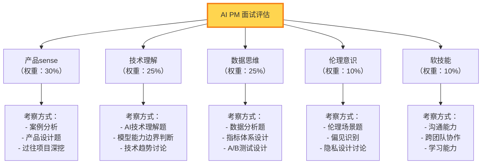
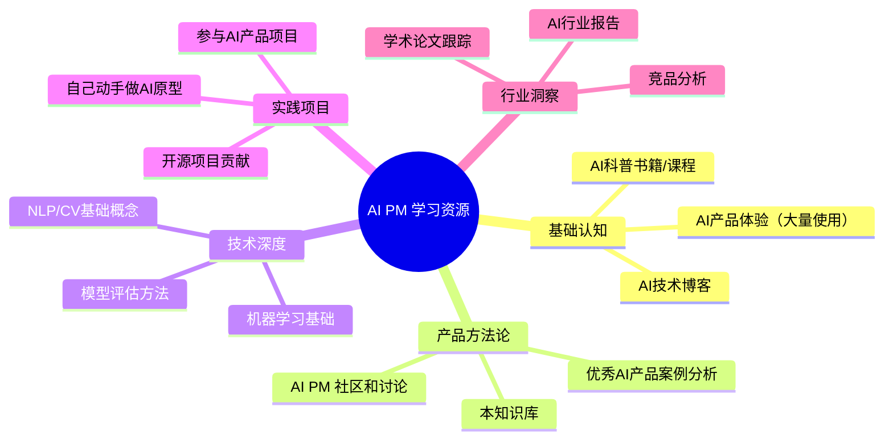

# AI产品经理的能力模型与成长路径

> [!abstract] 核心观点
> AI PM 需要什么能力？技术理解（不是写代码，而是理解AI能力边界）、产品sense、数据思维、伦理意识。本文从能力模型、成长路径、以及HR视角的招聘评估三个维度，构建AI PM 的完整能力发展框架。

---

## 一、AI PM 能力模型

### 1.1 四维能力模型

### 1.2 各维度详解

#### 维度一：产品sense

> [!important] 这是AI PM 的"地基"
> 无论技术多深，AI PM 首先是一个产品经理。产品sense是所有AI PM能力的基础。如果连用户需求都理解不了，再懂AI也没用。

| 子能力 | 初级 | 中级 | 高级 |
|--------|------|------|------|
| **用户洞察** | 能执行用户调研 | 能独立发现用户痛点 | 能预测用户需求趋势 |
| **需求分析** | 能写用户故事 | 能从复杂需求中识别核心问题 | 能定义AI产品的新范式 |
| **商业思维** | 理解商业模式 | 能设计AI产品的商业化策略 | 能判断AI对行业的颠覆性影响 |
| **决策能力** | 在明确选项中选择 | 在不确定中做决策 | 在没有数据的情况下做方向判断 |

#### 维度二：技术理解

> [!important] 不是写代码，是理解边界
> AI PM 不需要写代码，不需要训练模型，但必须理解AI的**能力边界**——AI能做什么、不能做什么、以及"差一点就能做什么"。

| 子能力 | 说明 | 如何培养 |
|--------|------|----------|
| **AI能力边界理解** | 理解不同模型的能力差异和局限性 | 使用AI产品、阅读技术博客、与算法工程师交流 |
| **模型评估能力** | 能理解模型评估指标，判断模型表现 | 学习基本的ML评估概念（准确率、召回率、F1等） |
| **技术趋势判断** | 理解AI技术的发展方向，预判能力演进 | 跟踪AI技术前沿，理解论文和产品发布 |
| **算法沟通能力** | 能用算法工程师的语言沟通需求 | 学习基本的AI术语，理解模型开发流程 |

#### 维度三：数据思维

| 子能力 | 说明 | 如何培养 |
|--------|------|----------|
| **数据分析能力** | 能从数据中发现问题、验证假设 | 学习SQL、数据可视化、统计分析 |
| **数据策略设计** | 能设计数据飞轮、数据收集和标注策略 | 参与数据标注项目，理解数据全流程 |
| **A/B测试设计** | 能设计AI产品的A/B测试方案 | 学习实验设计方法，理解AI A/B测试的特殊性 |
| **指标体系建设** | 能建立AI产品的评估指标体系 | 学习北极星指标设计，理解AI特有指标 |

#### 维度四：伦理意识

| 子能力 | 说明 | 如何培养 |
|--------|------|----------|
| **偏见识别** | 能识别AI系统中的偏见风险 | 学习AI偏见案例，参与偏见审计 |
| **隐私意识** | 在产品设计中考虑数据隐私 | 学习GDPR、个人信息保护法等法规 |
| **透明度设计** | 能设计让用户理解AI的交互方式 | 研究AI产品的最佳实践 |
| **合规判断** | 能在产品决策中判断合规风险 | 与法务团队合作，了解行业法规 |

---

## 二、AI PM 能力等级模型

---

## 三、AI PM 成长路径

### 3.1 路径一：从传统PM转型AI PM

> [!tip] 转型的关键挑战
> 传统PM转型AI PM的最大挑战不是"学AI知识"，而是**思维范式的转变**——从确定性思维到概率性思维，从功能思维到能力思维。详见 [[05-产品与开发/AI产品经理方法论/01_AI产品经理与传统PM的本质区别]]。

### 3.2 路径二：从零开始成为AI PM

### 3.3 路径三：从技术转AI PM

> [!tip] 技术转AI PM的优势和挑战
> **优势**：技术理解深，与算法团队沟通无障碍，能准确判断AI能力边界。
> **挑战**：容易陷入"技术可行就应该做"的思维，需要培养"用户需要什么"的产品思维。

---

## 四、HR视角：如何招聘和评估AI PM

### 4.1 面试评估维度

### 4.2 面试题库（示例）

#### 产品sense类

> [!question] 面试题示例
> 1. "请分析一个你最近使用的AI产品，它好在哪里？不好在哪里？"
> 2. "如果让你设计一个AI客服产品，你会怎么定义'好'的标准？"
> 3. "一个AI产品DAU在涨，但NPS在降，可能是什么原因？"

#### 技术理解类

> [!question] 面试题示例
> 1. "GPT-4和GPT-3.5的能力差异有哪些？这些差异对产品设计有什么影响？"
> 2. "AI模型的'幻觉'问题是什么？作为PM，你会怎么处理这个问题？"
> 3. "如果需要设计一个AI产品，你会如何判断是用大模型还是用小模型？"

#### 数据思维类

> [!question] 面试题示例
> 1. "AI产品的A/B测试和传统产品的A/B测试有什么不同？"
> 2. "请设计一个AI推荐系统的评估指标体系"
> 3. "数据飞轮转不起来，可能是什么原因？"

#### 伦理意识类

> [!question] 面试题示例
> 1. "AI产品上线后，你发现模型对某个用户群体的表现明显更差，你会怎么办？"
> 2. "你的AI产品需要用户数据来优化，但用户对隐私有顾虑，你怎么平衡？"
> 3. "AI做出了一个错误的决策，影响了用户，你怎么设计申诉流程？"

### 4.3 评估rubric

| 维度 | 不合格 | 合格 | 优秀 |
|------|--------|------|------|
| **产品sense** | 只能用功能列表描述产品 | 能从用户需求出发思考产品 | 能定义AI产品的新范式 |
| **技术理解** | 认为AI是"魔法" | 理解AI的基本能力和局限 | 能准确判断AI能力边界和趋势 |
| **数据思维** | 不知道数据对AI的重要性 | 理解数据飞轮概念 | 能设计完整的数据策略 |
| **伦理意识** | 没考虑过AI伦理问题 | 能识别明显的伦理风险 | 能将伦理融入产品设计 |

---

## 五、AI PM 的持续学习路径

### 5.1 学习资源地图

### 5.2 学习节奏建议

| 阶段 | 时间 | 重点 | 产出 |
|------|------|------|------|
| **入门期** | 0-3个月 | 建立AI认知，大量使用AI产品 | 10个AI产品分析报告 |
| **成长期** | 3-12个月 | 参与AI产品项目，建立方法论 | 1-2个完整的AI产品案例 |
| **进阶期** | 12-24个月 | 独立负责AI产品，形成方法论 | 个人AI PM方法论总结 |
| **深耕期** | 24个月以上 | 行业影响力，前沿探索 | 行业分享、文章、方法论输出 |

---

## 六、核心要点总结

> [!summary] 记住这五点
>
> 1. **AI PM 需要四维能力**：产品sense + 技术理解 + 数据思维 + 伦理意识
> 2. **技术理解不是写代码，而是理解AI能力边界** —— 这是AI PM和传统PM最核心的能力差异
> 3. **三条成长路径**：传统PM转型、从零开始、技术转PM —— 各有优势和挑战
> 4. **招聘评估要均衡**：产品sense最重要（30%），技术和数据并重（各25%），伦理不能忽视（10%）
> 5. **AI PM 是持续学习者** —— AI领域变化太快，今天的方法论明天可能就过时了

---

## 关联阅读

- [[05-产品与开发/AI产品经理方法论/00_MOC_AI产品经理方法论中枢]] — 知识库总览
- [[05-产品与开发/AI产品经理方法论/01_AI产品经理与传统PM的本质区别]] — 理解AI PM的核心差异
- [[02-AI趋势与素养/AI时代能力要求/00_MOC_AI时代能力要求中枢]] — AI时代的通用能力要求框架
- [[01-AI技术/Skill制作痛点/00_MOC_Skill制作痛点中枢]] — 了解AI时代需要掌握的技能