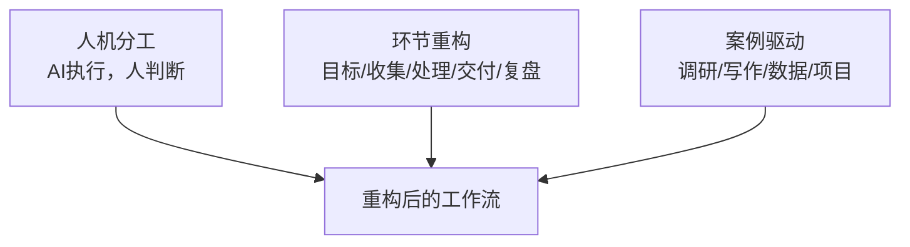
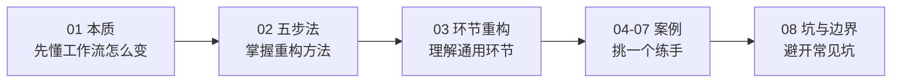
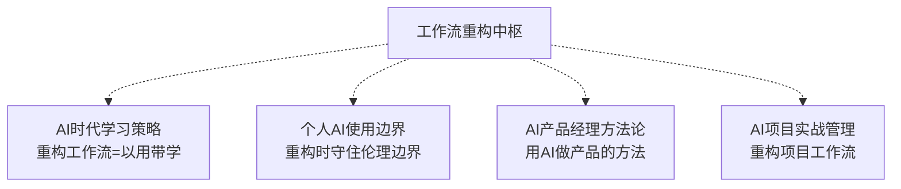

# AI时代工作流重构中枢

> [!abstract] 知识库定位
> 回答**"在未来 AI 时代下，我的工作流会怎么变化"**——不是讲某个工具怎么用，而是讲**工作流本身怎么被 AI 重构**：每个环节的"人机分工"怎么变、怎么诊断自己的旧工作流、怎么设计新工作流、有哪些案例可参考、有哪些坑要避开。
>
> 本库的核心判断：**AI 时代工作流的变化，本质是"人机分工"的重新划分——从"人做全部环节"变成"人定方向 + AI 执行 + 人验证"。** 会重构工作流的人，效率和质量都碾压不会的人；而重构的起点，是看清自己现在的工作流长什么样。
>
> 与 [[05-产品与开发/AI产品经理学习路径/00_MOC_AI产品经理学习路径中枢]]（讲"怎么成为 AI PM"）、[[05-产品与开发/AI时代的学习策略与能力底座/00_MOC_AI时代学习策略中枢]]（讲"AI 时代怎么学"）互补：本库讲"**AI 时代怎么干活**"——把 AI 嵌入每一项工作的具体做法。

---

## 一、核心模型：工作流重构三支柱

> 工作流重构不是"换个工具"，是"**重新设计人机分工**"。三支柱缺一不可。

| 支柱 | 解决什么问题 | 不做的后果 |
|------|-------------|-----------|
| **人机分工** | 每个环节 AI 做什么、人做什么 | 要么全信 AI，要么完全不用 |
| **环节重构** | 工作流的通用环节怎么被 AI 重构 | 只会零散用 AI，不成体系 |
| **案例驱动** | 具体工作怎么重构（有参照） | 知道理论，落不了地 |

> 一句话规则：**先看清旧工作流（诊断），再重新设计人机分工（重构），用案例当参照（落地）。**

---

## 二、文档导航

| 文档 | 核心问题 | 关键标签 |
|------|----------|----------|
| [[05-产品与开发/AI时代工作流重构/01_工作流变化的本质：从人执行到人机协作]] | 工作流到底怎么变了？本质是什么？ | #人机分工 #工作流本质 #执行与判断 |
| [[05-产品与开发/AI时代工作流重构/02_工作流重构五步法：诊断、拆解、重构、验证、迭代]] | 怎么重构一项工作？ | #五步法 #诊断 #重构 #迭代 |
| [[05-产品与开发/AI时代工作流重构/03_工作流通用环节重构：目标、收集、处理、交付、复盘]] | 每个环节怎么被 AI 重构？ | #环节重构 #目标 #收集 #处理 #交付 #复盘 |
| [[05-产品与开发/AI时代工作流重构/04_案例_行业调研工作流重构]] | 行业调研怎么用 AI 重构？ | #案例 #行业调研 #调研工作流 |
| [[05-产品与开发/AI时代工作流重构/05_案例_写作与内容创作工作流重构]] | 写作/内容怎么用 AI 重构？ | #案例 #写作 #内容创作 |
| [[05-产品与开发/AI时代工作流重构/06_案例_数据分析与报告工作流重构]] | 数据分析/报告怎么用 AI 重构？ | #案例 #数据分析 #报告 |
| [[05-产品与开发/AI时代工作流重构/07_案例_项目管理与沟通工作流重构]] | 项目管理/沟通怎么用 AI 重构？ | #案例 #项目管理 #沟通 |
| [[05-产品与开发/AI时代工作流重构/08_工作流重构的坑与边界]] | 重构会踩哪些坑？边界在哪？ | #坑 #边界 #过度自动化 |

---

## 三、怎么用这个库（学习路径）

> 建议顺序：**先读 01 懂本质，再读 02 学方法，03 看环节，然后挑一个最贴近你工作的案例（04-07）练手，最后读 08 避坑。** 案例文档都含"重构前后对比 + 可直接套用的模板"。

---

## 四、与已有知识库的衔接

- **学习策略**：重构一次工作流，就是一次"以用带学 + 项目驱动"，见 [[05-产品与开发/AI时代的学习策略与能力底座/02_学习策略：慢学习法、以用带学、项目驱动]]。
- **伦理边界**：重构工作流时，AI 会接触更多数据，必须先过边界判断，见 [[05-产品与开发/个人AI使用边界与伦理自律/03_个人AI伦理决策框架]]。
- **产品方法**：用 AI 做产品（需求/设计/迭代）的方法论，见 [[05-产品与开发/AI产品经理方法论/00_MOC_AI产品经理方法论中枢]]。
- **项目实战**：AI 项目怎么从 0 到 1 落地，见 [[05-产品与开发/AI项目实战管理/00_MOC_AI项目实战管理中枢]]。

---

## 五、我的工作流重构进度（闭环）

> [!todo] 每重构一项工作用
> - [ ] 01：我懂工作流变化的本质了吗？
> - [ ] 02：我用五步法诊断过一项工作了吗？
> - [ ] 03：我知道每个环节怎么被 AI 重构了吗？
> - [ ] 04-07：我挑一个案例练手了吗？
> - [ ] 08：我避开了常见坑吗？

> 本轮重构：____ / 当前卡在哪：____ / 下一步：____

---

## 版本历史

| 版本 | 日期 | 更新内容 |
|------|------|----------|
| v1.0 | 2026-08-23 | 初始中枢（三支柱 + 导航 + 学习路径） |
