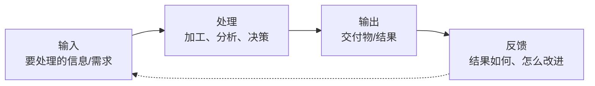
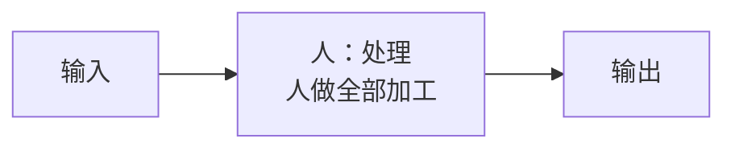
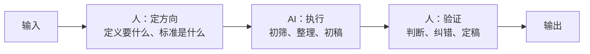
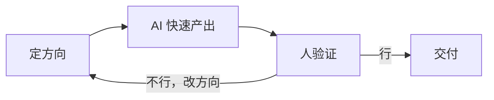

# 工作流变化的本质：从人执行到人机协作

> [!abstract] 本文要练成的能力
> 看懂"AI 时代工作流到底怎么变了"——不是工具变了，是**人机分工变了**。能说出变化的三层本质，并据此判断"我的哪部分工作会被重构、哪部分不会"。这是整个工作流重构库的地基。

---

## 一、先定义：什么是工作流

> 任何工作，拆到最底层都是同一个结构：**输入 → 处理 → 输出 → 反馈**。

| 环节 | 是什么 | 例子（行业调研） |
|------|--------|-----------------|
| **输入** | 拿到什么信息/需求 | 调研主题、问题树 |
| **处理** | 怎么加工/分析/决策 | 收集信息、分析、判断 |
| **输出** | 交付什么 | 调研简报 |
| **反馈** | 结果如何、怎么改 | 复盘、迭代 |

> 关键认知：**所有工作都是这个结构，只是环节的复杂度和比重不同。** 看懂这个结构，才能看懂 AI 重构了什么。

---

## 二、变化的本质：人机分工重新划分

> AI 时代工作流的变化，**不是"环节变多了"，是"每个环节里，人和 AI 的分工变了"**。

### 变化前（人做全部）

### 变化后（人机协作）

| 维度 | 变化前 | 变化后 |
|------|--------|--------|
| 处理主体 | 人做全部 | AI 做执行，人做判断 |
| 人的角色 | 执行者 | **方向制定者 + 验证者** |
| 瓶颈 | 人的执行速度 | 人的判断质量 |
| 产出速度 | 受限于人手 | 受限于人机配合 |

> 一句话本质：**工作流重构 = 把"人做执行"改成"人定方向 + AI 执行 + 人验证"。** 人从"干活的人"变成"指挥干活的人"。

---

## 三、变化的三层本质

> 工作流变化不是均匀的，分三层，每层变化程度不同。

| 层 | 变化程度 | 具体变化 | 人的价值 |
|----|:---:|---------|---------|
| **执行层**（收集、整理、初稿、格式化） | 剧变 | AI 基本接管，又快又好 | 价值被稀释，别在这层花时间 |
| **判断层**（要什么、标准、边界、取舍） | 部分变 | AI 能辅助，但最终判断要人负责 | **价值上升，这是人的主战场** |
| **协作层**（人机怎么配合、怎么验证） | 全新 | 新出现的能力，会的人少 | **价值上升，这是新红利** |

> 关键认知：**AI 时代，人的稀缺性从"会执行"转移到"会判断 + 会协作"。** 执行层被 AI 拉平，判断层和协作层是人和人拉开差距的地方。

---

## 四、工作流从"线性"变"循环"

> 变化前，工作流是"做完一次就结束"的线性流程；变化后，因为 AI 让"试错成本"大幅下降，工作流变成"快速迭代"的循环。

| 维度 | 线性工作流 | 循环工作流 |
|------|-----------|-----------|
| 节奏 | 一次做完 | 快速试错、迭代 |
| 试错成本 | 高（人做慢） | 低（AI 做快） |
| 质量来源 | 一次做对 | **迭代逼近** |
| 人的重点 | 一次做好 | **定好方向 + 判断迭代** |

> 关键认知：**AI 时代，质量不是"一次做对"出来的，是"快速迭代"出来的。** 但迭代的前提是"方向对 + 判断准"——这恰恰是人的活。

---

## 五、怎么判断"我的工作会被怎么重构"

> 用"执行 vs 判断"二分法，快速判断一项工作的重构程度。

| 工作类型 | 执行占比 | 判断占比 | 重构程度 | 应对 |
|---------|:---:|:---:|:---:|------|
| 纯执行（整理、格式化、初稿） | 高 | 低 | 剧变 | 尽快交给 AI，人只定标准 |
| 执行+判断（调研、写作、分析） | 中 | 中 | 大变 | 重构分工，人抓判断 |
| 纯判断（决策、责任、关系） | 低 | 高 | 小变 | 人主导，AI 只辅助 |

> 一句话规则：**执行占比越高的工作，越该重构；判断占比越高的工作，越该守住。** 把时间从"执行"挪到"判断"，就是工作流重构的方向。

---

## 六、资源与练习

### 看什么
- 关键词：AI 工作流 / 人机协作 / AI Agent 工作流
- 关键词：工作流自动化 / AI 提效

### 练什么（可自测）
- [ ] 选一项你常做的工作，画出它的"输入→处理→输出→反馈"
- [ ] 标出每个环节"执行占比 vs 判断占比"
- [ ] 判断：这项工作的哪部分最该交给 AI？

### 过关判据
> - [ ] 能说出工作流变化的本质（人机分工重新划分）
> - [ ] 能说出变化的三层（执行/判断/协作）
> - [ ] 能判断一项工作的重构程度，并说出应对

---

## 练什么（可自测）

- 我每天的工作，执行占比高还是判断占比高？
- 我有没有把时间花在"AI 能做的执行"上？
- 我现在的角色，是"干活的人"还是"指挥干活的人"？

若达标，进入五步法：[[05-产品与开发/AI时代工作流重构/02_工作流重构五步法：诊断、拆解、重构、验证、迭代]]

---

- 回到 [[05-产品与开发/AI时代工作流重构/00_MOC_AI时代工作流重构中枢]]
- 能力分层（执行/判断的价值）：[[05-产品与开发/AI时代的学习策略与能力底座/01_能力分层模型：什么在贬值，什么不贬值]]
