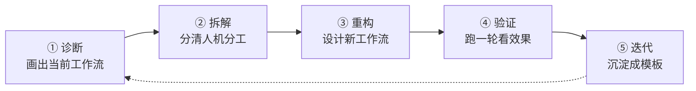

# 工作流重构五步法：诊断、拆解、重构、验证、迭代

> [!abstract] 本文要练成的能力
> 把任何一项工作，用**五步法**系统地重构一遍：**诊断（看清现状）→ 拆解（分清人机）→ 重构（设计新分工）→ 验证（跑一轮）→ 迭代（沉淀模板）**。核心是：**重构不是"拍脑袋用 AI"，是"有方法地重新设计"。**

---

## 一、五步法总览



| 步骤 | 做什么 | 产出物 | 不做会怎样 |
|------|--------|--------|-----------|
| **① 诊断** | 画出"输入→处理→输出→反馈"，找瓶颈 | 当前工作流图 | 不知道从哪改 |
| **② 拆解** | 每个环节问"AI 能做什么、人必须做什么" | 人机分工表 | 乱用 AI，不成体系 |
| **③ 重构** | 设计新分工，定 AI 做什么、人做什么 | 新工作流图 | 没有设计，只是零散用 |
| **④ 验证** | 跑一轮，看质量/速度/风险 | 验证记录 | 不知道重构是否有效 |
| **⑤ 迭代** | 调整 + 沉淀成模板 | 可复用模板 | 重构经验不沉淀 |

> 一句话规则：**先看清（诊断），再分清（拆解），然后设计（重构），跑过才算数（验证），最后沉淀（迭代）。**

---

## 二、第一步：诊断——画出当前工作流

> 重构前先"拍照"：把你现在怎么做这项工作的，完整画出来。

### 诊断模板（填完即用）

```
【工作】____
【输入】____（我拿到什么开始做）
【处理步骤】____（我一步步做了什么，写清顺序）
【输出】____（我交付什么）
【反馈】____（我怎么知道做得好不好）
【瓶颈】____（最耗时/最痛苦/最容易错的一步）
【时间分配】____（每步花多少时间）
```

### 找瓶颈的三个信号

| 信号 | 说明 | 例子 |
|------|------|------|
| **耗时最多** | 时间黑洞，值得先重构 | 收集信息花 3 天 |
| **最重复** | 每次都做同样的事 | 每次写同样格式的报告 |
| **最容易错** | 出错率高，需要人反复检查 | 手动整理数据出错 |

> 关键认知：**重构从瓶颈开始，不从"最想用 AI"开始。** 先找最痛的点，重构收益最大。

---

## 三、第二步：拆解——分清人机分工

> 对每个环节，问两个问题：**"AI 能做吗？"** 和 **"人必须做吗？"** 交叉判断分工。

| 判断 | AI 能做 | AI 不能做 |
|------|---------|----------|
| **人必须做** | 人定标准，AI 执行（如：人定问题树，AI 收集） | 人做（如：最终决策、承担责任） |
| **人不必做** | AI 做（如：格式化、初稿、整理） | 都不做（删掉或简化） |

### 拆解表（填完即用）

```
【环节】____
【AI 能做什么】____（初筛/整理/初稿/格式化？）
【人必须做什么】____（定标准/判断/决策/责任？）
【分工】____（AI 做 X，人做 Y）
```

> 一句话规则：**"AI 能做 + 人不必做"的，全交给 AI；"人必须做"的，人守住。** 拆解不清，重构就会乱。

---

## 四、第三步：重构——设计新工作流

> 基于拆解结果，画出新工作流：**人定方向 → AI 执行 → 人验证 → 交付**。

### 重构模板（填完即用）

```
【新工作流】
  ① 人：定方向（要什么、标准是什么）____
  ② AI：执行（初筛/整理/初稿）____
  ③ 人：验证（判断、纠错、补经验）____
  ④ 人：定稿交付____
【提示词/工具】____（AI 部分怎么让它干活）
【验证点】____（每个 AI 输出，人验证什么）
```

> [!warning] 深度洞察·坑
> 反例：重构时把"人验证"环节省了，让 AI 直接出最终稿。**重构的核心不是"AI 做得多"，是"人机分工对"。** 省掉人验证，短期快，长期错——AI 的错误会直接进交付物。验证环节是重构的"刹车"，不能省。

---

## 五、第四步：验证——跑一轮看效果

> 重构不是"设计完就完"，要**跑一轮真实任务**，看三个指标。

| 指标 | 验证什么 | 怎么判断 |
|------|---------|---------|
| **质量** | 产出是否达标 | 和重构前比，质量升还是降 |
| **速度** | 是否真的更快 | 记录耗时，和重构前比 |
| **风险** | 有没有新风险 | AI 错误、数据安全、责任不清 |

### 验证记录模板（填完即用）

```
【跑的任务】____
【质量】____（和重构前比：升/降/持平）
【速度】____（耗时：重构前____ → 重构后____）
【风险】____（AI 错误/数据安全/责任）
【结论】____（保留 / 调整 / 回退）
```

> 关键认知：**重构大概率第一轮不完美，验证的价值是"发现问题"，不是"证明成功"。** 发现问题 → 进第五步迭代。

---

## 六、第五步：迭代——沉淀成模板

> 验证后调整，然后把"验证有效的新工作流"**沉淀成模板**，下次直接复用。

### 沉淀模板（填完即用）

```
【工作】____
【新工作流】____（人机分工图/步骤）
【提示词/工具】____（可复用的提示词）
【验证点】____（人验证什么）
【踩过的坑】____（这次重构发现的坑）
【适用场景】____（这个模板还能用在哪些工作）
```

> 一句话规则：**一次重构的终点，是"下次不用再重构"。** 沉淀成模板，工作流重构才从"一次性动作"变成"可复用的资产"。

---

## 七、资源与练习

### 看什么
- 关键词：工作流设计 / 流程再造 / AI Agent 工作流
- 关键词：人机协作 设计 / 自动化 工作流

### 练什么（可自测）
- [ ] 选一项常做的工作，走完五步法（诊断→拆解→重构→验证→迭代）
- [ ] 画出"重构前 vs 重构后"两张工作流图
- [ ] 把验证有效的新工作流沉淀成模板

### 过关判据
> - [ ] 能画出当前工作流并找到瓶颈
> - [ ] 能分清每个环节"AI 做 / 人做"
> - [ ] 至少重构过一项工作，且沉淀成模板

---

## 练什么（可自测）

- 我重构过的工作，是从"瓶颈"开始的吗？
- 我的新工作流，保留了"人验证"环节吗？
- 我验证过重构的效果吗？还是设计完就当成功？

若达标，进入环节重构：[[05-产品与开发/AI时代工作流重构/03_工作流通用环节重构：目标、收集、处理、交付、复盘]]

---

- 回到 [[05-产品与开发/AI时代工作流重构/00_MOC_AI时代工作流重构中枢]]
- 项目最小闭环：[[05-产品与开发/AI项目实战管理/01-个人项目实战篇/02_最小闭环与里程碑]]
