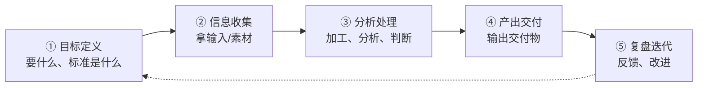

# 工作流通用环节重构：目标、收集、处理、交付、复盘

> [!abstract] 本文要练成的能力
> 把任何工作拆成**五个通用环节**（目标定义、信息收集、分析处理、产出交付、复盘迭代），并知道每个环节**怎么被 AI 重构、人守住什么**。核心是：**环节是通用的，重构方法是可迁移的。**

---

## 一、五个通用环节

> 几乎所有工作都能拆成这五个环节，只是比重不同。



| 环节 | 是什么 | 例子（写作） |
|------|--------|-------------|
| **目标定义** | 明确要什么、给谁、标准 | 文章主题、读者、风格 |
| **信息收集** | 拿输入/素材 | 收集资料、案例 |
| **分析处理** | 加工、分析、判断 | 组织观点、搭结构 |
| **产出交付** | 输出交付物 | 成稿、发布 |
| **复盘迭代** | 反馈、改进 | 看反馈、改稿 |

> 关键认知：**五个环节里，"目标定义"和"复盘迭代"是人的主战场，"收集/处理/交付"是 AI 的主战场。** 把 AI 用在后面三个环节，把人的精力留给前后两个。

---

## 二、环节①：目标定义（人的主战场）

| 维度 | 重构前 | 重构后 |
|------|--------|--------|
| 谁做 | 人凭感觉 | 人定标准，AI 帮补充 |
| 怎么做 | 想到哪做到哪 | 先写"目标定义"再动手 |

### 目标定义模板（填完即用）

```
【要什么】____（最终交付物）
【给谁】____（读者/使用者，ta 要什么）
【标准】____（怎么算好，3 条可检查标准）
【边界】____（不做什么，防跑偏）
```

> 一句话规则：**目标定义不清，后面全白做。** AI 时代更要先定目标——因为 AI 会"很努力地做错方向"。

---

## 三、环节②：信息收集（AI 的主战场）

| 维度 | 重构前 | 重构后 |
|------|--------|--------|
| 谁做 | 人手动搜、手动整理 | AI 初筛、整理，人筛选 |
| 速度 | 慢，容易淹没 | 快，人只处理精选 |

### AI 收集的正确姿势

| 动作 | 具体做法 |
|------|---------|
| **给框架** | 先给 AI"要收集什么"（问题树/清单），再让它收 |
| **要来源** | 让 AI 给出来源，不要裸结论 |
| **人筛选** | AI 初筛后，人判断哪些值得深挖 |
| **防幻觉** | 关键信息交叉验证，不信 AI 的笃定 |

> 一句话规则：**AI 收集 = "AI 初筛 + 人筛选"，不是"AI 收集 + 人照抄"。** 收集环节 AI 提效，但"要什么、信什么"人说了算。

---

## 四、环节③：分析处理（人机协作核心）

| 维度 | 重构前 | 重构后 |
|------|--------|--------|
| 谁做 | 人全做 | AI 帮归纳、找模式，人判断 |
| 风险 | 慢 | AI 会"笃定地说错"，人必须验证 |

### 分析处理的分工

| 动作 | AI 做 | 人做 |
|------|-------|------|
| 归纳整理 | ✅ 帮归纳、分类 | 判断归纳对不对 |
| 找模式 | ✅ 帮找规律 | 判断规律是否真实 |
| 生成初稿 | ✅ 帮写初稿 | 判断初稿方向对不对 |
| 最终判断 | ❌ | ✅ 人负责，承担后果 |

> [!warning] 深度洞察·坑
> 反例：让 AI 做分析，AI 给了一堆"看起来很有道理"的结论，人直接采用。**AI 的分析是"基于它看到的模式"，不是"基于真实世界"。** 分析环节，AI 是"助手"，人是"法官"——人必须用自己的经验和常识验证 AI 的分析。

---

## 五、环节④：产出交付（AI 提效，人定稿）

| 维度 | 重构前 | 重构后 |
|------|--------|--------|
| 谁做 | 人写 | AI 生成初稿，人校对定稿 |
| 关键 | 一次写对 | 人定标准 + 校对 |

### 交付环节的分工

| 动作 | AI 做 | 人做 |
|------|-------|------|
| 生成初稿 | ✅ 快速出稿 | 定风格、定结构 |
| 格式化 | ✅ 排版、整理 | 检查格式 |
| 校对 | ✅ 查错别字 | 判断内容对错 |
| 定稿 | ❌ | ✅ 人负责最终质量 |

> 一句话规则：**AI 出"初稿"，人出"定稿"。** 交付环节，AI 负责"快"，人负责"准"和"负责"。

---

## 六、环节⑤：复盘迭代（人的主战场）

| 维度 | 重构前 | 重构后 |
|------|--------|--------|
| 谁做 | 人凭记忆 | 人复盘，AI 帮整理 |
| 价值 | 容易忘 | 沉淀成模板，越做越快 |

### 复盘模板（填完即用）

```
【这次做了什么】____
【有效的地方】____（下次保留）
【要改的地方】____（下次调整）
【AI 用得好/不好】____（人机分工哪里要调）
【沉淀】____（产出什么模板，放哪）
```

> 一句话规则：**复盘是工作流重构的"燃料"**——不复盘，重构经验就流失；复盘，每次重构都让下次更快。

---

## 七、五环节总览表（一页记住）

| 环节 | 谁主战场 | AI 做什么 | 人做什么 |
|------|---------|----------|---------|
| ① 目标定义 | 人 | 帮补充 | 定要什么、标准 |
| ② 信息收集 | AI | 初筛、整理 | 给框架、筛选 |
| ③ 分析处理 | 人机协作 | 归纳、找模式 | 判断、验证 |
| ④ 产出交付 | AI+人 | 初稿、格式化 | 校对、定稿 |
| ⑤ 复盘迭代 | 人 | 帮整理 | 复盘、沉淀 |

> 记忆口诀：**"前后人，中间 AI"**——目标（前）和复盘（后）人守住，收集/处理/交付（中间）交给 AI 提效。

---

## 八、资源与练习

### 看什么
- 关键词：工作流设计 / 环节拆分 / AI 提效
- 关键词：人机协作 分工 / 自动化流程

### 练什么（可自测）
- [ ] 选一项工作，拆成五个环节，标出"谁主战场"
- [ ] 对每个环节，写"AI 做什么 / 人做什么"
- [ ] 用"前后人，中间 AI"检查你的分工是否合理

### 过关判据
> - [ ] 能把工作拆成五个通用环节
> - [ ] 知道每个环节 AI 做什么、人做什么
> - [ ] 能说出"前后人，中间 AI"的分工原则

---

## 练什么（可自测）

- 我的工作，目标定义清楚吗？还是想到哪做到哪？
- 我有没有把"收集/处理/交付"交给 AI，把精力留给"目标/复盘"？
- 我复盘时，会调整人机分工吗？

若达标，进入案例：[[05-产品与开发/AI时代工作流重构/04_案例_行业调研工作流重构]]

---

- 回到 [[05-产品与开发/AI时代工作流重构/00_MOC_AI时代工作流重构中枢]]
- 学习闭环（输入→加工→输出→复盘）：[[05-产品与开发/AI时代的学习策略与能力底座/04_学习闭环与知识管理]]
