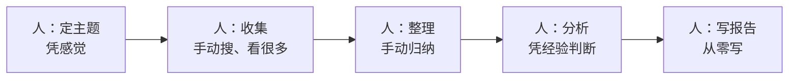
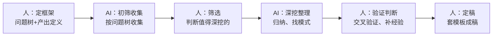

# 案例：行业调研工作流重构

> [!abstract] 本文要练成的能力
> 用"行业调研"这个案例，完整演示**一项工作怎么用 AI 重构**——从"人做全部"到"人机分工"，看懂重构前后差在哪、每个环节怎么做。核心是：**调研不是"用 AI 搜答案"，是"人定框架 + AI 收集整理 + 人验证判断"。**

---

## 一、重构前：传统行业调研工作流



| 环节 | 重构前做法 | 痛点 |
|------|-----------|------|
| 定主题 | 凭感觉，不定义产出 | 收集完发现不是要的 |
| 收集 | 手动搜，看大量资料 | 慢，被信息淹没 |
| 整理 | 手动归纳 | 耗时，容易漏 |
| 分析 | 凭经验 | 依赖个人，不可复现 |
| 写报告 | 从零写 | 慢，格式不统一 |

> 传统调研的痛点：**慢、乱、依赖个人经验、不可复现。** 一周调研往往"前三天收集、最后一天赶稿"。

---

## 二、重构后：AI 辅助行业调研工作流



| 环节 | 人做什么 | AI 做什么 |
|------|---------|----------|
| ① 定框架 | 定问题树、定产出定义 | 帮生成问题树初稿 |
| ② 收集 | 给框架、筛选值得深挖的 | 按问题树初筛、整理 |
| ③ 分析 | 判断结论、补行业经验 | 帮归纳、找模式 |
| ④ 验证 | 交叉验证、防幻觉 | 帮查来源、标置信度 |
| ⑤ 成稿 | 校对、补判断 | 生成简报初稿 |

> 一句话重构：**人从"做全部"变成"定框架 + 筛选 + 验证 + 定稿"，AI 从"没有"变成"初筛 + 整理 + 初稿"。** 人抓方向和质量，AI 提速度。

---

## 三、重构前后对比

| 维度 | 重构前 | 重构后 |
|------|--------|--------|
| 时间 | 一周紧巴巴 | 一周从容，还能复盘 |
| 质量 | 依赖个人经验 | 有框架 + 验证，更可靠 |
| 可复现 | 换个人做法就变 | 有模板，可复现 |
| 风险 | 信息淹没、产出跑偏 | 框架防跑偏，验证防幻觉 |
| 人的角色 | 执行者 | **方向制定者 + 验证者** |

> 关键认知：**重构后调研变快的核心，不是"AI 搜得快"，是"人先定框架，AI 只收集要的"。** 框架先行，才不被信息淹没。

---

## 四、关键环节的具体做法

### ① 定框架（决定成败）

```
【调研主题】____
【产出定义】____（交付什么：简报/决策建议？给谁看？）
【问题树】____（要回答什么问题，拆到能直接回答）
【不需要的】____（明确不调研什么）
```

> 框架先行是调研成败的关键——**先定"要什么"，再让 AI 收集，才不会收集一堆用不上。**

### ② AI 收集（用提示词让 AI 干活）

```
【角色】你是一个行业调研助手。
【任务】按问题树逐项回答，帮我调研【主题】。
【要求】
  1. 区分"事实"和"推断"，事实给出来源
  2. 不确定的明确说"不确定"，不要编造
  3. 数据给出来源和日期，标注是否可能过时
  4. 每个问题给"要点 + 来源 + 置信度"
【问题树】____
```

### ③ 验证（防 AI 坑）

| 验证动作 | 具体做法 |
|---------|---------|
| 要来源 | 每个结论能回查来源 |
| 交叉验证 | 关键结论 2-3 个独立来源印证 |
| 查时效 | 数据标注日期，判断是否过时 |
| 标置信度 | 低置信度的不写进核心结论 |

---

## 五、可直接套用的模板

### 一周调研时间盒（重构后）

| 天 | 里程碑 | 人机分工 |
|:---:|--------|---------|
| D1 | 定框架 | 人定问题树 + 产出定义 |
| D2-D4 | 收集 | AI 初筛 + 人筛选 |
| D5 | 验证补缺 | 人交叉验证 + 补数据 |
| D6 | 成稿 | AI 初稿 + 人定稿 |
| D7 | 复盘 | 人复盘 + 沉淀模板 |

### 调研简报模板（重构后）

```
# 【主题】调研简报
> 调研时间：____ | 数据截止：____
## 一、摘要（3句话）
## 二、核心结论（每条带证据+来源）
## 三、关键数据表（指标/数据/来源/日期/置信度）
## 四、洞察与判断（我的分析）
## 五、风险与存疑（不确定的明说）
## 六、下一步建议
```

---

## 六、这个案例教给你的通用方法

> 行业调研只是例子，**重构方法能迁移到任何工作**：

| 从调研案例学到的 | 通用到其他工作 |
|-----------------|---------------|
| 框架先行（先定要什么） | 任何工作先定目标定义 |
| AI 初筛 + 人筛选 | 收集类工作通用 |
| 人验证 + 防幻觉 | 所有 AI 输出都要人验证 |
| 套模板成稿 | 交付类工作通用 |

> 一句话：**调研重构 = 五步法 + 环节重构在"调研"上的落地。** 学会这个案例，就能把同样的方法用到写作、数据分析、项目管理（见 05-07）。

---

## 七、详细支撑

> 本案例的详细方法论，见 [[05-产品与开发/AI时代工作流重构/案例-行业调研/01_一周调研计划：时间盒与里程碑]]（时间盒）、[[05-产品与开发/AI时代工作流重构/案例-行业调研/02_调研框架先行]]（问题树）、[[05-产品与开发/AI时代工作流重构/案例-行业调研/03_AI辅助调研：分工与正确姿势]]（AI 分工）、[[05-产品与开发/AI时代工作流重构/案例-行业调研/04_信息验证与来源管理]]（验证）、[[05-产品与开发/AI时代工作流重构/案例-行业调研/05_调研简报模板]]（简报）。

---

## 八、资源与练习

### 练什么（可自测）
- [ ] 用"重构后工作流"重做一次你手头的调研
- [ ] 画出你调研的"重构前 vs 重构后"两张图
- [ ] 把调研模板沉淀到你的知识库

### 过关判据
> - [ ] 能说清调研重构前后的人机分工
> - [ ] 会写"框架先行"的产出定义和问题树
> - [ ] 会用提示词让 AI 收集，且知道怎么验证

---

## 练什么（可自测）

- 我的调研，是"人定框架 + AI 收集"还是"AI 直接给答案"？
- 我的每个结论，都能回查来源吗？
- 我有没有把调研模板沉淀下来复用？

若达标，进入下一个案例：[[05-产品与开发/AI时代工作流重构/05_案例_写作与内容创作工作流重构]]

---

- 回到 [[05-产品与开发/AI时代工作流重构/00_MOC_AI时代工作流重构中枢]]
- 用户研究（研究用户的方法）：[[05-产品与开发/用户研究与需求洞察/00_MOC_用户研究与需求洞察中枢]]
