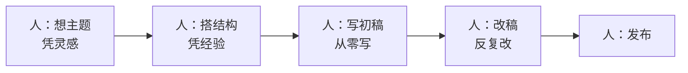
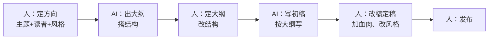

# 案例：写作与内容创作工作流重构

> [!abstract] 本文要练成的能力
> 用"写作与内容创作"这个案例，演示**内容类工作怎么用 AI 重构**——从"人从零写"到"人定方向 + AI 初稿 + 人定稿"。核心是：**AI 写作不是"让 AI 替你写"，是"人定灵魂，AI 出骨架，人润血肉"。**

---

## 一、重构前：传统写作工作流



| 环节 | 重构前做法 | 痛点 |
|------|-----------|------|
| 想主题 | 凭灵感，容易卡 | 不知道写什么 |
| 搭结构 | 凭经验 | 结构散，没逻辑 |
| 写初稿 | 从零写 | 慢，卡壳 |
| 改稿 | 反复改 | 费时 |
| 发布 | 直接发 | 质量不稳 |

> 传统写作的痛点：**卡壳（不知道写什么）、慢（从零写）、质量不稳（凭状态）。** 灵感来了写得快，没灵感就卡住。

---

## 二、重构后：AI 辅助写作工作流



| 环节 | 人做什么 | AI 做什么 |
|------|---------|----------|
| ① 定方向 | 定主题、读者、风格、核心观点 | 帮生成选题、找角度 |
| ② 搭结构 | 定大纲、改结构 | 生成大纲初稿 |
| ③ 写初稿 | 定标准（风格、长度） | 按大纲写初稿 |
| ④ 改稿 | 加自己的观点、案例、改风格 | 帮润色、压缩、扩写 |
| ⑤ 发布 | 定稿、负责 | 帮排版、起标题 |

> 一句话重构：**人定"写什么、给谁看、什么风格、核心观点"，AI 出"大纲 + 初稿"，人改"血肉 + 定稿"。** 灵感、观点、判断是人的，效率是 AI 的。

---

## 三、重构前后对比

| 维度 | 重构前 | 重构后 |
|------|--------|--------|
| 卡壳 | 经常卡，等灵感 | 不卡，AI 给角度 |
| 速度 | 一篇写半天 | 一篇 1-2 小时 |
| 质量 | 凭状态，不稳 | 有结构 + 人定稿，更稳 |
| 个人风格 | 容易丢 | 人改稿保住风格 |
| 人的角色 | 写手 | **主编（定方向 + 定稿）** |

> 关键认知：**AI 写作最大的风险是"同质化"——AI 写的都一个味。** 破解方法就是"人定稿"：加自己的观点、案例、经历，把 AI 的"通用味"改成"你的味"。

---

## 四、关键环节的具体做法

### ① 定方向（写作的灵魂）

```
【主题】____（写什么）
【读者】____（给谁看，ta 关心什么）
【核心观点】____（这篇文章要传达的一个观点）
【风格】____（口语化/专业/犀利？参考谁？）
【长度】____（多少字）
【边界】____（不写什么，防跑偏）
```

> 定方向是写作重构的关键——**方向越清楚，AI 初稿越能用，你改稿越省力。**

### ② AI 出大纲（让 AI 搭骨架）

```
【角色】你是一个内容编辑。
【任务】为下面的主题搭一个文章大纲。
【要求】
  1. 结构清晰：开头抓人、中间有逻辑、结尾有行动
  2. 每部分给出"要点 + 例子方向"
  3. 突出核心观点，不跑题
【主题】____
【核心观点】____
【读者】____
```

### ③ 人改稿定稿（保住"你的味"）

| 改稿动作 | 具体做法 |
|---------|---------|
| **加观点** | 加入你自己的判断、经历、案例 |
| **改风格** | 把 AI 的"通用味"改成你的语气 |
| **删废话** | 删掉 AI 的"正确废话" |
| **查事实** | 核实 AI 写的案例、数据、引用 |

> [!warning] 深度洞察·坑
> 反例：AI 写初稿，人直接发布。**AI 初稿是"60 分通用稿"，直接发 = 你的内容变成"AI 味"**——读者能闻出来，也丢了你的独特性。改稿不是"锦上添花"，是"把 AI 稿变成你的稿"。

---

## 五、可直接套用的模板

### 写作工作流模板（填完即用）

```
【定方向】主题____ / 读者____ / 核心观点____ / 风格____
【AI 大纲】让 AI 出大纲 → 人改结构
【AI 初稿】按定稿大纲让 AI 写 → 人改稿
【人定稿】加观点 / 改风格 / 删废话 / 查事实
【发布】定稿 → 发布 → 看反馈
```

### 常见内容场景的 AI 分工

| 内容场景 | 人定什么 | AI 做什么 |
|---------|---------|----------|
| 公众号文章 | 主题、观点、风格 | 大纲、初稿、润色 |
| 招聘 JD | 岗位要求、亮点 | 初稿、润色 |
| 面试反馈 | 真实评价、分寸 | 整理、润色措辞 |
| 绩效评语 | 事实、判断 | 组织语言、改措辞 |
| 简历优化 | 真实经历、目标 | 提炼、改写表达 |

> 注意：**涉及员工真实信息的场景（面试反馈、绩效评语），先过数据边界判断**，见 [[05-产品与开发/个人AI使用边界与伦理自律/03_个人AI伦理决策框架]]。

---

## 六、这个案例教给你的通用方法

| 从写作案例学到的 | 通用到其他工作 |
|-----------------|---------------|
| 先定方向（主题/读者/观点） | 任何创作先定目标定义 |
| AI 出大纲，人定大纲 | 结构类工作通用 |
| AI 写初稿，人改定稿 | 所有"产出"环节通用 |
| 人加观点防同质化 | 保住你的独特性 |

> 一句话：**写作重构 = "人定灵魂，AI 出骨架，人润血肉"。** 这个分工模式，能用到所有内容创作类工作。

---

## 七、资源与练习

### 练什么（可自测）
- [ ] 用"定方向模板"写清你下一篇内容的方向
- [ ] 用"AI 大纲提示词"出一版大纲，人改结构
- [ ] 写一篇"AI 初稿 + 人改稿"的内容，对比纯 AI 稿

### 过关判据
> - [ ] 能说清写作重构的人机分工（人定方向，AI 出稿，人定稿）
> - [ ] 会写"定方向"（主题/读者/观点/风格）
> - [ ] 改稿时能保住自己的风格，不直接发 AI 稿

---

## 练什么（可自测）

- 我的写作，是"人定方向 + AI 出稿"还是"AI 写我发"？
- 我的内容，有"我的味"吗？还是 AI 味？
- 涉及员工真实信息的内容，我过了数据边界判断吗？

若达标，进入下一个案例：[[05-产品与开发/AI时代工作流重构/06_案例_数据分析与报告工作流重构]]

---

- 回到 [[05-产品与开发/AI时代工作流重构/00_MOC_AI时代工作流重构中枢]]
- 内容创作方法论：[[05-产品与开发/AI产品经理学习路径/04-实战落地/01_作品集构成与项目故事框架]]
