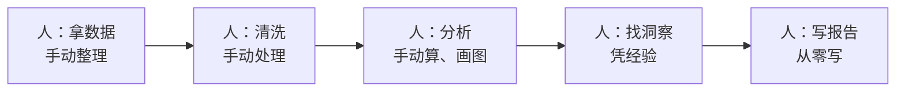
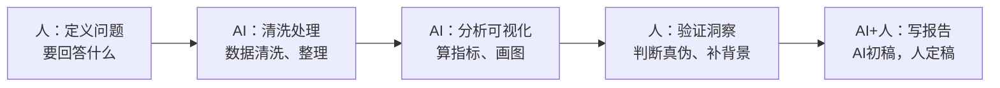

# 案例：数据分析与报告工作流重构

> [!abstract] 本文要练成的能力
> 用"数据分析与报告"这个案例，演示**数据类工作怎么用 AI 重构**——从"人手动处理数据"到"AI 处理 + 人定义问题 + 人验证洞察"。核心是：**数据分析的价值不在"算"，在"问对问题 + 判断洞察真伪"。**

---

## 一、重构前：传统数据分析工作流



| 环节 | 重构前做法 | 痛点 |
|------|-----------|------|
| 拿数据 | 手动导出、整理 | 耗时 |
| 清洗 | 手动处理缺失/异常 | 容易错 |
| 分析 | 手动算、画图 | 慢 |
| 找洞察 | 凭经验 | 可能漏、可能错 |
| 写报告 | 从零写 | 慢，格式不统一 |

> 传统数据分析的痛点：**清洗耗时、分析慢、洞察依赖经验、报告从零写。** 大量时间花在"处理数据"，而不是"理解数据"。

---

## 二、重构后：AI 辅助数据分析工作流



| 环节 | 人做什么 | AI 做什么 |
|------|---------|----------|
| ① 定义问题 | 定"要回答什么、指标是什么" | 帮补充分析角度 |
| ② 清洗处理 | 定规则、检查 | 清洗、整理、处理缺失 |
| ③ 分析可视化 | 定指标、判断 | 算指标、画图、找模式 |
| ④ 验证洞察 | 判断洞察真伪、补业务背景 | 帮解释、找关联 |
| ⑤ 写报告 | 定稿、补判断 | 生成报告初稿 |

> 一句话重构：**人从"处理数据"变成"定义问题 + 验证洞察"，AI 从"没有"变成"清洗 + 分析 + 初稿"。** 数据处理的脏活累活交给 AI，人的精力留给"问对问题 + 判断洞察"。

---

## 三、重构前后对比

| 维度 | 重构前 | 重构后 |
|------|--------|--------|
| 时间 | 清洗分析占大头 | 处理交给 AI，人专注洞察 |
| 洞察质量 | 凭经验，可能漏 | 有验证，更可靠 |
| 可复现 | 手动操作，难复现 | 有流程，可复现 |
| 风险 | 手动出错 | AI 会"编造关联"，人必须验证 |
| 人的角色 | 数据处理员 | **问题定义者 + 洞察验证者** |

> 关键认知：**AI 分析最大的坑是"虚假关联"——AI 会从数据里"发现"其实不存在的规律。** 所以"验证洞察"环节必须人来做：用业务常识判断"这个关联合理吗"。

---

## 四、关键环节的具体做法

### ① 定义问题（分析的方向）

```
【要回答的问题】____（这次分析要回答什么）
【关键指标】____（用什么指标衡量）
【数据来源】____（数据从哪来，是否可靠）
【决策用途】____（分析结果给谁做决策）
【边界】____（不分析什么）
```

> 定义问题是数据分析重构的关键——**问题定义不清，AI 分析得再快也是白做。**

### ② AI 分析（让 AI 干活）

```
【角色】你是一个数据分析助手。
【任务】基于以下数据，回答【问题】。
【要求】
  1. 区分"事实"和"推断"，推断标明"推断"
  2. 给出关键指标的计算和解读
  3. 指出数据的局限（样本/口径/缺失）
  4. 不要编造数据里没有的结论
【数据】____
【问题】____
```

### ③ 验证洞察（防 AI 坑）

| 验证动作 | 具体做法 |
|---------|---------|
| **查口径** | 指标怎么算的？口径对吗？ |
| **查样本** | 样本够吗？有偏吗？ |
| **查关联** | "相关"不等于"因果"，AI 说的关联合理吗？ |
| **查背景** | 用业务常识判断洞察是否合理 |

> [!warning] 深度洞察·坑
> 反例：AI 说"数据显示 A 和 B 强相关，建议做 C"，人直接采纳。**AI 的"相关"可能是巧合，也可能是数据口径问题。** 分析环节，AI 是"算得快"，人是"判断得准"——洞察必须过业务常识这一关。

---

## 五、可直接套用的模板

### 数据分析报告模板（重构后）

```
# 【主题】数据分析报告
> 数据截止：____ | 数据来源：____
## 一、结论摘要（3句话）
## 二、关键指标（指标/数值/口径/趋势）
## 三、核心洞察（每条：洞察+证据+业务含义）
## 四、数据局限（样本/口径/缺失）
## 五、建议行动（基于洞察的下一步）
```

### HR 数据分析场景的 AI 分工

| HR 场景 | 人定义什么 | AI 做什么 |
|---------|-----------|----------|
| 招聘漏斗分析 | 转化率指标、阶段定义 | 清洗、算转化、画漏斗 |
| 绩效分布分析 | 评估维度、口径 | 统计、分布、找模式 |
| 离职率分析 | 维度（部门/司龄）、问题 | 清洗、分组、找关联 |
| 培训效果分析 | 效果指标、对照组 | 对比、显著性、报告 |

> 注意：**HR 数据多为敏感数据（L3），分析前先过数据边界判断**，见 [[05-产品与开发/个人AI使用边界与伦理自律/02_数据敏感度分级与场景判断]]。

---

## 六、这个案例教给你的通用方法

| 从数据分析案例学到的 | 通用到其他工作 |
|---------------------|---------------|
| 先定义问题（要回答什么） | 任何分析先定目标 |
| AI 清洗处理，人定规则 | 处理类工作通用 |
| 人验证洞察（防虚假关联） | 所有 AI 结论都要验证 |
| 报告套模板 | 交付类工作通用 |

> 一句话：**数据分析重构 = "人问对问题 + AI 算得快 + 人验证洞察"。** 这个模式，能用到所有"数据驱动"的工作。

---

## 七、资源与练习

### 练什么（可自测）
- [ ] 用"定义问题模板"写清你手头一次分析要回答的问题
- [ ] 用"AI 分析提示词"跑一轮，人验证洞察
- [ ] 用"报告模板"组织一次分析结果

### 过关判据
> - [ ] 能说清数据分析重构的人机分工（人定义问题，AI 处理，人验证）
> - [ ] 会写"定义问题"（问题/指标/用途）
> - [ ] 能识别 AI 的"虚假关联"，用业务常识验证

---

## 练什么（可自测）

- 我的分析，是"先定义问题"还是"拿到数据就开干"？
- 我验证过 AI 的洞察吗？还是直接信？
- 涉及敏感数据的分析，我过了边界判断吗？

若达标，进入下一个案例：[[05-产品与开发/AI时代工作流重构/07_案例_项目管理与沟通工作流重构]]

---

- 回到 [[05-产品与开发/AI时代工作流重构/00_MOC_AI时代工作流重构中枢]]
- AI 数据分析方法论：[[06-数据分析/AI数据分析/00_MOC_AI数据分析中枢]]
