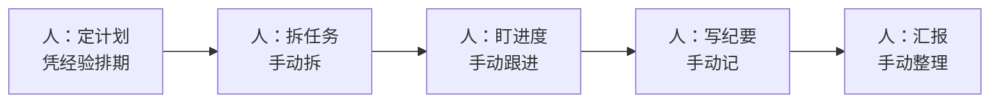
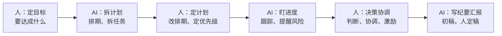

# 案例：项目管理与沟通工作流重构

> [!abstract] 本文要练成的能力
> 用"项目管理与沟通"这个案例，演示**协作类工作怎么用 AI 重构**——从"人盯进度、人写文档"到"AI 辅助计划、跟踪、纪要、汇报"。核心是：**项目管理重构不是"AI 替你管项目"，是"AI 处理信息，人做决策和关系"。**

---

## 一、重构前：传统项目管理工作流



| 环节 | 重构前做法 | 痛点 |
|------|-----------|------|
| 定计划 | 凭经验排期 | 排期不准 |
| 拆任务 | 手动拆 | 容易漏 |
| 盯进度 | 手动跟进 | 费时，容易忘 |
| 写纪要 | 手动记 | 慢，不全 |
| 汇报 | 手动整理 | 费时 |

> 传统项目管理的痛点：**大量时间花在"信息处理"（排期、跟进、纪要、汇报），而不是"决策和关系"（判断、协调、激励）。**

---

## 二、重构后：AI 辅助项目管理与沟通工作流



| 环节 | 人做什么 | AI 做什么 |
|------|---------|----------|
| ① 定目标 | 定"要达成什么、标准" | 帮补充里程碑 |
| ② 拆计划 | 改排期、定优先级 | 生成计划初稿、拆任务 |
| ③ 盯进度 | 判断风险、做决策 | 跟踪进度、提醒风险 |
| ④ 沟通协调 | 协调、激励、处理关系 | 写纪要、整理汇报 |
| ⑤ 复盘 | 判断、沉淀 | 整理复盘素材 |

> 一句话重构：**人从"信息处理员"变成"决策者 + 协调者"，AI 从"没有"变成"计划 + 跟踪 + 纪要 + 汇报"。** 项目管理的"信息活"交给 AI，"决策和关系活"人守住。

---

## 三、重构前后对比

| 维度 | 重构前 | 重构后 |
|------|--------|--------|
| 计划 | 凭经验，不准 | AI 辅助，更全 |
| 跟进 | 手动，易漏 | AI 提醒，不漏 |
| 纪要 | 手动，慢 | AI 生成，人定稿 |
| 汇报 | 手动整理 | AI 整理，人把关 |
| 人的角色 | 信息处理员 | **决策者 + 协调者** |

> 关键认知：**项目管理重构的价值，是把人的时间从"信息处理"释放到"决策和关系"——这两件事 AI 替不了。** 排期准不准、风险要不要处理、人怎么协调，都是人的判断。

---

## 四、关键环节的具体做法

### ① 定目标（项目的方向）

```
【项目目标】____（要达成什么，可衡量）
【里程碑】____（分几个阶段，每阶段验收什么）
【优先级】____（什么最重要，什么可砍）
【风险】____（可能出什么问题）
【边界】____（不做什么）
```

### ② AI 拆计划（让 AI 干活）

```
【角色】你是一个项目管理助手。
【任务】基于目标，帮我拆一个项目计划。
【要求】
  1. 拆成里程碑 + 任务，标出依赖关系
  2. 每个任务给出"负责人 + 截止 + 验收标准"
  3. 标出可能的风险点
  4. 排期要现实，留缓冲
【目标】____
【截止】____
```

### ③ AI 盯进度（防漏防风险）

| AI 动作 | 具体做法 |
|---------|---------|
| 跟踪进度 | 定期让 AI 汇总进度，对照计划 |
| 提醒风险 | 让 AI 标出"延期/阻塞/依赖"风险 |
| 生成纪要 | 会后让 AI 整理纪要（决定/待办/负责人） |
| 整理汇报 | 让 AI 把进度整理成汇报稿，人把关 |

> [!warning] 深度洞察·坑
> 反例：让 AI 自动盯进度、自动汇报，人完全不管。**项目管理的核心是"判断风险 + 协调人"，AI 只能"提醒"，不能"决策"。** 把 AI 当"提醒工具"用，人负责"判断和协调"——否则 AI 提醒了也没人处理。

---

## 五、可直接套用的模板

### 项目计划模板（重构后）

```
# 【项目】计划
> 目标：____ | 截止：____ | 优先级：____
## 里程碑
| 阶段 | 任务 | 负责人 | 截止 | 验收标准 |
## 风险
| 风险 | 概率 | 影响 | 应对 |
## 每周跟进
| 周 | 进度 | 风险 | 下一步 |
```

### 沟通场景的 AI 分工

| 沟通场景 | 人做什么 | AI 做什么 |
|---------|---------|----------|
| 会议纪要 | 定决定、补细节 | 生成纪要初稿 |
| 向上汇报 | 定重点、把关 | 整理进度、生成初稿 |
| 跨部门沟通 | 协调、处理分歧 | 整理背景、起草沟通稿 |
| 周报 | 定亮点、判断 | 整理素材、生成初稿 |

> 注意：**涉及内部敏感信息的沟通内容，先过数据边界判断**，见 [[05-产品与开发/个人AI使用边界与伦理自律/03_个人AI伦理决策框架]]。

---

## 六、这个案例教给你的通用方法

| 从项目管理案例学到的 | 通用到其他工作 |
|---------------------|---------------|
| 先定目标（要达成什么） | 任何项目先定目标 |
| AI 拆计划，人定计划 | 计划类工作通用 |
| AI 盯进度，人做决策 | 跟踪类工作通用 |
| AI 写纪要汇报，人把关 | 沟通类工作通用 |

> 一句话：**项目管理重构 = "人定目标做决策，AI 处理信息提效率"。** 这个模式，能用到所有"协作 + 信息处理"的工作。

---

## 七、资源与练习

### 练什么（可自测）
- [ ] 用"项目计划模板"为手头项目排一版计划
- [ ] 用"AI 拆计划提示词"拆一次任务，人改排期
- [ ] 用 AI 生成一次会议纪要，人补决定和细节

### 过关判据
> - [ ] 能说清项目管理重构的人机分工（人决策，AI 处理信息）
> - [ ] 会写"定目标"（目标/里程碑/优先级/风险）
> - [ ] 知道 AI 只能"提醒"，决策和协调要人做

---

## 练什么（可自测）

- 我的项目时间，花在"信息处理"还是"决策协调"？
- 我有没有把 AI 当"提醒工具"，自己守住决策？
- 涉及敏感信息的沟通，我过了边界判断吗？

若达标，进入避坑：[[05-产品与开发/AI时代工作流重构/08_工作流重构的坑与边界]]

---

- 回到 [[05-产品与开发/AI时代工作流重构/00_MOC_AI时代工作流重构中枢]]
- AI 项目实战管理：[[05-产品与开发/AI项目实战管理/00_MOC_AI项目实战管理中枢]]
